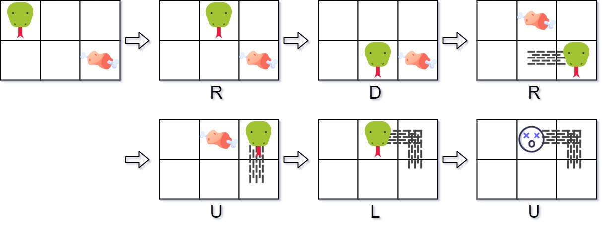

### 自定义数据结构之贪食蛇游戏

请你设计一个贪吃蛇游戏，该游戏会在一个**屏幕尺寸=宽度 x 高度**的屏幕上运行。如果你不熟悉这个游戏，可以<a href="http://patorjk.com/games/snake/">点击这里</a> 在线试玩。

起初时，蛇在左上角的 `(0,0)` 位置，身体长度为 1 个单位。你将会被给出一个数组形式的食物位置序列 `food`, 其中 `food[i]=(ri,ci) ` 。当蛇吃到食物的时候，身子的长度为增加 1 个单位，得分也会 +1。

食物不会同时出现，会按列表的顺序逐一显示在屏幕上。比方说，当第一个事务被蛇吃掉后，第二个食物才会出现。当一个食物在屏幕上出现时，保证**不会** 出现在被蛇身占据的格子里。

如果蛇越界(与边界相撞)或者头与移动后的身体相撞，则游戏结束。

实现 `SnakeGame` 类:

* `SnakeGame(int width,int height,int[][] food)` 初始化对象，屏幕大小为 `height * width`, 食物位置序列为 `food`
* `int move(String direction)` 返回蛇在方向 `direction` 上移动后的得分。如游戏结束，返回 -1。



```text
输入：
["SnakeGame", "move", "move", "move", "move", "move", "move"]
[[3, 2, [[1, 2], [0, 1]]], ["R"], ["D"], ["R"], ["U"], ["L"], ["U"]]
输出：
[null, 0, 0, 1, 1, 2, -1]

解释：
SnakeGame snakeGame = new SnakeGame(3, 2, [[1, 2], [0, 1]]);
snakeGame.move("R"); // 返回 0
snakeGame.move("D"); // 返回 0
snakeGame.move("R"); // 返回 1，蛇吃掉了第一个食物，同时第二个食物出现在 (0, 1)
snakeGame.move("U"); // 返回 1
snakeGame.move("L"); // 返回 2，蛇吃掉了第二个食物，没有出现更多食物
snakeGame.move("U"); // 返回 -1，蛇与边界相撞，游戏结束
```

#### 基本思路

这题很有趣，真实还原了贪吃蛇的玩法，代码不难，这里讲下思路

蛇可以用一个「链表」来表示，第一个元素是蛇头，最后一个元素是蛇尾，因为每次移动的只有蛇头和蛇尾，而链表可以高效地操作头尾元素。

这里注意，当蛇移动时，我们只需要操作蛇头尾就行了，中间的身子不会动的，所以每次蛇移动只需要更新蛇头并删除蛇尾就行了(增加新进入的坐标，移除尾部的坐标)。

当然，还需要把蛇身存储一个「哈希集合」，方便判断贪吃蛇有没咬到自己。接下里就是按照游戏规则进行判断了。

