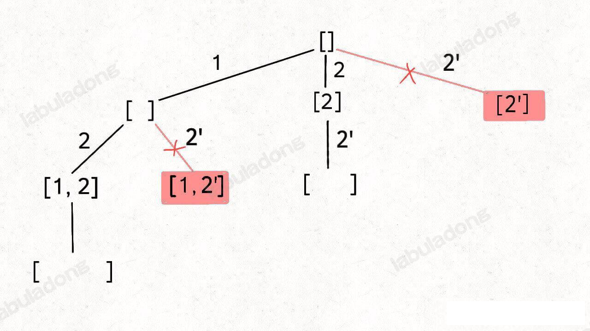
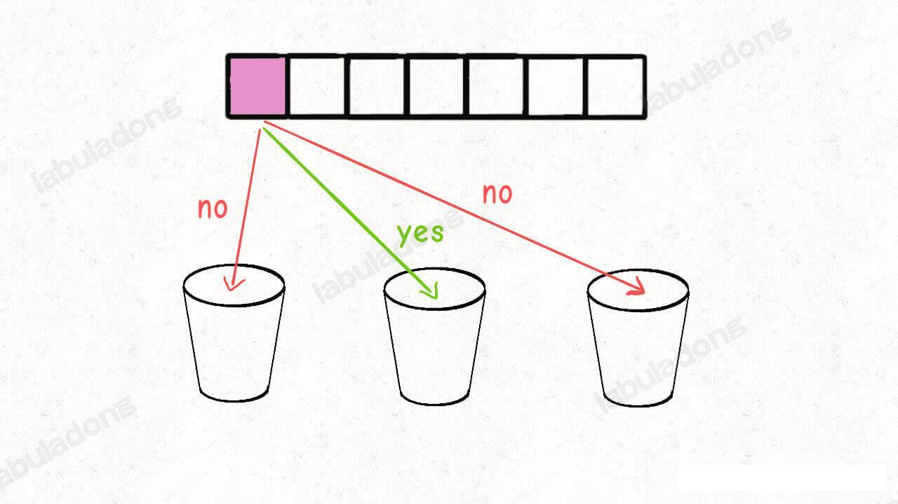
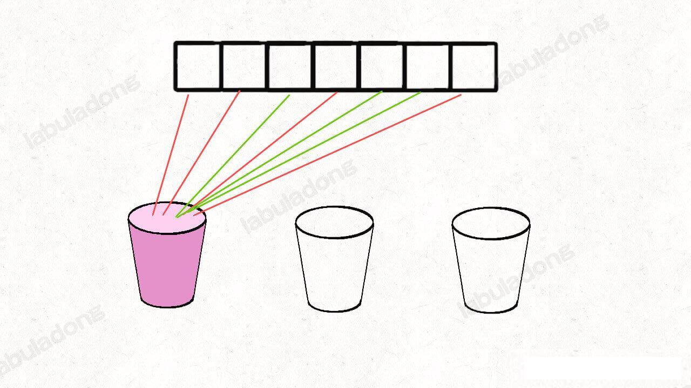
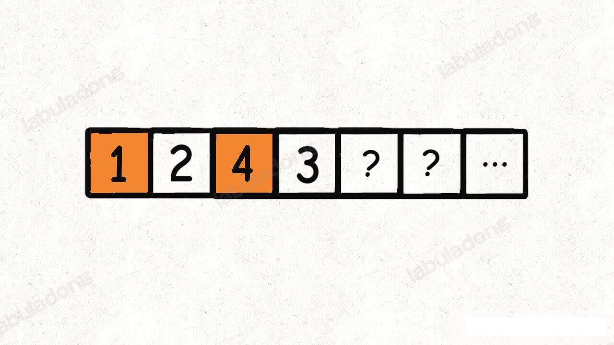
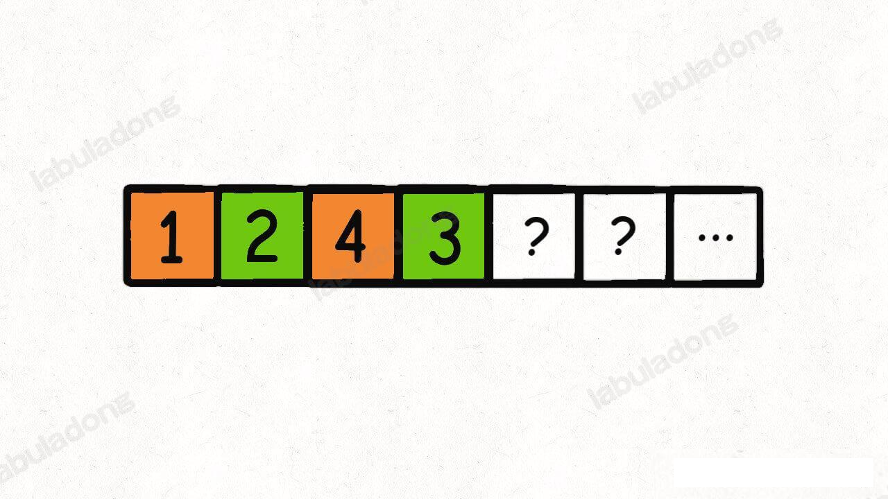
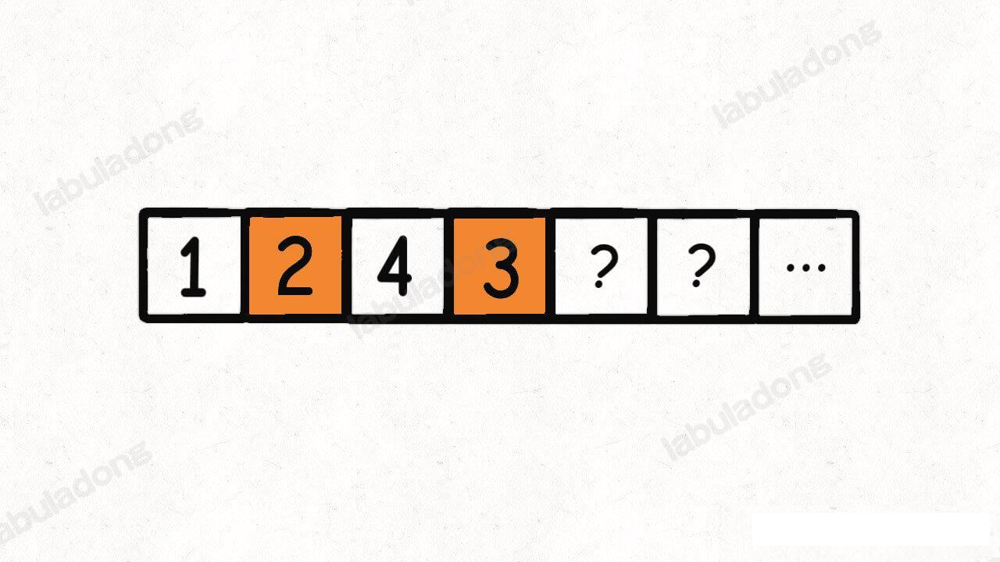
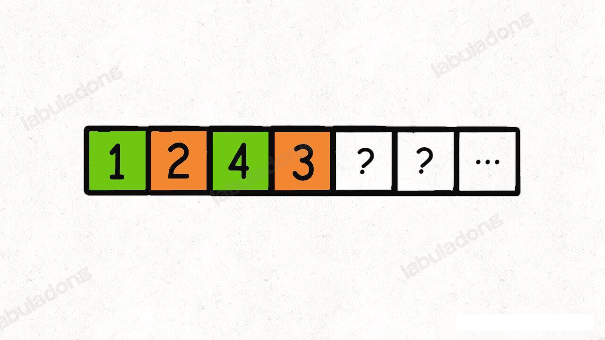

## DFS 

### DFS 算法的使用场景：回溯算法

#### 回溯算法框架：

**抽象地说，解决一个回溯问题，实际上就是遍历一颗决策树的过程，树的每个叶子节点存放着一个合法答案。你把整棵树遍历一遍，把叶子节点上的答案都收集起来，就能得到所有的合法答案**。

站在回溯树的一个节点上，你只需要思考 3 个问题：
1、路径：也就是已经做出的选择。
2、选择列表：也就是你当前可以做的选择
3、结束条件：也就是到达决策树底层，无法再做选择的条件。

如果无法理解三个词语的含义，没关系，我们后面用具体的例子来解释

回溯算法的框架如下：

```py
result=[]
def backtrack(路径,选择列表):
    if 满足结束条件:
        result.add(路径)
        return
    for 选择 in  选择列表:
        做选择
        backtrack(路径，选择列表)
        撤销选择
```

**其核心就是 for 循环里面的递归，在递归之前「做选择」，在递归调用之后「撤销选择」**，特别简单。

#### 回溯算法之全排列问题

leetcode 第 46 题「全排序列」就是给你输入一个数组 `nums`，让你返回这些数字的全排列


#### N 皇后问题

当 N = 8 时，就是八皇后问题，数学大佬高斯穷尽一生都没数清楚八皇后问题到底有几种可能的放置方法，但是我们的算法只需要一秒就可以算出来所有可能的结果。

不过真不怪高斯，这个问题的复杂度确实非常高，粗略估算一下：

N 行棋盘中，第一行有 N 个位置可能放置皇后，第二行有 N-1 个位置，第三行有 N-2 个位置，以此类推，再叠加每次放皇后之前的 isValid 函数所需的 O(N) 复杂度，所以总的时间复杂度上界就是 O(N!*N),而且没有什么明显的冗余计算可以优化效率。你可以试试 N=10 的时候，计算就已经很耗时了。

当然，因为有 `isValid` 函数剪枝，并不会真的在每个位置都放置皇后，所以实际的执行效率会高一些。但是总体的这个复杂度作为上界是没问题的。

再简单拓展一下，有可能题目不需要你计算出 N 皇后问题的所有具体结果，而仅仅问你共有几种解法，应该怎么做？

比如 leetcode 第 52 题 「N 皇后 II」

解法就是将 res.add() 改成 queenCount++;

#### 总结

回溯算法就是多叉树的遍历问题，关键就是在前序遍历和后续遍历的位置做一些操作，算法框架如下

```py
def backtrack(...):
    for 选择 in 选择列表:
        做选择
        backtrack(...)
        撤销选择
```

### 回溯算法描述所有的排列-组合-子集问题

无论是排列、组合还是子集问题，简单说无非就是让你从序列 `nums` 中以给定规则获取若干元素，主要有以下几种变体：

**形式一：元素无重复不可复选，即 nums 中的元素都是唯一的，每个元素最多只能被使用一次，这也是最基本的形式，也是最常见的形式(我们本来以为的样子)**。

以组合为例，如果输入 `nums=[2,3,6,7]`, 和为 7 的组合/子集应该只有 `[7]`。

**形式二，可重复但不可复选，即 `nums` 中的元素可以存在重复，每个元素还是最多只能被使用一次**。

以组合为例，如果输入 `nums=[2,5,2,1,2]`, 和为 7 的组合应该有两种 `[2,2,1,2]` 和 `[5,2]` 。

**形式三，元素无重复但可复选，即 `nums` 中的元素是唯一的，但是每个元素可被使用若干次**。

以组合为例，如果输入 `nums=[2,3,6,7]`, 和为 7 的组合应该有两种 `[2,2,3]` 和 `[7]` 。

第四种形式的，元素重复且可复选是没有存在的意义的。

上述用组合问题举例，但排列、组合、子集问题都可以有这三种基本形式，所以共有 9 种变化。

**但无论形式怎么变化，其本质就是穷举所有的解，而这些解呈现树形结构，所以合理使用回溯算法框架，稍微改动代码框架就可以把这些问题一网打尽**。

记住如下的子集问题和排列问题的回溯树，就可以解决所有排列组合子集相关问题：


只要能记住这两种树形结构就能解决所有相关问题，这是为什么那？

**首先，组合问题和子集问题是等价的。至于说的前面的三种变化形式，无非就是在这两颗树上减掉或者增加一些树枝罢了**。、

接下来，我们就把排列组合/组合/子集问题的 9 种形式都过一遍，学学如何使用回溯算法把它们一套带走。


#### 子集(元素无重复不可复选)

leetcode 78 题，就是这个问题：

题目给你输入一个无重复元素的数组 nums，其中每个元素最多使用一次，请你返回 nums 的所有子集。

函数签名如下：

```java
List<List<Integer>> subsets(int[] nums)
```
比如输入 `nums=[1,2,3]`, 算法应该返回如下子集：

```java
[ [],[1],[2],[3],[1,2],[1,3],[2,3],[1,2,3] ]
```

请参考 subsets 方法

#### 组合（元素无重复不可复选）

如果你能够成功的生成所有无重子集，那么你稍微改改代码就能生成所有无重组合了。

你比如说，让你在 nums = `[1,2,3]` 中拿 2 个元素形成所有的组合，你怎么做？

稍微想想就会发现，大小为 2 的所有组合，不就是所有大小为 2 的子集嘛。

**所以说组合和子集是一样的：大小为 k 的组合就是大小为 k 的子集**。

比如 leetcode 77 题 「组合」：


给定两个整数 `n` 和 `k`，返回范围 `[1, n]` 中所有可能的 `k` 个数的组合。

函数签名如下：
```java
List<List<Integer>> combine(int n, int k)
```

比如 combine(3, 2) 的返回值应该是：

```text
[ [1,2],[1,3],[2,3] ]
```

这是标准的组合问题，但我给你翻译一下就变成子集问题了：

**给你输入一个数组 `nums=[1,2...n]` 和一个正整数 `k`, 请你生成所有大小为 `k` 的子集**。

还是以 `nums=[1,2,3]` 为例，刚才让我们求所有的子集，就是把所有节点的值都收集起来；**现在你只需要把第 2 层(根节点视为第 0 层)的节点收集起来，就是大小为 2 的所有组合**：


反映到代码上， 只要稍微改写 base case ，控制算法仅收集第 `K` 层节点的值即可：

```java
void traceBackWithCombineK(int[] nums, int start, int k) {
        if (pathItems.size() == k) {
            res.add(new ArrayList<>(pathItems));
            return;
        }
       // 其他回溯代码....

    }
```

#### 排列(元素无重复不可复选)

全排列 leetcode 46 题已经在 BackTrackFullArrangement 这个类中实现了，这里就略过。示意图如下：


#### 子集/组合(元素可重复不可复选)

上面讲得标准子集问题 `nums` 是没有重复元素的，但如果存在重复元素，怎么处理？

leetcode 90 题 『子集 II』就是这样一个问题：

给你一个整数数组 `nums`, 其中可能包含重复元素，请你返回该元素组所有可能的子集。

函数签名如下：

```java
List<List<Integer>> subsetsWithDp(int[] nums);
```
比如输入 `nums=[1,2,2]`, 你应该输出：

```java
[ [],[1],[2],[1,2],[2,2],[1,2,2] ]
```

当然， 按道理说集合不应该包含重复元素，但是题目既然这样问了，我们就忽略这个细节吧，仔细思考一下这个题该怎么做才是正事。

就以 `nums=[1,2,2]` 为例，为了区别两个 `2` 是不同的元素，后面我们会写作 `nums=[1,2,2']`

按照之前的思路画出子集的树形结构，显然，两条值相同的相邻树枝会产生重复：


```text
[ 
    [],
    [1],[2],[2'],
    [1,2],[1,2'],[2,2'],
    [1,2,2']
]
```
可以看到，`[2]` 和 `[1,2]` 这两个结果出现了重复，所以我们需要进行剪枝，如果一个节点有多余值相同的树枝相邻，则只遍历第一条边，剩下的都剪掉，不要去遍历：




**体现在代码上，需要先进行排序，让相同的元素靠在一起，如果发现`nums[i]=nums[i-1]`, 则跳过 `nums[i]`**:

方法 traceBackWithDp 和之前的标准子集问题的代码几乎相同，就是添加了排序和剪枝的逻辑。

至于为什么这样剪枝，结合前面的图应该也很容易理解，这样带重复元素的子集问题也解决了。

我们之前说了**组合问题和子集问题是等价的**，接下来看一道 leetcode 40 题，「组和总和 II」:

给你输入 `candidates` 和一个目标和 `target`，从 `candidates` 中找出所有和为 `target` 组合

`candidates` 可能存在重复元素，且其中的每个数字最多只能使用一次。

说这是一个组合问题，其实换个问题就变成子集问题了：请你计算 `candidates` 中所有和为 `target` 的子集。

所以这题该怎么破？

对比子集问题的解法，只需要额外用一个 `trackSum` 变量记录回溯路径上的元素和，然后将 base case 改一下即可解决这道题

#### 排列（元素可重复不可复选）

排列问题的输入如果存在重复，比子集/组合问题稍微复杂点，比如 leetcode 47 题 「全排列 II」:

给你输入一个可包含重复数字的序列 `nums`, 请你写一个算法，返回所有可能的全排列，函数签名如下：

```java
List<List<Integer>> permuteUnique(int[] nums);
```
比如输入 `nums=[1,2,2]`, 函数返回:

```java
[ [1,2,2],[2,1,2],[2,2,1] ]
```

详细解法请参考 TraceBack 类中的 permuteUnique 方法

对比下之前的 Permutations.java 中的解法，这段代码只有两处不同：

1、对 `nums` 进行了排序
2、添加了一句额外的剪枝逻辑

类比输入包含重复子集/组合的问题，我们能大概了解这么做事为了防止重复结果。

但是注意到排列问题的剪枝逻辑，和子集/组合问题的剪枝逻辑略有不同：**新增了 `!visited[i - 1]` 的逻辑判断。

这个地方理解起来就需要一些技巧，为了方便理解，我们会画图表示，相同的元素会标记 `'` 以示区别。

比如输入为 `nums = [1,2,2]` , 标准的全排列算法会得到如下答案：

```text
[
    [1,2,2'],[1,2',2],
    [2,1,2'],[2,2',1],
    [2',1,2],[2',2,1]
]
```

显然这个结果存在重复，比如 `[1,2,2']` 和 `[1,2',2]` 应该被算作同一个排列，但被算了两个不同的排列。

所以，现在的关键在于，如何设计剪枝逻辑，把这种重复去掉？

**答案是，保证相同的元素在排列中的相对位置保持不变**。

比如说 `nums = [1,2,2']` 这个例子，我们保持排列中 `2` 一直在 `2'` 前面。

这样的话，我们从上面的排列结果中只能挑出 3 个排列符合这个条件：
```text
[ [1,2,2'],[2,1,2'],[2,2',1] ]
```
这也是正确答案。

进一步，如果 `nums=[1,2,2',2'']` , 我们只要保证重复元素 `2` 的相对位置固定，比如说 `2->2'->2''`, 也可以得到无重复的全排列结果。

仔细思考，应该很容易明白其中的原理：

**标准全排列之所以会出现重复，是因为把相同元素形成的排列序列视为不同序列，但实际上他们应该是相同的；而如果固定相同元素形成的序列顺序，当然就避免了重复**。

那么反映到代码上，注意看这个剪枝逻辑：

```java
 if (i > 0 && nums[i] == nums[i - 1] && !visited[i - 1]) {
    // 如果前面的相邻元素没有用过，我也不能用，则跳过。
    // 大哥还没成家，我绝对不能成家；大哥没有娶老婆，我绝对不能先娶老婆；大哥还没当太子，怎么能轮到我？
    continue;
}
// 选择 nums[i]
```

**当出现重复元素时，比如输入 `nums=[1,2,2',2'']` , `2'` 只有在 `2` 已经被使用的情况下才会被选择，同理，`2''` 只有在 `2'` 已经被使用的情况下才会被选择，这样就保证了相同的元素在排列中的相对位置保持固定**。（吐槽下，发现这个特点的人确实对算法然就有一套，我想了半小时左右，愣是没想出来）

这里拓展下，如果把上述的剪枝逻辑中的 `!visited[i-1]` 改为 `visited[i-1]`, 其实也可以通过所有的测试用例，但是效率会有所下降，这是为什么那？

之所以这样修改会产生错误，是因为这种写法相当于维护了 `2''->2'->2` 的相对顺序，最终也可以实现去重的效果。（是的那，如果 2 在 2' 之前被 visit, 那么就会被 continue，最终就是维护了 2''->2'->2 的是相对顺序）。但是为什么这样写效率会下降那？因为这个写法剪掉的树枝不够多，比如输入 `nums=[1,2,2',2'']` ，产生的回溯树如下所示：


如果用绿色的树枝代表 `backTrack` 函数遍历过的路径，红色树枝代表剪枝逻辑的触发，那么 `!visited[i-1]` 的这种剪枝逻辑得到的回溯树长这样


(中间的 2' 被剪枝是因为 2 不在 path 上，2'' 被剪枝是因为 2' 不在路径上 )

而 `visited[i-1]` 这种剪枝逻辑得到的回溯树如下：


(第一个 2' 被剪枝是因为 2 在路径上，第二个 2'' 不被剪枝是因为 2' 不在路径上，但是 2'' 下面的 2' 被剪枝仍然是因为 2 在路径上，这样的结果导致最终的 最右边 2''->2'->2 这个路径没有被任何剪枝，被完全保留了下来，也是符合要求的唯一遍历路径)。

可以看到, `!visited[i-1]` 这种剪枝逻辑减的干净利落，而 `visited[i-1]` 这种剪枝逻辑也能得到无重复结果，但是它剪掉的树枝较少，存在的计算较多，所以效率会差些。

当然，关于排列去重，也有其他剪枝思路：

```java
void backTrackPermuteUnique(int[] nums) {
        if (pathItems.size() == nums.length) {
            res.add(new LinkedList<>(pathItems));
        }
        // 题目说 -10 <= nums[i] <= 10
        int prevNum = -888;

        for (int i = 0; i < nums.length; i++) {
            if (visited[i]) {
                continue;
            }

            // 注意这里，虽然说每次递归，prevNum 都会被初始化为 -888, 但是在循环里面也被改了，
            // 如果我们忽略循环中递归函数的调用，就会发现 prevNum 确确实实记录了上一次循环的值，到当前循环中，就是上一次的值
            // 由于数组是排序的，相同的元素排列在一起，所以这个 prevNum 也能起到剪枝的作用
            // 这个剪枝逻辑想明白后，发现也是非常的容易理解，更符合我们平时的习惯和代码的直观思考
            if (nums[i] == prevNum) {
                continue;
            }
            visited[i] = true;
            // 记录这条树枝上的值
            prevNum = nums[i];
            pathItems.add(prevNum);
            backTrackPermuteUnique(nums);
            visited[i] = false;
            pathItems.removeLast();
        }
    }
```

这个思路也是对的，设想一个节点出现了相同的树枝：


如果不做处理，这些相同的树枝下面的子树也会长得一模一样，所以会出现重复的排列

因为排序之后所有相等的元素紧挨在一起，**所以只要用 `prevNum` 记录前一条树枝的值，就可以避免遍历相同的树枝，从而避免产生相同的子树，最终避免出现重复的排列。**

这样，包含重复输入的排列问题也解决了。

#### 子集/组合(原始无重复可复选)

这个是最后一种类型：输入数组无重复元素，但每个元素可以被无限次使用

leetcode 39 题「组合总和」

给你一个无法重复元素的整数数组 `candidates` 和一个目标和 `target`, 找出 `candidates` 中可以使用数字和为目标数 `target` 的所有组合。`candidates` 中的每个数字可以无限制重复被选取。

函数签名如下：
```java
List<List<Integer>> combinationSum(int[] candidates, int target);
```

比如输入 `candidates=[1,2,3], target=3`, 算法应该返回：

```text
[ [1,1,1],[1,2],[3] ]
```

这道题说是组合问题，实际上也是子集问题，`candidates` 的哪些子集的和为 `target`。

我们想解决这种类型的问题，也得回到回溯树上，**我们不妨先思考思考，标准的子集/组合问题是如何保证不使用重复元素的**?

答案在于 `backtrack` 递归时输入的参数 `start`:

```java
// 无重组合的回溯算法框架
void backtrack(int[] nums, int start) {
    for (int i = start; i < nums.length; i++) {
        // ...
        // 递归遍历下一层回溯树，注意参数
        backtrack(nums, i + 1);
        // ...
    }
}
```

这个 `i` 从 `start` 开始，那么下一层回溯树就是从 `start + 1` 开始，从而保证 `nums[start]` 这个元素不会被重复使用：


那么反过来，如果我想让每个元素被重复使用， 我只要把 `i+1` 改成 `i` 即可：

```java
// 元素可重复使用的组合的回溯算法框架
void backtrack(int[] nums, int start) {
    for (int i = start; i < nums.length; i++) {
        // ...
        // 递归遍历下一层回溯树，注意参数
        backtrack(nums, i);
        // ...
    }
}
```

这相当于给之前的回溯树添加了一条树枝，在遍历的这棵树的过程中，一个元素可以被无限次使用：


当然，这样这棵树会永远生长下去，所以我们的递归函数需要设置合适的 base case 以结束算法，即路径和大于 `target` 时就没必要再遍历下去了。

#### 排列(元素无重复可复选)

leetcode 上面没有相似的题目，我们不妨设想一下，`nums` 数组中的元素无重复且可复选的情况下，会有哪些排列

比如输入 `nums=[1,2,3]` ，那么在这种条件下全排列共有 3^3 = 27 中

```java
[
  [1,1,1],[1,1,2],[1,1,3],[1,2,1],[1,2,2],[1,2,3],[1,3,1],[1,3,2],[1,3,3],
  [2,1,1],[2,1,2],[2,1,3],[2,2,1],[2,2,2],[2,2,3],[2,3,1],[2,3,2],[2,3,3],
  [3,1,1],[3,1,2],[3,1,3],[3,2,1],[3,2,2],[3,2,3],[3,3,1],[3,3,2],[3,3,3]
]
```

**标准的全排列算法利用 `used` 数组进行剪枝，避免重复使用同一个元素(避免在同一个遍历路径上再次遍历该元素)。如果允许重复使用元素的话，直接放飞自我，去除所有 `used` 数组的剪枝逻辑就行了**。

那这个问题就简单了，代码如下：

```java
class Solution {

    List<List<Integer>> res = new LinkedList<>();
    LinkedList<Integer> track = new LinkedList<>();

    public List<List<Integer>> permuteRepeat(int[] nums) {
        backtrack(nums);
        return res;
    }

    // 回溯算法核心函数
    void backtrack(int[] nums) {
        // base case，到达叶子节点
        if (track.size() == nums.length) {
            // 收集叶子节点上的值
            res.add(new LinkedList(track));
            return;
        }

        // 回溯算法标准框架
        for (int i = 0; i < nums.length; i++) {
            // 做选择
            track.add(nums[i]);
            // 进入下一层回溯树
            backtrack(nums);
            // 取消选择
            track.removeLast();
        }
    }
}
```

至此，排列/组合/子集问题的九种变化就全部描述完毕。

#### 最后总结

回顾下 排列/组合/子集问题的三种形式在代码上的区别

由于子集问题和组合问题本质上是一样的，无非就是 base case 有一些区别，所以把这两个问题放在一起看。

**形式一，元素无重复不可复选，即 `nums` 中的元素都是唯一的，每个元素最多只能被使用一次**， `backTrack` 的核心代码如下：

```java
// 组合/子集问题的回溯算法框架
void backTrack(int[] nums, int start) {
    //回溯算法标准框架
    for(int i=start; i<nums.length;i++) {
        //做选择
        track.addLast(nums[i]);
        //进行递归，注意参数
        backTrack(nums,i+1);
        //撤销选择
        track.removeLast();
    }
}

// 排列问题回溯算法框架
void backTrack(int[] nums) {
    for(int i=0;i<nums.lenght;i++) {
        if(used[i]) {
            continue;
        }
        //做选择
        used[i]=true;
        track.addLast(nums[i]);
        //进行递归，注意参数
        backTrack(nums);
        //撤销选择
        used[i] = false;
        track.removeLast();
    }
}
```

**形式二、元素可重复不可复选，即 `nums` 中的元素可以存在重复，但是每个元素最多只能被使用一次**，其关键在于排序和剪枝，`backTrack` 的核心代码如下：

```java
Arrays.sort(nums);
// 组合/子集问题回溯框架
void backTrack(int[] nums, int start) {
    // 回溯算法标准框架
    for(int i=start;i<nums.length;i++) {
        if(i>start && nums[i] == nums[i-1]) {
            // 剪枝逻辑，跳过值相同的相邻剪枝
            continue;
        }
        track.addLast(nums[i]);
        // 注意参数
        backTrack(nums, i+1);
        track.removeLast();
    }
}

// 排列问题

Arrays.sort(nums);
void backTrack(int[] nums) {
    for(int i=0;i<nums.length;i++) {
        // 剪枝逻辑
        if(used[i]) {
            continue;
        }
        // 剪枝逻辑，固定 相同的元素在排列中的相对位置。重复元素就像孪生兄弟，老大没有上路，老二老三老 n 都不能上路 ，就是都不能被递归到
        if(i>0 && nums[i] == nums[i-1] && !used[i-1]) {
            continue;
        }
        //选择
        used[i]=true;
        track.addLast(nums[i]);
        //递归
        backTrack(nums);
        //撤销选择
        used[i]=false;
        track.removeLast();
    }
}
```

**形式三、元素无重复但可复选，即 `nums`中的元素都是唯一的，每个元素都可以被使用若干次**，只要删掉去重逻辑即可，`backTrack` 核心代码如下：

```java
// 组合子集问题回溯框架
void backTrack(int[] nums, int start) {
    for(int i=start;i<nums.length;i++) {
        // 做选择
        track.addLast(nums[i]);
        //进行递归，注意参数
        backTrack(nums, i);
        // 撤销选择
        track.removeLast();
    }
}

// 排列问题回溯框架
void backTrack(int[] nums) {
    for(int i=start;i<nums.length;i++) {
        // 做选择
        track.addLast(nums[i]);
        //进行队规，注意参数
        backTrack(nums);
        // 撤销选择
        track.removeLast();
    }
}
```

只要从树的角度思考，这些问题看似复杂多变，实则改改 base case 就能解决，这也是为什么我们强调学习二叉树遍历中的树类型题目的重要性。

看到这里，我想大家以后遇到各种乱七八糟的算法题，应该能一眼看穿他们的本质，以不变应万变。


### 回溯法最佳实践——括号生成

leetcode 22 题, 「括号生成」，要求如下：

请你写一个算法，输入是一个正整数 `n`, 输出是`n`对括号的所有合法组合，函数签名如下：
```java
public List<String> generateParenthesis(int n)
```
比如说，输入 `n=3`，输出为如下 5 个字符串：

```java
"((()))",
"(()())",
"(())()",
"()(())",
"()()()"
```

有关括号问题，你只要记住一下性质，思路就很容易想出来：

**1、一个「合法」括号组合的左括号数量一定等于右括号数量，这个很好理解**
**2、对于一个「合法」的括号字符串组合 `p`, 必然对于任何 `0 <= i <len(p)` 都有：子串`p[0..i]`中左括号的数量都大于等于右括号的数量。**

如果不跟你说这个性质，可能不太容易发现，但是稍微想一下，其实很容易理解，因为从左至右算的话，肯定是左括号多嘛，到最后左右括号数量相等，说明这个括号组合是合法的。

反之，比如这个括号组合 `))((`，前几个子串都是右括号数量大于等于左括号，显然不是合法的括号组合。

下面我们就看下 回溯法如何破解这个问题

#### 回溯思路

明白了合法括号的性质括号的性质，如何把这道题和回溯算法扯上关系那？

算法输入一个整数 `n`, 让你计算 **`n` 对括号** 能组成几种合法的括号组合，可以改写成如下问题：

**现有 `2n` 个位置，每个位置可以放置字符 `(`或者 `)`, 组成的所有括号中，有多少个是合法的**？

这个命题和题目的意思完全一样对吧，那么我们先想想如何得到全部 `2^(2n)` 种组合，然后再根据我们刚才总结出的合法括号组合的性质筛选出合法的组合，不就完事了？

如何得到所有组合那？这就是标准的暴力穷举回溯框架呀，之前反复提到的：

```python
def backtrack(路径，选择列表):
    if 满足结束条件:
        result.add(路径)
        return
    for 选择 in 选择列表:
        做选择
        backtrack(路径，选择列表)
        撤销选择
```
那么对于这个需求，我们应该如何打印所有的括号组合那？套一下框架的事，伪代码如下：

```java
void backtrack(int n, int i, StringBuilder track) {
    // 穷举到了最好一个位置
    if(i == 2*n) {
        print(track.toString());
        return;
    }
    
    for choice in ['(',')'] {
        // 做选择
        track.append(choice);
        backtrack(n,i+1,track);
        // 撤销选择
        track.deleteAt(track.length()-1);
    }
}
```

那么，现在就能够打印所有的括号组合了，如何从他们中筛选出来合法的括号组合那？很简单，加几个条件进行「剪枝」就行了。

对于 `2n` 个位置，必然有 `n` 个左括号，`n` 个右括号，所以我们不是简单的记录穷举位置 `i`, 而是**用 `left` 记录还可以使用多少可左括号，用`right` 记录还可以使用多少个右括号**，这样就可以通过刚在总结的合法括号规律进行筛选了：


### 回溯算法穷举的两种视角

经过前面对回溯算法的了解，你就会发现回溯算法是笔试中最好用的算法，只要你没有什么思路，就用回溯算法暴力求解，即便不能通过全部用例，也能多少过一点。

回溯算法的技巧也不难，前文说过，回溯算法就是穷举一颗决策树，只要在递归前「做选择」，在递归后 『撤销选择』就行了。

**但是，就算暴力穷举，不同的思路也有优劣之分**。

本章节，我们就来探讨一道非常经典的回溯算法问题，leetcode 698 『划分为 k 个相等的子集』。这道题可以帮我们深刻理解回溯算法的思维，得心应手地写出回溯函数

698. 划分为k个相等的子集。给定一个整数数组  nums 和一个正整数 k，找出是否有可能把这个数组分成 k 个非空子集，其总和都相等。

示例 1：

>输入： nums = [4, 3, 2, 3, 5, 2, 1], k = 4
>输出： True
>说明： 有可能将其分成 4 个子集（5），（1,4），（2,3），（2,3）等于总和。


示例 2:

>输入: nums = [1,2,3,4], k = 3
>输出: false

我们之前的背包问题子集划分 写过一次动态规划的子集划分方式，不过那道题只需要我们把子集划分成两个相等的集合，可以转化为背包问题用动态规划技巧求解。

但是如果可以划分成多个相等的集合，解法一般只能通过暴力穷举，时间复杂度爆表，是学习回溯算和递归思维的好机会。

#### 一、思路分析

首先，我们回顾下以前学过的排列组合知识：

在球盒模型中，我们提到过两种视角得到的不同公式，但是最终都可以转化为我们熟知的阶乘模式：


把装有 n 个数字的数组 `nums` 分成 `k` 个和相同的集合，你可以想象将 `n` 个数字分配到 `k` 个「桶」中，最后这 `k` 个「桶」里的数字之和要相同。

前文回溯算法框架 讲过，回溯算算法的关键在哪里？

**关键要知道怎么「做选择」，这样才能利用递归函数进行穷举**。

那么模仿排列公式的推导思路，将 `n` 个数字分配到 `k` 个桶里面，我们也可以有两种视角：

**视角一，如果我们切换到这 `n` 个数字的视角，每个数字都要选择进入 `k` 个桶中的某一个**。



**视角二，如果我们切换到这 `k` 个桶的视角，对于每个桶，都要遍历 `nums` 中的 `n` 个数字，然后选择是否将当前遍历到的数组装入自己的桶中。**。



你可能问，这两种视角有什么不同？

**用不同的视角进行穷举，虽然结果相同，但是解法代码的逻辑完全不同，进而算法的效率也会不同；对比不同的穷举视角，可以帮你更深刻地理解回溯算法，我们慢慢道来**。

#### 二、以数字的视角

用 for 循环遍历 `nums` 数组，我们都会：
```java
for (int index = 0; index < nums.length; index++) {
    System.out.println(nums[index]);
}
```

递归遍历数组你会不会？其实也很简单
```java
void traverse(int[] nums, int index) {
    if (index == nums.length) {
        return;
    }
    System.out.println(nums[index]);
    traverse(nums, index + 1);
}
```
我们只要调用 `traverse(nums,0)`, 效果和 for 循环完全一样的。

那么回到这题，以数字的视角，选择 `k` 个桶，用 for 循环写出来就是下面这样：

```java
// k 个桶（集合），记录每个桶装的数字之和
int[] bucket = new int[k];

// 穷举 nums 中的每个数字
for (int index = 0; index < nums.length; index++) {
    // 穷举每个桶
    for (int i = 0; i < k; i++) {
        // nums[index] 选择是否要进入第 i 个桶
        // ...
    }
}
```

如果改成递归的形式，就是下面这段代码的逻辑：

```java
// k 个桶（集合），记录每个桶装的数字之和
int[] bucket = new int[k];

// 穷举 nums 中的每个数字
void backtrack(int[] nums, int index) {
    // base case
    if (index == nums.length) {
        return;
    }
    // 穷举每个桶
    for (int i = 0; i < bucket.length; i++) {
        // 选择装进第 i 个桶
        bucket[i] += nums[index];
        // 递归穷举下一个数字的选择
        backtrack(nums, index + 1);
        // 撤销选择
        bucket[i] -= nums[index];
    }
}

```

虽然上述代码仅仅是穷举逻辑，还不能解决我们的问题，但是只要略加修改完善即可：

请参考 BackTrack.canPartitionKSubsets() 方法

主要看 `backTrack` 函数的递归部分：

```java
for (int i = 0, len = buckets.length; i < len; i++) {
            if (buckets[i] + nums[index] > target) { // 剪枝
                continue;
            } 

            if (backTrack(nums, buckets, index + 1, target)) {
                return true;
            }
           
        }
```

**如果我们想让尽可能多的情况命中剪枝的那个 if 分支，就可以减少递归调用的次数，一定程度上减少时间复杂度**。

如何尽可能多的命中这个 if 分支那？我们知道 index 参数是从 0 开始递增的，也就是递归递从 0 开始遍历 `nums` 数组。

如果我们提前对 `nums` 数组排序，把大的数字排在前面，那么大的数字就会被分配优先分配到 bucket 中，对于之后的数字，`buckets[i] + nums[index]` 会更大，更容易触发剪枝的 if 条件。

```java
// 将 nums 倒序排列
        int[] tmp = Arrays.copyOf(nums, n);
        // Arrays.sort() 带 comparator 的是 泛型 T[] 数组，不适合用 primitive type，这里有点坑爹
        Arrays.sort(tmp);
        for (int i = n - 1; i >= 0; i--) {
            nums[n - 1 - i] = tmp[i];
        }
```
这个解法可以得到正确答案，但是耗时较多，已经无法通过所有测试用例，接下来看看另一种视角的解法

#### 三、以桶的视角

文章开头说，**以桶的视角进行穷举，每个桶都要遍历 `nums` 中的所有数字，决定是否把当前数字装进桶中；当装满一个桶之后，还要装下一个桶，直到所有的桶都被装满为止。**

这个思路可以用用下面这段代码表示出来

```java
// 装满所有桶为止
while (k > 0) {
    // 记录当前桶中的数字之和
    int bucket = 0;
    for (int i = 0; i < nums.length; i++) {
        // 决定是否将 nums[i] 放入当前桶中
        if (canAdd(bucket, num[i])) {
            bucket += nums[i];
        }
        if (bucket == target) {
            // 装满了一个桶，装下一个桶
            k--;
            break;
        }
    }
}

```

那么我们也可以把这个 while 循环改写成递归函数，不过比刚才略微复杂一些，首先写一个 backTrack 的递归函数

```java
backTrack(int k,int bucketSum, int[] nums,int start,boolean used,int target )
```

不要被这么多参数吓到，接下来逐个介绍这些参数。**如果大家能够透彻理解本章节，也能得心应手地写出这样的回溯函数**。

这个 backTrack 函数的参数可以这样解释：

现在 `k` 号桶正在思考是否应该把 `nums[start]` 这个元素装进来；目前 `k` 号桶里面已经装的数字之和为 `bucketSum`;`used` 标识某一个元素是否已经被装入到桶中；`target` 是每个桶要达成的目标和。

根据这个函数的定义可以这样调用 `backTrack` 函数

```java
boolean canPartitionKSubsets(int[] nums, int k) {
    // 排除一些基本情况
    //省略基本逻辑
    
    boolean[] used = new boolean[nums.length];
    int target = sum / k;
    // k 号桶初始什么都没装，从 nums[0] 开始做选择
    return backtrack(k, 0, nums, 0, used, target);
}
```
实现 `backTrack` 函数逻辑之前，再重复一遍，从桶的视角：

1、需要遍历 `nums` 中的所有数字，决定哪些数字需要装到当前桶中。
2、如果当前桶装满了(桶内数字和达到 `target`)，则让下一个桶开始执行第 1 步。

代码逻辑如下：

```java
boolean backTrack(int k, int bucketSum, int[] nums, int start, boolean[] used, int target) {
        // base case
        if (k == 0) {
            // 所有的桶都装满了，而且桶用完了
            // 因为 target = sum/k, 同时 bucketSum == target 的时候，才递归 k-1
            return true;
        }
        if (bucketSum == target) { // 当前桶已经装满，则递归下一个桶。下一个桶也是要从第一个数字开始遍历
        // 虽然是从 0 开始扫描，不过因为有 used[i] 这个变量来判断
        // nums[i] 是否在路径上，最终迭代的结果是会跳过 nums[0..i] 之间的所有元素
            return backTrack(k - 1, 0, nums, 0, used, target);
        }
        // 从 start 开始探查有效的 nums[i] 装入当前桶中
        for (int i = start; i < nums.length; i++) {
            // 仍然需要剪枝
            if (used[i]) {
                continue;
            }
            if (bucketSum + nums[i] > target) {
                //当前桶装不下 nums[i]
                continue;
            }
            // 做选择
            used[i] = true;
            bucketSum += nums[i];
            // 回溯下一个数字是否可以装入桶中. 注意，下一个数字是 i+1, 而不是 start +1
            if (backTrack(k, bucketSum, nums, i + 1, used, target)) {
                return true;
            }
            used[i] = false;
            trackSum -= nums[i];
        }
        // 穷举了所有数字，都无法装入当前桶中。
        return false;
    }
```

**这段代码是可以得出正确答案的，但是效率很低，我们可以思考一下是否还有优化空间**。

首先，在这个解法中每个桶都是没有差异的，但是我们的回溯算法却会对它们区别对待，这里就会出现重复统计的情况。

什么意思？我们的回溯算法，说到底就是穷举所有的可能的组合，然后看看是否能够找出和为 target 的 `k` 个桶(子集)。

那么，比如下面这种情况，`targete=5`, 算法会在第一个桶里面装入 `1,4`:



现在第一个桶装满了，开始装第二个桶，算法会装入 `2,3` :




然后依次类推，对后面的元素进行穷举，凑出若干个和为 5 的桶（子集）。

但是问题是，如果最后发现无法凑出和为 target 的 `k` 个自己，算法会怎么做？

回溯算法会回溯到第一个桶，重新开始穷举，现在它知道第一个桶里面装的 `1,4` 是不可行的，它会尝试把 `2,3` 装入到第一个桶中(对对)：



现在第一个桶装满了，就开始第二个桶 ,算法会装入 `1,4`:



好，我们现在已经看出问题了，这种情况其实和之前的那种情况是一样的。也就是说，导致觉得结果你其实已经知道不需要再穷举了，必然凑不出和为 `target` 的 `k` 个子集。

但是我们的算法还是会傻乎乎地继续穷举，因为在它看来，第一个桶和第二个桶里面装的元素不一样，那这就是两种不一样的情况呀。

那么我们怎么让算法的智商提高，识别出这种情况，避免冗余计算那？

你注意这两种情况的 `used` 数组肯定长得一样(因为 1,2,3,4 都是被 used 了，第一二个桶装分别装 1,4 |2,3 和 2,3|1,4, used数组 是一样的)，所以 `used` 数组可以认为是回溯过程中的「状态」。

**所以，我们可以用一个 `memo` 备忘录，在装满一个桶的时候记录当前 `used` 的状态，如果当前 `used` 的状态曾经出现过，那就不用再穷举，从而起到剪枝避免冗余计算的作用。**

有人肯定会问，`used` 一个布尔数组，怎么作为键进行存储那？这其实是小问题，比如我们可以把数组转化成字符串，这样就可以作为哈希表的键来进行存储了。

稍微改写 `backTrack` 函数即可

```java
HashMap<String,Boolean> memo = new HashMap<>();
    boolean backTrack(int k, int bucketSum, int[] nums, int start, boolean[] used, int target) {
        // base case
        if (k == 0) {
            // 所有的桶都装满了，而且桶用完了
            return true;
        }
        String state = Arrays.toString(used);
        if (bucketSum == target) { // 当前桶已经装满，则递归下一个桶。下一个桶也是要从第一个数字开始遍历
            boolean result = backTrack(k - 1, 0, nums, 0, used, target);
            // 把当前状态装入备忘录
            memo.put(state,result);
            return result;
        }
        //// 如果当前状态曾经计算过，就直接返回，不再递归穷举了。
        if(memo.containsKey(state)) {
            return memo.get(state);
        }
        // 其他逻辑不变
    }
```
这样提交解法，发现执行效率依然很低，这次不是因为算法逻辑上的冗余计算，而是代码实现上的问题。

**因为每次递归都要把 `used` 数组转化成字符串，这对于编程语言来说是一个不小的的开销。所以我们还可以进一步优化**。

注意题目给的数据规模 `nums.length<= 16`, 也就是说 `used` 数组的长度不会超过 16，那么我们完全可以用「位图」的技巧，用一个 int 类型的 used 遍历来替代 used 数组。

具体来说，我们可以用 used 的第 i 位(used>>i &1) 的 1/0 来表示 used[i] 的 true/false.

这样一来，不仅节约了空间，而且整数 `used` 也可以直接作为键存储 HashMap, 省去数组转字符串的消耗。

最终解法参考 backTrack2

#### 最后总结

本章节写的两种思路都可以算出正确的答案，不过第一种解法即便经过了优化，也明显比第二种慢很多，这是为什么？

我们来分析下算法的时间复杂度，假设 `nums` 中的元素个数为 `n`。

先说第一种解法，也就是从数字的角度进行穷举，`n` 个数字，每个数字有 `k` 个桶可以选择，所以组合出的结果数为 `k^n`(n个k相乘)，时间复杂度就是 `O(k^n)`。

第二个解法每个桶要遍历 `n` 个数字，对每个数字有「装入」或者「不装入」两种选择，所以组合的结果有 `2^n`; 而我们有 k 个桶，所以总的时间复杂度为 `O(k*2^n)`。

**当然，这是最坏的时间复杂度上界的粗略估算，实际的复杂度肯定要好很多，毕竟我们添加了那么多剪枝逻辑**。不过，从复杂度的上界已经可以看出第一种思路会慢很多。

所以，谁说回溯算法没有技巧性？虽然回溯算法就是暴力穷举，但穷举也分聪明的穷举方式和低效的穷举方式，关键看你以谁的「视角」进行穷举。

通俗来说，我们应该尽量「少量多次」，也就是说宁可选择多做几次选择。

其实跟 msyql 做 join 的时候驱动表和别驱动表一样，大表驱动小表，每个元素被join 比较 k 次, 时间复杂度为 O(k^n), 而如果是小表驱动大表，则小表中的数字跟大表比，有等或者不等，也就是 `2^n` 次join比较，然后 k 个小表数字就是 `O(k*2^n)`