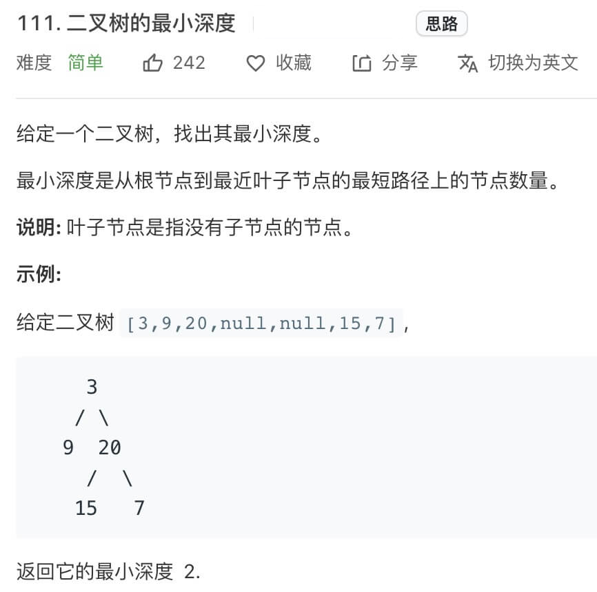
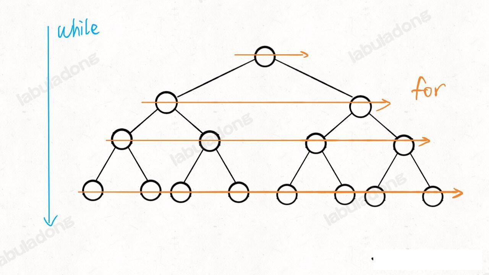
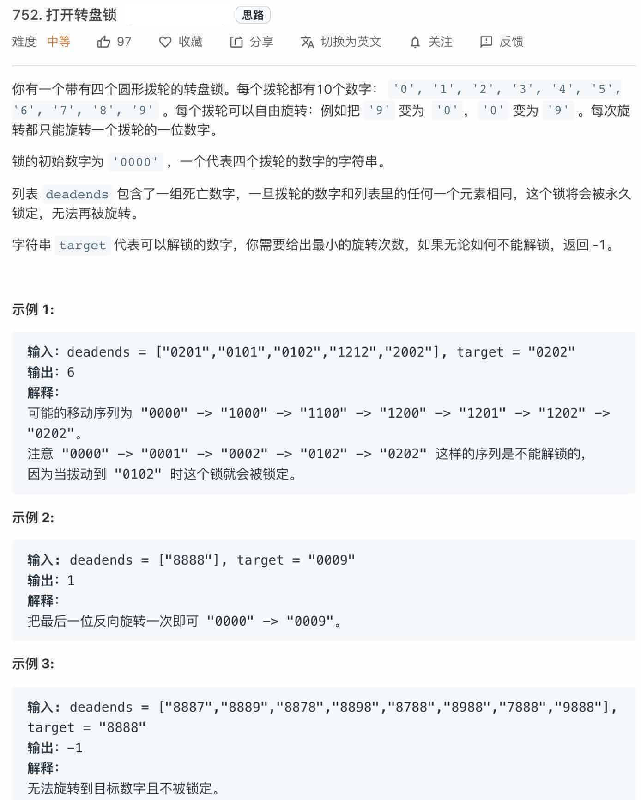
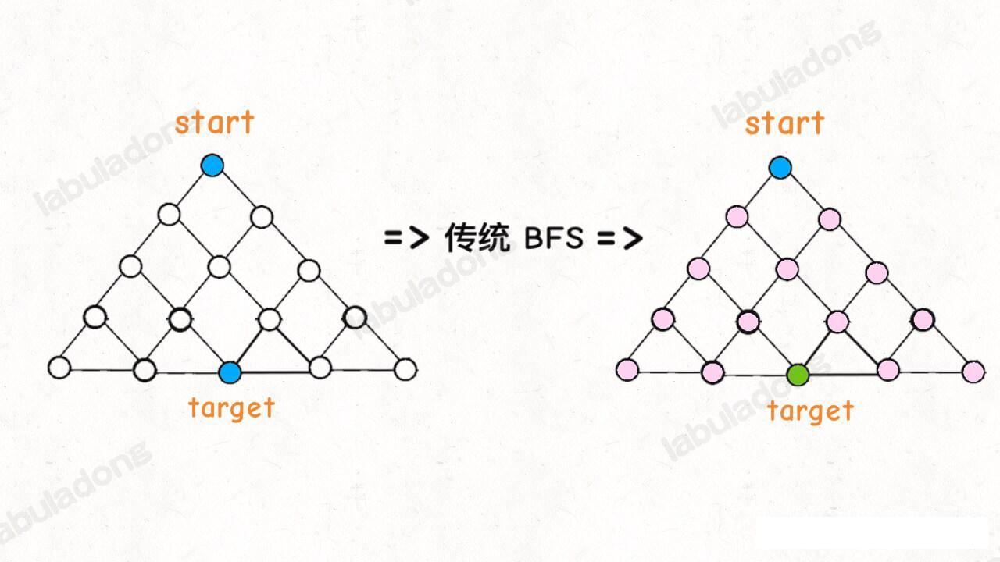
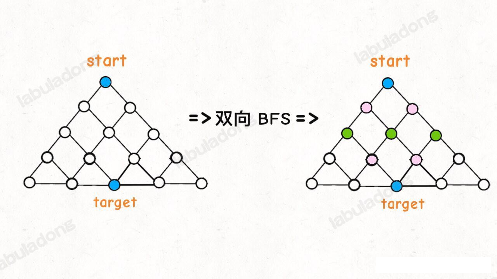
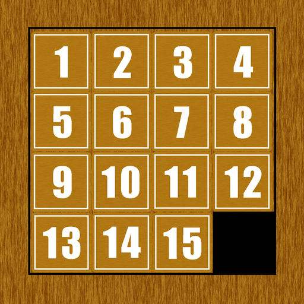
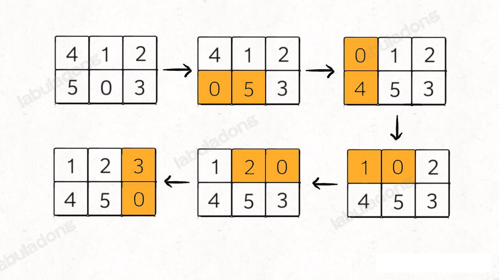
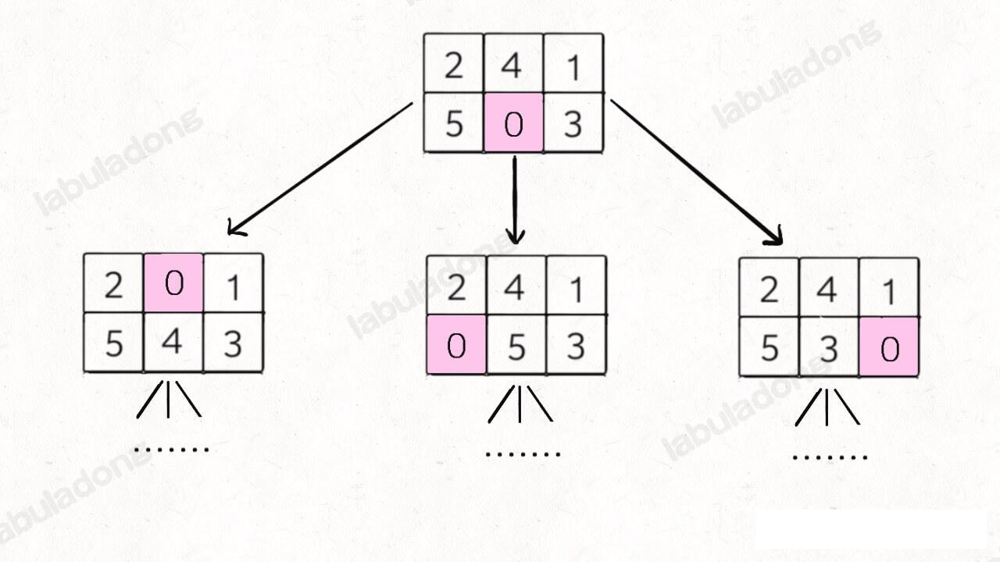
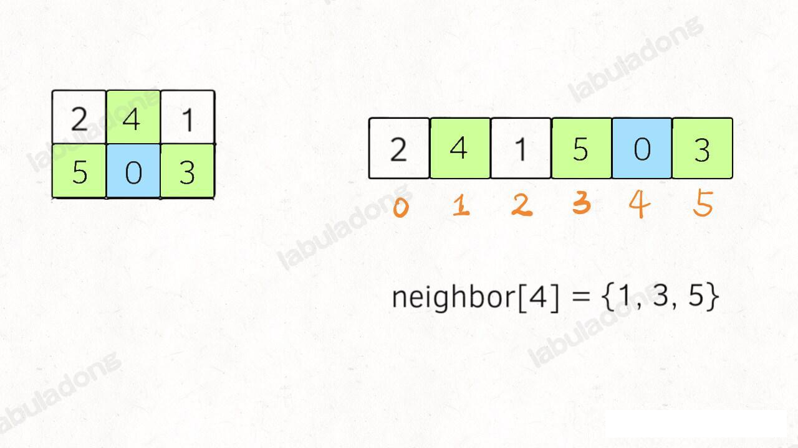

## BFS 宽度优先遍历

### BFS 算法解题套路

**DFS 算法就是回溯算法**，BFS 的核心思想应该不难理解，就是把一些问题抽象成图，从一个点开始，向四周扩散。一般来说，我们写 BFS 算法都是用「队列」这种数据结构，每次将一个节点周围的所有节点加入队列。

BFS 相对于 DFS 的最主要区别是：**BFS找到的路径一定是最短的，但代价是空间复杂度可能比 DFS 大很多**。

本章节，就由浅入深地介绍两道 BFS 的典型题目，非别是「二叉树的最小高度」和「打开密码锁的最小步数」，来看看 BFS 如何派上用场。

#### 二叉树最小深度

leetcode 111 题：


解法请参考 BfsUsage.minDepth() 方法

这里注意这个 `while` 循环和 `for` 循环的配合， `while` 循环控制一层一层往下走，`for` 循环利用 `len` 变量控制从左至右遍历每一层二叉树节点：


这点很重要你，这个形式在普通 BFS 问题中都很常见，但是在 Dijkastra 算法中，我们修改了这种代码模式，不再使用 size 遍历控制，而是使用优先级队里的优先级功能，寻找最短路径(PS: Dijkastra 使用这种方式就错了)。

话说回来，二叉树本身是很简单的数据结构，上述代码理解应该很容易，其他复杂问题都是这个框架的变形，在探讨复杂问题之前，我们解答两个问题：

**1、为什么 BFS 可以找到最短距离，DFS 不行吗？**

首先,你看 BFS 的逻辑, `depth` 每增加一次，队列中的所有节点都向前迈一步，这保证了第一次到达终点的时候，走的步数是最少的。

DFS 不能找到最短路径吗？其实也可以的，但是时间复杂度要相对高很多。你想啊，DFS 实际上是靠递归的堆栈记录走过的路径，你要找到最短路径，肯定得把所二叉树中所有的分支都探索完毕才能对比出最短路径有多长对不对？而 BFS 借助队列做一次一步「齐头并进」，是可以在不遍历完整棵树的条件下找到最短距离的。

形象店说，DFS 是线，BFS 是面；DFS 是单打独斗，BFS 是集体行动。这个应该比较容易理解吧。

**2、既然 BFS 那么好，为啥 DFS 还要存在**？

BFS 可以找到最短距离，但是空间复杂度高，而 DFS 的空间复杂度较低。

还是拿刚才的二叉树问题举例，假设给你的这个二叉树是满二叉树，节点为 N，对于 DFS 算法来说，空间复杂度无非就是递归堆栈，最坏情况下顶多就是树的高度，也就是 `O(logN)`。

但是你想想 BFS 算法，队列中每次都会存储着二叉树的一层节点，这样的话最坏情况下空间复杂度是树的最底层节点的数量，也就是 N/2 , 用 Big O表示法就是 O(N)。

由此来看，BFS 还是有代价的，一般来说在找最短路径的时候使用 BFS，其他时候还是 DFS 使用的多一些（主要是递归代码好写）。

接下来是 BFS 的深度使用例子

#### 解开密码锁的最少次数

leetcode 752 题，「打开转盘锁」，比较有意思：



题目中描述的就是我们生活中常见的那种密码锁，如果没有任何约束，最少的拨动次数很好算，就像我们平常开密码那样直奔密码拨就行了。

但现在的难点在于，不能出现 `deadends`，应该如何计算出最少的转动次数那？

**第一步，我们不管素有的限制条件，不管 `deadends` 和 `target` 的限制，就思考一个问题：如果让你设计一个算法，穷举所有可能的密码组合，你怎么做**？

穷举呗，再简单点，如果你只能转一下锁，有几种可能？总共有 4 个位置，每个位置可以向上转，也可以向下转，也就有 8 中可能对吧。

比如说从 `"0000"` 开始，转一次，可以穷举出 `"1000","9000","0100","0900"....` 共 8 中密码。然后再以这 8 中密码为基础，对每个密码再转一下，穷举所有可能...

**仔细想象，你就可以抽象成一幅图，每个节点有 8 个相邻的节点**，又让你求最短距离，这不就是典型的 BFS 嘛，框架就可以派到用场了。

除了框架之外，我们还要解决几个问题：

1、会走回头路。比如说，我们从 "0000" 拨到 "1000", 但是等从队列中拿到 "1000" 时，还是会拨出一个 "0000", 这样的话，就会产生死循环。

2、没有终止条件，按照题目要求，我们找到 `target` 就应该结束并返回拨动的次数。

3、需要对 `deadends` 做处理，按道理这些「死亡密码」是不能出现的，也就是说遇到这些密码是要跳过。

解决了这 3 个问题，这道题目就解决了。

#### 双向 BFS 优化

你以为到这里 BFS 算法就结束了？恰恰相反，BFS 算法还有一种稍微高级一点的优化思路：**双向 BFS**，可以进一步提高算法的效率。

**传统的 BFS 框架就是从起点开始向四周扩散，遇到重点时停止；而双向 BFS 则是从起点和重点同时开始扩散，当两边有交集时停止**。

为什么这样能提高效率那？其实从 Big O 表示法分析算法复杂度的话，它俩的最坏复杂度都是 O(N), 但是实际上双向 BFS 确实会快些，下面给出一幅示意图：




图中的属性结果，如果重点在最底部，按照传统的 BFS 算法策略，会把真棵树的节点都搜索一遍，最坏找到 target; 而双向 BFS 其实只遍历了半棵树就出现了交集，也就是找到了最短距离。从这个例子可以直观感受到，双向 BFS 要比传统的 BFS 高效。

**不过双向 BFS  也有局限，因为你必须知道重点在哪里**。比如我们刚才讨论的二叉树最小高度的问题，你一开始根本不知道重点在哪里，也就无法使用双向 BFS；但是第二个密码锁的问题，是可以使用双向 BFS 来提高效率的，参考方法 BfsUsage.openLock()


### BFS 解决滑动谜题

leetcode 773 题，「滑动谜题」

拼图游戏大家应该都玩过，下图是一个 4X4 的滑动拼图：



拼图的格子是空的，可以利用这个空着的格子移动其他数字。你需要通过移动这些数字，得到某个特定的顺序，这样就算赢了。

那么这种游戏怎么玩？应该是有一些套路的，类似于模仿还原公式。但是我们进不来研究让人头秃的技巧，**这些益智游戏统统可以通过暴力搜索算法解决，所以我们这个章节就学以致用，用 BFS 算法框架来解决这类问题**。

#### 一，题目解析

题目要求如下：

给你一个 2X3 的滑动拼图，用一个 2X3 的数组 `board` 表示。拼图中有数字 `0~5` 6 个数字，其中**数字0就表示那个空着的格子**，你可以移动其中的数字，当 `borad` 变为 `[[1,2,3],[4,5,0]]` 时，赢得游戏。

请你写一个算法，计算赢得游戏需要的最少移动次数，如果不能赢得游戏，返回 -1。

比如说输入二维数组 `board=[[4,1,2],[5,0,3]]`, 算法应该返回 5：



如果输入的是 `board=[[1,2,3],[5,4,0]]`, 则算法返回 -1，因为这种局面下无论如何都不能赢得游戏。

#### 二、思路分析

对于这种计算最小步数的问题，我们就要敏感地想到 BFS 算法。

这个题目转化成 BFS 问题是有一些介壳的，我们面临如下问题：

1、一般的 BFS 算法，是从一个起点 `start` 开始，向终点 `target` 机械能寻路，但是拼图问题不是在寻路，而是在不断交换数字，这应该怎么转化成 BFS 算法问题那？

2、即使这个问题能够转化成 BFS 问题，如何处理起点 `start` 和终点 `target`？他们都是数组呀，把数组放进队列，套 BFS 算法，想象就比较麻烦。

首先第一个为问题，**BFS 算法并不只是一个寻路算法，而是一种暴力搜索算法**，只要涉及暴力穷举的问题，然后从中找到一个最优解罢了。

你想想计算机是怎么解决问题的？那有什么特殊技巧，本质上就是把所有可行解暴力穷举出来，然后从中找到一个最优解罢了。

明白了这个道理，我们的问题就转化成了：**如何穷举出 `board` 当前局面下可能衍生出的所有局面**？ 这就简单了，看数字 0 的位置呗，和上下左右数字进行教化那就行了：



这样其实就一个 BFS 问题，每次找到数字 0 ，然后和周围的数字进行交换，形成新的局面加入队列...... 当第一次到达 `target` 时，就得到了赢得游戏的最少步数。

对于第二个问题，我们这里的 `board` 仅仅是 2X3 的二维数组，所以压缩成一个一位字符串。**其中比较有技巧的点在于，二维数组有「上下左右」的概念，压缩成一维后，如果得到一个索引的上下左右索引**？

对于这道题，题目说输入的数组打下都是 2x3, 所以我们可以直接手动写出来这个映射：
```java
int[][] neighbor = new int[][] {
    {1,3},// 2x3 二维数组的 0 位置的上下左右索引在一维空间的映射为 {1,3}, 其中 1 是 右，3 是下
    {0,4,2}, // 索引 1 的 左，下，右 相邻索引
    {1,5},
    {0,4},
    {3,1,5}, // 顺时针
    {4,2}
}
```
**这个含义就是，在一维字符串中，索引 i 在二维数组中的的相邻索引为 neighbor[i]**:



那对对于一个 `m x n` 的二维数组，手写它的一位索引映射肯定不现实，如何用代码生成它的一位索引映射那？

观察上图就能发现，如果二维数组中的某个元素 e 在一维数组的索引为 i，那么 e 的左右邻居在一维数组中的索引就是 i-1 和 i+1, 而 e 的上下相邻元素数组的索引就是 i-n 和 i+n, 其中 n 为二维数组的列数。

这样，对于 `m x n` 的二维数组，我们可以写一个函数来生成的 `neighbors` 索引映射

```java
neighbors 方法
```

至此，我们就把这个问题完全转化成标准的 bfs 问题了，借助 bfs 代码框架，直接既可以套出解法代码了。
