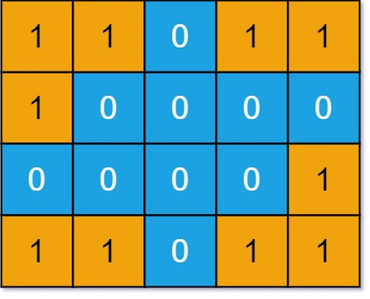

### DFS 解决岛屿相关问题

**岛屿系列问题的核心考点就是用 DFS/BFS 算法遍历二维数组**。

那么如何在二维数组矩阵使用 DFS 搜索那？如果你把二维矩阵的每一个位置看做一个节点，这个节点的上下左右位置就是就是相邻节点，那么整个矩阵就可以抽象成一副网状的「图」结构。

那么我我们根据二叉树的遍历框架，写出二维矩阵 DFS 的遍历框架

```java
void dfs(int[][] grid, int i, int j, boolean[][] visited) {
    //越界判断
    int m = grid.length;
    int n = grid[0].length;
    if(i<0|| j<0 || i>=m || j>=n) {
        return;
    }
    // 已遍历过 i,j
    if(visited[i][j]) {
        return ;
    }
    visited[i][j]=true;
    dfs(grid,i-1,j, visited); //上
    dfs(grid,i+1,j, visited); //下
    dfs(grid,i,j-1, visited); //左
    dfs(grid,i,j+1, visited); //右
}
```

因为二维矩阵本质上是一幅「图」，所以遍历过程需要一个 `visited` 布尔数组防止走回头路。如果理解了上述代码，那么岛屿系列问题都很简单

在 Union-Find 算法讲解中，我们也用到了反向数组：

```java
// 方向数组，分别代表上、下、左、右
int[][] dirs = new int[][]{{-1,0}, {1,0}, {0,-1}, {0,1}};

void dfs(int[][] grid, int i, int j, boolean[][] visited) {
    int m = grid.length, n = grid[0].length;
    if (i < 0 || j < 0 || i >= m || j >= n) {
        // 超出索引边界
        return;
    }
    if (visited[i][j]) {
        // 已遍历过 (i, j)
        return;
    }

    // 进入节点 (i, j)
    visited[i][j] = true;
    // 递归遍历上下左右的节点
    for (int[] d : dirs) {
        int next_i = i + d[0];
        int next_j = j + d[1];
        dfs(grid, next_i, next_j, visited);
    }
    // 离开节点 (i, j)
}
```

这种写法无非就是用 for 循环处理上下左右遍历罢了，我们可以按照个人的喜好选择写法。

#### 岛屿数量

leetcode 200 题，最简单也是最经典的一道题，题目要求输入一个二维数组 `grid`,其中包含 0 或者 1, 0 代表海水，1 代表陆地，且假设该矩阵四周都是被海水包围着的。

我们说连成片的陆地形成岛屿，那么请你写一个算法， 计算这个矩阵 `grid` 中岛屿的个数，函数签名如下：
```java
 public int numIslands(char[][] grid);
 ```
 比如题目给你输入下面这个 `grid` 有 4 片岛屿，算法应该返回 4：

 

 思路很简单，关键在于如何寻找并标记「岛屿」，这就要 DFS 算法发挥作用了，我们直接看代码

 参考 DfsBfsIsland 类中的 numIslands 方法

 #### 封闭岛屿的数量

 leetcode 1254 题，二维矩阵 grid 由 0 （土地）和 1 （水）组成。岛是由最大的4个方向连通的 0 组成的群，封闭岛是一个 完全 由1包围（左、上、右、下）的岛，请返回 封闭岛屿 的数目。

 函数签名如下：

 ```java
 public int closedIsland(int[][] grid) ;
 ```
比如题目给你输入如下这个二维矩阵：

 

算法返回2，只有图中灰色部分的 `0` 是四周全部非海水包围着的「封闭岛屿」

那么如何判断「封闭岛屿」那？其实很简单，就是把上一题中的所有靠边岛屿都去掉，剩下的不就是「封闭岛屿了」吗？

有了这个思路，就可以直接写代码了，注意这道题规定 `0` 表示陆地，`1` 表示海水。

请参考 closedIsland() 方法，

这道题用 Union-Find 解决也可以解决，在 Union-Find 学习的过程中，我们也尝试用 Union-Find 来解决这种类型的题目。

这道岛屿题目的解法稍微改下就可以解决 leetcode 1020  题 「飞地的数量」。这题不让你封闭岛屿的数量，而是求封闭岛屿的面积总和。

其实思路是一样的，先把海边的陆地淹掉，然后去数剩下的陆地数量就行了，注意该题中是 1 代表陆地，0 代表海水。

例子图如下：


算法应该返回 3，解释为： 有三个 1 被 0 包围。一个 1 没有被包围，因为它在边界上


#### 岛屿的最大面积

leetcode 695 题 「岛屿的最大面积」，0 表示海水，1 表示陆地，现在不让你计算岛屿的个数了，而是让你计算你最大的那个岛屿面积，函数签名如下：
```java
int maxAreaOfIsland(int[][] grid);
```

比如题目给你输入一个如下的二维矩阵：


其中面积最大的是橘红色的岛屿，算法返回它的面积为 6。

**这题的大体思路和之前完全一样，只不过 `dfs` 函数淹没岛屿的同时，还应该想办法记录这个岛屿的面积**

具体解法请参考 maxAreaOfIsland 和 maxAreaOfIsland2

#### 子岛屿数量

如果说前面的题目都是模板题，那么 leetcode 1905 题 「统计子岛屿」可能得动动脑子了。


**这道题的关键在于，如何快速判断子岛屿**？我们重点讨论 DFS 算法，在什么情况下 `grid2` 中的一个岛屿 B  是 `grid1` 中的一个岛屿 A 的子岛那？

当岛屿 B 中所有陆地在岛屿 A 中也是陆地的时候，岛屿 B 是岛屿 A 的子岛。

**反顾来说，如果岛屿 `B` 中存在一片陆地，在岛屿 `A` 中对应的是海水，那么岛屿 `B `就不是岛屿 `A` 的子岛**。

那么我们只要遍历 grid2 中所有岛屿，把哪些步可能是子岛的岛屿全排除掉，剩下的就是子岛，按照这个思路，写出代码

参考 countSubIslands 。

总结一下，有点求两个结合的交集一样， 集合 B 把不属于集合 A 的元素都删除(grid2 把 跟 grid1 不一样的岛屿淹没)，剩下的 B 中的元素就是 跟 A 交集，也就是说剩下的岛屿都是 grid1 的子集。

#### 不同岛屿的数量

这是本章节最后一道岛屿题，作为压轴题，当然也最有意思。

leetcode 694 题「不同岛屿的数量」，题名还是一个二维矩阵，0 表示海水，1 表示陆地，这次让你计算不同的(distinct) 岛屿数量，函数签名如下：
```java
int numDistinctIslands(int[][] grid);
```

比如题目输入下面这个二维矩阵：

 

 题目有 4 个岛屿，但是左下角和右上角的岛屿形状相同，所以不同的岛屿有是哪些，算法返回 3。

 很显然，我们得想办法把二维矩阵中的「岛屿」进行转化，变成比如字符串这样的类型，然后利用 HashSet 这样的结构去重，最终的到不同岛屿的数量。

 如果想把岛屿转化为字符串，说白了就是序列化，序列化说白了就是遍历嘛。前文的二叉树序列化和反序列化讲过，二叉树和字符串相互转化，这里也类似。

 **首先，对于形状相同的岛屿，如果从同一起点出发,`dfs` 函数边那里的顺序肯定是一样的**。

 因为遍历顺序是写死在你的递归函数里面(上下左右的遍历顺序)，不会动态改变。
 
 所以，遍历顺序从某种意义上来说就可以用来描述岛屿的形状，比如下面这个岛屿图：

 

 假设他们的遍历顺序是：
 >下，右，上，撤销上，撤销右，撤销下
 如果我们用 `1,2,3,4,` 代表上下左右，用 `-1,-2,-3,-4` 代表上下左右的撤销，那么这样可以表示他们的遍历熟悉：

 > 2,4,1,-1,-4,-2

 你看，这就相当于是岛屿序列化的结果，只要每次使用 `dfs` 遍历的时候生成这串数字进行比对，就可以计算到底有多少不同的岛屿了。

 这里可能有人要问，为什么记录「撤销」操作才能唯一表示遍历顺序那？不记录撤销操作好像也可以？实际上不是的。

 比如说 「下，右，撤销右，撤销下」和「下，撤销下，右，撤销右」显然是两个不同的遍历顺序，但如果不记录撤销操作，那么它俩都是「下，右」，成了相同的遍历顺序，显然是不对的。

 ```java
 public int numsOfDistinctIslands(int[][] grid) {
        if (grid == null || grid.length < 1) {
            return 0;
        }
        reverseWaterAndLand();
        StringBuilder content = new StringBuilder();
        Set<String> islandsSet = new HashSet<>();
        for (int i = 0; i < grid.length; i++) {
            for (int j = 0; j < grid[0].length; j++) {
                if (grid[i][j] == LAND) {
                    // 初始值传入一个非 遍历方向的值就行
                    content.delete(0, content.length());
                    dfsDistinctIslands(grid, i, j, content, 0);
                    islandsSet.add(content.toString());
                }
            }
        }
        reverseWaterAndLand();
        System.out.println(islandsSet);
        return islandsSet.size();
    }

    /**
     * 不同的岛屿遍历
     * 
     * @param grid
     */
    void dfsDistinctIslands(int[][] grid, int i, int j, StringBuilder sb, int direction) {
        int m = grid.length;
        int n = grid[0].length;
        if (i < 0 || i >= m || j < 0 || j >= n || grid[i][j] == WATER) {
            return;
        }
        grid[i][j] = WATER;
        sb.append(direction);
        // 上下左右 dfs 遍历。1,2,3,4 代表上下左右
        dfsDistinctIslands(grid, i - 1, j, sb, 1);
        dfsDistinctIslands(grid, i + 1, j, sb, 2);
        dfsDistinctIslands(grid, i, j - 1, sb, 3);
        dfsDistinctIslands(grid, i, j + 1, sb, 4);
        // 后续遍历位置，代表撤销操作
        sb.append(-direction);
    }

    void reverseWaterAndLand() {
        WATER = WATER ^ 1;
        LAND = LAND ^ 1;
    }
 ```

> 仔细看这个代码，在递归前做选择， 在递归后撤销选择，它像不像 回溯算法框架？实际上它就是回溯算法，因为它关注的是「树枝」（岛屿的遍历顺序），而不是「节点」（岛屿的每个格子）。

direction 记录方向，`dfs` 函数结束后，sb 记录着整个遍历顺序。

这样这道题就解决了，至于为什么出事调用 dfs 的时候 direction 参数可以随意写，因为这个 dfs 函数实际是回溯算法，它关注的是「树枝」而不是「节点」。

这就是岛屿系列题目的解题思路，后面两道题还是比较巧妙的，希望我们大家都能现学现用，灵活使用。


