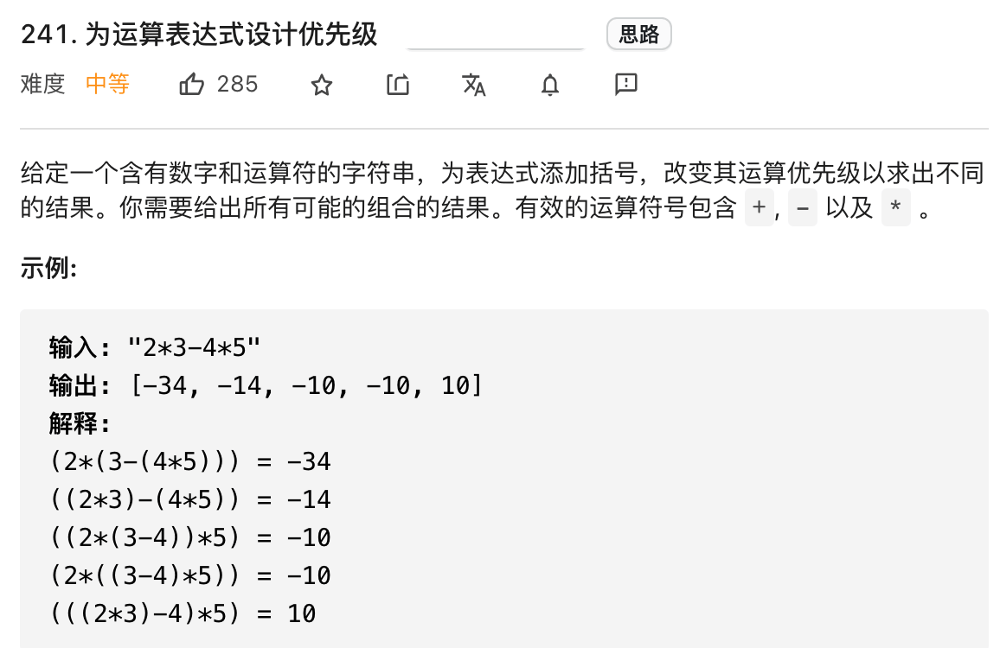

### 分治思想

分治算法，可以认为是一种思想，通过将原问题分解成小规模的子问题，然后根据子问题的结果构造出原问题的答案。这里有点类似动态规划，所以说运用分治算法也需要满足一些条件，你的原问题应该可以通过合并子问题结果(merge)来计算。

分治法有时候也可以加个备忘录进行剪枝。没必要过分纠结每个算法的定义，定义这东西无非文学词汇而已，反正能把题做出来你说这是啥算法都行，**所以大家还是得多刷题，刷出感觉，各种算法手到擒来**。

最典型的分值算法就是归并排序了，其核心逻辑如下：

```java
void sort(int[] nums,int lo,int hi) {
    int mid = (lo+hi)/2;
    /****** 分 *****/
    sort(nums,lo,mid)
    sort(nums,mid+1, hi);
    /********* 治 **********/
    // 合并两个已经排好序的子数组。
    merge(nums,lo,mid,hi);
}
```
下面来看一道具体的算法题。

#### 添加括号的所有方式

我们借助 leetcode  241 题「为运算表达式设计优先级」来讲讲什么是分治算法，先看看题目：



简单说，就是给你输入一个算式，你可以给它随意添加括号，**请你穷举出所有可能的加括号方式，并计算出对应的结果**。

函数签名如下：

```java
public List<Integer> diffWaysToCompute(String expression) 
```

看到这道题的第一个感觉就是肯定是复杂，我要穷举出所有可能的加括号方式，是不是还得考虑括号的合法性？是不还要考虑计算的优先级？

是的，这些都要考虑，但是不需要我们来考虑。利用分治思想和递归函数，算法会帮我们考虑一切细节，也许这就是这就是算法的魅力把。（看完之后，大呼牛逼，完全没想到）

废话不多说，解决本题的关键有两点：

**1、不要思考整体，而是把目光聚焦到局部，只看一个运算符**

这点我们在解决相关二叉树问题时，有提到过，我们要考虑每个节点做什么，而不需要思考整棵树需要作什么

说白了，解决递归相关的算法问题，就是一个化整为零的过程，你必须瞄准一个小的突破口，然后把问题拆解，大而化小，利用递归函数解决。

**2、明确递归函数的定义是什么，相信并且利用好函数的定义**。

这也是我们之前经常提到的一点，因为递归函数要自己调用自己，你必须搞清楚函数到底能干什么？才能正确进行递归调用

下面来具体解释下这两个关键点怎么理解。

我们先来看一个例子，比如题目输入一个这样的算式：

`1 + 2 * 3 - 4 * 5`

请问，这个算式有几种加括号的方式？请在一秒内回复

估计你回答不上来，因为括号可以嵌套，要穷举出来肯定得费点功夫。

不过那，嵌套这个事情吧，我们人类来看是很头疼，但是对于算法来说，嵌套括号不要太简单，依次递归就可以嵌套一层，一次搞不定大不了多递归几次。

所以，作为写算法的人类，我们只需要思考，如果不让括号嵌套(即加一层括号)，有几种加括号的方式？

还是上面的例子，显然我们有 4 中加法：

`(1)+(2 * 3 - 4 * 5)`

`(1+ 2) * (3 - 4 * 5)`

`(1 + 2 * 3) - (4 * 5)`

`(1 + 2 * 3 - 4) * (5)`

发现规律了吗？**其实就是按照运算符进行分割，给每个运算符的左右两部分都加括号**，这就是之前说的第一个关键点，不要考虑整体，而是聚焦每个运算符。

现在单独说上面第三种情况：

`(1 + 2 * 3) - (4 * 5)`

我们利用减号 `-` 作为分隔符，把源表达式分解成两个算式 `1 + 2 * 3` 和 `4 * 5`。

分治分治，分而治之，**这一步就是把原问题进行「分」，现在我们开始「治」了**。

`1 + 2 * 3` 可以有两种加括号的方式，分别是：

`1 + (2 * 3) = 7`

`(1 + 2) * 3 = 9`

或者我们可以写成这种形式：

`1 + 2 * 3=[9,7]`

而 `4 * 5` 当然只有一种加括号的方式，那就是 `4 * 5 = [20]`。

然后那，我们能不能通过上述结果推导出 `(1 + 2 * 3) - (4 * 5)` 有几种加括号的方式，或者说有几种不同的结果？

显然，可以推导出来 `(1 + 2 * 3) - (4 * 5)` 有两种结果，分别是：

`9- 20 = -11`

`7 -20 = -13`

那么你可能要问了 `1 + 2 * 3 = [9,7]` 的结果是我们自己看出来的，如何让算法计算出来这个结果那？

这个简单，再回头看看题目给出的函数签名：

```java
// 定义算式 expresssion 所有可能的运算结果
List<Integer> diffWaysToCompute(String expression) 
```

这个函数不就是干这事的吗？**这就是我们之前说的第二个关键点，明确函数的定义，相信并利用这个函数定义**。

你甭管这个函数时怎么做到的，你相信它能做到，然后用就行了，最后它就真的能做到。( ps:这句话说的就像吹牛逼，但是回想下归并排序，你别管它是怎么排序的，你只管拆分，相信它能将更小的集合也进行排序）

那么，对于 `(1 + 2 * 3) - (4 * 5)` 这个例子，我们的计算逻辑其实就是这段代码：

```java
List<Integer> diffWaysToCompute("(1 + 2 * 3) - (4 * 5)") {
    List<String> res = new LinkedList<>();
    /***********分************/
    List<Integer> left = diffWaysToCompute("1 + 2 * 3");
    List<Integer> right= diffWaysToCompute("4 * 5");
    /*******治***********/
    for(int a : left)
        for(int b : right) 
            res.add(a-b);
    
    return res;
}
```

好，现在 `(1 + 2 * 3) - (4 * 5)` 这个例子是如何计算的，你应该完全理解了吧，那么回来看我们的原始问题。

原问题 `(1 + 2 * 3) - (4 * 5)` 是不是只有 `(1 + 2 * 3) - (4 * 5)` 这一种情况？是不是只能从减号 - 进行分割？

不是，每个运算符都可以把问题分割成两个子问题，刚才已经列出了所有可能的分割方式：

`(1)+(2 * 3 - 4 * 5)`

`(1+ 2) * (3 - 4 * 5)`

`(1 + 2 * 3) - (4 * 5)`

`(1 + 2 * 3 - 4) * (5)`

所以我们要穷举上面每一种情况，可以进一步细化一下解法代码：

