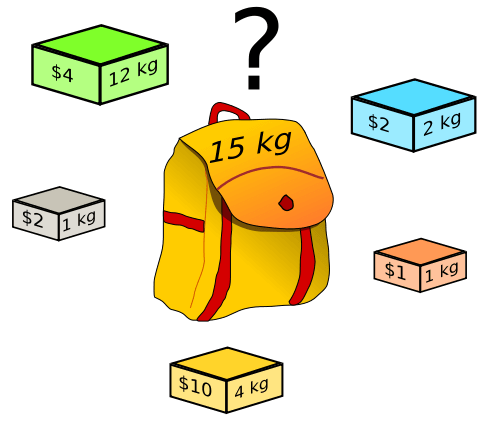

### 背包问题
#### 0-1 背包问题
这个问题根据 东哥的描述，没有在 leetcode 中找到对应的题目

问题描述，给你一个可装载重量为 W 的背包和 N 个物品，每个任务品有重量和价格两个属性。其中第 i 个物品的重力为 wt[i]，价值为 val[i], 现在让你用这个被包装物品，最多能装的价格是多少？


举个简单的例子，输入如下：
```python
N = 3, W = 4
wt = [2,1,3]
val = [4, 2, 3] 
```
算法返回 6 ，选择前俩个物品装进背包，总重量为 3 小于 W，可获得的最大价值为 6.

题目就是这么简单，一个典型的动态规划问题。这个题目中的物品不可以分割，要么装进包里，要么不装，不能说切成两块装一半。这就是 0-1 背包这个名词的来历。

解决这个问题没什么排序之类的巧妙的方法，只能穷举所有可能，根据我们 动态规划详解 中的套路，直接走流程就行了。

##### 第一步要明确两点，「状态」和「选择」

**状态有 2 个，就是「可选的物品」和「背包的容量」**

再说选择，**选择就是「装进背包」或者「不装进背包」嘛**

有了状态和选择，我们就可以套框架了

##### 第二步明确 `dp` 数组的定义
`dp[i][j]` 的定义如下：

dp[i][j] 表示容量为使用第 i 个物品，载重量为 j 的时候，背包能装下最大的价值

比如说，如果 `dp[3][5] = 6`, 其含义为：对于给定的一系列物品中，若只对前 3 个物品进行选择，当背包容量为 5 时，最多可以装下的价值为 6。

根据这个定义，我们需要求解的最终答案就是 dp[N][M]。base case 就是 `dp[0][..] = dp[..][0] = 0` ，因为没有物品或者背包没有空间的时候，能装的价值都是 0。

##### 第三步，根据「选择」，思考状态转移的逻辑。

简单说就是，按选择分就是当前物品装入背包或者没有装入背包
**如果没有把第 `i` 个物品装入背包**，那么很显然，最大价值 dp[i][w] 应该等于 `dp[i-1][w]` ，就是继承前一个的结果。

**如果把第 `i` 个物品装入背包**，那么 dp[i][w] 应该等于 `val[i-1] + dp[i-1][w-wt[i-1]]`。

如果我们选择将第 i 个物品装入背包，那么第 i 个物品的价值 val[i-1] 肯定是要加上的，同时当前容量(其实就是背包剩余容量)需要进行  `w - wt[i-1]`, 在 i 个物品中挑选价值最大的，即 dp[i-1][w - wt[i-1]]。 

最终的状态转移公式：

// 可以选择第 i 个物品，也可以不选择.选择的话，就是要减去重量，加上价格
dp[i][j] = Math.max(dp[i-1][j], dp[i-1][j-wt[i]] + val[i])

### 经典动态规划：子集背包问题

输入一个只包含正整数的非空数组 nums，请你写一个算法，判断这个数组是否可以被分割成两个子集，使得两个子集的元素和相等。

比如说输入 `nums = [1,5,11,5]`，算法返回 true，因为 nums 可以分割成 `[1,5,5]` 和 `[11]` 这两个子集。

如果说输入 `nums = [1,3,2,5]`，算法返回 false，因为 nums 无论如何都不能分割成两个和相等的子集。

这个问题，看起来和背包没有任何关系，为甚说它是背包问题那？
对于这个问题，我们可以先对集合求和，得出 sum，再把问题转化为背包问题：

**给一个可装载重量为 `sum/2` 的背包和 `N` 个物品，每个物品的重量为 nums[i]。现在让你装物品，是否存在一种装法，能够恰好将背包装满？**

看看，这个问题是不是成功第转化为背包模型了，甚至比我们之前的经典背包问题还要简单一些，下面我们直接套用背包套路

#### 先明确状态和选择，在确定 dp[i][j] 的含义，最后求出状态转换方程

状态有：可选的物品=数组的元素，背包的容量=求解的 sum 和；选择就是「装进背包」或者「不装进背包」

dp[i][j] 的定义：

**`dp[i][j]=x` 表示，对于前 `i` 个物品(i 从 1 开始自己算)，当前背包的容量为 `j` 时，若 `x` 为 true ，则说明可以恰好将背包装满，若 x 为 `false`, 则说明不能恰好将背包装满。 **

比如说，如果 `dp[4][9] =true`，其含义为，对于容量为 9 的背包，若只是在前 4 个物品中进行选择，可以有一种办法把背包敲好填满。

根据这个定义，我们想求的最终答案就是 dp[N][sum/2]，base case 就是 `dp[..][0] = true` 和 `dp[0][..] = false`，因为
**背包没有空间的时候，就相当于装满了，因此为 true**，而当没有物品可选择的时候，肯定没办法装满背包

最后一步，根据「选择」，思考状态转移的逻辑。

根据 dp[i][j] 的定义，可以得出如下状态转移：

如果不把 `nums[i]` 算入子集，**或者说不把这第 `i` 个物品装入背包**, 那么当前的 dp[i][j] 是否能够恰好装满背包，取决于上一个状态 `dp[i-1][j]`, 继承之前的结果，如果上一个能够满足要求，那么当前[i]肯定也是可以将 j 恰好装入背包(当然 i 不会被装入，否则就溢出了，但是表示的 dp[i][j] 的含义是前 i 的物品是可以装满背包的，这里对 dp[i][j] 的意义的理解是很重要的)

如果把 `nums[i]` 算入子集，**或者说把这第 `i` 个物品装入背包**, 那么释放能够恰好装入背包，取决于 `dp[i-1][j-nums[i-1]]` 。

`dp[i-1][j-nums[i-1]]` 很好理解，你如果装满了第 `i` 个物品，就需要看背包剩余的重量是否能够恰好装入 nums[i] 实现 j 容量的恰好装满 ，能恰好装入的前提是，容量在上一物品装入之后是否为  j-nums[i-1] 。

最后形成状态转移方程和具体的函数实现

#### 优化，将二维空间降低为一维空间

这个自行看代码，逻辑意义看不懂

### 完全体背包问题：零钱兑换

题目描述：

给定不同面额的硬币 coins 和一个总金额 amount，写一个函数来计算可以凑成总金额的硬币组合数。假设每一种面额的硬币有无限个。

比如说输入 amount = 5, coins = [1,2,5]，算法应该返回 4，因为有如下 4 种方式可以凑出目标金额：

```python
5=5

5=2+2+1

5=2+1+1+1

5=1+1+1+1+1

```
如果输入的 amount = 5, coins = [3]，算法应该返回 0，因为用面额为 3 的硬币无法凑出总金额 5。

#### 解题思路：

**我们可以把这个问题转移成背包问题的描述**

有一个背包，最大容量为 `amount`, 有一系列物品 `coins`，每个物品的重量为 coin[i] ， **每个物品的数量无限**。请问有多少种方法，能够把背包恰好装满？

这个就是传说中的「**完全背包问题**」，没啥高大上的，无非就是状态转移方程有一点变化而已。

dp[i][j] 的定义如下：
若只使用前 i 个物品（可以重复使用），当背包容量为 j 时，有 dp[i][j] 种方法可以装满背包。

base case 为 dp[0][..] = 0, dp[..][0] = 1。i = 0 代表不使用任何硬币面值，这种情况下显然无法凑出任何金额；j = 0 代表需要凑出的目标金额为 0，那么什么都不做或就是唯一的一种凑法

***思考状态转移***

**不把第 i 个物品放入背包** dp[i][j] = dp[i-1][j], 继承之前的结果

**把第 i 个物品放入背包** dp[i][j] =dp[i][j-coin[i-1]] 

综上两种选择，而我们想求的 dp[i][j] 是「共有多少种凑法」，所以 dp[i][j] 的值应该是两种选择的结果之和：