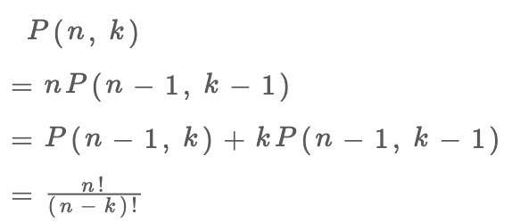
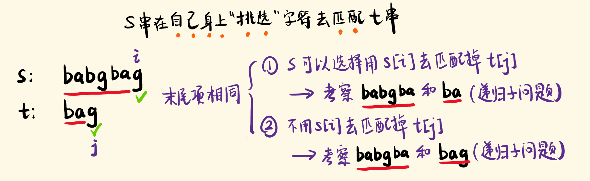
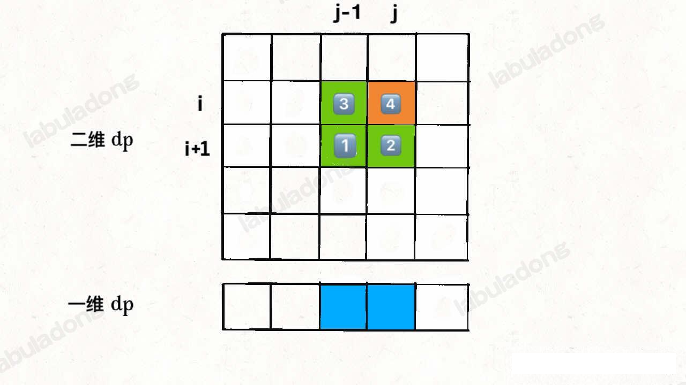

## 动态规划基本技巧章节

### 动态规划解题套路框架
动态规划问题(Dynamic Programming) 应该是很多读者头疼的，不过这类问题也是最具有技巧性，最有意思的。本章节来专门讲解一下这个重要的算法。

本章节解决结果问题：

动态规划是什么？解决动态规划问有什么技巧？如果学习动态规划？

刷题多了就会发现，算法技巧就那么几个套路，我们后续的动态规划系列章节，都在使用本章节的解题框架思维，如果你心里有数，就会轻松很多。
所以本章节作为第一章节，来扒一扒动态规划的裤子，形成一套解决这类问题的思维框架，希望能成为解决动态规划问题的一部指导方针。本篇就讲讲该算法的基本套路框架，下面上干货。

首先，**动态规划问题的一般形式就是求最值**。动态规划其实是运筹学的一种最优化方法，只不过在计算机上应用比较多，比如说让你求最长递增子序列呀，最小编辑距离等等。

既然是求最值，核心的问题是什么那？**求解动态规划的核心问题是穷举**。因为要求最值，肯定要把所有可行的答案穷举出来，然后在其中找最值呗。

动态规划就是这么简单，就是穷举就完事了？我看到的动态规划问题都很难呀！

首先，虽然动态规划的核心思想就是穷举最值，但是问题可以千变万化，穷举所有可行解其实并不是一件容易的事，需要你熟练掌握递归思维，只有列出**正确的「状态转移方程」**，才能正确地穷举。而且，你需要判断算法问题是否**具备「最优子结构」**，是否能通过子问题的最值得到原问题的最值。另外，动态规划问题**存在「重叠子问题」**，如果暴力穷举的话，效率会很低，所以需要你使用「备忘录」或者「DP table」来优化穷举过程，避免不必要的计算。

以上提到的<font color='red'>**重叠子问题，最优子结构、状态转移方程**</font>就是动态规划三要素。具体什么意思下面会举例详解，但是在实际的算法问题中，写出状态转移方程是最困难的，这也是为什么很多朋友觉得动态规划问题困难的原因，这里提供一个思维框架，辅助你思考状态转移方程：

**明确 base case -> 明确「状态」 -> 明确「选择」 -> 定义 `dp` 数组/函数的含义**。

按上面的套路走，最后的解法代码就是是如下的框架
```python
# 自顶向下递归的动态规划
def dp(状态1,状态2,...):
  for 选择 in 所有可能的选择:
    # 此时的状态以及因为做了选择而改变
    result = 求最值(result,dp(状态1,状态2，...))
  return result

# 自底向上的动态规划。自底向上还是自顶向下，这里描述太晦涩，实际使用中我总结出来的是根据函数的轮询的方向,一般 ++ 是从小到大，也就是自底向上。如果没有迭代方向，只有递归，那么看 fx=f(x+1) 还是 f(x)=f(x-1) 。x+1 就是自底向上，x-1 就是自顶向下。
# -- 是从大到小，自顶向下。
# 初始 base case
dp[0][0][...] = base case
for 状态1 in 状态1的所有取值：
    for 状态2 in 状态2的所有取值：
        for ...
            dp[状态1][状态2][...] = 求最值(选择1，选择2...)
```
具体的算法请参考斐波那契梳理和凑零钱的问题来理解动态规划。

#### 斐波那契数列

力扣第 509 题「斐波那契数列」就是这个问题，请不要嫌弃这个例子简单，**只有简单的例子才能让你把精力充分集中在算法背后的通用思想和技巧上，而不会被那些隐晦的细节问题搞的莫名其妙**。想要困难的例子，接下来的动态规划系列里有的是。

##### 1、暴力递归
斐波那契的书序形式就是递归的，写成代码就是下面这样：
```java
int fib(int N) {
  if(N==1 || N == 2) return 1;
  return fib(N-1) + fib(N-2);
}
```
这个不用多少了，学校老师将递归的时候几乎都是拿这个举例子。我们也知道这样写代码虽然简洁易懂，但是十分低效，抵消在哪里？假设 n=20，请画出递归树：


(PS:但凡遇到递归问题，最好都画出递归树，这对分析算法的复杂度，寻找算法抵消的原因有巨大帮助。）

这个递归树怎么理解？就是说如果想要计算原问题 f(20), 就得先计算出子问题 f(19) 和 f(18),
然后计算 `f(19)` , 我们就需要先算出子问题`f(18)` 和 `f(17)`，以此类推。最火遇到 f(1) 或者 f(2) 的时候，结果已知，节能直接返回，递归树不再向下生长了。

**递归算法的时间复杂度怎计算？就是用子问题个数乘以解决一个子问题所需要的时间**。

首先计算子问题的个数，即递归树中节点的总数。显然二叉树节点总数为指数级别，所以这个问题的个数为 O(2^n)。

然后计算解决一个子问题的时间，在本算法中，没有循环，只有 `f(n-1)+f(n-2)` 一个加法操作，时间为O(1)。

所以，这个算法的时间复杂度为二者相乘，即 O(2^n)，指数级别，爆炸。

观察递归树，很明显发现了抵消的原因：存在大量的重复计算，比如 `f(18)` 被计算了两次，而且你还可以看到，以 `(f18)` 为根的这个递归树体量巨大，多算一遍，会耗费巨大的时间。更何况，还不知 `f(18)` 这一个节点被重复计算，所以这个算法及其低效。

这就是动态规划的第一个性质：**重叠子问题**。下面，我们想办法解决这个问题。

##### 2、带备忘录的递归解法

明确了问题，其实就已经把问题解决了一半。既然耗时的原因是重复计算，那么我们可以造一个「备忘录」，每次算出某个字问题的答案后被记者返回，先记录到「备忘录」里再返回；每次遇到一个子问题先去「备忘录」里查一查，如果发现之前已经解决过这个问题了，直接把答案拿出来用，不要再耗时去计算了。

一般使用一个数组充当这个「备忘录」，当然我们也可以使用哈希表（字典），思想都是一样的。
```java
int fib(int N) {
    // 备忘录全初始化为 0
    int[] memo = new int[N + 1];
    // 进行带备忘录的递归
    return dp(memo, N);
}

// 带着备忘录进行递归
int dp(int[] memo, int n) {
    // base case
    if (n == 0 || n == 1) return n;
    // 已经计算过，不用再计算了
    if (memo[n] != 0) return memo[n];
    memo[n] = dp(memo, n - 1) + dp(memo, n - 2);
    return memo[n];
}
```
现在，画出递归树，你就知道「备忘录」到底做了什么：


实际上，带「备忘录」的递归算法，是吧一个存在巨量冗余的递归树通过「**剪枝**」，改造成了衣服不存在冗余的递归图，极大地减少了子问题(即递归图中的节点)的个数。


**递归算法的时间复杂度怎么计算？就是用子问题个数乘以解决一个子问题所需要的时间**。

子问题个数，即图中节点的总数，由于本算法不存在冗余计算，子问题就是 `f(1)、f(2)、f(3)...f(20)`，数量和输入规模 `n=20` 成正比，所以子问题个数为 O(n)。

解决一个子问题的时间，同上，没有什么循环，时间为 O(1)。

所以算法的时间复杂度为O(n)，比起暴力算法，算是降维打击。

至此，带备忘录的递归解法的效率已经和迭代的动态规划解法一样了。实际上，这种解法和常见的动态规划解法已经差不多了，只不过这种是「自顶向下」进行「递归求解」，我们更常见的动态规划代码是「自底向上」进行「递推」求解。

啥叫「自顶向下」？注意我们刚才画的递归树（或者说图），是从上向下延伸，都是从一个规模较大的原问题比如说 `f(20)`，向下逐渐分解规模，直到 `f(2)` 和 `f(1)` 这两个 base case，然后逐层返回答案，这就叫「自顶向下」。

啥叫「自底向上」？反过来，就是我们直接从最底下、最简单、问题规模最小、已知结果的 `f(1)`和 `f(2)` 开始往上推，直到推到我们想要的答案`f(20)`。这就是「递推」的思路，这也是动态规划一般都脱离了递归，而是由循环迭代完成计算的原因。

##### 3、`dp` 数组的迭代（递归）解法

有了上一步「备忘录」的启发，我们可以把这个「独立」出来成为一张表，通常叫 DP table，在这张表上完成「自底向上」的推算岂不美哉！
```java
int fib(int N) {
  if (N == 0) return 0;
  int[] dp = new int[N + 1];
  // base case
  dp[0] = 0; dp[1] = 1;
  // 状态转移
  for(int i=2;i<=N;i++) {
    dp[i] = dp[i-2] + dp[i-1];
  }
  return dp[N];
}
```


画个图其实就很好理解了，而且你发现这个 DP table 特别像之前那个「剪枝」后的结果，只是反过来而已。实际上，带备忘录的递归解法中的「备忘录」，就是最终完成后的这个 DP table，所以说这两种解法其实是差不多的，大部分情况下，效率也是基本相同。

这里, 引出「状态转移方程」这个名词，实际上就是描述问题结构的数学形式：


为啥叫「状态转移方程」？其实就是为了听起来高端。

`f(n)` 的函数参数会不断变化，所以你把参数 `n` 想做一个状态，这个状态 `n` 是由状态 `n-1` 和状态 `n-2` 转移(相加)而来，这就叫状态转移，仅此而已。

你会发现，上面的集中解法中的所有操作，例如 `return f(n-1)+ f(n-2)`, `dp[i] = dp[i-1]+ dp[i-2]`，以及对备忘录或 DP table 的初始化操作，都是围绕这个方程式的不同表现形式。

可见列出「状态转移方程」的重要性，它是解决问题的核心，而且很容易发现，其实状态转移方程直接代表着暴力解法。

**千万不要小看暴力解，动态规划问题最困难的就是写出这个暴力解，即状态转移方程。**

只要写出暴力解，优化方法无非就是用备忘录或者 DP table，再无奥妙可言。

这个例子的最后，再说一个细节优化。

如果仔细观察就会发现，依据斐波那契数列的状态转回方程，当前状态 `n` 只和之前的`n-1，n-2` 两个状态有关，其实并不需要那么长的一个 DP table 来存储所有的状态，只要想办法存储之前的两个状态就行了。

所以，可以进一步优化，把空间复杂度降为 O(1)。这也是我们最常见的计算斐波那契数列的算法：
```java
int fib(int n) {
  if(n==0 || n==1) {
    // base case
    return n;
  }
  // 分别代表 dp[i-1],dp[i-2]
  int dp_i_1=1, dp_i_2=0;
  //仍然是从 i=2 开始
  for(int i=2;i<=n;i++) {
    // dp[i] = dp[i-1] + dp[i-2];
    int dp_i = dp_i_1 + dp_i_2;
    //滚动更新
    dp_i_2 = dp_i_1;
    dp_i_1 = dp_i;
  }
  return dp_i_1;
}
```
___
这一般是动态规划问题的最后一步优化，如果我们发现每次状态转移只需要 DP table 中的一部分，那么可以尝试缩小 DP table 的大小，只记录必要的数据，从而降低空间复杂度。

上述例子就是相当于把 DP table 的大小从 n 缩小到 2。后面的 《动态规划降维打击》 进一步讲解这个压缩空间复杂度的技巧，一般来说把一个二维的 DP table 压缩成一维，即把空间复杂度从 O(n^2) 压缩到 O(N)。

还有最后一个动态规划的重要特性「最优子结构」没有涉及。下面会涉及，斐波那契亚严格来说并不算动态规划，因为没有涉及求最值，以上旨在说明重叠子问题的小厨房放，演示得到最优解法逐步求精的过程。下面看看第二个问题，凑零钱的问题。

#### 二、凑零钱问题

##### 问题描述
leetcode 第 322 题
给你 `k` 种面值的硬币，面值分别为 `c1,c2...ck`，每种硬币的数量无限，再给一个总金额 amount，请问 **最少**需要几枚硬币才能凑出这个金额，如果不可能凑出，算法返回 -1。算法的签名如下：
```java
// coins 中是可选应避面值，amount 是目标金额
int coinChange(int[] coins,int amount)
```
比如说 `k=3`, 面值分别是1，2,5，总金额 `amount=11`。那么最少需要 3 枚硬币凑出，即 11 == 5+5+1。

你认为计算机应该如果解决这个问题？显然，就是把所有可能的凑硬币方法都穷举出来，然后找到最少需要多少枚硬币。

具体的解法参见 CoinChange.java 

##### 一、递归求解
首先，这个问题是动态规划问题，因为它具有「最优子结构」的。**要符合「最优子结构」，子问题间必须相互独立**。啥叫相互独立？你肯定不想看数学证明，我用一个直观的例子来讲解。

比如说，假设你考试，每门科目的成绩都是互相独立的。你的原问题是考出最高的总成绩，那么你的子问题就是要把语文考到最高，数学考到最高…… 为了每门课考到最高，你要把每门课相应的选择题分数拿到最高，填空题分数拿到最高…… 当然，最终就是你每门课都是满分，这就是最高的总成绩。

得到了正确的结果：最高成绩就是总分。因为这个过程符合最优子结构，「每门科目考到最高」这些子问题是相互独立的，互不干扰。

但是，如果加一个条件：你的语文成绩和数学成绩会相互制约，不能同时达到满分，数学分高，语文成绩分数就会降低，反之亦然。

这样的话，显然你能考到的总成绩就达不到总分了，按刚才那个思路就会得到错误的结果。因为「每门科目考到最高」的子问题并不独立，语文数学成绩相互影响，无法同时最优，所以最优子结构被破坏。

回到凑零钱问题，为什么说他符合最优子结构那？假设你有面值 `1,2,5` 的硬币，你想求 `amount=11` 时的最少硬币数(原问题)，如果你知道凑出 `amount=10,9,6` 的最少硬币书(子问题)，你只需要把子问题的答案加 1（再选一枚面值为 `1,2,5` 的硬币），求个最小值，就是原问题的答案。应为硬币数量没有限制，所以子问题之间没有相互制约，是相互独立的。

既然知道了动态规划的问题，如何思考状态转移方程？
**1、确定 base case**，amount=0 时是算法肯定返回 0，因为不需要任何硬币就已经凑出目标了。

**2、确定「状态」，也就是原问题的子问题中会变化的变量**。由于硬币数量无限，硬币的面额也是固定的，只有目标金额会不断地向 base case 靠近，所以唯一的「状态」就是目标金额 `amount`。

**3、确定「选择」，也就是导致「状态」发生变化的行为**。目标金额为什么会变化，因为你在选择硬币，你没选择一枚硬币，就相当于减少了目标金额。所以说所有的硬币的面值，就是你的「选择」。

**4、明确`dp` 函数/数组的定义**。这里我们讲的是自顶向下的解法，所以会有一个递归的 `dp` 函数，一般来说函数的参数就是装转移中会变化的量(要不然递归个毛线)，也就是上面说的「状态」；函数的返回值就是题目要求我们计算的量。就本题目而言，状态只有一个，即「目标金额」，题目要求我们计算凑出目标金额所需的最少硬币数量。

**所以我们可以这样定义 `dp` 函数：`dp(n)` 表示，输入一个目标金额 `n`，返回凑出目标金额 `n` 所需的最少硬币数量**

搞清楚上面几个关键点，解法的伪代码就可以写出来了：
```java
int coinChange(int[] coins,int amount) {
  return dp(coins,amount);
}

int dp(int[] coins,int amount) {
  for(int coin : coins) {
    res = Math.min(res,1 + dp(coins, amount-coin));
  }
}
```
至此，状态转移方程其实已经文成了，以上算法已经是暴力解法了，其代码的数学形式就是状态转移方程，如下所示：


至于 **重叠子问题**的消除，则还是依靠备忘录

##### 二、dp 数组的迭代解法

当然我们也可以采用子自底向上的使用 dp table 来消除重叠子问题，关于「状态」「选择」和 base case 与之前没有区别，`dp` 数组的定义和刚才 `dp` 函数类似，也是把 「状态」，也就是目标金额作为变量。不过 dp 函数体现在函数参数，而 `dp` 数组体现在数组索引：

**`dp` 数组的定义：当目标金额为 `i` 时，至少需要 `dp[i]` 枚硬币凑出**。

具体的代码实现请参考 CoinChange

##### 三、最后总结

第一个斐波那契梳理的问题，解释了如何通过「备忘录」或者「dp table」的方式来优化递归树，并且明确了这两种方法本质上是一样的，只是自顶向下和自底向上的不同而已。

第二个凑零钱的问题，展示了如何流程化确定「状态转移方程」，只要通过状态转移方程写出暴力递归求解，剩下的也就是优化递归树，消除重叠子问题而已。

**计算机解决问题其实没有任何特殊的技巧，他唯一的解决办法就是穷举**，穷举所有可能性。算法设计无非就是先考虑”如何穷举“，然后再追求”如何聪明地穷举“。

状态转移返程，就是在解决”如何穷举“的问题。之所以说它难，一是因为很多穷举需要递归实现，而是以为内有的问题本身的解空间复杂，不是那么容易穷举完整。

备忘录，DP table 就是在追求”如何聪敏地穷举“。用空间换时间的思路，是降低时间复杂度的不二法门，除此之外，试问，还能玩出啥花样？


___

### 最优子结构原理和 dp 数组遍历方向

本章节是一篇概括总结文章，也是一篇答疑文章。通过这篇文章，我们就能比较清晰第了解以下几个问题：

1、到底什么才叫「最优子结构」，和动态规划有什么关系。

2、如何判断一个问题是动态规划问题，如何看出是否存在重叠子问题。

3、为什么经常看到将 `dp` 数组的大小设置为 `n+1` 而不是 `n`。

4、为什么动态规划遍历 `dp` 数组的方式五花八门，有的正着遍历，有的倒着遍历，有的斜着遍历。

#### 一、最优子结构详解

「最优子结构」是某些问题的一种特定性质，并不是动态规划问题专有的。也就是说，很多问题其实都有最优子结构，只是其中大部分不具有重叠子问题，所以我们不把它们归为动态规划系列问题而已。

这里再举一个例子：

假设你们学校有 10 个班，你已经计算出了每个班的最高考试成绩。那么现在我要求你计算全校最高的成绩，你会不会算？当然会，而且你不用重新遍历全校学生的分数进行比较，而是追要在这 10 个最高成绩中取最大的就是全校最高的成绩。

我给你提出的这个问题就是符合最优子结构：你可以从子问题的最优结果推出更大规模的最优结果(一个班的推出全校的)。让你算出**每个班**最优成绩就是子问题，你知道所有子问题的答案后，就可以借此推出**全校**学生的最优成绩这个规模更大的问题的答案。

你看，这么简单的问题都有最优子结构性质，只是因为显然没有重叠子问题，所以我们简单地求最值肯定用不到动态规划。

再举个例子：假设你们学校有 10 个班，你已知每个班的最大分数差（最高分和最低分的差值）。那么现在我让你计算全校学生中的最大分数差，你会不会计算？可以想办法算，但是肯定不能通过已知的这 10 个班的最大分数差推导出来。因为这 10 个班的最大分数差不一定就包含全校学生的最大分数差，比如全校的最大分数差可能是 3 班的最高分和 6 班的最低分之差。

这次提出的问题就**不符合最优子结构**，因为你没有办法通过每个班的最值推导出全校的最优值，没办法通过子问题的最优值推导出规模更大的问题的最优值。前面动态规划的原则讲过，想满足最优子结构，子问题之间必须相互独立，所以这个问题本身不符合最优子结构。

**那么遇到这种最优子结构失效情况，怎么办？策略师：改造问题。**对于最大分数差这个问题我们不是没有办法利用一直的每个班的分数差吗，那我们只能写一段暴力代码：
```java
int result=0;
for(Student a : school) {
  for(Student b : school) {
    if(a is b) continue;
    result = Math.max(result |a.score - b.score|)
  }
  return result;
}
```

改造问题，也就是把问题等价转化：最大分数差，不就是等价于最高分数和最低分数的差吗，那么不就是要求最好分和最低分，不就是我们讨论的第一个问题吗，不就具有最优子结构了吗？现在改变思路，借助最优子结构解决最值问题，再回过头来解决最大分数差问题，是不是就高效很多？

当然上面的例子太简单，不过请回顾下，我们做动态规划问题，是不是一直在求各种最值，本质跟哦们所举的例子没啥区别，部分需要处理下重叠子问题。

后面的 《高楼扔鸡蛋》就展示了如何改造问题，不同的子结构，可能导致不同的效率和解法。

在举个常见但也十分简单的例子，求一个二叉树的最大值，不难吧
```java
int maxVal(TreeNode root) {
  if(root == null) {
    return -1;
  }
  int left = maxVal(root.left);
  int right = maxVal(root.right);
  return max(root.val,left,right);
}
```

你看这个问题也符合最优子结构，以 `root` 为根的树的最大值，可以通过两边子树(子问题)的最大值推导出来，结构刚才学校和班级的例子，很容易理解把。

当然这也不是动态规划的问题，旨在说明，最优子结构并不是动态规划的一种性质，能求最值的问题大部分都将拥有这个性质；**但反过来，最优子结构性质作为动态规划问题的必要条件，一定是让你求最值的**，以后碰到那种恶心人的最值问题，思路往动态规划想就对了，这就是套路。

动态规划不就是从最简单的 base case 往后推导吗？可以想象成一个链式反应，以小博大。但只有符合最优子结构的问题，才有发生这种链式反应的性质。

找最优子结构的过程，其实就是证明状态转移方程正确性的过程，方程符合最优子结构就可以写暴力解了，写出暴力解了就可以看出有没有重叠子问题了，有则优化，无则 OK。这也是条路，经常刷题的我们应该能体会。

#### 二、如何一眼看出重叠子问题

我们经常会问：
看了前文的动态规划核心套路，我知道了如何一步步优化动态规划问题；
看到了数学归纳法，我知道如何利用数学归纳法写出暴力解（状态转移方程）。
**但就算我写出暴力解，很难判断这个解法是否存在重叠子问题**，从而无法确定是否可以运用备忘录等方法优化算法效率。

对于这个问题，我们这里再统一总结一下：

**首先，最简单粗放的方式就是画图，把递归树画出来，看看有没有重复节点**。

比如最简单的例子，斐波那契中的递归树。再比如最小路径和中的
`dp[i]=grid[i][j] + Math.min( dp(grid,i-1,j),dp(grid,i,j-1))` 我们不需要读前文，光看这个函数代码就能看出来，该函数递归过程参数`i,j` 不断变化，即「状态」是`(i,j)` 的值，你是否可以判断你这个解法存在重叠子问题那？
假设输入的 `i=8, j=7`, 二维码状态的递归树如下图：显然出现了重叠子问题


**但是稍加思索就可以知道，其实根本没必要画图，可以通过递归框架直接判断你是否存在重叠子问题**

具体操作就是直接删掉代码细节，抽先出该解法的递归框架：
```java
int dp(int[][] grid,int i, int j {
  dp(grid,i-1,j), //#1
  dp(grid,i ,j-1) // #2
}
```
我们可以看到，`i,j`的值在不断减小，我们这里有一个问题：如果想从状态 `(i,j)` 转移到到 `(i-1,j-1)`，有几种路径？

显然有两种路径，可以是 `(i,j)->#1 ->#2` 或者 `(i,j) ->#2 ->#1`，不止一种，说明 `(i-1,j-1)` 会被计算多次，所以一定存在重叠子问题。
再比如后文的《正则表达式》的 dp 框架如下：
```c++
bool dp(string& s, int i, string& p, int j) {
    dp(s, i, p, j + 2);     // #1
    dp(s, i + 1, p, j);     // #2
    dp(s, i + 1, p, j + 1); // #3
}
```
和上一题一样，这个解法的状态也是`(i,j)` 的值，那么我们这里继续发问，如果我想从状态 `(i,j)` 转移到 `(i+2,j+2)`，有几种路径？

显然，至少有两条路径：`(i,j)->#1 ->#2->#2`和`(i,j)->#3 ->#3`，这就说明这个解法存在巨量重叠子问题。
所以，不用画图也知道这个解法存在重叠子问题，需要使用备忘录技巧去优化。

#### 三、dp数组的大小设置

比如子序列中的 编辑距离问题，我们首先实现的是一个自顶向下的解法，实现这样一个 `dp` 函数：
```java
int dp(String s1, String s2) {
    // 处理 base case
    if (i == -1) {
        return j + 1;
    }
    if (j == -1) {
        return i + 1;
    }
   // 进行状态转移
    if (s1.charAt(i) == s2.charAt(j)) {
        return dp(s1, i - 1, s2, j - 1);
    } else {
        return min(
            dp(s1, i, s2, j - 1) + 1,
            dp(s1, i - 1, s2, j) + 1,
            dp(s1, i - 1, s2, j - 1) + 1
        );
    }
}
```
然后改成造成自底向上的数组和迭代解法
```java
int minDistance(String s1, String s2) {
  int m = s1.length,n = s2.length;
  int[][] dp = new int[m+1][n+1];
  // base case ,一般的 base case 都是初始化 dp 数组
  for(int i=1;i<=m;i++) { // s2 为空字符串的时候
    dp[i][0]=i;
  } 
  for(int j=1;j<=n;j++) { // s1 为空字符串的时候
    dp[0][j] = j;
  }
  for(int i=1;i<=m;i++) {
    for(j=1;j<=n;j++) {
      if(s1.charAt(i-1) == s2.charAt(j-1)) {
        dp[i][j] = dp[i-1][j-1];
      } else {
        dp[i][j] = Math.min(1+ dp[i][j-1],
        1+ dp[i-1][j],
        1+ dp[i-1][j-1]);
      }
    }
  }
  return dp[m][n]
}
```
这两种解法思路完全相同，但是我们还有有人想问，为什么迭代中的 `dp` 数组在初始化大小的是要设为 `int[m+1][n+1]`? 为什么 `s1[0..i]` 和 `s2[0..i]` 的最小编辑距离要存储在 `dp[i+1][j+1]` 中，有一位的索引偏移？

能不能模仿 `dp` 函数的定义，把 `dp` 数组初始化为 `int[m][n]`, 然后让  `s1[0..i]` 和 `s2[0..i]` 的最小编辑距离要存储在 `dp[i][j]` 中?

**理论上你怎么定义都可以，只要根据定义处理好 base case 就可以了**。

你看 `dp` 函数的定义，`dp(s1,i,s2,j)` 计算 `s1[0..i]` 和 `s2[0..j]` 的编辑距离，那么 `i,j` 等于 -1 时代表空串 base case，所以函数的开头处理了这两种情况。

在看 `dp` 数组，你当然也可以定义 `dp[i][j]` 存储 `s1[0..i]` 和 `s2[0..j]` 的编辑距离，但问题是 base case 怎么搞？**索引怎么能是 -1 ？？？**

所以我们把 `dp` 数组初始化为 `int[m+1][n+1]`，让索引整体偏移一位，把索引 0 留出来作为 base case 表示空串，然后定义 `dp[i+1][j+1]`存储 `s1[0..i]` 和 `s2[0..j]` 的编辑距离

#### 四、dp 数组的遍历方向

我相信很多人做动态规划的时候，肯定会回到 `dp` 数组的遍历顺序有些头疼。我们拿二维 `dp` 数组来举例，有时候我们是正向遍历：
```java
int[][] dp = new int[m][n];
for(int i=0;i<m;i++) {
  for(int j=0;j<n;j++) {
    //计算 dp[i][j]
  }
}
```
有时候我们是反向遍历
```java
int[][] dp = new int[m][n];
for(int i=n-1;i>=0;i--) {
  for(int j=n-1;j>=0;j--) {
    //计算 dp[i][j]
  }
}
```
有时候可能会倾斜
```java
// 斜着遍历数组
for(int l=2;l<=n;l++) {
  for(int i=0;i<=n - l;i++) {
    int j = l+1-1;
    //计算 dp[i][j]
  }
}
```
甚至更让人迷惑的是，有时候发现正相反相遍历都可以得到正确答案，比如 《下面的团灭股票问题》中有的地方就正反皆可。

如果仔细观察的话，就可以发现其中的原因，你只要把握住两点就行了：

**1、遍历的过程中，所需的状态必须是已经计算出来的**。(需要看清楚 f(x) 是依赖 f(x-1)还是f(x+1) )

**2、遍历结束后，存储结果的那个位置必须已经被计算出来了**。

下面来解释上面两个原则是什么意思：

还是拿编辑距离说事，通过编辑距离的状态转移方程可知 `dp[i][j]` 需要从 `dp[i-1][j]`, `dp[i][j-1]` 和 `dp[i-1][j-1]` 转移而来，如下图所示：


那么参考刚才说的两条原则，你应该怎么遍历 `dp` 数组那？肯定是正向遍历了：

```java
for(int i=1;i<=m; i++) {
  for(int j=1;j<=n; j++) {
    //通过 dp[i-1][j]，dp[i][j-1], dp[i-1][j-1] 来计算 dp[i][j]
  }
}
```
因为，这样每一步迭代的**左边、上边、左上边的位置都是 base case 或者之前已经计算出来的，而且最终结束在我们想要的答案 `dp[m][n]`**。

再举一个例子，回文那个，我们通过对 `dp` 数组的定义，确定了 base case 处在中间的对角线，`dp[i][j]` 需要从 `dp[i+1][j-1]`,  `dp[i][j-1]` 和 `dp[i+1][j]` 转移而来，我们要求的最终答案是 `dp[0][n-1]`, 如下图所示：


这种情况根据刚才的两个原则，就可以有正确的遍历方式：


要么从左至右斜着遍历，要么从下向上从左至右遍历，这样才能保证每次 `dp[i][j]`的**左边，下边，左下边**已经计算完毕，得到正确的结果。

现在，你应该理解了这两个原则，主要就是看 base case 和最终结果的存储位置，保证遍历过程中使用的数据都是计算完毕的就行，有时候确实存在多种方法可以得到正确答案，可根据个人口味自行选择。

### base case 和备忘录的初始值该怎么定？

#### 下降路径最小和

LeetCode 第 931 题，「下降路径最小和」，输入一个 `n*n` 的二维数组 `matrix`, 请你计算从第一行落到最后一行，经过的路径和最小为多少。

函数签名如下：
```java
int minFallingPathSum(int[][] matrix);
```
就是说你可以站在 `matrix` 的第一行的任意一个元素，需要下降到最后一行。

每次下降，可以向下，向左下，向右下三个方向移动一格。也就是说，可以从 `matrix[i][j]` 降到 `matrix[i+1][j]` 或 `matrix[i+1][j-1]` 或 `matrix[i+1][j+1` 三个位置。

请你计算最小路径和，比如说题目给的一个例子：


后面有两篇和路径和有关的文章：动态规划之最小路径和 和 《用动态规划通关魔塔》。

今天整道题也是类似情况，不算是苦难的题目，所以 **我们借助这道题来讲讲 base case 的返回值，备忘录的初始化值，索引越界的返回值如何确定**

不过还是要通过动态规划的标准套路介绍一下这道题的解题思路，首先我们需要顶一个 `dp` 函数：
```java
int dp(int[][] matrix,int i, int j);
```
这个 `dp` 函数的的含义如下：

**从第一行 (`matrix[0][..]`) 向下落，落到位置 `matrix[i][j]` 的最小路径和为 `dp(matrix,i,j)`**。那最小的路径和就是最后一样任意位置的 dp 值取最小就行

根据这个定义，我么你可以把主函数逻辑写出来：
```java
int minFallingPathSum(int[][] matrix) {
  int n = matrix.length;
  int res= Integer.MAX_VALUE;
  //最小的路径和的重点可能在最后一行的任一位置，所以需要遍历出来
  for(int j=0;j<n;j++) {
    res = Math.min(res,dp(matrix,n-1,j));
  }
  return res;
}
```

因为我们可能落后最后一行的任意一列，所以要穷举一下，看看落到哪一列才能得到最下路径和。接下来看看 `dp` 函数如何实现：
对于 `matrix[i][j]` 只能从 `matrix[i-1][j], matrix[i-1][j-1], matrix[i-1][j+1]` 这是哪个位置转移过来。
那么，**只要知道`(i-1,j),(i-1,j-1), (i-1,j+1)`** 这三个位置的最小路径和，加上 `matrix[i][j]` 的值，就能算出来到达 `(i,j)` 的最小路径和
```java
int dp(int[][] matrix,int i,int j) {
  //base case 1 , i 和 j 不能越界，越界的话返回一个有效数字
  if(i<0 || j<0 || i > matrix.length || j> matrix[0].length) {
    // 有效数字如何界定，请看下文的描述
    return 99999;
  }
  // base case 2
  if(i==0) {
    return matrix[0][j]; // 这个也好理解，第一行的最小路径距离肯定是它自身
  }
  // 为什么比增加 j==0 的逻辑，因为 状态转移函数主要是 i，次要是 j，j 转移的的所有请看都被 i 给覆盖了，如下所示
  // 状态转移
  return  matrix[i][j] + Math.min(
    dp(matrix,i-1,j),
    dp(matrix,i-1,j-1),
    dp(matrix,i-1,j+1)
  )
}
```
当上上述暴力求解存在着重叠子问题，我们使用备忘录消除重叠即可。

**这里对这个 `dp` 函数仔细探讨三个问题：**
1、对于索引的合法性检查，返回值为什么是 99999 ？ 其他值行不行？
2、base case 为什么是 i==0 ？
3、备忘录 memo 的初始值为什么是 66666 ？ 其他值行不行？

**首先说下 base case 为什么是 i == 0，返回值为什么是 matrix[0][j]，这是根据 dp 函数的定义决定的。**
我们回顾下 `dp` 函数的定义
dp[i] 的定义为 第一行 `matrix[0][..]` 向下落，落到位置 `matrix[i][i]` 的最小路径和为 `dp(matrix, i, j)`
根据这个定义，我们是从 `matrix[0][j]` 开始下落, 最后我们落地的目的地就是 j==n-1，所以所需的路径和就是
`dp[i][j]`呗

**再说备忘录 memo 的初始值为啥是 66666，这是由题目给出的数据范围决定的。**
题目要求如下：
>
>n == matrix.length == matrix[i].length
>1 <= n <= 100
>-100 <= matrix[i][j] <= 100

matrix 是 n x n 的二维数组，其中 `1 <= n <= 100`；对于二维数组中的元素，有 `-100 <= matrix[i][j] <= 100`。
假设 matrix 的大小是 `100*100`，所有元素都是 100，从第一行往下落，得到的路径和就是 100*100 = 10000，也就是最大合法答案
同理最小合法答案是 -10000，
也就是，这个问题的合法区间会落在[-10000,10000] 之间
所以，我们 `memo` 的初始值就要避开区间 [-10000,10000], 换句话说我们 `memo` 的初始化值只要在`(-inf,-10001] U [10001,+inf)` 之间就可以。

**最后，对于不合法索引，返回值应该如何确定，这要根据我们的状态转移方程来确定。**

我们的状态转移逻辑在：
```java
return matrix[i][j] + min(
          dp(matrix, i - 1, j),
          dp(matrix, i - 1, j - 1),
          dp(matrix, i - 1, j + 1));
```
显然，`i-1, j-1, j+1` 这几个运算可能造成数组索引越界，对于索引越界的 dp 函数，应该返回一个不可能被调用到的值。
刚才我们说了，合法区间是 [-10000,10000] 之间，所以只要我们的返回值大于10000 就相当于一个永不会取到的最大值。

至此，我们把动态规划规划相关的是哪个细节问题举例说明了。

**拓展延伸下，建议我们自己做题时，处理提议本身，<font color="red">一定不要忽略题目给定的其他信息</font>**

___
### 动态规划穷举的两种视角 

本章节来讨论下动态规划穷举时不同视角的问题。

#### 动态规划解题组合拳

前文，我们说过，我们刷的算法题的本质是「穷举」，动态规划也不例外，你必须想出办法穷举所有可能的解，然后从中筛选出符合题目要求的解。

然后，想要写出暴力解需要依据状态转移方程，状态转移方程是动态规划的解题核心，可不是那么容易先出来的。不过，前文在《最长递增子序列》章节锁描述的的数学归纳法告诉我们，思考状态转移方程的一个基本方法时数学归纳法，即明确 `dp` 函数或数组的定义，然后使用这个定义，从已知的「状态」中推导出未知的「状态」。

还没完，《高楼扔鸡蛋》中对 `dp` 函数/数组的定义不见得是唯一的，不同的定义会导致状态转移发生变化，解题效率也有高低之分，所以我们应该给 `dp` 函数尽可能想出更适合的语义来解题。

**接下来就是本篇重点探讨的问题了：就算 `dp` 函数/数组的定义相同，如果你使用不同的「视角」进行穷举，效率也不见得是相同的**。
关于穷举的视角，这里只是简单探讨下，后文的 《子集划分技巧》讲了回溯算中不同的穷举时叫导致的不同解法，其实这种视角的切换在动态规划类型问题中依然存在。


#### 排列组合的 2 种视角

先来回顾下以前学过的排列组合只是：

1、P(n,k)(有的书称为 `A(n,k)`) 表示从 n 个不同的元素中拿出 k 个元素的排列 (Permutation/Arrangement); `C(n,k)` 表示从 n 个不同的元素中拿出 k 个元素的组合 (Combination) 总数。
2、「排列」与「组合」的主要区别在于是否考虑顺序的差异
3、排列和组合的总数计算公式如下


##### 我眼中的排列组合公式理解

Q1:有从1到9共计9个号码球，请问，可以组成多少个三位数？

A1:123和213是两个不同的排列数。即对排列顺序有要求的，既属于“排列P”计算范畴。

上问题中，任何一个号码只能用一次，显然不会出现988,997之类的组合，我们可以这么看，百位数有9种可能，十位数则应该有9-1种可能，个位数则应该只有9-1-1种可能，最终共有9*8*7个三位数。计算公式＝P(3,9)＝9*8*7,(从9倒数3个的乘积）

Q2:有从1到9共计9个号码球，请问，如果三个一组，代表“三国联盟”，可以组合成多少个“三国联盟”？

A2:213组合和312组合，代表同一个组合，只要有三个号码球在一起即可。即不要求顺序的，属于“组合C”计算范畴。

上问题中，将所有的包括排列数的个数去除掉属于重复的个数即为最终组合数C(3,9)=9*8*7/3*2*1

重复的个数为什么是 3*2*1，因为 3 个数最大可以组成 3! 个不同排列，在组合的情况下，就是 1 个，因此组合的最终结果是 9*8*7/3*2*1

##### 基于「球盒模型」的公式理解

排列组合问题的各种变体都可以通过「球盒模型」，P(n,k) 就可以抽象成下面这个场景：

即，将 `n` 个标记了不同序列号的球（标记号码是为了体现顺序的差异），放入 `k` 个标记了不同序号的盒子中( 其中 `n>=k`, 每个盒子最终都装有恰好一个球)，共有 `P(n,k)` 中不同的方法。

现在你来，往盒子里面放球，你怎么放？其实有 2 中视角。

**首先，你可以站在盒子的视角**，每个盒子必然要选择一个球。
这样，第一个盒子可以选择 `n` 个球中的任意一个，然后你需要让剩下 `k-1` 个盒子在 `n-1` 个球中选择 (第一个例子符合该视角的，百位数可以在 1-9 中选择任意一个数字)


**另外，你也可以站在球的角度**，因为并不是每个球都会被装进盒子，所以球的视角分两种情况：
1、第一个球可以不装进任何一个盒子，这样的话你就需要将剩下的 `n-1` 个球放入 `k` 个盒子。
2、第一个球可以装进 `k` 个盒子的任意一个，这样的话，你就需要将剩下的 `n-1` 个球放入 `k-1` 个盒子

综合上述两种情况，可以得到：


你看，两种视角得到两个不同的递归公式，但是这两个递归模式解开的结果都是我们熟知的阶乘形式：


至于如何递归，涉及的数学知识内容比较多，这里就不深入探讨了。

当然，以上只是纯数学的推导，`P(n,k)`的计算那结果也仅仅是一个数字，所以以上两种视角从数学来讲没什么差异。但是从编程的角度来看，如果让你计算出来所有的排列结果，那么这两种穷举思路的代码实现可能会产生性能上的差异，因为有的穷举思路会使用额外的 for 循环来拖慢效率。

因此上述公式满足 `P(n,k)=n!/(n-k)!；C(n,k) = P(n,k)/k! = n!/(k!*(n-k)!)`

本章节不讲回溯算和排列组合，不过请大家记住这个例子，待会会把这种穷举视角的差异运用到动态规划题目当中。

##### 例题分析

leecode 115 题，不同的子序列
https://leetcode.cn/problems/distinct-subsequences/
给你输入一个字符串 s 和一个字符串 t，请你计算在 s 的子序列中 t 出现的次数。比如题目给的例子，输入 s = "babgbag", t = "bag"，算法返回 5, 如下所示：


函数签名如下：
```java
int numDistinct(String s,String t);
```
你要数一数 `s` 中的子序列中有多少个 `t`, 说白了就是穷举嘛，那么首先想到的就是能不能把原问题分解成规模更小的子问题，然后通过子问题的答案推导出原问题的答案。

首先，我们可以这样定义一个 `dp` 函数：
```java
// 定义：s[i..]的子序列中 t[j..] 出现的次数为 ds(s,i,t,j)
int dp(String s,int i,String t, int j)
```
有了这个 `dp` 函数，题目想要的结果是 `dp(s,0,t,0)`, base case 也很容易写出来，解法框架如下：
```java
int numDistance(String s,String t) {
  return dp(S,0,t,0);
}
int dp(String s, int i,String t,int j) {
  //base case
  if(j == t.length) {
    return 1; // 匹配到一个完整的 t
  }
  // base case 2 
  if(s.length() -i < t.length() - j) { // 源字符串的长度小于要比较的字符串
   return 0;
  }
}
```
好，接下来开始思考如何利用 `dp` 函数将大问题分解成小问题，即如何写出状态转移方程进行穷举。

**回顾一下之前讲的排列组合的「球盒模型」，这里是不是很类似？`t` 中的若干字符就像若干盒子，`s` 中的若干字符就像若干小球，你需要做的的是给所有盒子都装上一个小球所以这里就有两种穷举思路了，分别是站在 `t` 的视角(盒子选择小球) 和站在 `s` 的视角（小球选择盒子）**。

##### 视角一，站在 `t` (盒子选择小球)的角度进行穷举

我们的原问题是求 `s[0..]` 中所有的子序列中 `t[0..]` 出现的次数，那么可以先看 `t[0]` 在 `s` 中的什么位置，假设 `s[2], s[6]` 是字符 `t[0]`, 那么原问题就转化成了 `s[2..]` 和 `s[6..]` 的所有子序列中出现 `t[1..]` 的次数。（ps：我个人感觉这里跟球盒模型不太一样，球盒是第一个小球可以放入任意一个球盒，但是我们的不同的子序列要求要比这个严格，好比球盒的每个盒子都被标上字母，而小球也被标字母，只有两者字母相同的球和球盒才能匹配，所以这里并非完全符合球盒模型）

写成比较偏数学的形式就是状态转移方程：
```java
// 定义 s[i..] 中 t[j..] 出现的次数为 dp(s,i,t,j)
// 根据该公式，可以看出 i 的变量的为k，在方程中没有更改名称
dp(s,i,t,j) = sum(dp(s,k+1,t,j+1) where k>=1 and s[k] == t[j])
```
翻译成代码的大致思路就是如下：
```java
dp(String s ,int i, String t,int j) {
  int res = 0;
  // 在 s[i..] 中寻找 k，使得 s[k] == t[j]
  for(int i=0;i<n; i++) {
    if(s.charAt(i) == t.charAt(j)) {
      // 累加结果
      res += sp(s,i+1,t, j+1);
    }
  }
  return res;
}
```
加上备忘录的完全体方法，请参考 DistinctSubSequent.java

这道题就解决了，不过效率不高，我们可以粗略估算一下这个算的时间复杂度上限，其中 `M，N` 分别表示 `s,t` 的长度，算法的「状态」
就是 `dp` 函数参数 `i,j` 的组合:
```
带备忘录的动态规划算法的时间复杂度
= 子问题的个数 x 函数本身的时间复杂度
=「状态」的个数 x 函数本身的时间复杂度
= O(MN) * O(M)
= O(N*M^2)
```
当然，因为 for 循环的复杂度并不总是 O(M) 且总问题个数肯定小于 O(MN)(s.length()-i<t.length-j return 0 这时候就不再遍历了，因此总问题个数达不到 O(MN),递归本身的时间复杂度是 O(M), 如果递归再有for(0..M) 的循环，那复杂度就是 O(M^2))，所以这是复杂度的粗略上界。

这个上限说明这个算法的复杂度还是有些偏高，主要高在哪里那？对「状态」的穷举已经有 memo 备忘录优化，所以 O(MN)的复杂度是必不可少的(这是函数递归本身的复杂度)，关键的问题处在 dp 函数中的 for 循环。
是否可以优化掉 dp 函数中的 for 循环那？可以的，这就需要另一种视角来解决这个问题。


##### 视角二，站在 `s` 的角度(棋子选择棋盒)进行穷举

我们的原问题是计算 s[0...] 中的所有子序列中 t[0..] 的出现次数，可以先看看 `s[0]` 是否能匹配 `t[0]`, 如果不匹配，那没得说，原问题就转化为计算 `s[1..]` 的所有子序列中 `t[0..]` 出现的次数；

但是如果 `s[0] ` 可以匹配 `t[0]`, 这两种情况是累加的关系：
1、让 s[0] 匹配 t[0], 那么原问题转化为 s[1..] 的所有子序列中计算 t[1..] 出现的次数
2、不让 s[0] 匹配 t[0], 那么原问题就转化为 s[1..] 中的所有子序列中计算 t[0..] 出现的次数

为啥明明 s[0] 可以匹配 t[0], 还不让它俩匹配那？主要是为了给 s[0] 之后的元素匹配的机会，比如 `s="aab", t="ab"`，就有两种匹配方式 `a_b` 和 `_ab`

把以上思路写成状态转移方程：
```java
// 定义：s[i..] 的子序列中 t[j..] 出现的次数为 dp(s,i,t,j)
int dp(String s,int i,String t,int j) {
    if (s[i] == t[j]) {
        // 匹配，两种情况，累加关系
        return dp(s,i+1,t,j+1) + dp(s,i+1,t,j);
    } else {
        // 不匹配，在 s[i+1..] 的子序列中计算 t[j..] 的出现次数
        return dp(s,i+1,t,j);
    }
}
```
根据以上思路，可以写出 实现函数来

总结一下，就是站在盒子的角度看，盒子选择小球，因为一个盒子对应 n 个小球中的其中一个，需要遍历小球，找到以后继续递归
而小球找盒子，不存在递归，第一个小球要嘛跟第一个盒子匹配，要嘛不匹配，剩下的小球，则通过递归完成。总之递归少不了，如果使用小球找盒子
则 for 循环可以省

##### 不同子序列的 dp 数组实现
数组实现法，参考下图

当 S[j] == T[i] , dp[i][j] = dp[i-1][j-1] + dp[i][j-1];

当 S[j] != T[i] , dp[i][j] = dp[i][j-1]


##### 不同的子序列个数实现
通过以上总结，发现不同的子序列个数的实现总体来说是 3 个
1：站在 `t` 的角度的，`s[i..]` 匹配 `t[j..]` O(MN*M) 时间复杂度，由 s 的 for 循环来驱动递归
2：站在 `s` 角度的 `s[i..]` 匹配 `t[j..]` O(MN) 的时间复杂度，由 dp[i][j] = dp[i+1][j+1] 来驱动
3、第三是第二的 二维数组`dp[][]` 利用`s[i..]` 和 `t[j..]` 的循环代替递归实现版本，就是自顶向下最终返回的 dp[0][0]

___
### 动态规划和回溯算法实现 word Break

二叉树使用递归穷举可以划分为「遍历」和「分解问题」两种思路，其中遍历思路扩展一下就是回溯算法，「分解问题」的思路可以扩展下就是动态规划算法。

前文说过，**标准的动态规划问题一定是求最值的**，因为动态规划类型问题有一个性质叫「最优子结构」，即从子问题的最优解推导出原问题的最优解。

但在我们平常的语境中，就算不是求最值的题目，只要看见使用备忘录消除重叠子问题，我们一般都称它为动态规划算法。严格来讲这是不符合动态规划问题的定义的，说这种解法叫做「带备忘录的 DFS 算法」可能更准确些。不过咱们也不用太纠结这种名词层面的细节，既然大家叫的顺口，就叫它动态规划也无妨。
本次 单词拆分 这两道题也不是求最值的，但依然会把它们的解法成为动态规划解法，这里提前跟大家说下这里面的细节，免得引起混淆。

#### 拆分成单词 I
题目描述如下：


函数签名如下：
```java
boolean workBreak(String s,List<String> wordDict);
```
这是一道非常高频的面试题，我们来下如何通过「遍历」和「分解问题」的思路来解决它。

**先说「遍历」的思路，也就是回溯法解决问题。** 回溯算法最经典的应用就是排列组合相关的问题了，不难发现这道题换个说法换个说法就可以变成一个排列问题：
给你一个字符串 `s` 和一个包含若干单词的 `wordDict`，请你判断是否可以从 `wordDict` 中挑选若干单词(可重复)组成字符串 `s`。

回溯法即便我们如何优化，总的时间复杂度依然是指数级的 O(2^N * N^2),是无法通过所有测试用例
那么问题出在哪那？

比如输入 `wordDict = ["a","aa"], s="aaab"`, 算法无法找到一个可行的组合，所以一定会遍历整棵回溯树，但我们要注意里面存在重复的情况。重复情况极端情况下会消耗大量的时间。

**如何消除冗余计算那？这里要稍微变一下思维模式，用「分解问题」的思维模式来考虑这道题**

我们刚才以排列组合的方式来思考这个问题，现在我们换一种视角，思考一下能否把问题分解成规模更小，结构相同的子问题，然后通过子问题的结果计算原问题的结果(dp 函数不就是干这个的吗)？

对于输入的字符串 `s`, 如果我们能够从单词列表 `wordDict` 中找到一个单词匹配 `s` 的前缀 `s[0..k]`, 那么只要我能拼出 `s[k+1]`, 就一定能拼出整个 `s` 。换句话说，我把规模较大的原问题 `workBreak(s[0..])` 分解成了规模较小的子问题 `wordBreak(s[k+1..])`, 然后通过子问题的求解反推出原问题的解。
有了这个思路就可以定义一个 `dp` 函数, 并给出该函数的定义：
```java
// 定义：返回 s[i..] 能否被拼出
int dp(String s,int i);

// 计算整个 s 是否能够被拼出，调用 dp(s,0)
```
有了这个函数定义，我们就可以把刚才的逻辑大致翻译成伪代码：

```java
HashSet<String> wordDict

// 定义：返回 s[i..] 能否被拼出
int dp(String s,int i) {
    // base case, s[i..] 时空串或者遍历到 s 的结尾
    if(i==s.length) {
        return  true;
    }

    for (int k=1;i+k < s.length(); k++) {
        if wordDict 中存在 s[i..i+k] {
            // 只要 s[i+len..] 能够被拼出，s[i..] 就能被整体拼出
            if(dp(s, i+k)) {
                return true;
            }
        }
    }
    // 所有单词都尝试过，没有办法拼出整个 s
    return false
}
```

这个算法的复杂度，我们来预估下，因为有备忘录的辅助，消除了递归树上的重复节点，使得递归函数的调用次数从指数级降为状态的个数`O(N)` ，函数本身的复杂度还是 O(N^2)，所以总的时间复杂度还是 O(N^3)，相较于回溯法的效率大为提升。

#### 拆分成单词 II

题目描述如下：


相较于上一题，这道题不是单单问你 `s` 能否被拼出，还要问你是怎么拼出的，其实只要把之前的解法稍微修改一下就可以解出这道问题


___

### 对动态规划进行降维打击

注意，这里说的降维打击，并非语义上的降维，而是指二维降为一维。状态压缩并不难，可以理解为一种投机取巧的办法优化某些动态规划空间的复杂度。个人认为状态压缩并非必须掌握的技巧。
动态规划技巧对于算法效率的提升非常可观，一般来说能把指数和阶乘时间复杂度的算法优化成O(N^2),堪称算法界的二向箔( 三维宇宙空间由长宽高三个维度组成，而二向箔与三维宇宙接触的瞬间，会使三维宇宙中的一个维度无限蜷缩，从而迫使三维宇宙空间及其中的所有物质向二维宇宙坍塌，并在二维空间中“融化”为只存在长和宽而被剥夺了高度概念的绝对平面。来自刘慈欣的科幻小说《三体III：死神永生》)·，把各种魑魅魍魉统统打成二次元。
但是，动态规划求解的过程也是可以进行阶段性优化的，如果我们认真观察某些动态规划的的状态转移方程，就能够把它们解法的空间复杂度进一步降低，由O(N^2)降低为O(N)

能够使用空间压缩技巧的动态规划都是二维 dp 的问题，**我们可以通过它的状态转移方程，如果计算状态 `dp[i][j]` 需要的都是 `dp[i][j]` 相邻的状态，那么就可以使用空间压缩技巧**，将二维的 `dp` 数组转化为一维，将空间复杂度从O(N^2)降低到O(N)。

什么叫「和 `dp[i][j]` 相邻的状态」那？比如后文最长回文子序列中，最终的代码如下：
```java
int longestPalindromeSubeqDpDoubleArray(String s) {
    int n = s.length();
    int[][] dp = new int[n][n];
    for (int i = 0; i < n; i++) {
      // 同一个字符的 dp[i..i] 肯定是 1
      dp[i][i] = 1;
    }
    for (int i = n - 1; i >= 0; i--) {
      // 列的遍历方向为正常的从左至右，从小到大哦
      for (int j = i + 1; j < n; j++) {
        if (s.charAt(i) == s.charAt(j)) {
          dp[i][j] = dp[i + 1][j - 1] + 2;
        } else {
          dp[i][j] = Math.max(dp[i][j - 1], dp[i + 1][j]);
        }
      }
    }
    // 整个 s 的最长回文子串长度
    return dp[0][n - 1];
  }
```
我们通过观察可以看出对 `dp[i][j]` 的更新，其实依赖于 `dp[i+1][j-1], dp[i][j-1], dp[i+1][j]` 这三个状态，如下图所示：


这就叫和 `dp[i][j]`相邻，反正你计算 `dp[i[j]` 只需要这三个相邻状态，其实根本不需要那么大一个二维的 dp table 对不对？**空间压缩的核心思路就是，将二维数组「投影」到一维数组**，如下图所示：


「投影」这个词比较形象把，说白了就是希望让一维数组发挥原来二维数组的作用。

思路也很直观，但是也有一个明显的问题，图中 `dp[i][j-1]` 和 `dp[i+1][j-1]` 这两个状态处在同一列，而一维数组中只能容下一个，那么它俩投影到一维空间必然有一个会被另一个覆盖掉，我们还怎么计算 `dp[i][j]` 那？

这就是空间压缩的难点，下面就来分析解决这个问题，还是拿「最长回文子序列」问题举例，它的状态转移方程主要逻辑就是下面这段代码：
```java
 for (int i = n - 1; i >= 0; i--) {
      for (int j = i + 1; j < n; j++) {
        // 状态转移方程
        if (s.charAt(i) == s.charAt(j)) {
          dp[i][j] = dp[i + 1][j - 1] + 2;
        } else {
          dp[i][j] = Math.max(dp[i][j - 1], dp[i + 1][j]);
        }
      }
    }
```

回乡上面的图，「投影」其实就是把多行变成一行，所以想把二维`dp` 数组压缩成一维，一般来说是把第一个维度，也就是 `i` 这个维度去掉，只剩下 `j` 这个维度。压缩后的一维 `dp` 数组就是之前二维 `dp` 数组的 `dp[i][..]` 那一行（在 i 变化的时候，dp 就是就是指当前行，但是每一列并非一定等于当前行当前列的值，在 dp[j] 被更改之前，dp[j] 是上一行的值 j 列值）

我们现将上述代码进行改造，直接无脑地去掉 `i` 这个维度，把 `dp` 数组变成一维：
```java
 for (int i = n - 2; i >= 0; i--) {
      for (int j = i + 1; j < n; j++) {
        // 在这里，一维 dp 数组中的数是什么？
        if (s.charAt(i) == s.charAt(j)) {
          dp[j] = dp[j - 1] + 2;
        } else {
          dp[j] = Math.max(dp[j - 1], dp[j]);
        }
      }
    }
```

上述代码中的一维 `dp` 数组只能表示二维 `dp` 数组中的一行 `dp[i][..]`, 那我怎么才能得到 `dp[i+1][j-1], dp[i][j-1], dp[i+1][j]` 这三个必要的值，来进行状态转移那？

在代码注释的位置，将要进行状态转移，更新 dp[j]，那么我们来思考两个问题：
1、在对 `dp[j]` 赋值之前，`dp[j]`对应着二维 `dp`数组中的什么位置？
2、`dp[j-1]` 对应着二维 `dp` 数组中的什么位置？

**对于问题1，在对 `dp[j]` 赋值之前，dp[j] 的值就是外层 for 循环上一次迭代算出来的值，也就是对应二维 `dp` 数组中 `dp[i+1][j]` 的位置**。(其实就是从上一行dp中透传过来的或者带过的)

**对于问题2，`dp[i-1]` 的值就是内层 for 循环上一次迭代算出来的值，也就是对应二维数组 `dp` 中的 `dp[i][j-1]` 的位置**。

那么问题已经解决了一大半了，只剩下二维 `dp` 数组中的 `dp[i+1][j-1]` 这个状态我们不能直接从一维 `dp` 数组中得到：

```java
 for (int i = n - 2; i >= 0; i--) {
      for (int j = i + 1; j < n; j++) {
        // 在这里，一维 dp 数组中的数是什么？
        if (s.charAt(i) == s.charAt(j)) {
            // dp[i][j] = dp[i+1][j-1] + 2；
          dp[j] = ?? + 2;
        } else {
            //dp[i][j] = max(dp[i][j-1], dp[i+1][j])
          dp[j] = Math.max(dp[j - 1], dp[j]);
        }
      }
    }
```

因为 for 循环遍历 i 和 j 的顺序为从左至右，从下到上，所以我们可以发现，在更新(update)一维 `dp` 数组中的时候，`dp[i+1][j-1]` 会被 `dp[i][j-1]` 覆盖掉，下图中标出了这是四个位置被遍历的次序：


(注意请仔细观察这个顺序，从下至上，从左至右的顺序，对后面理解维度压缩很重要)
那么如果我们想得到 `dp[i+1][j-1]`，就必须把它覆盖之前用一个临时变量 `temp` 把它保存起来，并把这个变量的值保留到计算 `dp[i][j]` 的时候。为了达到这个目的，结合上图，我们可以这样写代码：
```java
 for (int i = n - 2; i >= 0; i--) {
    // 存储 dp[i+1][j-1] 的变量
      int pre=0;
      for (int j = i + 1; j < n; j++) {
        int temp = dp[j];
        if (s.charAt(i) == s.charAt(j)) {
            // dp[i][j] = dp[i+1][j-1] + 2；
          dp[j] = pre + 2;
        } else {
            //dp[i][j] = max(dp[i][j-1], dp[i+1][j])
          dp[j] = Math.max(dp[j - 1], dp[j]);
        }
        // 到下一轮循环，pre 就是 dp[i+1][j-1]。长大后我就成了你。。。
        pre=temp;
        //ps:当时看到这段代码 pre 代表了[j-1] 我明白，但是在内层的 for 循环里面 
        // 怎么会代表 [i+1] 那，我百思不得其解。光思考这个问题，花了我大约 
        // 4 个小时的时间，这段代码太伤脑细胞了。后来对着图仔细的观察了下，
        // 发现 dp[j] 在更改之前代表的是上一行 dp[i+1][j]，然后被赋值给变量 temp, 然后在下一轮内层 j++ 循环之前
        // 将这个数据存在 pre 变量上，当下一个 j++ 循环时，此时的 pre 就是当前循环的 dp[i+1][j-1]，这个非常难以发现
      }
    }
```
别小看这段代码，这是一维 `dp` 最精妙的地方(是的，花了我将近 4 个小时的思考，死了很多脑细胞)，会者不难，那这不会。为了清晰起见，我这里用具体的数值来拆解这个逻辑：

现在假设 `i=5,j=7` 且 `s[5]== s[7]`, 那么现在进入下面这个逻辑对吧：
```java
for(i=5;i--) {
    for(j=7;j++) {
        if(s[5]==s[7]) {
            // dp[5][7]=dp[i+1][j-1]+2
            dp[7]=pre+2;
        }
    }
}
```
请问这里的 `pre` 变量是什么？是内层 for 循环上一次迭代的 `temp` 值。

那么再请问`内层` for 循环上一次迭代的 `temp` 值是什么？是 `dp[j-1]` 也就是 `dp[6]`，但是请注意，这是`外层for` 循环 `上一次内层迭代`对应的 `dp[6]` ,不是现在的 `dp[6]`。
这样要对应二维数组的索引来理解。你现在的 dp[6] 是二维数组中的 dp[i][6]=dp[5][6]，而人家这个 temp 是二维 dp 数组中的 dp[i+1][6]=dp[6][6]。（我感觉这一段解释逻辑解释的不太好，没有我在代码里面的注释解释的号）
也就是说, `per` 变量就是 `dp[i+1][j-1]=dp[6][6]`, 这也是我们想要的结果。

现在我们成功第对状态进行了转移方程的降维，算是最硬的骨头啃掉了，但注意到我们还有 base case 要处理呀：
```java
int[][] dp = new int[n][n];
//base case
for(int i=0;i<n;i++) {
    dp[i][i]=1;
}
```
如何把 basecase 打成一维那？很简单，记住空间压缩就是投影，我们把 base case 投影到一维看看，如下图所示：


二维 dp 数组中的 base case 全部落入一维 dp 数组，不存在冲突和覆盖，所以说我们直接写代码就行了：
```java
int[] dp = new int[n];
Arryas.fill(dp,1);
```
至此，我们把 base case 和状态转移方程都进行了降维，实际已经写出了完整代码
参考 org.swj.leet_code.algorithm.dynamic_program.subsequence.LongestPalindromeSubSeq#longestPalindromeSubseq

本文就就结束了，不过空间压缩技巧再牛逼，也是基于常规动态规划思路之上的。
我们也看到，使用空间压缩技巧对二维 dp 数组压缩之后，代码的可读性变得非常差，如果直接看这种解法，任何人都是一脸懵逼。算法的优化就是这么一个过程，先写出可读性很好的暴力递归算法，然后尝试运用动态规划技巧来优化重叠子问题，最后尝试空间压缩技巧优化空间复杂度。

