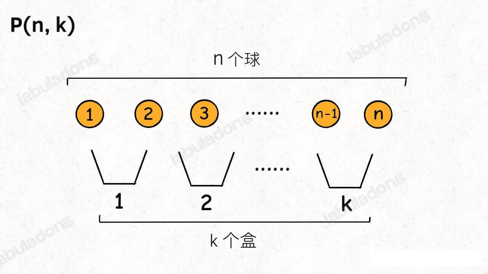
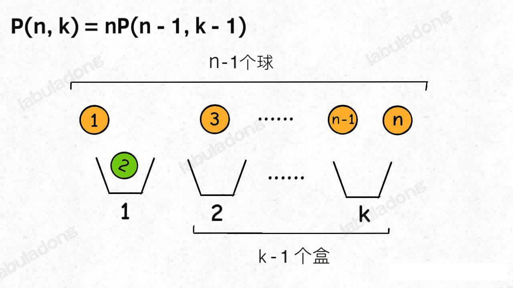
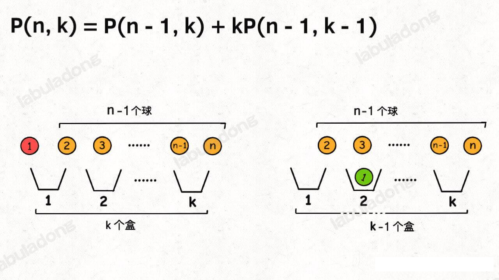
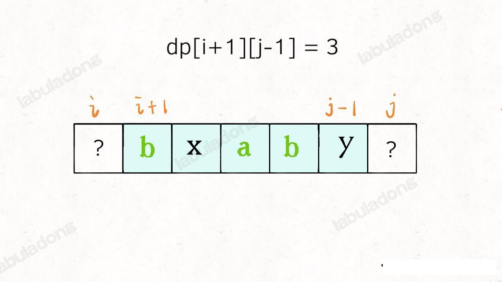
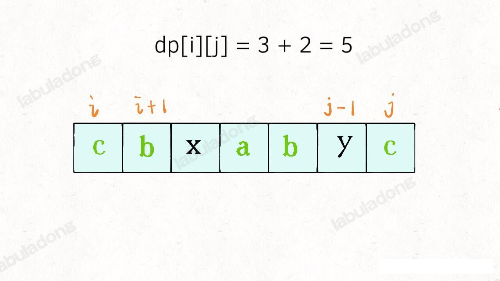
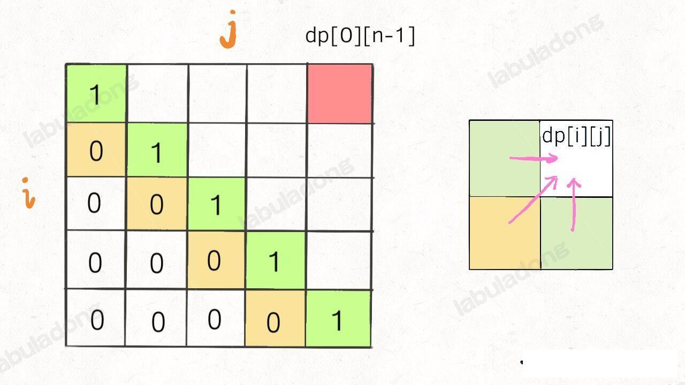
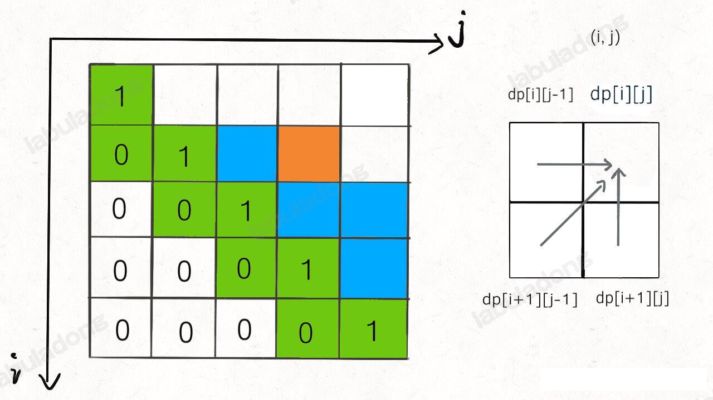
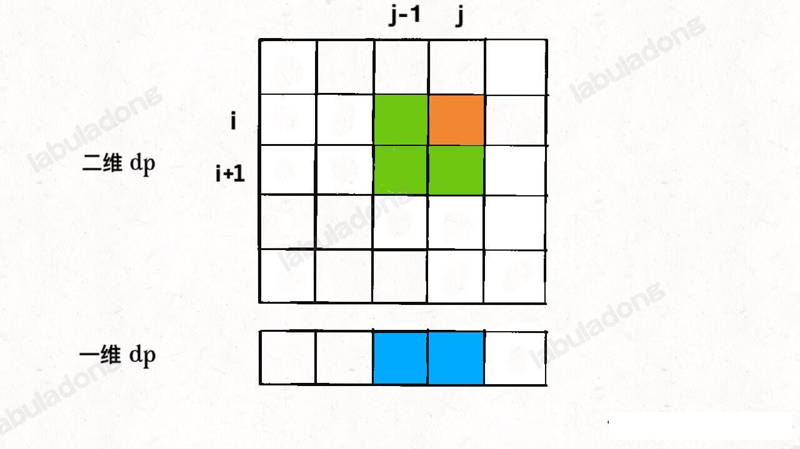
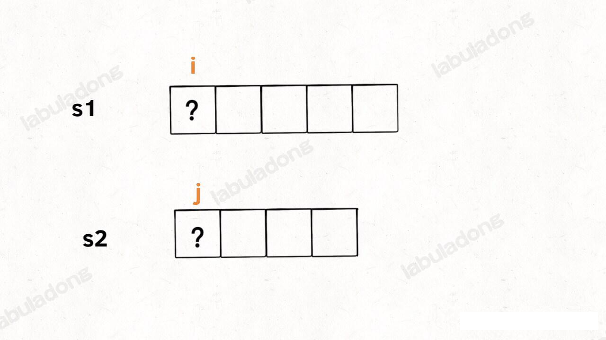
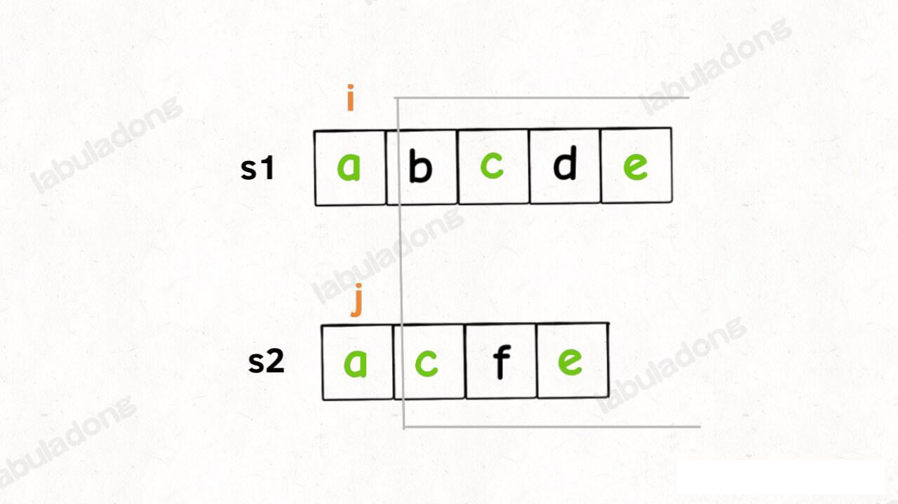

动态规划章节

leecode 115 题，不同的子序列
https://leetcode.cn/problems/distinct-subsequences/
给你输入一个字符串 s 和一个字符串 t，请你计算在 s 的子序列中 t 出现的次数。比如题目给的例子，输入 s = "babgbag", t = "bag"，算法返回 5

#### 排列组合的 2 种视角

1、P(n,k)(有的书称为 `A(n,k)`) 表示从 n 个不同的元素中拿出 k 个元素的排列 (Permutation/Arrangement); `C(n,k)` 表示从 n 个不同的元素中拿出 k 个元素的组合 (Combination) 总数。
2、「排列」与「组合」的主要区别在于是否考虑顺序的差异
3、排列和组合的总数计算公式如下


##### 公式推导过程

###### 公式推导1
Q1:有从1到9共计9个号码球，请问，可以组成多少个三位数？

A1:123和213是两个不同的排列数。即对排列顺序有要求的，既属于“排列P”计算范畴。

上问题中，任何一个号码只能用一次，显然不会出现988,997之类的组合，我们可以这么看，百位数有9种可能，十位数则应该有9-1种可能，个位数则应该只有9-1-1种可能，最终共有9*8*7个三位数。计算公式＝P(3,9)＝9*8*7,(从9倒数3个的乘积）

Q2:有从1到9共计9个号码球，请问，如果三个一组，代表“三国联盟”，可以组合成多少个“三国联盟”？

A2:213组合和312组合，代表同一个组合，只要有三个号码球在一起即可。即不要求顺序的，属于“组合C”计算范畴。

上问题中，将所有的包括排列数的个数去除掉属于重复的个数即为最终组合数C(3,9)=9*8*7/3*2*1

重复的个数为什么是 3*2*1，因为 3 个数最大可以组成 3! 个不同排列，在组合的情况下，就是 1 个，因此组合的最终结果是 9*8*7/3*2*1

###### 公式推导2
排列组合问题的各种变体都可以通过「球盒模型」，P(n,k) 就可以抽象成下面这个场景：

即，将 `n` 个标记了不同序列号的球（标记号码是为了体现顺序的差异），放入 `k` 个标记了不同序号的盒子中( 其中 `n>=k`, 每个盒子最终都装有恰好一个球)，共有 `P(n,k)` 中不同的方法。
现在你来，往盒子里面访求，你怎么放？其实有 2 中视角。
**首先，你可以站在盒子的视角**，每个盒子必然要选择一个球。
这样，第一个盒子可以选择 `n` 个球中的任意一个，然后你需要让剩下 `k-1` 个盒子在 `n-1` 个球中选择 (第一个例子符合该视角的，百位数可以在 1-9 中选择任意一个数字)

**另外，你也可以站在球的角度**，因为并不是每个球都会被装进盒子，所以球的视角分两种情况：
1、第一个球可以不装进任何一个盒子，这样的话你就需要将剩下的 `n-1` 个球放入 `k` 个盒子。
2、第一个球可以装进 `k` 个盒子的任意一个，这样的话，你就需要将剩下的 `n-1` 个球放入 `k-1` 个盒子

综合上述两种情况，可以得到：


你看，两种视角得到两个不同的递归模式，但是这两个递归模式解开的结果都是我们熟知的阶乘形式：


至于如何递归，涉及的数学知识内容比较多，这里就不深入探讨了。
当然，以上只是纯数学的推导，P(n,k)的计算那结果也仅仅是一个数字，所以以上两种视角从数学来讲没什么差异，但是从编程的角度来看，如果让你计算出来所有的排列结果，那么这两种穷举思路的代码实现可能会产生性能上的差异，因为有的穷举思路会使用额外的 for 循环来拖慢效率。

因此上述公式满足 P(n,k)=n!/(n-k)!；C(n,k) = P(n,k)/k! = n!/(k!*(n-k)!)

#### 动态规划&排列组合的算法复杂度计算
 M，N 分别表示 s,t 的长度
```
带备忘录的动态规划算法的时间复杂度
=子问题的个数 x 函数本身的时间复杂度
=「状态」的个数 x 函数本身的时间复杂度
= O(MN) * O(M)
= O(N*M^2)
```
当然，因为 for 循环的复杂度并不总是 O(M) 且总问题个数肯定小于 O(MN)(s.length()-i<t.length-j return 0 这时候就不再遍历了，因此总问题个数达不到 O(MN))，所以这是复杂度的粗略上界。
这个上限说明这个算法的复杂度还是有些偏高，主要高在哪里那？对「状态」的穷举已经有 memo 备忘录优化，所以 O(MN)的复杂度是必不可少的，关键的问题处在 dp 函数中的 for 循环。
是否可以优化掉 dp 函数中的 for 循环那？可以的，这就需要另一种视角来解决这个问题。

##### 视角2，站在 `s` 的角度进行穷举

我们的原问题是计算 s[0...] 中的所有子序列中 t[0..] 的出现次数，可以先看看 `s[0]` 是否能匹配 `t[0]`, 如果不匹配，那没得说，原问题就转化为计算 `s[1..]` 的所有子序列中 `t[0..]` 出现的次数；

但是如果 `s[0] ` 可以匹配 `t[0]`, 这两种情况是累加的关系：
1、让 s[0] 匹配 t[0], 那么原问题转化为 s[1..] 的所有子序列中计算 t[1..] 出现的次数
2、不让 s[0] 匹配 t[0], 那么原问题就转化为 s[1..] 中的所有子序列中计算 t[0..] 出现的次数

为啥明明 s[0] 可以匹配 t[0], 还不让它俩匹配那？主要是为了给 s[0] 之后的元素匹配的机会，比如 `s="aab", t="ab"`，就有两种匹配方式 `a_b` 和 `_ab`

把以上思路写成状态转移方程：
```java
// 定义：s[i..] 的子序列中 t[j..] 出现的次数为 dp(s,i,t,j)
int dp(String s,int i,String t,int j) {
    if (s[i] == t[j]) {
        // 匹配，两种情况，累加关系
        return dp(s,i+1,t,j+1) + dp(s,i+1,t,j);
    } else {
        // 不匹配，在 s[i+1..] 的子序列中计算 t[j..] 的出现次数
        return dp(s,i+1,t,j);
    }
}
```
根据以上思路，可以写出 实现函数来

#### 不同的子序列 dp 数组实现
数组实现法，参考下图

当 S[j] == T[i] , dp[i][j] = dp[i-1][j-1] + dp[i][j-1];

当 S[j] != T[i] , dp[i][j] = dp[i][j-1]


### 动态规划和回溯算法实现 word Break

回溯法即便我们如何优化，总的时间复杂度依然是指数级的 O(2^N * N^2),是无法通过所有测试用例
那么问题出在哪那？

比如输入 `wordDict = ["a","aa"], s="aaab"`, 算法无法找到一个可行的组合，所以一定会遍历整棵回溯树，但我们要注意里面存在重复的情况。重复情况极端情况下会消耗大量的时间。

**如何消除冗余计算那？这里要稍微变一下思维模式，用「分解问题」的思维模式来考虑这道题**

我们刚才以排列组合的方式来思考这个问题，现在我们换一种视角，思考一下能否把问题分解成规模更小，结构相同的子问题，然后通过子问题的结果计算原问题的结果(dp 函数不就是干这个的吗)？

对于输入的字符串 `s`, 如果我们能够从单词列表 `wordDict` 中找到一个单词匹配 `s` 的前缀 `s[0..k]`, 那么只要我能拼出 `s[k+1]`, 就一定能拼出整个 `s` 。换句话说，我把规模较大的原问题 `workBreak(s[0..])` 分解成了规模较小的子问题 `wordBreak(s[k+1..])`, 然后通过子问题的求解反推出原问题的解。
有了这个思路就可以定义一个 `dp` 函数, 并给出该函数的定义：
```java
// 定义：返回 s[i..] 能否被拼出
int dp(String s,int i);

// 计算整个 s 是否能够被拼出，调用 dp(s,0)
```
有了这个函数定义，我们就可以把刚才的逻辑大致翻译成伪代码：

```java
HashSet<String> wordDict

// 定义：返回 s[i..] 能否被拼出
int dp(String s,int i) {
    // base case, s[i..] 时空串或者遍历到 s 的结尾
    if(i==s.length) {
        return  true;
    }

    for (int k=1;i+k < s.length(); k++) {
        if wordDict 中存在 s[i..i+k] {
            // 只要 s[i+len..] 能够被拼出，s[i..] 就能被整体拼出
            if(dp(s, i+k)) {
                return true;
            }
        }
    }
    // 所有单词都尝试过，没有办法拼出整个 s
    return false
}
```

这个算法的复杂度，我们来预估下，因为有备忘录的辅助，消除了递归树上的重复节点，使得递归函数的调用次数从指数级降为状态的个数`O(N)` ，函数本身的复杂度还是 O(N^2)，所以总的时间复杂度还是 O(N^3)，相较于回溯法的效率大为提升。

_______________________
### 动态规划之最长回文子序列

首先子序列本身想想对于子串，子数组更困难一些，因为前者是不连续的序列，而后者是连续的，你就算穷举你都不一定会，更别说求解先关的算法问题了。

而且，子序列问题很可能设计到两个字符串，比如接下来的《最长公共子序列》，如果没有一定的处理经验，真的不容易想出来。所以本章节就来扒一扒子序列问题的套路，使其就有两种模板，相关问题只要往这两种思路上想，十拿九稳。

一般来说，这类问题都是让我们求一个**最长子序列**，因为最短子序列就一个字符嘛，没啥可问的。一旦涉及到子序列和最值，那几乎可以肯定，**考察的是动态规划技巧，时间复杂度一般都是 O(n^2)**。

原因很简单，你想想一个字符串，它的自徐磊能有所少中可能？起码是指数级的，这种情况下，不用动态规划技巧，还想怎么着？

既然要用动态规划，那就要定义 dp 数组，找找状态关系。我们说的两种思路模板，就是 `dp` 数组的定义思路。不同的问题可能需要不同的 `dp` 数组定义来解决。


#### 一、两种思路
_______________
##### 1、第一种思路模板是一个一维的 `dp` 数组:
```java
int n = array.length;
int[] dp = new int[n];

for(int i=1; i<n; i++) {
    for (j=0;j<i;j++) {
        dp[i] = 最值(dp[i],dp[j] + ...)
    }
}
```

比如我们 之前的 《最长递增子序列》和《最大子数组和》都是这个思路。在这个思路中 `dp` 数组的定义是：
**在子数组 arr[0..i] 中，以 arr[i] 结尾的子序列的长度是 `dp[i]`**。

为啥最长递增子序列需要这种思路那？前文说的很清楚了，因为这样符合归纳法，可以找到状态转移的关系，这里就不具体展开了。

##### 2、第二种思路模板就是一个二维的 `dp` 数组

```java
int n = arr.length;
int[][] dp = new int[n][n];

for (int i=0;i<n;i++) {
    for(int j=0;j<n;j++) {
        if(arr[i] = arr[j]) 
            dp[i][j]=dp[i][j] + ...
        else
            dp[i][j] = 最值(...)
    }
}
```

这种思路运用的更多一些，尤其是涉及两个字符串/数组的子序列时，比如之前的《编辑距离》和接下来的《最长公共子序列》；这种思路也可以用于只设计一个字符串/数组的情景，比如本文讲的回文子序列问题。

**2.1 涉及两个字符串/数组的场景**，`dp` 数组的定义如下
**在子数组 `arr[0..i]` 和子数组 `arr2[0..j]` 中，我们要求的子序列长度为 dp[i][j]**。

**2.2 只涉及一个字符串/数组的场景**, `dp` 数组的定义如下：
在子数组 `array[i..j]` 中, 我们要求的子序列的长度为 `dp[i][j]`。

下面按就看看最长回文子序列问题，详解一下第二种情况下如何使用动态规划。

#### 二、最长回文子序列

之前解决了 《最长回文子串》的问题（在 firstMac 项目的 com.swj.ics.dataStructure.strings.Palindrome 中，本次也会重新求解），这次提升难度，leetcode 第 516 题，求最长回文子序列的长度：

输入一个字符串 s ，请你找出 s 中的最长回文子序列的长度，函数签名如下：
```java
int longestPalinddromeSubseq(String s);
```
比如说输入 `s=aecda` ,算法返回 3 ，因为最长的回文子序列是 `"aca"`, 长度为 3。
我们对 dp 数组的定义是：**在子串 `s[i..j]` 中，最长回文子序列的长度为 `dp[i][j]`。一定要记住这个定义才能理解算法。

为啥这个问题要定义成二维的 dp 数组那？在 《最长递增子序列》提到，找状态转移需要归纳思维，说白了就是如何从已知的结果推导出未知的部分。二折页定义能够进行归纳，容易发现状态转移关系。

具体来说，如果我们想求出 `dp[i][j]`, 假设你知道子问题 `dp[i+1][j-1` 的结果 (`s[i+1..j-1]`中最长回文子序列的长度)，你是否能想办法算出 `dp[i][j]` 的值(`s[i..j]`中，最长回文子序列的长度)那？



可以！这取决于 `s[i]` 和 `s[j]` 的字符：
**如果它俩相等**，那么它俩加上 `s[i+1..j-1]`中的最长回文子序列就是 `s[i..j]` 的最长回文子序列


**如果它俩不相等**，说明它俩**不可能同时**出现在`s[i..j]` 的最长回文中，那么把它俩分别加入 `s[i+1..j-1]` 中，看看哪个字符串产生的回文子序列更长即可：


以上这两种情况写成代码就是这样的 
```java
if (s[i] == s[j]) {
    // 它俩一定出现在最长回文子序列中
    dp[i][j]=dp[i+1][j-1]+2;
} else {
    // s[i+1..j] 和 s[i..j-1] 谁的回文子序列更长？
    dp[i][j]=max(dp[i+1][j],dp[i][j-1])
}
```
至此，状态转移方程就写出来了，根据 dp 数组的dingy9i，我们要求的是 `dp[0][n-1]`, 也是整个 `s` 的最长回文子序列长度。

#### 三、代码实现

首先明确一个base case，如果只有一个字符，显然最长回文子序列长度是 1，也就是 `dp[i][j]=1(i==j)`。
因为 i 肯定小于等于 j，所以对于哪些 i>j 的位置，根本不存在真美子序列，应该初始化为 0。
另外，看看刚才写的状态转移方程，相求 `dp[i][j]` 需要知道 `dp[i+1][j-1]`, `dp[i+1][j]`, `dp[i][j-1]` 这三个位置：再看看我们确定的 base case，填入 `dp` 数组之后是这样的：

为了保证每次计算 `dp[i][j]`, 左、下、右方向的位置已经被计算出来了，只能斜着遍历(i++,j++)或者反着遍历(i--,j++)。


这里我们选择反着遍历：代码实现请参考 LongestPalindromeSubSeq.java

#### 四、拓展延伸

使然回文相关的问题没有什么特别广泛的使用场景，但是你汇算最长回文子序列以后，一些类似的题目也可以顺手解决掉
比如力扣第 1312 题「计算让字符串成为回文串的最少插入次数」：
输入一个字符串 s，你可以在字符串的任意位置插入任意字符。如果要把 s 变成回文，请你计算最好呀哦今夕多少次插入？
函数签名如下：
```java
int minInsertions(String s);
```

比如说输入 `s="abcea"`，算法返回 2，因为可以给 s 插入 2 个字符变成回文串 "abeceba" 或者 "aebcbea"。如果输入 "aba"，则算法返回0，因为 s 已经是回文串，不用插入任何字符。

这也是一道单字符串的子序列问题，所以我们也可以使用一个二维 dp 数组，其中 dp[i][j] 的定义如下：
**对字符串 s[i..j] ，最少需要进行 dp[i][j] 次插入才能变成回文串**。
根据 `dp` 数组的定义，base case 就是 `dp[i][i] = 0`, 因为单个字符本身就是回文串，不需要插入。然后使用数学归纳法，假设已经计算出了子问题 `dp[i+1][j-1]` 的值了，思考如何推出 `dp[i][j]` 的值：


实际上和最长回文子序列问题的状态转移方程非常类似，这里也分两种情况：
```java
if (s[i] == s[j]) {
    // 根本不需要插入任何字符
    dp[i][j] = dp[i+1][j-1];
} else {
    // 把 s[i+1..j] 和 s[i..j-1] 变成回文串，选择插入次数较少的
    // 然后还要再插入一个 s[i] 或 s[j]，使 s[i..j] 变成回文串
}
```

最后，我们依然采用倒着遍历`dp` 数组的方式，写出代码：
请参考  org.swj.leet_code.algorithm.dynamic_program.subsequence.minInsertion(String s) 方法

至此，这道题也是用了子序列解题模板解决了，整体逻辑和最长回文子序列非常类似，那么这个问题是否可以直接复用回文子序列的解法那？

其实是可以的，我们甚至都不用谢状态转移方程，你仔细想象：

**我先算出字符串 s 的最长回文子序列，哪些不再最长回文中的字符串，不是就要需要插入的字符吗?**

所以这道题可以直接复用之前实现的 `longestPaliddromeSubseq` 函数：
```java
int minInsertion2(String s) {
    return s.length() - longestPalindromeSubeqDpDoubleArray(s);
  }
```
好了，子序列相关的算法就先说到这里。

 
### 对动态规划进行降维打击
___

注意，这里说的降维打击，并非语义上的降维，而是指二维降为一维。状态压缩并不难，可以理解为一种投机取巧的办法优化某些动态规划空间的复杂度。个人认为状态压缩并非必须掌握的技巧。
动态规划技巧对于算法效率的提升非常可观，一般来说能把指数和阶乘时间复杂度的算法优化成O(N^2),堪称算法界的二向箔( 三维宇宙空间由长宽高三个维度组成，而二向箔与三维宇宙接触的瞬间，会使三维宇宙中的一个维度无限蜷缩，从而迫使三维宇宙空间及其中的所有物质向二维宇宙坍塌，并在二维空间中“融化”为只存在长和宽而被剥夺了高度概念的绝对平面。来自刘慈欣的科幻小说《三体III：死神永生》)·，把各种魑魅魍魉统统打成二次元。
但是，动态规划求解的过程也是可以进行阶段性优化的，如果我们认真观察某些动态规划的的状态转移方程，就能够把它们解法的空间复杂度进一步降低，由O(N^2)降低为O(N)

能够使用空间压缩技巧的动态规划都是二维 dp 的问题，**我们可以通过它的状态转移方程，如果计算状态 `dp[i][j]` 需要的都是 `dp[i][j]` 相邻的状态，那么就可以使用空间压缩技巧**，将二维的 `dp` 数组转化为一维，将空间复杂度从O(N^2)降低到O(N)。

什么叫「和 `dp[i][j]` 相邻的状态」那？比如后文最长回文子序列中，最终的代码如下：
```java
int longestPalindromeSubeqDpDoubleArray(String s) {
    int n = s.length();
    int[][] dp = new int[n][n];
    for (int i = 0; i < n; i++) {
      // 同一个字符的 dp[i..i] 肯定是 1
      dp[i][i] = 1;
    }
    for (int i = n - 1; i >= 0; i--) {
      // 列的遍历方向为正常的从左至右，从小到大哦
      for (int j = i + 1; j < n; j++) {
        if (s.charAt(i) == s.charAt(j)) {
          dp[i][j] = dp[i + 1][j - 1] + 2;
        } else {
          dp[i][j] = Math.max(dp[i][j - 1], dp[i + 1][j]);
        }
      }
    }
    // 整个 s 的最长回文子串长度
    return dp[0][n - 1];
  }
```
我们通过观察可以看出对 `dp[i][j]` 的更新，其实依赖于 `dp[i+1][j-1], dp[i][j-1], dp[i+1][j]` 这三个状态，如下图所示：


这就叫和 `dp[i][j]`相邻，反正你计算 `dp[i[j]` 只需要这三个相邻状态，其实根本不需要那么大一个二维的 dp table 对不对？**空间压缩的核心思路就是，将二维数组「投影」到一维数组**，如下图所示：


「投影」这个词比较形象把，说白了就是希望让一维数组发挥原来二维数组的作用。

思路也很直观，但是也有一个明显的问题，图中 `dp[i][j-1]` 和 `dp[i+1][j-1]` 这两个状态处在同一列，而一维数组中只能容下一个，那么它俩投影到一维空间必然有一个会被另一个覆盖掉，我们还怎么计算 `dp[i][j]` 那？

这就是空间压缩的难点，下面就来分析解决这个问题，还是拿「最长回文子序列」问题举例，它的状态转移方程主要逻辑就是下面这段代码：
```java
 for (int i = n - 1; i >= 0; i--) {
      for (int j = i + 1; j < n; j++) {
        // 状态转移方程
        if (s.charAt(i) == s.charAt(j)) {
          dp[i][j] = dp[i + 1][j - 1] + 2;
        } else {
          dp[i][j] = Math.max(dp[i][j - 1], dp[i + 1][j]);
        }
      }
    }
```

回乡上面的图，「投影」其实就是把多行变成一行，所以想把二维`dp` 数组压缩成一维，一般来说是把第一个维度，也就是 `i` 这个维度去掉，只剩下 `j` 这个维度。压缩后的一维 `dp` 数组就是之前二维 `dp` 数组的 `dp[i][..]` 那一行（在 i 变化的时候，dp 就是就是指当前行，但是每一列并非一定等于当前行当前列的值，在 dp[j] 被更改之前，dp[j] 是上一行的值 j 列值）

我们现将上述代码进行改造，直接无脑地去掉 `i` 这个维度，把 `dp` 数组变成一维：
```java
 for (int i = n - 2; i >= 0; i--) {
      for (int j = i + 1; j < n; j++) {
        // 在这里，一维 dp 数组中的数是什么？
        if (s.charAt(i) == s.charAt(j)) {
          dp[j] = dp[j - 1] + 2;
        } else {
          dp[j] = Math.max(dp[j - 1], dp[j]);
        }
      }
    }
```

上述代码中的一维 `dp` 数组只能表示二维 `dp` 数组中的一行 `dp[i][..]`, 那我怎么才能得到 `dp[i+1][j-1], dp[i][j-1], dp[i+1][j]` 这三个必要的值，来进行状态转移那？

在代码注释的位置，将要进行状态转移，更新 dp[j]，那么我们来思考两个问题：
1、在对 `dp[j]` 赋值之前，`dp[j]`对应着二维 `dp`数组中的什么位置？
2、`dp[j-1]` 对应着二维 `dp` 数组中的什么位置？

**对于问题1，在对 `dp[j]` 赋值之前，dp[j] 的值就是外层 for 循环上一次迭代算出来的值，也就是对应二维 `dp` 数组中 `dp[i+1][j]` 的位置**。(其实就是从上一行dp中透传过来的或者带过的)

**对于问题2，`dp[i-1]` 的值就是内层 for 循环上一次迭代算出来的值，也就是对应二维数组 `dp` 中的 `dp[i][j-1]` 的位置**。

那么问题已经解决了一大半了，只剩下二维 `dp` 数组中的 `dp[i+1][j-1]` 这个状态我们不能直接从一维 `dp` 数组中得到：

```java
 for (int i = n - 2; i >= 0; i--) {
      for (int j = i + 1; j < n; j++) {
        // 在这里，一维 dp 数组中的数是什么？
        if (s.charAt(i) == s.charAt(j)) {
            // dp[i][j] = dp[i+1][j-1] + 2；
          dp[j] = ?? + 2;
        } else {
            //dp[i][j] = max(dp[i][j-1], dp[i+1][j])
          dp[j] = Math.max(dp[j - 1], dp[j]);
        }
      }
    }
```

因为 for 循环遍历 i 和 j 的顺序为从左至右，从下到上，所以我们可以发现，在更新(update)一维 `dp` 数组中的时候，`dp[i+1][j-1]` 会被 `dp[i][j-1]` 覆盖掉，下图中标出了这是四个位置被遍历的次序：


(注意请仔细观察这个顺序，从下至上，从左至右的顺序，对后面理解维度压缩很重要)
那么如果我们想得到 `dp[i+1][j-1]`，就必须把它覆盖之前用一个临时变量 `temp` 把它保存起来，并把这个变量的值保留到计算 `dp[i][j]` 的时候。为了达到这个目的，结合上图，我们可以这样写代码：
```java
 for (int i = n - 2; i >= 0; i--) {
    // 存储 dp[i+1][j-1] 的变量
      int pre=0;
      for (int j = i + 1; j < n; j++) {
        int temp = dp[j];
        if (s.charAt(i) == s.charAt(j)) {
            // dp[i][j] = dp[i+1][j-1] + 2；
          dp[j] = pre + 2;
        } else {
            //dp[i][j] = max(dp[i][j-1], dp[i+1][j])
          dp[j] = Math.max(dp[j - 1], dp[j]);
        }
        // 到下一轮循环，pre 就是 dp[i+1][j-1]。长大后我就成了你。。。
        pre=temp;
        //ps:当时看到这段代码 pre 代表了[j-1] 我明白，但是在内层的 for 循环里面 
        // 怎么会代表 [i+1] 那，我百思不得其解。光思考这个问题，花了我大约 
        // 4 个小时的时间，这段代码太伤脑细胞了。后来对着图仔细的观察了下，
        // 发现 dp[j] 在更改之前代表的是上一行 dp[i+1][j]，然后被赋值给变量 temp, 然后在下一轮内层 j++ 循环之前
        // 将这个数据存在 pre 变量上，当下一个 j++ 循环时，此时的 pre 就是当前循环的 dp[i+1][j-1]，这个非常难以发现
      }
    }
```
别小看这段代码，这是一维 `dp` 最精妙的地方(是的，花了我将近 4 个小时的思考，死了很多脑细胞)，会者不难，那这不会。为了清晰起见，我这里用具体的数值来拆解这个逻辑：

现在假设 `i=5,j=7` 且 `s[5]== s[7]`, 那么现在进入下面这个逻辑对吧：
```java
for(i=5;i--) {
    for(j=7;j++) {
        if(s[5]==s[7]) {
            // dp[5][7]=dp[i+1][j-1]+2
            dp[7]=pre+2;
        }
    }
}
```
请问这里的 `pre` 变量是什么？是内层 for 循环上一次迭代的 `temp` 值。

那么再请问`内层` for 循环上一次迭代的 `temp` 值是什么？是 `dp[j-1]` 也就是 `dp[6]`，但是请注意，这是`外层for` 循环 `上一次内层迭代`对应的 `dp[6]` ,不是现在的 `dp[6]`。
这样要对应二维数组的索引来理解。你现在的 dp[6] 是二维数组中的 dp[i][6]=dp[5][6]，而人家这个 temp 是二维 dp 数组中的 dp[i+1][6]=dp[6][6]。（我感觉这一段解释逻辑解释的不太好，没有我在代码里面的注释解释的号）
也就是说, `per` 变量就是 `dp[i+1][j-1]=dp[6][6]`, 这也是我们想要的结果。

现在我们成功第对状态进行了转移方程的降维，算是最硬的骨头啃掉了，但注意到我们还有 base case 要处理呀：
```java
int[][] dp = new int[n][n];
//base case
for(int i=0;i<n;i++) {
    dp[i][i]=1;
}
```
如何把 basecase 打成一维那？很简单，记住空间压缩就是投影，我们把 base case 投影到一维看看，如下图所示：


二维 dp 数组中的 base case 全部落入一维 dp 数组，不存在冲突和覆盖，所以说我们直接写代码就行了：
```java
int[] dp = new int[n];
Arryas.fill(dp,1);
```
至此，我们把 base case 和状态转移方程都进行了降维，实际已经写出了完整代码
参考 org.swj.leet_code.algorithm.dynamic_program.subsequence.LongestPalindromeSubSeq#longestPalindromeSubseq

本文就就结束了，不过空间压缩技巧再牛逼，也是基于常规动态规划思路之上的。
我们也看到，使用空间压缩技巧对二维 dp 数组压缩之后，代码的可读性变得非常差，如果直接看这种解法，任何人都是一脸懵逼。算法的优化就是这么一个过程，先写出可读性很好的暴力递归算法，然后尝试运用动态规划技巧来优化重叠子问题，最后尝试空间压缩技巧优化空间复杂度。

### 用动态规划解决最长公共子序列

不知道大家做算法题有什么感觉，**我总结出来做题的技巧就是，把大的问题细化到一个点，先研究在这个点上如何解决问题，然后再通过递归/迭代的方式扩展到整个问题**。

比如二叉树的解法中，我们会把整个问题细化到某个节点上，想想自己站在某个节点上，需要做什么，然后套二叉树的框架就行了。

动态规划系列问题也是一样，尤其是子序列相关的问题。本章节从 **「最长公共子序列问题」展开，总结三道子序列问题**，解完这些题并仔细讲讲子序列的问题套路，我们就能感受到这种思维了。

#### 最长公共子序列

计算最长公共子序列(Longest Common Subsequence)就是一道经典的动态规划题目,leetcode 第 1143 题就是这个问题。
给你输入两个字符串 s1 和 s2，请你找出他们俩的最长公共子序列，返回这个子序列的长度。函数签名如下：
```java
int longestCommonSubsequence(String s1,String s2);
```
比如说输入 `s1 = "zabcde", s2="acez"`，它们俩的最长公共子序列是 `lcs="ace"`, 长度为 3，所以返回 3.

如果没有做过这道题，一个最简单的暴力算法就是，把 s1 和 s2 的所有公共子序列都穷举出来，然后看看有没有公共的，然后在所有的 LCS 寻找一个铲毒最长的。
显然，这种思路的复杂度非常高，你要穷举所有的子序列，这个复杂度是指数级别的，肯定不实际。

正确的思路是不要考虑整个字符串，而是细化到 s1 和 s2 的每个字符。后文的 《子序列解题模板》中总结的一个规律：
___
**对于两个字符串求子序列的问题，都是用两个指针 `i` 和 `j` 分别在两个字符串上移动，大概率是动态规划思路。最长公共子序列的问题也遵循这个规律，我们可以先写一个 `dp` 函数：
```java
int dp(String s1,int i,String s2,int j);
```
这个 dp 函数的定义是：`dp(s1,i,s2,j)` 计算 `s1[i..]` 和 `s2[j..]` 的最长公共子序列长度。
根据这个定义，那么我们想要的答案就是 `dp(s1,0,s2,0)`，且 base case 就是 `i==len(s1) || j==len(s2)` 时，因为这时候 `s1[i..]` 或者 `s2[j..]` 是空串了，此时的最长公共子序列的长度肯定是 0。

```java
int longestCommonSubse(String s1,String s2) {
    return dp(s1,0,s2,0);
}
// 主函数
int dp(String s1,int i,String s2,int j) {
    //base case
    if (i==s1.length() || j == s2.length()) {
        return 0;
    }
   //....
}
```
*** 接下来，我们<font color="red">不看</font> s1 和 s2 两个字符串，而是要具体到每一个字符，思考每个字符该做什么**，如下图所示：


我们知道看 `s1[i]` 和 `s2[j]`, 如果 `s1[i] == s2[j]` ，说明这两个相同的字符一定在 `lcs` 中，如下图所示

这样我们就可以找到一个 lcs 中的字符，根据 dp 函数的定义，我们可以完善一下代码：
```java
int dp(String s1,int i,String s2,int j) {
    //base case
    if (i==s1.length() || j == s2.length()) {
        return 0;
    }
    if (s1.charAt(i) == s2.charAt(j)) {
        // s1[i] 和 s2[j] 必然在 lcs 中
        // 因此这里 使用 1 + s1[i+1..] 和 s2[j+1..] 中的 lcs 长度，就是答案。
        return 1 + dp(s1,i+1,s2,j+1)
    } else {
        //...
    }
}
```

刚才说的 `s1[i]==s2[j]` 的情况，但如果 `s1[i] != s2[j]`，该怎么办？
**`s1[i] != s2[j]` 意味着，`s1[i]` 和  `s2[j]` 至少有一个字符不在 lcs 中，分 3 种情况，如下图所示：


如上图所示，总共可能有 3 种情况，我怎么知道具体哪三种情况那？

其实我们也不知道，那就把三种期刊的答案都算出来，取其中结果最大的那个呗，还能怎样？因为题目是让我们算「最长」公共子序列的长度嘛。
这三种情况的答案怎么算？回想一下我们的 `dp` 函数定义，不就是为了专门计算他们而设计的嘛！
代码可以再进一步
```java
int dp(String s1,int i,String s2,int j) {
    if (s1.charAt(i) == s2.charAt(j)) {
        // s1[i] 和 s2[j] 必然在 lcs 中
        // 因此这里 使用 1 + s1[i+1..] 和 s2[j+1..] 中的 lcs 长度，就是答案。
        return 1 + dp(s1,i+1,s2,j+1)
    } else {
        // s1[i] 和 s2[j] 中至少要有一个字符不再 lcs 中，
        // 穷举三种情况的结果，取其中的最大结果
        return max(
            // 情况一：s1[i] 不在 lcs 中
            dp(s1,i+1,s2,j),
            // 情况二：s[j] 不再 lcs 中
            dp(s1,i,s2,j+1),
            //情况三，都不在 lcs 中
            dp(s1, i+1, s2, j+1)
        );
    }
}
```

这里其实已经非常接近我们的答案了，**还有一个小的优化，情况三 「s1 和 s2 都不在 lcs 中」其实是可以直接忽略的**。

因为我们在求的是最大值嘛，情况三在计算 `s1[i+1..]` 和 `s2[j+1..]` 的 `lcs` 长度，这个长度肯定是小于等于情况二  `s1[i..]` 和 `s2[j+1..]` 的 `lcs` 长度，因为 `s1[i+1..]` 比 `s1[i..]` 短嘛，那从这里面计算出来的 lcs 当然也不可能更长嘛。

同理，情况三的结果肯定也小于等于情况一。**说白了，情况三被情况一和情况二包含了**，所以我们可以直接忽略掉情况三，完整的代码见源码：org.swj.leet_code.algorithm.dynamic_program.subsequence.LongestCommonSubSeq

这里我们简单抽象成核心 `dp` 函数的队规框架：
```java
int dp(int i,int j) {
    dp(i+1,j+1); // #1
    dp(i,j+1);   // #2
    dp(i,j+1);   // #3
}
```
我们想从 dp(i,j) 转移到到 dp(i+1,j+1), 有不止一种方式，可以直接 +1，也可以走 先 i+1, 然后 j+1, 最后也能走到 dp(i+1,j+1), 所以这就存在重叠子问题，如果我们不用 memo 备忘录消除子问题，那么 dp(i+1,j+1) 会被计算多次，这是没有必要的。

至此，最长公共子序列的问题完全解决了，用的是**自顶向下**(为啥这里叫自顶向下：函数 f(x) 是由 f(x+1) 推导出来，因此必先知道 f(x+1) 的值才能推导出 f(x) 的值，这便是自顶向下；相反，如果 f(x) 是由 f(x-1) 推导出来的，则称为自底向上)带备忘录的动态规划思路，我们当然可以使用自底向上的迭代的动态规划思路，和我们的递归思路是一样的，关键是如何定义 `dp` 数组，我们这里也写一下自底向上的解法吧, 解决思路和 DistinctSubSequence  不同的子序列的 dp 数组自底向上解法非常相似
动态方程:

当 S1[j-1] == S2[i-1] , dp[i][j] = dp[i-1][j-1] +1; // 自底向上

当 S1[j-1] != S2[i-1] , dp[i][j] = max(dp[i][j-1],dp[i-1][j])


#### 字符串的删除

leetcode 第 583 题 「两个字符串的删除操作」，题目如下：
给定两个单词 s1 和 s2，返回使得 s1 和 s2 相同所需的最小步数。每步可以删除任意一个字符串中的一个字符，函数签名如下：
```java
int minDistance(String s1,String s) ;
```
比如输入 `s1="sea" s2="eat"` ,算法返回 2，第一步将 `sea` 变成 `ea`，第二步将 `ea` 变成 `eat`。
题目让我计算将两个字符串变得相同的最少删除次数，那我们可以思考下，最后这两个字符串会被删除成什么样？

删除的结果不就是它俩的最长公共子序列嘛！
那么，要计算删除删除的次数，就可以通过最长公共子序列的长途推导出来：
```java
int minDistance(String s1,String s2) {
    int m=s.length(),n=s2.length();
    int lcs=longestCommonSubsequence(s1,s2);
    return m-lcs+n-lcs;
}
```

#### 最小 ASCII 删除和

leetcode 712 题，「两个字符串的最小 ascii 删除和」，题目和上一道题目非常类似，只不过上道题要求删除次数最小化，这道题要求删除掉的字符 ascii 码之和最小化

比如输入 `s1="sea", s2="eat"`, 算法返回 231。
因为在 `"sea"` 中 删除 `"s"`, 在 "eat" 中删除 “t”，可使得两个字符串相等，且删掉字符串的 ascii 码之和最小，即 s(115) + t(115) = 213

**这道题不能直接复用计算最长公共子序列的函数，但是可以一招之前的思路，稍微修改 base case 和 状态转移部分分即可写出解法代码**：
参见 org.swj.leet_code.algorithm.dynamic_program.subsequence.LongestCommonSubSeq#minimumDeleteSum

base case 有一定的区别，计算 lcs 长度的时候，如果一个字符串为空，那么 lcs 长度必然此时的 lcs 必然为 0；但是这道题如果一个字符串为空，另外一个字符串必然要被全部删除，所以需要计算另一个字符串的所有字符的 ascii 之和的。

关于状态转移，当 s1[i] 和 s2[j] 相同时不需要删除，不同时需要删除，所以可以利用 dp 函数计算两种情况，得出最优的结果。其他的大同小异，就不具体展开了。

至此，三道公共子序列问题已经解决了，关键在于将问题细化到字符，根据每个字符是否相同来判断他们是否在结果子序列中，从而避免了对所有的子序列进行穷举。

这也算是在两个字符串中求子序列的常用思路吧，需要我们好好体会，多多练习~

### 动态规划之子序列问题解题模板

