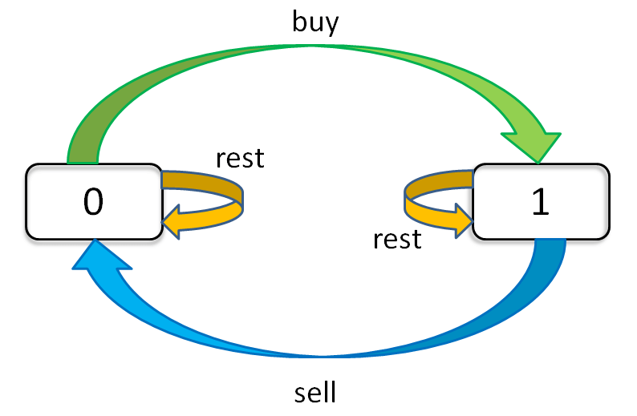
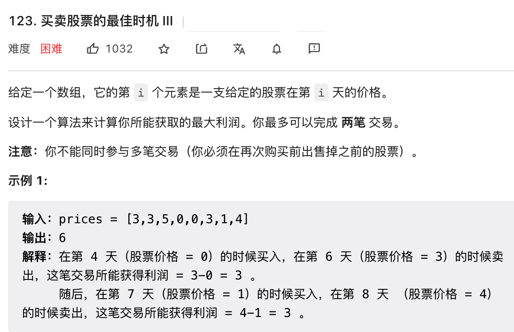
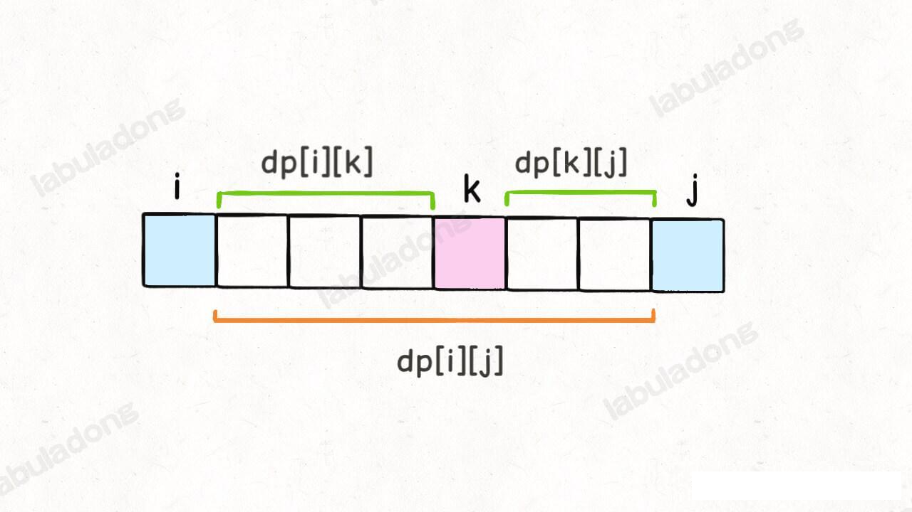
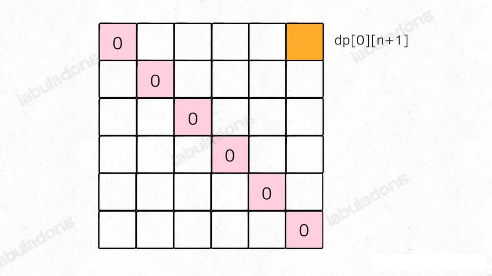
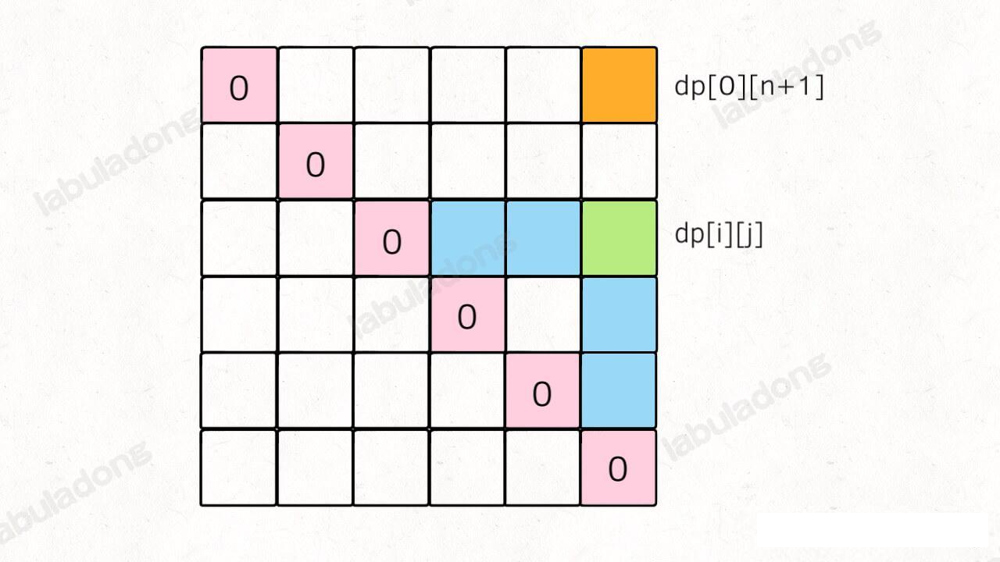
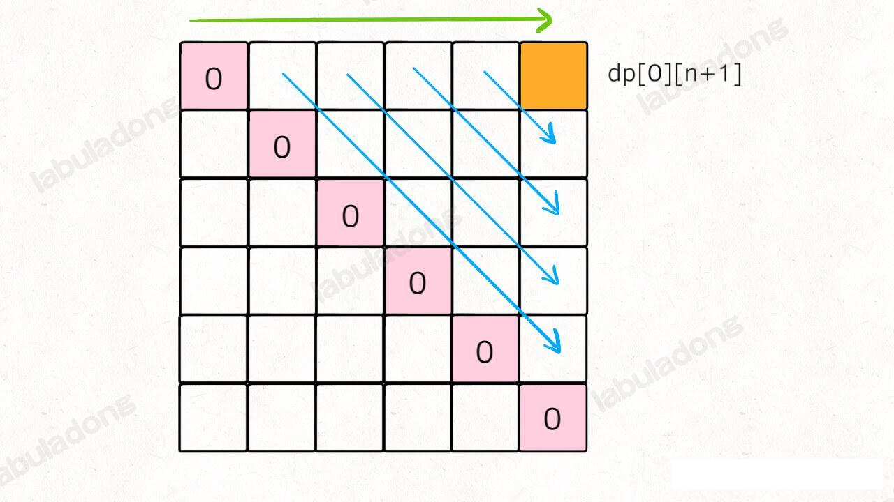
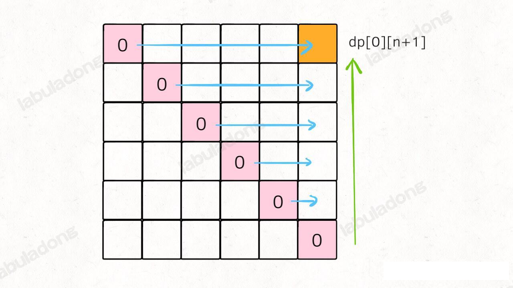

### 地下城游戏--魔塔

「魔塔」是一款经典的地牢类游戏，碰到怪物要掉血，吃血瓶能加血，你要收集钥匙，一层一层上楼，最后救出美丽的公主

leetcode 174 题，「地下城游戏」是一道类似的题目，题目的简单描述如下：

输入一个存储着整数的二维数组 `grid`，如果 `grid[i][j] > 0`, 说明这个格子装着血瓶，经过他可以增加对应的生命值；如果 `grdi[i][j] == 0` ，则是一个空格子，经过它不会发生任何事情；如果 `grid[i][j] < 0`, 说明这个格子有怪物，经过他会损失对象的生命值。

现在你是一名骑手，将会出现在最左上角，公主被困于最右下角，你只能向右或者向下移动，请问你初始至少需要多少生命值才能救出公主。

**换句话说，就是问你至少需要多少初始生命值，能够让骑士从最左上角移动到最右下角，且任何时候生命值都大于 0**。

比如如下一个二维数组 grid, 用 K 表示骑士，用 P 表示公主


算法应该返回 7，也就是说骑士的生命初始化至少为 7 才能成功救出公主，行进线路如图中的箭头所示。

这和上篇文章的 《最小路径和》是类似的问题，问你从左上角到右下角的最小路径和是多少。

我们做算法题一定要尝试举一反三，感觉今天这道题和最小路径和有点关系吧？

想要最小化骑士的初始生命值，是不是意味着要最大化骑士行进路线上的血瓶？是不是相当于求「最大路径和」？是不是可以直接套用计算「最小路径和」的思路 ？

但是稍加思考，发现这个推论并不成立，吃到最多的血瓶，并不一定就能获得最小的初始生命值。比如下面这种情况：


但也很容易看到正确答案是下图的箭头所示的路径，初始生命值只需要 1：


**所以，关键不在于吃多少血瓶，而是在于如何损失最少的生命值。**

dp 函数的定义：

**从 `grid[i][j]` 到达终点(右下角)所需的最少生命值是 `dp(grid,i,j)`

根据最新的 dp 函数定义和 base case ，我们想求 `dp(0,0)`，那就应该试图通过 `dp(i+1,j)` 和 `dp(i,j+1)` 推导出 `dp(i,j)` ，这样才能不断逼近 base case ，正确地进行状态转移。

具体来说，「从 A 到右下角的的最少生命值」应该由「从 B 到达右下角的最少生命值」和 「从 C 达到右下角的最少生命值」推导出来：


能不能推导出来那？这是可以的，假设 dp(0,1) = 5, dp(1,0) = 4 ，那么肯定要从 A 走到 C，因为 4 <5 嘛。

那么怎么推导 dp(0,0) 是多少那？
假设 A 的值为 1，既然知道下一步要往 C 走，且 dp(1,0) = 4, 这就意味着走到 grid[1][0] 的时候至少要有 4 点生命值，那么就可以确定骑士出现在 A 点的时候需要 4-1 = 3 的初始生命值。当然如果 A 点的生命值是 10，那么 4-10 =-6 这个也是不符合要求的，如果出现了负数骑士的生命值小于 1 就挂了，所以这种情况下骑士的生命的最小值为 1.

综上：状态转移方程就出来了
```java
int res = min(
    dp(i+1,j),
    dp(i,j+1)
) - grid[i][j]
dp(i,j) = res <= 0 ? 1 : res
```

### 自由之路

leetcode 第 514 题

给你输入一个字符串 ring 代表圆盘上的字符(指针在 12 点钟方向，初始指向 ring[0]) ，再输出一个字符串 key 代表你需要转动圆盘输入的字符串，你的算法需要返回输入这个 key 至少要进行多少次操作(拨动一个圆盘和按下中间的按钮都是一次操作)
举例如下：输入 `ring="godding"，key= "gd"`，对应的圆盘如下:


如果我们输入的 `key = "gd" `，算法返回 4。
因为指针现在的字母是 g，可以直接按下中间按钮，然后再将圆盘逆时针波动两格，让指针指向字母 "d"，然后再按下中间按钮一次。

上述过程，按了两次按钮，拨了两格转盘，共操作 4 次，是最少的操作次数，所以算法返回 4.

这里我们首先给题目做一个等价转换，转动圆盘是不就就等于波动指针？

**原题可以转化为：圆盘固定，我们可以拨动指针；现在需要我们拨动指针并按下按钮，以最少的操作次数输入 `key` 对应的字符串**。

「状态」和「选择」是什么？
**「状态」就是「当前需要如输入的字符」和「圆盘当前的指针位置也就是当前要输入的字符」**

dp 函数可以定义为 :
```java
int dp(String ring,int i, String key, int j);
```
定义文字解释如下：
当圆盘指针指向 `ring[i]` 时，输入字符串 `key[j..]` 至少需要 `dp(ring,i,key ,j)` 次操作。

### 用动态规划解决 加权最短路径

力扣 787 题 「K站内最便宜的航班」，题目描述如下：

现在有 n 个城市，分别用 0,1...n-1 这些序号表示，城市之间的航线用三元组 `[from,to,price]` 来表示，比如说三元组 `[0,1,100]` 就表示，从城市 0 到 城市 1 之间的机票价格是 100 元。

题目会给你输入若干参数：正整数 n 代表了城市个数，数组 `flights` 装着若干三元组带表城市之间的航线以及价格，城市编号 src 代表了你所在的城市，城市标号 dst 代表了你要去的目标城市，整数 K 代表了你最多经过的中转站个数。
函数签名如下：
```java
int findCheapestPrice(int n, int[][] flights, int src, int dst,int K);
```
请你的算法计算，在 `K` 次中转之内，从 src 到 dst 所需的最小花费是多少钱，如果无法到达，则返回 -1。比如说，题目给的例子
`n=3, flights=[[0,1,100],[1,2,100],[0,2,500]], src=0, dst=2, k=1`

航线就是下面这张图，所有有向边代表了航向的方向，边上的数字代表了航线的机票价格

出发点是 0，到达点是 2，允许的最大中转次数 K 为 1，所以最小的开销就是图中红色的两条边，从0 出发，经过中转城市，经过中转城市 1 到达目标城市 2，所以算法的返回值应该是 200。

注意这个中转次数的上限 K 是比较棘手的，如果上述题目将 K 改成 0，那也就是不允许中转，那么我们的算法只能返回 500 了，也就是从 0 飞到 2。

**很明显，这题就是个加权有向图中求最短路径的问题**。 说白了，就是给你一副加权有向图，让你求 src 到 dst 权重最小的一条路径，同时要满足，这条路径最多不能超过 `K+1` 条边（经过 K 个节点相当于经过 `K+1` 条边）。

#### 算法思路：

下面分析相关算法：

BFS 算法思路：

对于加权图的场景，我们需要优先级队列「自动排序」的特性，将路径权重较小的节点排在队列前面，以此基础施展 BFS 算法，也就变成了 Dijstra 算法。
Dijstra 算法本篇章暂不涉及，后面的图论相关的算法会重写该方法

##### 动态规划思路：

求最值的问题，很多都可能使用动态规划来求解。
加权最短路径问题，再加个 `K` 的限制也无妨，不就是求最值的问题嘛，动态规划统统拿下。
我们先不管 K 的限制，单就「加权最短路径」这个问题来看，他怎么就是个动态规划问题了那？比方说，我们想计算 src 到 dst 的最短路径：
怎么从 src 到 dst 我不知道，但我可以把问题分解：


`s1, s2` 是指向 dst 的相邻节点，他们之间的权重我是知道的，分别是 `w1, w2`。
只要我知道了从 `src` 到 `s1,s2` 的最短路径，我不就知道了从 `src` 到 `dst` 的最短路径了吗？

```java
minPath(src,dst) = min(
    minPath(src,s1) + w1,
    minPath(src,s2) + w2
)
```

这其实就是递归关系了，就是这么简单。

**不过别忘了，题目对我们的最短路径还有个「路径上不能超过 `K+1` 条边」的限制**。

___
### 经典动态规划，正则表达式

leetcode 第 10 题，正则表达式匹配。题目要求如下：
实现一个简单的正则匹配算法，包括「.」通配符和「*」通配符。

这两个通配符是最常用的，其中点号「.」 可以匹配任意一个字符，星号「*」可以让之前的那个字符重复任意次数(包括 0 次)。

比如说模式串 `".a*b"` 就可以匹配文本 `"zaaab"` ，也可以匹配 `"cb"`；模式串 "a..b" 可以匹配文本 `"amnb"`; 而模式串 `".*"` 就比较牛逼了，它可以匹配任何文本。

题目会给我们输入了字符串 `s` 和 `p`，s 代表文本，p 代表模式串，请你判断模式串 p 是否可以匹配文本 s。我们可以假设模式串只包含小写字母和上述两种通配符且一定合法，不会出现 `*a` 或者 `b**` 这种不合法的模式串：

```java
boolean isMatch(String s, String p);
```

对于我们将要实现的这个正则表达式，难点在哪里那？

点号通配符其实很好实现，`s` 中的任何字符，只要遇到 `.` 通配符，就可以无脑匹配就完事了。主要是这个星号通配符不好实现，一旦遇到 `*` 通配符，前面的那个字符可以选择重复一次，可以重复多次，也可以一次都不出现，这该怎么办？

对于这个问题，答案很简单，对于所有可能出现的情况，全部穷举一遍，只要有一种情况可以完成匹配，就认为 `p` 可以匹配了 `s`。那么一旦涉及两个字符串的穷举，我们就应该条件反射第想到动态规划技巧了。

#### 一、思路分析
我们先脑补一下，s 和 p 相互匹配的过程大致是，两个指针 i 和 j 分别在 s 和 p 上移动，如果最后两个指针都能移动到字符串的末尾，那么就匹配成功，反之匹配失败。

**如果不考虑 `*` 通配符，面对两个待匹配的字符串 `s[i]` 和 `s[j]` ，我们唯一能做的就是看他俩是否匹配：**

```java
boolean isMatch(String s, String p) {
    int i=0,j=0;
    while(i<s.length() && j<p.length()) {
        // . 号通配符就是万金油
        if(s.charAt(i) == p.charAt(j) || p.charAt(j) == '.') {
            // 匹配，接着匹配 s[i+1..]和p[j+1..]
            i++;j++;
        } else {
            //不匹配
            return false;
        }
    }
    return  i==j;
}
```
那么考虑一下，如果加入 `*` 通配符，局面就会稍微复杂一些，不过要分情况请来分析，也不难理解。
**当 `p[j+1]` 为 `*` 通配符时，我们分情况讨论下：**

1、如果 `s[i] == p[j]`，那么会有两种情况：
    1.1 `p[j]` 有可能会匹配多个字符，比如 `s[i] == "aaa", p="a*"`, 那么 `p[0]` 会通过 `*` 匹配 3 个字符 `"a"`。
    1.2 `p[j]` 有可能会匹配0个字符，比如 `s[i] == "aa", p="a*aa"`，由于后面的字符可以匹配 `s`, 所以 p[0] 只能匹配 0 次。

2、如果 `s[i] != p[j]`, 只有一种情况：

`p[j]` 只能匹配 0 次，然后看看下一个字符能否和 `s[i]` 匹配。比如说 `s[i] == "aa", p="b*aa"`, 此时 `p[0]` 只能匹配 0 次。

综上，可以把之前的代码块针对 `*` 通配符进行一下改造：
```java
if (s[i] == p[j] || p[j] == '.') {
    // 匹配
    if(j < p.length() - 1 && p.charAt(j+1) == "*") {
        // 有 * 通配符，可以匹配 0 次或者多次
    } else {
        // 无 *  通配符，老老实实的匹配 1 次
        i++;j++;
    }
} else {
    if(j < p.length() -1 && p.charAt(j+1) = '*') {
        // 有 * 通配符，可以匹配 0 次

    } else {
        // 无 * 通配符
        return false;
    }
}
```

整体思路已经很清晰了，但是现在的问题是，遇到`*` 通配符时，到底应该是匹配 0 次还是匹配多次？多次是几次？

你看，这就是一个做「选择」的问题，要把所有可能的选择都穷举一遍才能得出结果。动态规划算法的核心就是「状态」和「选择」。**「状态」无非就是 `i` 和 `j` 两个指针的位置，「选择」就是 `p[j]` 选择匹配几个字符**。

#### 二、动态规划解法

根据状态，我们可以定一个 `dp` 函数：
```java
boolean dp(String s,int i,String p ,int j);
```
dp 函数的定义如下：

**若 `dp(s, i, p, j) = true`，则表示 `s[i..]` 可以匹配 `p[j..]`; 若 `dp(s, i, p, j) = false`, 则表示  `s[i..]` 无法匹配 `p[j..]`**。

#### 备忘录的使用推导

代码中使用了一个 `memo` 备忘录消除重叠子问题。如何一眼看出重叠子问题？根据之前的动态规划经验中所讲的技巧，抽出正则表达式的递归框架

```java
boolean dp(String s,int i,String p,int j) {
    ds(s,i,p,j); // 1
    dp(s,i+1,p, j); // 2
    dp(s,i+1,p, j+1); // 3
    dp(s,i, p, j+2); //4
}
```
如果让你从 `dp(s,i,p,j)` 得到 `dp(s,i+2,p,j+2)` , 至少有两条路径`1->2->4` 或者 `3->3`。这就说明 `(i+2,j+2)` 这个状态的计算必然存在重复，也就是说明存在重叠子问题，我们需要使用备忘录消除重叠子问题，提高效率

___
### 动态规划经典：高楼扔鸡蛋

#### 问题描述
本章节聊一个很经典的算法问题，若干楼层，若干鸡蛋，让你算出最少的尝试次数，找到鸡蛋恰好摔不碎的那层楼。国内大厂以及谷歌脸书面试经常考察这道题，只不过他们觉得扔鸡蛋太浪费，改成扔盘子，扔破碗什么的。

这道题的解法很巧，光动态规划就好几种效率不同的思路。接下来我们就来通过动态规划来研究下这道题

leetcode 第 887 题，鸡蛋掉落，题目描述如下：

你面前有一栋从 1 到 N 共 N 层的楼，然后给你 K 个鸡蛋（K 至少为 1）。现在确定这栋楼存在楼层 `0=<F <=N`, 在这层将鸡蛋扔下去，鸡蛋**恰好没有摔碎**(高于 F 的楼层都会碎，低于 F 的楼层都不会碎，如果鸡蛋没有碎，可以捡回来继续扔)。现在问你，**最坏**情况下，你至少要扔几次鸡蛋，才能确定这个楼层 F 那？

什么叫「最坏情况」下「至少」要扔几次那？我们分别举个栗子就明白了。

比方说**现在先不管鸡蛋个数的限制**，有 7 层楼，你怎么去找鸡蛋恰好摔碎的那层楼？
最原始的方式就是线性扫描，每层都扔一下试试
以这种策略，**最坏**情况下应该就是我试到了第 7 层鸡蛋也没有碎(F==7), 也就是我扔了 7 次。
现在理解了最坏情况了吧？ **鸡蛋破碎一定发生在搜索区间穷尽时**，不会说你在第 1 层摔一下鸡蛋就碎了，这是你运气好，不是最坏情况。

再来理解什么叫「至少」要仍几次。依然是不考虑鸡蛋个数限制，同样是 7 层楼，我们可以优化策略。
最好的策略是使用二分法查找思路，我先去第 (1 + 7) / 2 = 4 层扔一下：

如果碎了说明 F 小于 4，我就去第 (1 + 3) / 2 = 2 层试……

如果没碎说明 F 大于等于 4，我就去第 (5 + 7) / 2 = 6 层试……

以这种策略，最坏情况应该是试到第 7 层鸡蛋还没碎（F = 7），或者鸡蛋一直碎直到第 1 层（F = 0）。然而无论那种最坏情况，只需要试 log7 向上取整等于 3 次，比刚才尝试 7 次要少，这就是所谓的**至少**要扔几次。

实际上，如果不限制鸡蛋个数的话，二分思路显然可以得到最少尝试的次数，但问题是，**现在给你的鸡蛋个数限制 K，直接使用二分思路就不行了**。

比如说给你 1 个鸡蛋，7 层楼高，你敢二分吗？你直接去第 4 层扔一下，如果鸡蛋没碎还好，，你可以把鸡蛋捡起来继续去更高的楼层尝试；但是如果碎了，你就没有鸡蛋继续测试了，无法确定鸡蛋恰好摔不碎的楼层 F 了。

其实只有 1 个鸡蛋的时候，只能从下往上一层层尝试扔鸡蛋，最坏情况下需要扔 7 次。

#### 思路分析：

动态规划问题，有什么「状态」，有什么「选择」，然后穷举。
**「状态」很明显：就是当前拥有的鸡蛋个数 k 和需要测试的楼层数 N**。随着测试的进行，鸡蛋个数可能减少，楼层的搜索范围也会减小，这就是状态的变化。

**「选择」其实就是去选择那层楼扔鸡蛋**。不同的选择会造成状态的转移。

现在明确了「状态」和「选择」，**动态规划的思路就形成了**，肯定是个二维的 `dp` 数组或者带两个参数的 dp  函数来表示状态转移，外加一个 for 循环来遍历所有选择，选择最优的状态：

状态转移部分：

我们选择第 i 层扔鸡蛋之后，可能出现两种情况，鸡蛋碎了，鸡蛋没碎。**注意：这个时候状态转移来了**：

**如果鸡蛋碎了**，那么鸡蛋的个数 K 应该减一，搜索的楼层应该从 `[1..N]` 变为 `[1..i-1]` 共 `i-1` 层楼；
**如果鸡蛋没碎**，那么鸡蛋的个数 K 不变，搜索的楼层区间应该从  `[1..N]` 变为 `[i+1..N]` 共 `N-i` 层楼；


因为我们要求的是 **最坏情况**下扔鸡蛋的次数，所以鸡蛋在第 `i` 层楼没有碎，取决于那种情况的结果**更大**:
```python
int dp(int k, int N):
    for 1 <= i <= N:
        res = min(res,
                    max(
                        dp(k-1, i -1) , # 碎了的函数
                        dp(k, N -i) # 没碎函数
                    ) + 1 # 在第 i 楼扔了 1 次。
        )
return res;
```
递归的 base case 也很好理解，N=0 的时候，显然不需要扔鸡蛋；当鸡蛋数 K 为 1 的时候，显然只能线性扫描所有楼层

```java
int dp(int K, int N) {
    if(N==0)  return 0;
    if(K==1) return N;
    //...
}
```
具体解法参见代码

这个 for 循环就是下面这个状态转移方程的具体代码实现


首先我们根据 dp(K, N) 数组的定义（有 K 个鸡蛋面对 N 层楼，最少需要扔几次），**很容易知道 K 固定时，这个函数随着 N 的增加一定是单调递增的**，无论你策略多聪明，楼层增加测试次数一定要增加。

那么注意 dp(K - 1, i - 1) 和 dp(K, N - i) 这两个函数，其中 i 是从 1 到 N 单增的，如果我们固定 K 和 N，把这两个函数看做关于 i 的函数，**前者随着 i 的增加应该也是单调递增的，而后者随着 i 的增加应该是单调递减的**


这时候求二者的较大值，再求这些最大值之中的最小值，其实就是求这两条直线交点，也就是红色折线的最低点嘛。

这样就能用二分法了，二分查找的运用很广泛，只要能够找到具有单调性的函数关系，都很有可能运用二分法来优化线性搜索的复杂度。回顾这个 dp 函数的曲线，我们要找的最低点其实就是这种情况：
```java
for (int i = 1; i <= N; i++) {
    if (dp(K - 1, i - 1) == dp(K, N - i))
        return dp(K, N - i);
}
```

熟悉二分搜索的同学肯定敏感地想到了，这不就是相当于求 Valley（山谷）值嘛，可以用二分查找来快速寻找这个点的，参考相关代码吧！

下面是 在油管上看到的油管 这道题的解法和相关画图

base case 有增加：
1、N==1 时，K >0 ,则 dp(K,N) = 1 因为只有1层楼时，只需要扔 1 次

K=2,N=6 时的递归树如下：

从这张递归树中能更清楚的看到，我们要求的是从第 3 层楼进行扔的时候，能得出最小的扔鸡蛋次数 3。


从这张图中，我们更能看出 dp(k-1,i-1) 的单调递增性 和 dp(k,n-i) 的单调递减性

___
### 股票交易

#### 一、穷举框架
如何穷举：
动态规划的本质是穷举「状态」，然后在「选择」中选择最优解。
这道题，选择有三种：「买入」「卖出」「无操作」, 即 buy,sell, rest
状态有 3 个，第一个是价格天数，第二个是允许交易的最大次数，当前的持有状态(即 rest 的状态，1 为持有，0 为不持有)，然后我们用一个三维数组就可以装下这几个状态的全部组合：
```py
dp[i][k][0 or 1]
0=<i<=n-1, 1 =< k <= K。
n 为天数，大 K 为交易次数的上限，0 和 1 代表是否持有股票
此问题共有 n * K * 2 种状态，全部穷举能搞定

for 0 <= i < n:
    for 1 <= k <= K:
        for s in {0, 1}:
            dp[i][k][s] = max(buy, sell, rest)
```
而且我们可以用自然语言描述出每一个状态的含义，比如说 dp[3][2][1] 的含义就是：今天是第三天，我现在手上持有着股票，至今最多进行 2 次交易。再比如 dp[2][3][0] 的含义：今天是第二天，我现在手上没有持有股票，至今最多进行 3 次交易。很容易理解，对吧？

我们想求的最终答案是 dp[n - 1][K][0]，即最后一天，最多允许 K 次交易，最多获得多少利润。

记住如何解释「状态」，一旦你觉得哪里不好理解，把它翻译成自然语言就容易理解了。


#### 二、状态转移框架
首先请看状态转移图



根据上图，我们来写出状态转移方程：

```python
dp[i][k][0] = max(dp[i-1][k][0], dp[i-1][k][1] + prices[i])
              max( 今天选择 rest,        今天选择 sell       )
```
解释：今天我**没有**持有股票，有两种可能，我从这两种可能中求最大利润：

1、我昨天就没有持有，且截至昨天最大交易次数限制为 k；然后我今天选择 rest，所以我今天还是没有持有，最大交易次数限制依然为 k。

2、我昨天持有股票，且截至昨天最大交易次数限制为 k；但是今天我 sell 了，所以我今天没有持有股票了，最大交易次数限制依然为 k。

```python
dp[i][k][1] = max(dp[i-1][k][1], dp[i-1][k-1][0] - prices[i])
              max( 今天选择 rest,         今天选择 buy         )

```

解释：今天我**持有**着股票，最大交易次数限制为 k，那么对于昨天来说，有两种可能，我从这两种可能中求最大利润：

1、我昨天就持有着股票，且截至昨天最大交易次数限制为 k；然后今天选择 rest，所以我今天还持有着股票，最大交易次数限制依然为 k。

2、我昨天本没有持有，且截至昨天最大交易次数限制为 k - 1；但今天我选择 buy，所以今天我就持有股票了，最大交易次数限制为 k(每次 buy，交易次数 +1)。


**注意 `k` 的限制，在选择 buy 的时候相当于开启了一次交易，那么对于昨天来说，交易次数的上限 k 应该减小 1**


```javascript
dp[-1][...][0] = 0
解释：因为 i 是从 0 开始的，所以 i = -1 意味着还没有开始，这时候的利润当然是 0。

dp[-1][...][1] = -infinity
解释：还没开始的时候，是不可能持有股票的。
因为我们的算法要求一个最大值，所以初始值设为一个最小值，方便取最大值。

dp[...][0][0] = 0
解释：因为 k 是从 1 开始的，所以 k = 0 意味着根本不允许交易，这时候利润当然是 0。

dp[...][0][1] = -infinity
解释：不允许交易的情况下，是不可能持有股票的。
因为我们的算法要求一个最大值，所以初始值设为一个最小值，方便取最大值。
```

把上面的状态转移方程总结一下：

```py
base case：
dp[-1][...][0] = dp[...][0][0] = 0
dp[-1][...][1] = dp[...][0][1] = -infinity

状态转移方程：
dp[i][k][0] = max(dp[i-1][k][0], dp[i-1][k][1] + prices[i])
dp[i][k][1] = max(dp[i-1][k][1], dp[i-1][k-1][0] - prices[i])
```

#### 股票相关题目解决
##### 股票买卖第一题
**第一题，先说力扣 121 题「买卖股票的最佳时机」，相当于 `k = 1` 的情况：


直接套状态转移方程，根据 base case ，可以做一些简化：
```python
dp[i][1][0]=max(dp[i-1][1][0], dp[i-1][1][1] + price[i])
dp[i][1][1]=max(dp[i-1][1][1], dp[i-1][0][0] - price[i])
            =max(dp[i-1][1][1], - price[i])
解释 k=0 的 base case ，所以 dp[i-1][0][0] = 0。
现在发现 k 都是 1，不会改变了，即 k 对应的专题转移已经没有了影响了。
可以进行进一步的简化去掉所有的 k:
dp[i][0] = max(dp[i-1][0], dp[i-1][1] + price[i])
dp[i][1] = max(dp[i-1][1], - price[i])
```
因此可以直接写出代码

##### 股票交易第二题


题目还专门强调可以在同一天出售，但是我觉得这个条件纯属多余，如果当天买卖，那利润当然就是 0， 这不是和没有进行交易一样的吗？这道题的特点在于没有给出交易总数 `k` 的限制，也就是相当于 `k` 为正无穷。

如果 `k` 为正无穷，那么可以认为 `k` 和 `k-1` 是一样的。可以这样改写框架：

```python
dp[i][k][0] = max(dp[i-1][k][0], dp[i-1][k][1] + prices[i])
dp[i][k][1] = max(dp[i-1][k][1], dp[i-1][k-1][0] - prices[i])
            = max(dp[i-1][k][1], dp[i-1][k][0] - prices[i])

我们发现数组中的 k 已经不会改变了，也就是说不需要记录 k 这个状态了：
dp[i][0] = max(dp[i-1][0], dp[i-1][1] + prices[i])
dp[i][1] = max(dp[i-1][1], dp[i-1][0] - prices[i])
```

##### 第三题，力扣 309 「最佳买卖股票时期含冷冻期」

**这道题也就是 `k` 为正无穷，但含有交易冷冻期的情况**


在满足约束条件下，你可以尽可能地完成更多的交易，但卖出股票后，你无法在第二天买入股票(及冷冻期为 1 天)。

和上一题一样，只不过每次 `sell` 之后要等一天才能继续交易，只要把这个条件融入上一题的状态转移方程就行
```py
dp[i][0] = max(dp[i-1][0],dp[i-1][1] + prices[i]);
dp[i][1] = max(dp[i-1][1], dp[i-2][0] - prices[i]);
解释：先卖出，再买入 。中间有 1 天的冷冻期，所以 i-2 表示上一次的卖出。
```

##### 第 4 题，买卖股票的最佳时机含手续费。

**也就是说 `k` 为正确穷且考虑手续费的情况** ：


每次交易都需要支付手续费，只要把手续费从利润中减去即可，改写方程
```py
dp[i][0]=max(dp[i-1][0],dp[i-1][1] + prices[i])
dp[i][1]=max(dp[i-1][1],dp[i-1][0] - prices[i] - fee)
解释：相当于买入股票的价格升高了
在第一个式子里减也是一样的，相当于卖出股票的价格减小了。不过算法上为了阅读着更舒服，选择买入了股票买入价格增加。
```

##### 第五题，leetcode 123 题，「买卖股票的最佳时机 III」,也就是 `k==2` 的时候



`k=2` 和前面的题目稍微不同，因为上面的情况和 `k` 的关系不太大，要嘛 `k` 是正无穷，状态转移和 `k` 没关系了; 要嘛 `k=1` 跟 `k=0` 这个 base case 挨得很近，最后也没有存在感。

这道题的 `k=2` 和后面要说的 k 是任意正整数的情况中，对 `k` 的处理就凸显出来了，我们直接写代码，低吗中编写分析原因

```py
原始的状态转移方程，没有可用简化的地方
dp[i][k][0]= max(dp[i-1][k][0],dp[i-1][k][1] + price[i])
dp[i][k][1]= max(dp[i-1][k][1],dp[i-1][k-1][0] - price[i])
```
>**这里有个疑问，`k` 的 base case 是 0，按理说应该从 k =1，k++ 这样穷举状态 `k` 才对？而且如果你真的这样从小到大遍历 k，提交发现也是可以的。**

这个疑问很正确，但为什么我们从大到小遍历 k 也是可以正确提交那？因为你注意看，`dp[i][k][..]` 不会依赖 `dp[i][k-1][..]` 而是依赖 `dp[i-1][k-1][..]` ,而 `dp[i-1][..][..]` 都是已经计算出来的，所以不关你是 `k=max_k,k--` 还是 `k=1, k++`,都可以的得出正确答案，

那为什么我们这里使用 `k=max_k,k--` 的方式那？因为这样符合语义：

你买股票，初始「状态」是什么？应该是从第 0 天开始，而且是没有进行过买卖，所以最大交易次数限制 `k` 应该是 max_k; 而随着状态的转移，你会进行交易，那么交易次数上线 `k` 应该不断减少，这样一想， `k=max_k,k--` 的方式是比较合乎实际场景的。

当然，这里 `k` 取值范围比较小，所以也可以不用 for 循环，直接把 k=1 和 2 的情况全部列举出来也可以
```java
int maxProfit_k_2_2(int[] prices) {
        
        /**
         * 状态转移方程：
         * dp[i][2][0]=max(dp[i-1][2][0], dp[i-1][2][1] + price[i]);
         * dp[i][2][1]=max(dp[i-1][2][1], dp[i][1][0] - price[i])
         * dp[i][1][0]=max(dp[i-1][1][0], dp[i-1][1][1] + price[i]);
         * dp[i][1][1]=max(dp[i-1][1][1], -price[i])
         */
        int dp_i20 = 0,dp_i21 = Integer.MIN_VALUE;
        int dp_i10 = 0,dp_i11 = Integer.MIN_VALUE;
        for(int price : prices) {
            // 这里为何先算 dp_i20 和 dp_i21 那？这是因为上面的代码中 10 和 11 算完之后 continue了，就是为了给下一轮的 20 和 21 使用
            // 所以这里尽管先初始化 20 和 21 ，但是首次的 max 求值因为存在极值，是没问题的
            dp_i20 = Math.max(dp_i20, dp_i21 + price);
            dp_i21= Math.max(dp_i21, dp_i10 - price);
            dp_i10 = Math.max(dp_i10, dp_i11 + price);
            dp_i11 = Math.max(dp_i11, -price);
        }
        return dp_i20;
    }
```
状态转移方程和含义明确的变量名称知道，相信大家很容易看懂。其实如果我们故弄玄虚，把上述 4 个变量编程 `a、b、c、d`。这样当兵别人看到你的代码的时候，就会觉得你很牛逼~ ~

##### 第 6 题，买卖股票的最佳时机 leetcode 188 题
即 `k` 是题目给定的任何数的情况：


有了上一题 `k=2` 的铺垫，这题应该和上一题的第一个解法没啥区别，我们把上一题的 `K=2` 换成提提输入 `k` 就行了。

但试一下会发现会出现一个内存超限的错误，原来是传入的 k 值会非常大，dp 数组太大了。那么现在详细，交易次数 k 最大是多大那？

一次交易由买入和卖出构成，至少需要两天。所以说，有效的限制 k 应该不超过 n/2 ,如果超过，就没有约束作用了，相当于 k 没有限制的情况。

所有我们可以直接使用之前的函数。请参考实现方法maxProfit_k_any()


### 经典动态规划：戳气球

leetcode 312. Burst Balloons

今天我们要聊的这道题「Burst Balloon」和 我们讲过的那篇 
经典动态规划：高楼扔鸡蛋问题 分析过的高楼扔鸡蛋问题类似，知名度很高，但难度确实也很大。因此今天就来看一看这道题目到底有多难。

```text
有 n 个气球，编号为0 到 n - 1，每个气球上都标有一个数字，这些数字存在数组 nums 中。

现在要求你戳破所有的气球。戳破第 i 个气球，你可以获得 nums[i - 1] * nums[i] * nums[i + 1] 枚硬币。 这里的 i - 1 和 i + 1 代表和 i 相邻的两个气球的序号。如果 i - 1或 i + 1 超出了数组的边界，那么就当它是一个数字为 1 的气球。

求所能获得硬币的最大数量。

示例 1：
输入：nums = [3,1,5,8]
输出：167
解释：
nums = [3,1,5,8] --> [3,5,8] --> [3,8] --> [8] --> []
coins =  3*1*5    +   3*5*8   +  1*3*8  + 1*8*1 = 167
示例 2：

输入：nums = [1,5]
输出：10
提示：

n == nums.length
1 <= n <= 300
0 <= nums[i] <= 100
```

首先必须要说明，这个题目的状态转移方程真的比较巧妙，所以说如果你看了题目之后完全没有思路恰恰是正常的。虽然最优答案不容易想出来，但基本的思路分析是我们应该力求做到的。所以本文会先分析一下常规思路，然后再引入动态规划解法。

#### 一、回溯思路

先来顺一下解决这种问题的套路：

**我们前文多次强调过，很显然只要涉及求最值，没有任何特殊方法，一定是穷举所有可能的结果，然后对比得出最值**。

所以说，只要遇到求最值的算法问题，首先要思考的就是：如何穷举出所有可能的结果？

穷举主要有两种算法，就是回溯算法和动态规划，前者就是暴力穷举，而后者是根据状态转移方程推导「状态」。

如何将我们的扎气球问题转化成回溯算法呢？这个应该不难想到的，**我们其实就是想穷举戳气球的顺序**，不同的戳气球顺序可能得到不同的分数，我们需要把所有可能的分数中最高的那个找出来，对吧。

那么，这不就是一个「全排列」问题嘛，我们之前的 bfs_dfs 算法总结笔记那里 
回溯算法框架套路详解 中有全排列算法的详解和代码，其实只要稍微改一下逻辑即可，伪码思路如下：

```java
int res = Integer.MIN_VALUE;
/* 输入一组气球，返回戳破它们获得的最大分数 */
int maxCoins(int[] nums) {
    backtrack(nums, 0); 
    return res;
}
/* 回溯算法的伪码解法 */
void backtrack(int[] nums, int socre) {
    if (nums 为空) {
        res = max(res, score);
        return;
    }
    for (int i = 0; i < nums.length; i++) {
        int point = nums[i-1] * nums[i] * nums[i+1];
        int temp = nums[i];
        // 做选择
        在 nums 中删除元素 nums[i]
        // 递归回溯
        backtrack(nums, score + point);
        // 撤销选择
        将 temp 还原到 nums[i]
    }
}
```
回溯算法就是这么简单粗暴，但是相应的，算法的效率非常低。这个解法等同于全排列，所以时间复杂度是阶乘级别，非常高，题目说了 nums 的大小 n 最多为 500，所以回溯算法肯定是不能通过所有测试用例的。

#### 动态规划思路

这个动态规划问题和我们之前的动态规划系列文章相比有什么特别之处？为什么它比较难呢？

**原因在于，这个问题中我们每戳破一个气球 nums[i]，得到的分数和该气球相邻的气球 nums[i-1] 和 nums[i+1] 是有相关性的**。

我们前文 
动态规划套路框架详解 说过运用动态规划算法的一个重要条件：子问题必须独立。所以对于这个戳气球问题，如果想用动态规划，必须巧妙地定义 dp 数组的含义，避免子问题产生相关性，才能推出合理的状态转移方程。

如何定义 dp 数组呢，这里需要对问题进行一个简单地转化。题目说可以认为 `nums[-1] = nums[n]` = 1，那么我们先直接把这两个边界加进去，形成一个新的数组 `points`：

```java
int maxCoins(int[] nums) {
    int n = nums.length;
    // 两端加入两个虚拟气球
    int[] points = new int[n + 2];
    points[0] = points[n + 1] = 1;
    for (int i = 1; i <= n; i++) {
        points[i] = nums[i - 1];
    }
    // ...
}
```
现在气球的索引变成了从 1 到 n，`points[0]` 和 `points[n+1]` 可以认为是两个「虚拟气球」。

那么我们可以改变问题：**在一排气球 points 中，请你戳破气球 0 和气球 `n+1` 之间的所有气球（不包括 0 和 `n+1`），使得最终只剩下气球 0 和气球 n+1 两个气球，最多能够得到多少分**？

现在可以定义 dp 数组的含义：

**`dp[i][j] = x` 表示，戳破气球 i 和气球 j 之间（开区间，不包括 i 和 j）的所有气球，可以获得的最高分数为 `x`**。

那么根据这个定义，题目要求的结果就是 dp[0][n+1] 的值，而 base case 就是 dp[i][j] = 0，其中 `0 <= i <= n+1, j <= i+1`，因为这种情况下，开区间 `(i, j)` 中间根本没有气球可以戳。

```java
// base case 已经都被初始化为 0
int[][] dp = new int[n + 2][n + 2];
```

现在我们要根据这个 dp 数组来推导状态转移方程了，根据我们前文的套路，所谓的推导「状态转移方程」，实际上就是在思考怎么「做选择」，也就是这道题目最有技巧的部分：

不就是想求戳破气球 i 和气球 j 之间的最高分数吗，如果「正向思考」，就只能写出前文的回溯算法；我们需要「反向思考」，**想一想气球 i 和气球 j 之间最后一个被戳破的气球可能是哪一个****？

其实气球 i 和气球 j 之间的所有气球都可能是最后被戳破的那一个，不防假设为 k。回顾动态规划的套路，这里其实已经找到了「状态」和「选择」：i 和 j 就是两个「状态」，最后戳破的那个气球 k 就是「选择」。

**根据刚才对 dp 数组的定义，如果最后一个戳破气球 k，`dp[i][j]` 的值应该为**：

```java
dp[i][j] = dp[i][k] + dp[k][j] 
         + points[i]*points[k]*points[j]
```
你不是要最后戳破气球 k 吗？那得先把开区间 (i, k) 的气球都戳破，再把开区间 (k, j) 的气球都戳破；最后剩下的气球 k，相邻的就是气球 i 和气球 j，这时候戳破 k 的话得到的分数就是 `points[i]*points[k]*points[j]`。

那么戳破开区间 `(i, k)` 和开区间 `(k, j)` 的气球最多能得到的分数是多少呢？嘿嘿，就是 `dp[i][k]` 和 `dp[k][j]`，这恰好就是我们对 dp 数组的定义嘛！



```java
// 最后戳破的气球是哪个？
for (int k = i + 1; k < j; k++) {
    // 择优做选择，使得 dp[i][j] 最大
    dp[i][j] = Math.max(
        dp[i][j], 
        dp[i][k] + dp[k][j] + points[i]*points[j]*points[k]
    );
}
```
写出状态转移方程就完成这道题的一大半了，但是还有问题：对于 k 的穷举仅仅是在做「选择」，但是应该如何穷举「状态」i 和 j 呢？

```java
for (int i = ...; ; )
    for (int j = ...; ; )
        for (int k = i + 1; k < j; k++) {
            dp[i][j] = Math.max(
                dp[i][j], 
                dp[i][k] + dp[k][j] + points[i]*points[j]*points[k]
            );
return dp[0][n+1];
```

#### 三、写出代码

关于「状态」的穷举，最重要的一点就是：状态转移所依赖的状态必须被提前计算出来。

拿这道题举例，dp[i][j] 所依赖的状态是 dp[i][k] 和 dp[k][j]，那么我们必须保证：在计算 dp[i][j] 时，dp[i][k] 和 dp[k][j] 已经被计算出来了（其中 i < k < j）。

那么应该如何安排 i 和 j 的遍历顺序，来提供上述的保证呢？我们前文的动态处理笔记 写过处理这种问题的一个鸡贼技巧：根据 base case 和最终状态进行推导。

>注
>
>最终状态就是指题目要求的结果，对于这道题目也就是 dp[0][n+1]。

我们先把 base case 和最终的状态在 DP table 上画出来：



对于任一 `dp[i][j]`，我们希望所有 `dp[i][k]` 和 `dp[k][j]` 已经被计算，画在图上就是这种情况



那么，为了达到这个要求，可以有两种遍历方法，要么斜着遍历，要么从下到上从左到右遍历：




斜着遍历有一点难写，所以一般我们就从下往上遍历，下面看完整代码：

```java
int maxCoins(int[] nums) {
    int n = nums.length;
    // 添加两侧的虚拟气球
    int[] points = new int[n + 2];
    points[0] = points[n + 1] = 1;
    for (int i = 1; i <= n; i++) {
        points[i] = nums[i - 1];
    }
    // base case 已经都被初始化为 0
    int[][] dp = new int[n + 2][n + 2];
    // 开始状态转移
    // i 应该从下往上
    for (int i = n; i >= 0; i--) {
        // j 应该从左往右
        for (int j = i + 1; j < n + 2; j++) {

            // 最后戳破的气球是哪个？
            for (int k = i + 1; k < j; k++) {
                // 择优做选择
                dp[i][j] = Math.max(

                    dp[i][j], 
                    dp[i][k] + dp[k][j] + points[i]*points[j]*points[k]
                );
            }
        }
    }
    return dp[0][n + 1];
}
```

至此，这道题目就完全解决了，十分巧妙，但也不是那么难，对吧？

关键在于 dp 数组的定义，需要避免子问题互相影响，所以我们反向思考，将 dp[i][j] 的定义设为开区间，考虑最后戳破的气球是哪一个，以此构建了状态转移方程。

对于如何穷举「状态」，我们使用了小技巧，通过 base case 和最终状态推导出 i, j 的遍历方向，保证正确的状态转移。


### 经典动态规划：博弈问题

博弈类问题的套路都差不多，下文参考 这个 YouTube 视频 的思路讲解，其核心思路是在二维 dp 的基础上使用元组分别存储两个人的博弈结果。掌握了这个技巧以后，别人再问你什么俩海盗分宝石，俩人拿硬币的问题，你就告诉别人：我懒得想，直接给你写个算法算一下得了。

我们把力扣第 877 题「石头游戏」改的更具有一般性：

你和你的朋友面前有一排石头堆，用一个数组 `piles` 表示，`piles[i]` 表示第 i 堆石子有多少个。你们轮流拿石头，一次拿一堆，但是只能拿走最左边或者最右边的石头堆。所有石头被拿完后，谁拥有的石头多，谁获胜


486. 预测赢家 | 力扣  | LeetCode  |

```java
给你一个整数数组 nums 。玩家 1 和玩家 2 基于这个数组设计了一个游戏。

玩家 1 和玩家 2 轮流进行自己的回合，玩家 1 先手。开始时，两个玩家的初始分值都是 0 。每一回合，玩家从数组的任意一端取一个数字（即，nums[0] 或 nums[nums.length - 1]），取到的数字将会从数组中移除（数组长度减 1 ）。玩家选中的数字将会加到他的得分上。当数组中没有剩余数字可取时，游戏结束。

如果玩家 1 能成为赢家，返回 true 。如果两个玩家得分相等，同样认为玩家 1 是游戏的赢家，也返回 true 。你可以假设每个玩家的玩法都会使他的分数最大化。

示例 1：

输入：nums = [1,5,2]
输出：false
解释：一开始，玩家 1 可以从 1 和 2 中进行选择。
如果他选择 2（或者 1 ），那么玩家 2 可以从 1（或者 2 ）和 5 中进行选择。如果玩家 2 选择了 5 ，那么玩家 1 则只剩下 1（或者 2 ）可选。 
所以，玩家 1 的最终分数为 1 + 2 = 3，而玩家 2 为 5 。
因此，玩家 1 永远不会成为赢家，返回 false 。
示例 2：

输入：nums = [1,5,233,7]
输出：true
解释：玩家 1 一开始选择 1 。然后玩家 2 必须从 5 和 7 中进行选择。无论玩家 2 选择了哪个，玩家 1 都可以选择 233 。
最终，玩家 1（234 分）比玩家 2（12 分）获得更多的分数，所以返回 true，表示玩家 1 可以成为赢家。
提示：

1 <= nums.length <= 20
0 <= nums[i] <= 107
```

结合这个图，就能体会出 dp 数组定义的巧妙了。由于是开区间，dp[i][k] 和 dp[k][j] 不会影响气球 k；而戳破气球 k 时，旁边相邻的就是气球 i 和气球 j 了，最后还会剩下气球 i 和气球 j，这也恰好满足了 dp 数组开区间的定义。

那么，对于一组给定的 i 和 j，我们只要穷举 i < k < j 的所有气球 k，选择得分最高的作为 dp[i][j] 的值即可，这也就是状态转移方程：
