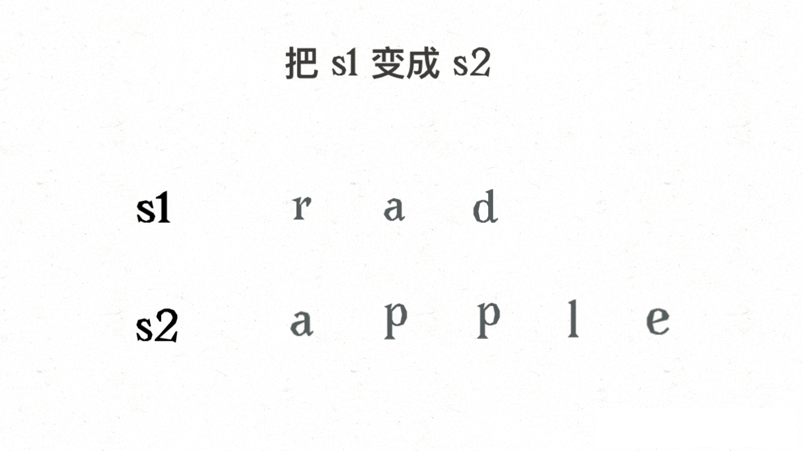
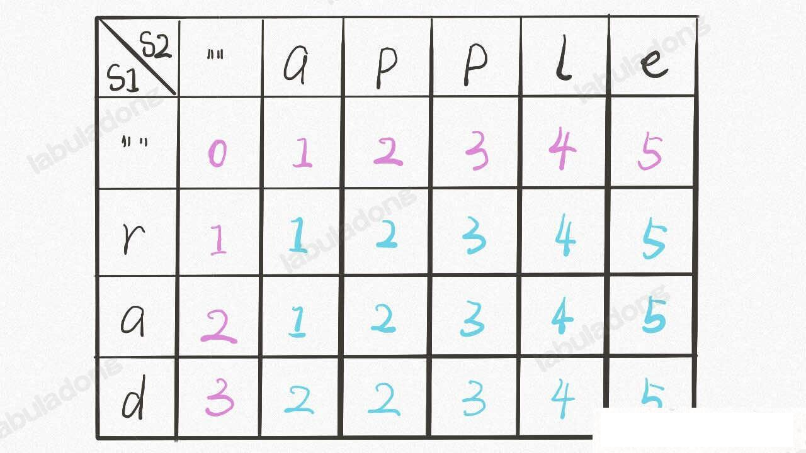
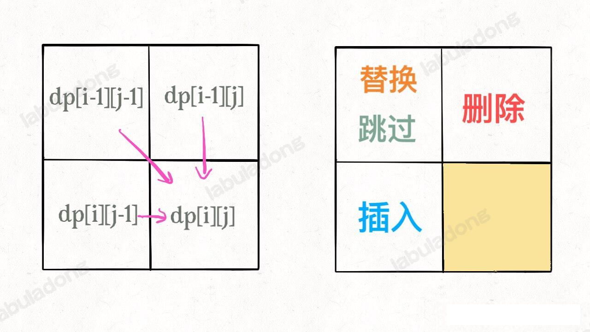
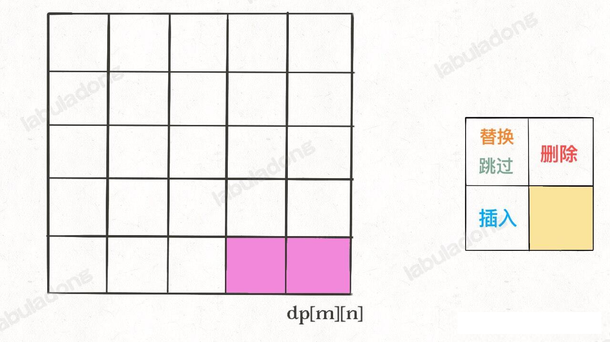
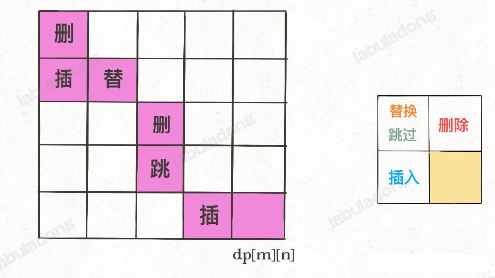
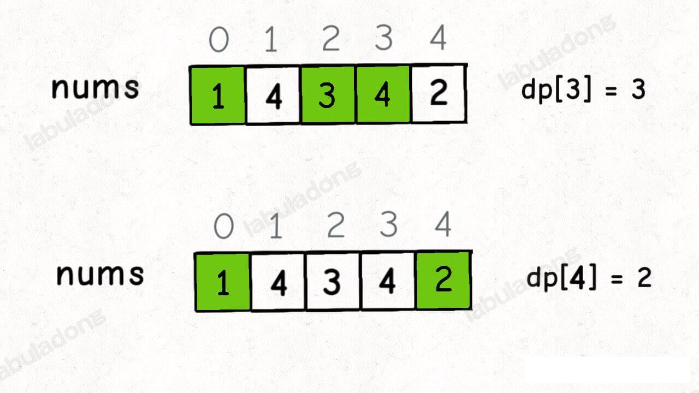
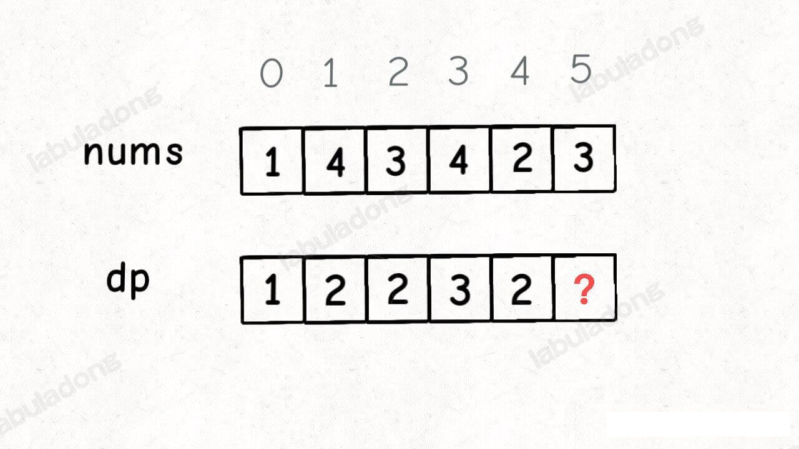
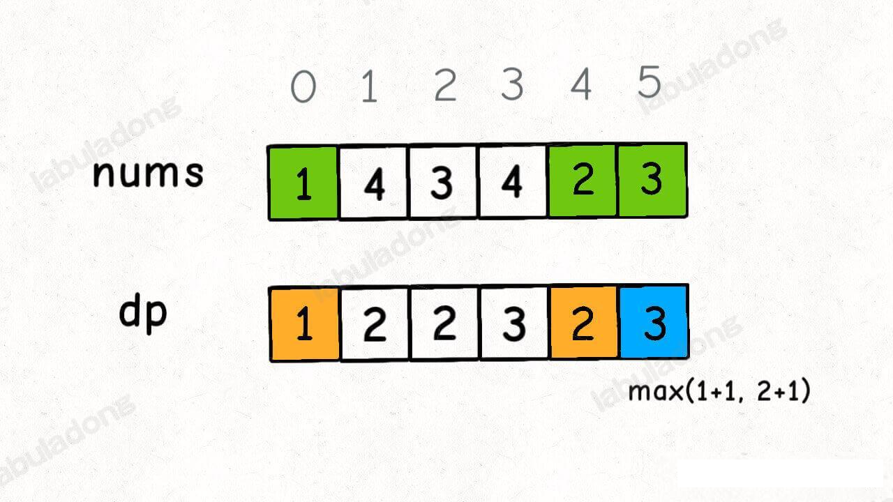
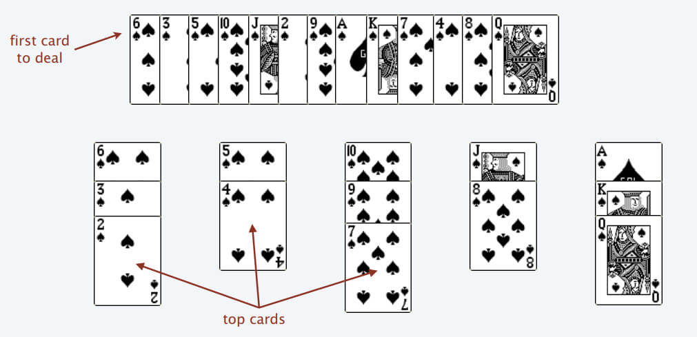
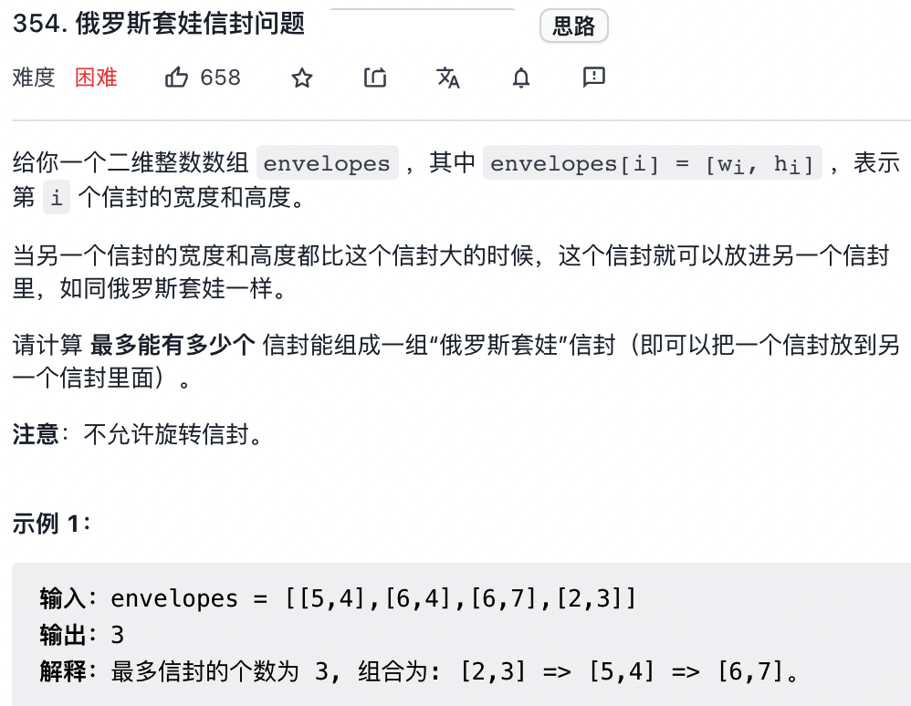

## 子序列相关问题使用 dp 动态规划进行解决

### 编辑距离问题
___
#### 默认的 dp 递归解法
设两个字符串分别为`rad` 和 `apple`，为了把 s1 变成 s2，算法会是这样进行的：



根据上的 gif，我们发现操作不只有三个，其实还有第四个，就是什么都不做 (skip)。比如 s1[i]==s2[j] 的情况，还有一个很容易处理的情况，就是 j 走完了 s2 后，如果 `i` 还没走完 `s1` ，那么只能用删除将 s1 缩短为 s2。类似的，如果 i 走完了 s1 时 j 还没走完 s2，那就只能用插入操作把 s2 剩下的字符全部插入 s1，这两种情况都算是算法的 basecase

伪代码大概如下：
```python
if s1[i] == s2[j]:
    啥都不做(skip)
    i,j 同时向前移动一步
    dp(s1,i-1,s2,j-1)
else:
    三选一：
        插入(insert)
        删除(delete)
        替换(replace)
```
#### 编辑距离的 dp table 数组解法
首先明确 `dp` 数组的含义，`dp` 数组是一个二维数组，长这样：


有了之前递归解法的铺垫，应该很荣立理解。dp[..][0] 和 dp[0][..] 对应的 base case ，dp[i][j] 含义和之前的 dp 函数类似：
```java
int dp(String s1,int i,String s2,int j)
// 返回 s1[0..i] 和 s2[0..j] 之间的最小编辑距离

dp[i-1][j-1]
//存储 s1[0..i] 和 s2[0..j] 的最小编辑距离。通过后面的文章了解到，之所以这么设计让 dp[i-1][j-1] 代表 s1[0..i][0..j] 的值，是因为 数组的索引是从 0 开始的，存在索引偏移。。。。
```
dp 函数的 base case 是 i,j 等于 -1，而数组索引至少是 0，所以 dp 数组会偏移一位。

既然 `dp` 数组和递归 `dp` 函数定义一样，也就是可以直接直接套用之前的思路写代码，**唯一不同的是，DP table 是自底向上(就是 要求 f(x) 必须先求 f(x-1)),递归解法是自顶向下**。(递归的调用处或者说是函数入口是自顶向下 ，比如 dp(s1,m-1,s2,n-1)，但是编写递归逻辑处，仍然是自底向上，比如 memo[i][j]== dp(s1, i - 1, s2, j - 1))。

#### 扩展阅读

一般来说，处理两个字符串的动态规划问题，都是按照文本的思路处理，建立 dp table。为什么那？因为容易找出状态转移的关系，比如编辑距离的 dp table:


还有一个细节，既然每个 `dp[i][j]` 只和它附近的三个状态有关，空间复杂度是可以压缩成 O(min(M,N)) 的(M,N 是两个字符串的长度)。不难，但是解释性大大降低，我们可以自行尝试。

还有一个问题，**这里只求出了最小的编辑距离，那具体的操作是什么？** 如果需要知道具体操作该怎么求出？这个其实很简单，代码稍加修改，给 dp 数组增加额外的信息即可。
```java
Node[][] dp;
class Node{
    int val;
    int choice;
    // 0 代表啥也不做
    // 1 代表插入 [i,j]->(i,j+1)
    // 2 代表删除 [i,j]->[i+1,j]
    // 3 代表替换
}
```
val 属性就是之前的 dp 数组的数组，choice 属性代表操作。在做最优选择的时候，顺便把操作记录下来，然后就从结果反推具体操作。
我们的最终结果不是 dp[m][n] 吗？，这里的 val 存着最小编辑距离，choice 存着最后一个操作，比如说是插入操作，那么久可以左移一格

重复此过程，可以一步步回到起点 dp[0][0],形成一条路径，安这条路径的操作进行编辑，就是最佳方案。


___
### 最长递增子序列

动态规划的核心思想是数学归纳法。数学归纳法的思路比价简单，比如我们想证明一个数学结论，那么我们先假设这个结论在 k < n 的时候成立，然后根据这个假设，想办法推导证明出 k=n 的时候此结论依然成立。
如果能够这么出来，说明这个结论对于 k 等于任何值都成立
我们是否有一种感觉：学会了动态规划的套路，找到了问题的「状态」,明确了 `dp` 数组/函数的含义，定义了 base case；但是不知道如何确定「选择」，也就是找不到状态转移的关系，依然写不出动态规划解法，怎么办？

不要担心，动态规划的难点本来就在于寻找正确的状态转移方程，本文就借助经典的「最长递增子序列」来讲一讲动态规划的通用技巧：**数学归纳法**

最长递增子序列(Longest Increasing Subsequence，简称 LIS) 是非常经典的一个算法问题，比较容易想到的是动态规划解法，时间复杂度是 O(N^2)，我们借这个问题由浅入深第讲解如何寻找状态转移方程，如写出动态规划解法。比较难想到的是利用二分法，时间复杂度是O(NlogN)，我们通过一种简单的纸牌游戏来辅助理解这种巧妙的解法。

leetcode 第 300 题 「最长增长子序列」

请输入一个无序的整数数组，请你找到其中最长的严格递增的子序列长度，函数签名如下：
```java
int lengthOfLIS(int[] nums);
```
比如说输入的是 `nums=[10,9,2,5,3,7,101,18]`，其中最长的递增子序列是 `[2,3,7,101]`, 所以算法的输出应该是 4
注意「子序列」和「子串」这两个名词的区别，子串一定是连续的，而子序列不一定是连续的。下面先来设计动态规划的算法来解决这个问题。

#### 一、动态规划解法
动态规划的核心是数学归纳法

相信大家对数学归纳法都不陌生，高中时期就学过，而且思路简单。比如我们想证明一个数学结论，那么**我们先假设这个结论在 `k<n` 时成立，然后想办法推导证明出 `k=n` 的时候此结论也成立**。如果能够证明出来，那么就说明这个结论对于 `k` 等于任何数据都成立。

类似的，我们设计动态规划算法，不是需要一个 dp 数组吗？我们可以假设 dp[0..i-1] 都已经被算出来的，然后问自己：怎么通过这些结果算出 `dp[i]` ?

至二级拿最长递增子序列这个问题距离你就能明白了。不过，首先要弄清楚 dp 数组的含义，即 `dp[i]` 的值到底代表着什么？

**我们的定义是这样的：`dp[i]` 表示以 `nums[i]` 这个数据结尾的最长递增子序列的长度**

为什么要这样定义，这是解决子序列问题的一个套路，后文的 子序列相关问题模板 总结了集中套路。学完本章所有的动态规划问题，就会发现 dp 数组定义的方法就那几种。

根据这个定义，我们就可以推出 base case : `dp[i]` 初始值为 1 ，因为以nums[i]结尾的最长递增子序列最起码要包含它自己。
举个栗子：


这个 GIF 展示了算法的演进过程：


根据这个定义，我们的最终结果(自徐磊的最大长度)应该是 dp 数组中的最大值。
```java
int res=0;
for(int item : dp) {
    res = Math.max(res,item);
}
return res;
```
我们这里也许会问，刚才的算法演进过程每个 `dp[i]` 的结果是我们肉眼看出来的，我们应该怎么设计算法逻辑来正确计算每个 `dp[i]` 那？
这就是动态规划的重头戏，如何设计算法逻辑进行状态转移，才能正确运行那？我们需要使用数学归纳法的思想：
**假设我们已经知道了 `dp[0..4]` 的所有结果，我们如何通过这些一直的结果推导出 `dp[5]` 那** ？


根据刚才我们对 dp 数组的定义，现在想求 `dp[5]`的值，也即是想求以 `nums[5]` 为结尾的最长递增子序列。

**`num[5]=3`, 既然是递增子序列，只要找到哪些结尾比 3 小的子序列，然后把 3 接到这些子序列的结尾，皆可以形成一个新的递增子序列，而且这个新的子序列长度加1**

num[5] 前面有哪些元素小于 nums[5] 那？这个好计算，用 for 循环比较一波就能把这些元素找出来。

以这些元素为结尾的最长递增子序列的长度是多少？回顾下我们对 dp 数组的定义，它记录的正是以每个元素为末尾的最长递增子序列的长度。

以我们举的例子来说，nums[0] 和 nums[4] 都是小于 nums[5] 的，然后对比 dp[0] 和 dp[4] 的值，我们最让 nums[5] 和更长的递增子序列结合，得出 dp[5]=3, 如下图所示

```java
for (int j=0;j<i;j++) {
    if(nums[i]>nums[j]) {
        dp[i] = Math.max(dp[i],dp[j]+1);
    }
}
```
当 i=5 时，这段代码的逻辑就可以算出 dp[5].其实到这里，这道算法题我们已经基本解决完了。

完整的代码请参考 lengthOfLIS 方法
```java
int lengthOfLIS(int[] nums) {
        int[] dp = new int[nums.length];
        // 每个元素的最长自序列长度至少是 1（元素本身的长度）
        Arrays.fill(dp, 1);
        for (int i = 0; i < nums.length; i++) {
            for (int j = 0; j < i; j++) {
                if (nums[j] < nums[i]) {
                    dp[i] = Math.max(dp[i], dp[j] + 1);
                }
            }
        }
        return Arrays.stream(dp).max().getAsInt();
    }
```

#### 二、 最长递增子序列查找——二分法

这个解法的时间复杂度为 `O(NlogN)`,但是说实话，正常人更不想不到这种解法(通过下面的纸牌游戏解说可能玩过这类游戏的人可以想出来)。所以我们了解一下就好，正常情况下能够给出动态规划解法就已经很不错了。
根据题目的意思，很难想象这个问题竟然能跟二分法车上关系。其实最长递增西序列和一种叫做 patience game 的纸牌游戏有关，甚至有一种排序方法就叫做 patience sorting(耐心排队)。
为了简单起见，后文跳过所有的数学证明，通过一个简化的例子来理解下算法的思路
首先，给你一副扑克牌，我们像数组遍历一样从左到右一张一张处理这些扑克牌，最终把这些牌分成若干堆。

处理这些扑克牌要遵循一下规则：
只能把点数小的牌压到点数比它大的牌上；如果当前牌点数比较大，没有可用放置的堆，则新建一个堆，把这张牌放进去；如果当前牌有多个堆可以选择，则选择最左边的那个堆放置（这个规则，恰好符合二分法的规则，这样就能用上二分法）。

比如说上述扑克牌最终会被分成 5 堆(我们认为纸牌 A 的牌面是最大的，纸牌 2 的牌面是最小的)。
为什么遇到多个可选择的时候要放到最左边的堆上那？因为这样可以保证堆顶的牌有序（2,4,7,8，Q), 证明略。
按照上述规则执行，可以算出最长递增子序列，**<font color='red'>牌的堆数就是子序列的长度</font>**，证明略
我们只需要把处理扑克牌的过程边写出来即可。每次处理一张扑克牌不是要找一个合适的堆顶来存放吗？牌的堆顶不是有序吗？这就能用到二分法查找了：用二分查找搜索牌应放置的位置。
最终的最序列为 [3,5,7,8,12] 如下图所示


具体方法参见 lengthOfLisBs 或者 lisUsingBinarySearch(重新抄了一遍，不带注释的)。

至此，二分法查找的解法也讲解完毕。

这个解法确实很难想到。首先涉及数学证明，谁能想到按照这些规则执行，就能得到最长递增子序列那？其次还有二分法查找的运用，要是对二分法的细节不清楚，给了思路也很难写对。

所以，这个方法作为思维拓展好了。但是动态规划的设计方法应该是完全理解的：假设之前的答案已知，利用数学归纳法的思想正确进行专题转移的推演转移，最终得到答案。
___
#### 拓展到二维 —— 俄罗斯信封解题分析


leetcode 第 354 题 「俄罗斯套娃信封问题」，题目如下：



**这道题目其实是最长子序列的一个变种，因为每次合法的嵌套是大的套小的，相当于在二维平明中找一个最长递增的子序列，其长度就是就是最多能签到的信封个数**。

前面说的标准的 LIS 算法只能在一维数组中寻找最长子序列，而我们的信封是由(w,h) 这样的二维数组对形式表示的，如何把 LIS 算法运用过来那？
我们也许会想到，通过 `w*h` 的方式计算面积，然后对面积进行标准的 LIS 算法。但是稍加思考就会发现这样不行，比如 `1*10` 大于 `3*3` ，但是这显然无法实现两个信封相互嵌套

这道题的解法比较巧妙：

先对宽度 `w` 按升序排列，如果遇到 `w` 相同的，则按照高度 `h` 降序排列；之后把所有的 `h` 作为一个数组，在这个数组上计算 LIS 的长度就是答案
接下来上图来帮助理解下


然后在 `h` 寻找最长递增子序列，这个子序列就是最优的嵌套方案


**为什么这就可以找到相互嵌套的信封序列那？** 稍微思考一下就明白了
首先，对宽度`w`从小到大排序，确保了 `w` 这个维度可以相互嵌套，所以我们只需要专注高度 `h` 这个维度就可以相互嵌套即可。

其次，两个`w`相同的信封不能相互包含，所以对于宽度`w`相同的信封，对高度`h` 进行降序排列保证二维 LIS 中不存在多个 `w` 相同的信封(因为题目说了长宽相同也无法嵌套)。