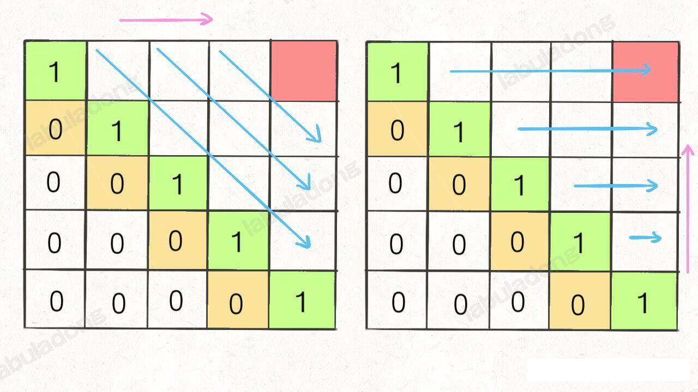

## 子序列相关问题使用 dp 动态规划进行解决

### 编辑距离问题
___
#### 默认的 dp 递归解法
设两个字符串分别为`rad` 和 `apple`，为了把 s1 变成 s2，算法会是这样进行的：


根据上的 gif，我们发现操作不只有三个，其实还有第四个，就是什么都不做 (skip)。比如 s1[i]==s2[j] 的情况，还有一个很容易处理的情况，就是 j 走完了 s2 后，如果 `i` 还没走完 `s1` ，那么只能用删除将 s1 缩短为 s2。类似的，如果 i 走完了 s1 时 j 还没走完 s2，那就只能用插入操作把 s2 剩下的字符全部插入 s1，这两种情况都算是算法的 basecase

伪代码大概如下：
```python
if s1[i] == s2[j]:
    啥都不做(skip)
    i,j 同时向前移动一步
    dp(s1,i-1,s2,j-1)
else:
    三选一：
        插入(insert)
        删除(delete)
        替换(replace)
```
#### 编辑距离的 dp table 数组解法
首先明确 `dp` 数组的含义，`dp` 数组是一个二维数组，长这样：


有了之前递归解法的铺垫，应该很荣立理解。dp[..][0] 和 dp[0][..] 对应的 base case ，dp[i][j] 含义和之前的 dp 函数类似：
```java
int dp(String s1,int i,String s2,int j)
// 返回 s1[0..i] 和 s2[0..j] 之间的最小编辑距离

dp[i-1][j-1]
//存储 s1[0..i] 和 s2[0..j] 的最小编辑距离。通过后面的文章了解到，之所以这么设计让 dp[i-1][j-1] 代表 s1[0..i][0..j] 的值，是因为 数组的索引是从 0 开始的，存在索引偏移。。。。
```
dp 函数的 base case 是 i,j 等于 -1，而数组索引至少是 0，所以 dp 数组会偏移一位。

既然 `dp` 数组和递归 `dp` 函数定义一样，也就是可以直接直接套用之前的思路写代码，**唯一不同的是，DP table 是自底向上(就是 要求 f(x) 必须先求 f(x-1)),递归解法是自顶向下**。(递归的调用处或者说是函数入口是自顶向下 ，比如 dp(s1,m-1,s2,n-1)，但是编写递归逻辑处，仍然是自底向上，比如 memo[i][j]== dp(s1, i - 1, s2, j - 1))。

#### 扩展阅读

一般来说，处理两个字符串的动态规划问题，都是按照文本的思路处理，建立 dp table。为什么那？因为容易找出状态转移的关系，比如编辑距离的 dp table:


还有一个细节，既然每个 `dp[i][j]` 只和它附近的三个状态有关，空间复杂度是可以压缩成 O(min(M,N)) 的(M,N 是两个字符串的长度)。不难，但是解释性大大降低，我们可以自行尝试。

还有一个问题，**这里只求出了最小的编辑距离，那具体的操作是什么？** 如果需要知道具体操作该怎么求出？这个其实很简单，代码稍加修改，给 dp 数组增加额外的信息即可。
```java
Node[][] dp;
class Node{
    int val;
    int choice;
    // 0 代表啥也不做
    // 1 代表插入 [i,j]->(i,j+1)
    // 2 代表删除 [i,j]->[i+1,j]
    // 3 代表替换
}
```
val 属性就是之前的 dp 数组的数组，choice 属性代表操作。在做最优选择的时候，顺便把操作记录下来，然后就从结果反推具体操作。
我们的最终结果不是 dp[m][n] 吗？，这里的 val 存着最小编辑距离，choice 存着最后一个操作，比如说是插入操作，那么久可以左移一格

重复此过程，可以一步步回到起点 dp[0][0],形成一条路径，安这条路径的操作进行编辑，就是最佳方案。


___
### 最长递增子序列

动态规划的核心思想是数学归纳法。数学归纳法的思路比价简单，比如我们想证明一个数学结论，那么我们先假设这个结论在 k < n 的时候成立，然后根据这个假设，想办法推导证明出 k=n 的时候此结论依然成立。
如果能够这么出来，说明这个结论对于 k 等于任何值都成立
我们是否有一种感觉：学会了动态规划的套路，找到了问题的「状态」,明确了 `dp` 数组/函数的含义，定义了 base case；但是不知道如何确定「选择」，也就是找不到状态转移的关系，依然写不出动态规划解法，怎么办？

不要担心，动态规划的难点本来就在于寻找正确的状态转移方程，本文就借助经典的「最长递增子序列」来讲一讲动态规划的通用技巧：**数学归纳法**

最长递增子序列(Longest Increasing Subsequence，简称 LIS) 是非常经典的一个算法问题，比较容易想到的是动态规划解法，时间复杂度是 O(N^2)，我们借这个问题由浅入深第讲解如何寻找状态转移方程，如写出动态规划解法。比较难想到的是利用二分法，时间复杂度是O(NlogN)，我们通过一种简单的纸牌游戏来辅助理解这种巧妙的解法。

leetcode 第 300 题 「最长增长子序列」

请输入一个无序的整数数组，请你找到其中最长的严格递增的子序列长度，函数签名如下：
```java
int lengthOfLIS(int[] nums);
```
比如说输入的是 `nums=[10,9,2,5,3,7,101,18]`，其中最长的递增子序列是 `[2,3,7,101]`, 所以算法的输出应该是 4
注意「子序列」和「子串」这两个名词的区别，子串一定是连续的，而子序列不一定是连续的。下面先来设计动态规划的算法来解决这个问题。

#### 一、动态规划解法
动态规划的核心是数学归纳法

相信大家对数学归纳法都不陌生，高中时期就学过，而且思路简单。比如我们想证明一个数学结论，那么**我们先假设这个结论在 `k<n` 时成立，然后想办法推导证明出 `k=n` 的时候此结论也成立**。如果能够证明出来，那么就说明这个结论对于 `k` 等于任何数据都成立。

类似的，我们设计动态规划算法，不是需要一个 dp 数组吗？我们可以假设 dp[0..i-1] 都已经被算出来的，然后问自己：怎么通过这些结果算出 `dp[i]` ?

至二级拿最长递增子序列这个问题距离你就能明白了。不过，首先要弄清楚 dp 数组的含义，即 `dp[i]` 的值到底代表着什么？

**我们的定义是这样的：`dp[i]` 表示以 `nums[i]` 这个数据结尾的最长递增子序列的长度**

为什么要这样定义，这是解决子序列问题的一个套路，后文的 子序列相关问题模板 总结了集中套路。学完本章所有的动态规划问题，就会发现 dp 数组定义的方法就那几种。

根据这个定义，我们就可以推出 base case : `dp[i]` 初始值为 1 ，因为以nums[i]结尾的最长递增子序列最起码要包含它自己。
举个栗子：


这个 GIF 展示了算法的演进过程：


根据这个定义，我们的最终结果(自徐磊的最大长度)应该是 dp 数组中的最大值。
```java
int res=0;
for(int item : dp) {
    res = Math.max(res,item);
}
return res;
```
我们这里也许会问，刚才的算法演进过程每个 `dp[i]` 的结果是我们肉眼看出来的，我们应该怎么设计算法逻辑来正确计算每个 `dp[i]` 那？
这就是动态规划的重头戏，如何设计算法逻辑进行状态转移，才能正确运行那？我们需要使用数学归纳法的思想：
**假设我们已经知道了 `dp[0..4]` 的所有结果，我们如何通过这些一直的结果推导出 `dp[5]` 那** ？


根据刚才我们对 dp 数组的定义，现在想求 `dp[5]`的值，也即是想求以 `nums[5]` 为结尾的最长递增子序列。

**`num[5]=3`, 既然是递增子序列，只要找到哪些结尾比 3 小的子序列，然后把 3 接到这些子序列的结尾，皆可以形成一个新的递增子序列，而且这个新的子序列长度加1**

num[5] 前面有哪些元素小于 nums[5] 那？这个好计算，用 for 循环比较一波就能把这些元素找出来。

以这些元素为结尾的最长递增子序列的长度是多少？回顾下我们对 dp 数组的定义，它记录的正是以每个元素为末尾的最长递增子序列的长度。

以我们举的例子来说，nums[0] 和 nums[4] 都是小于 nums[5] 的，然后对比 dp[0] 和 dp[4] 的值，我们最让 nums[5] 和更长的递增子序列结合，得出 dp[5]=3, 如下图所示

```java
for (int j=0;j<i;j++) {
    if(nums[i]>nums[j]) {
        dp[i] = Math.max(dp[i],dp[j]+1);
    }
}
```
当 i=5 时，这段代码的逻辑就可以算出 dp[5].其实到这里，这道算法题我们已经基本解决完了。

完整的代码请参考 lengthOfLIS 方法
```java
int lengthOfLIS(int[] nums) {
        int[] dp = new int[nums.length];
        // 每个元素的最长自序列长度至少是 1（元素本身的长度）
        Arrays.fill(dp, 1);
        for (int i = 0; i < nums.length; i++) {
            for (int j = 0; j < i; j++) {
                if (nums[j] < nums[i]) {
                    dp[i] = Math.max(dp[i], dp[j] + 1);
                }
            }
        }
        return Arrays.stream(dp).max().getAsInt();
    }
```

#### 二、 最长递增子序列查找——二分法

这个解法的时间复杂度为 `O(NlogN)`,但是说实话，正常人更不想不到这种解法(通过下面的纸牌游戏解说可能玩过这类游戏的人可以想出来)。所以我们了解一下就好，正常情况下能够给出动态规划解法就已经很不错了。
根据题目的意思，很难想象这个问题竟然能跟二分法车上关系。其实最长递增西序列和一种叫做 patience game 的纸牌游戏有关，甚至有一种排序方法就叫做 patience sorting(耐心排队)。
为了简单起见，后文跳过所有的数学证明，通过一个简化的例子来理解下算法的思路
首先，给你一副扑克牌，我们像数组遍历一样从左到右一张一张处理这些扑克牌，最终把这些牌分成若干堆。

处理这些扑克牌要遵循一下规则：
只能把点数小的牌压到点数比它大的牌上；如果当前牌点数比较大，没有可用放置的堆，则新建一个堆，把这张牌放进去；如果当前牌有多个堆可以选择，则选择最左边的那个堆放置（这个规则，恰好符合二分法的规则，这样就能用上二分法）。

比如说上述扑克牌最终会被分成 5 堆(我们认为纸牌 A 的牌面是最大的，纸牌 2 的牌面是最小的)。
为什么遇到多个可选择的时候要放到最左边的堆上那？因为这样可以保证堆顶的牌有序（2,4,7,8，Q), 证明略。
按照上述规则执行，可以算出最长递增子序列，**<font color='red'>牌的堆数就是子序列的长度</font>**，证明略
我们只需要把处理扑克牌的过程边写出来即可。每次处理一张扑克牌不是要找一个合适的堆顶来存放吗？牌的堆顶不是有序吗？这就能用到二分法查找了：用二分查找搜索牌应放置的位置。
最终的最序列为 [3,5,7,8,12] 如下图所示


具体方法参见 lengthOfLisBs 或者 lisUsingBinarySearch(重新抄了一遍，不带注释的)。

至此，二分法查找的解法也讲解完毕。

这个解法确实很难想到。首先涉及数学证明，谁能想到按照这些规则执行，就能得到最长递增子序列那？其次还有二分法查找的运用，要是对二分法的细节不清楚，给了思路也很难写对。

所以，这个方法作为思维拓展好了。但是动态规划的设计方法应该是完全理解的：假设之前的答案已知，利用数学归纳法的思想正确进行专题转移的推演转移，最终得到答案。
___
#### 拓展到二维 —— 俄罗斯信封解题分析


leetcode 第 354 题 「俄罗斯套娃信封问题」，题目如下：


**这道题目其实是最长子序列的一个变种，因为每次合法的嵌套是大的套小的，相当于在二维平明中找一个最长递增的子序列，其长度就是就是最多能签到的信封个数**。

前面说的标准的 LIS 算法只能在一维数组中寻找最长子序列，而我们的信封是由(w,h) 这样的二维数组对形式表示的，如何把 LIS 算法运用过来那？
我们也许会想到，通过 `w*h` 的方式计算面积，然后对面积进行标准的 LIS 算法。但是稍加思考就会发现这样不行，比如 `1*10` 大于 `3*3` ，但是这显然无法实现两个信封相互嵌套

这道题的解法比较巧妙：

先对宽度 `w` 按升序排列，如果遇到 `w` 相同的，则按照高度 `h` 降序排列；之后把所有的 `h` 作为一个数组，在这个数组上计算 LIS 的长度就是答案
接下来上图来帮助理解下


然后在 `h` 寻找最长递增子序列，这个子序列就是最优的嵌套方案


**为什么这就可以找到相互嵌套的信封序列那？** 稍微思考一下就明白了
首先，对宽度`w`从小到大排序，确保了 `w` 这个维度可以相互嵌套，所以我们只需要专注高度 `h` 这个维度就可以相互嵌套即可。

其次，两个`w`相同的信封不能相互包含，所以对于宽度`w`相同的信封，对高度`h` 进行降序排列保证二维 LIS 中不存在多个 `w` 相同的信封(因为题目说了长宽相同也无法嵌套)。

具体代码请参考 russia_envelope 或者 lisRussiaEnvelops2 
为了清晰起见，里面的将最后的求 LIS 的逻辑改为调用相关 LIS 方法，为了通过相关测试用例，LIS 调用部分必须使用带有二分法的、时间复杂度为 O(NlogN) 的方法。这样时间复杂度还是 O(NlogN),因为排序和计算 LIS 各需要 O(NlogN) 的时间，加到一起还是 `O(NlogN)`; 空间复杂度为 `O(N)`, 因为计算 LIS 函数需要一个 `top` 数组（应该还需要一个获取信封高度的 h 数组吧）

___

### 最大子数组

#### 最大子数组的三种解法
leetcode 第 53 题「最大子数组和」

最大子数组和的三个解法都在类 MaxSubArray 中，包括：
1、滑动窗口解法
2、动态规划解法
3、普通 for 循环解法
滑动窗口解法的说明也在该方法的注解之处。

___
### 最长公共子序列

不知道大家做算法题有什么感觉，**我总结出来做题的技巧就是，把大的问题细化到一个点，先研究在这个点上如何解决问题，然后再通过递归/迭代的方式扩展到整个问题**。

比如二叉树的解法中，我们会把整个问题细化到某个节点上，想想自己站在某个节点上，需要做什么，然后套二叉树的框架就行了。

动态规划系列问题也是一样，尤其是子序列相关的问题。本章节从 **「最长公共子序列问题」展开，总结三道子序列问题**，解完这些题并仔细讲讲子序列的问题套路，我们就能感受到这种思维了。

#### 用动态规划解决最长公共子序列

计算最长公共子序列(Longest Common Subsequence)就是一道经典的动态规划题目,leetcode 第 1143 题就是这个问题。
给你输入两个字符串 s1 和 s2，请你找出他们俩的最长公共子序列，返回这个子序列的长度。函数签名如下：
```java
int longestCommonSubsequence(String s1,String s2);
```
比如说输入 `s1 = "zabcde", s2="acez"`，它们俩的最长公共子序列是 `lcs="ace"`, 长度为 3，所以返回 3.

如果没有做过这道题，一个最简单的暴力算法就是，把 s1 和 s2 的所有公共子序列都穷举出来，然后看看有没有公共的，然后在所有的 LCS 寻找一个长度最长的。
显然，这种思路的复杂度非常高，你要穷举所有的子序列，这个复杂度是指数级别的，肯定不实际。

正确的思路是不要考虑整个字符串，而是细化到 s1 和 s2 的每个字符。后文的 《子序列解题模板》中总结的一个规律：

**对于两个字符串求子序列的问题，都是用两个指针 `i` 和 `j` 分别在两个字符串上移动，大概率是动态规划思路**。

最长公共子序列的问题也遵循这个规律，我们可以先写一个 `dp` 函数：
```java
int dp(String s1,int i,String s2,int j);
```
这个 dp 函数的定义是：`dp(s1,i,s2,j)` 计算 `s1[i..]` 和 `s2[j..]` 的最长公共子序列长度。
根据这个定义，那么我们想要的答案就是 `dp(s1,0,s2,0)`，且 base case 就是 `i==len(s1) || j==len(s2)` 时，因为这时候 `s1[i..]` 或者 `s2[j..]` 是空串了，此时的最长公共子序列的长度肯定是 0。

```java
int longestCommonSubse(String s1,String s2) {
    return dp(s1,0,s2,0);
}
// 主函数
int dp(String s1,int i,String s2,int j) {
    //base case
    if (i==s1.length() || j == s2.length()) {
        return 0;
    }
   //....
}
```
*** 接下来，我们<font color="red">不看</font> s1 和 s2 两个字符串，而是要具体到每一个字符，思考每个字符该做什么**，如下图所示：


我们知道看 `s1[i]` 和 `s2[j]`, 如果 `s1[i] == s2[j]` ，说明这两个相同的字符一定在 `lcs` 中，如下图所示

这样我们就可以找到一个 lcs 中的字符，根据 dp 函数的定义，我们可以完善一下代码：
```java
int dp(String s1,int i,String s2,int j) {
    //base case
    if (i==s1.length() || j == s2.length()) {
        return 0;
    }
    if (s1.charAt(i) == s2.charAt(j)) {
        // s1[i] 和 s2[j] 必然在 lcs 中
        // 因此这里 使用 1 + s1[i+1..] 和 s2[j+1..] 中的 lcs 长度，就是答案。
        return 1 + dp(s1,i+1,s2,j+1)
    } else {
        //...
    }
}
```

刚才说的 `s1[i]==s2[j]` 的情况，但如果 `s1[i] != s2[j]`，该怎么办？
**`s1[i] != s2[j]` 意味着，`s1[i]` 和  `s2[j]` 至少有一个字符不在 lcs 中，分 3 种情况**，如下图所示：


如上图所示，总共可能有 3 种情况，我怎么知道具体哪三种情况那？

其实我们也不知道，那就把三种期刊的答案都算出来，取其中结果最大的那个呗，还能怎样？因为题目是让我们算「最长」公共子序列的长度嘛。
这三种情况的答案怎么算？回想一下我们的 `dp` 函数定义，不就是为了专门计算他们而设计的嘛！
代码可以再进一步
```java
int dp(String s1,int i,String s2,int j) {
    if (s1.charAt(i) == s2.charAt(j)) {
        // s1[i] 和 s2[j] 必然在 lcs 中
        // 因此这里 使用 1 + s1[i+1..] 和 s2[j+1..] 中的 lcs 长度，就是答案。
        return 1 + dp(s1,i+1,s2,j+1)
    } else {
        // s1[i] 和 s2[j] 中至少要有一个字符不再 lcs 中，
        // 穷举三种情况的结果，取其中的最大结果
        return max(
            // 情况一：s1[i] 不在 lcs 中
            dp(s1,i+1,s2,j),
            // 情况二：s2[j] 不 lcs 中
            dp(s1,i,s2,j+1),
            //情况三，都不在 lcs 中
            dp(s1, i+1, s2, j+1)
        );
    }
}
```

这里其实已经非常接近我们的答案了，**还有一个小的优化，情况三 「s1 和 s2 都不在 lcs 中」其实是可以直接忽略的**。

因为我们在求的是最大值嘛，情况三在计算 `s1[i+1..]` 和 `s2[j+1..]` 的 `lcs` 长度，这个长度肯定是小于等于情况二  `s1[i..]` 和 `s2[j+1..]` 的 `lcs` 长度，因为 `s1[i+1..]` 比 `s1[i..]` 短嘛，那从这里面计算出来的 lcs 当然也不可能更长嘛。

同理，情况三的结果肯定也小于等于情况一。**说白了，情况三被情况一和情况二包含了**，所以我们可以直接忽略掉情况三，完整的代码见源码：org.swj.leet_code.algorithm.dynamic_program.subsequence.LongestCommonSubSeq

这里我们简单抽象成核心 `dp` 函数的递归框架：
```java
int dp(int i,int j) {
    dp(i+1,j+1); // #1
    dp(i,j+1);   // #2
    dp(i+1,j);   // #3
}
```
我们想从 dp(i,j) 转移到到 dp(i+1,j+1), 有不止一种方式，可以直接 +1，也可以走 先 i+1, 然后 j+1, 最后也能走到 dp(i+1,j+1), 所以这就存在重叠子问题，如果我们不用 memo 备忘录消除子问题，那么 dp(i+1,j+1) 会被计算多次，这是没有必要的。

至此，最长公共子序列的问题完全解决了，用的是**自顶向下**(为啥这里叫自顶向下：函数 f(x) 是由 f(x+1) 推导出来，因此必先知道 f(x+1) 的值才能推导出 f(x) 的值，这便是自顶向下；相反，如果 f(x) 是由 f(x-1) 推导出来的，则称为自底向上)带备忘录的动态规划思路，我们当然可以使用自底向上的迭代的动态规划思路，和我们的递归思路是一样的，关键是如何定义 `dp` 数组，我们这里也写一下自底向上的解法吧, 解决思路和 DistinctSubSequence  不同的子序列的 dp 数组自底向上解法非常相似
动态方程:

当 S1[j-1] == S2[i-1] , dp[i][j] = dp[i-1][j-1] +1; // 自底向上

当 S1[j-1] != S2[i-1] , dp[i][j] = max(dp[i][j-1],dp[i-1][j])


#### 字符串的删除

leetcode 第 583 题 「两个字符串的删除操作」，题目如下：
给定两个单词 s1 和 s2，返回使得 s1 和 s2 相同所需的最小步数。每步可以删除任意一个字符串中的一个字符，函数签名如下：
```java
int minDistance(String s1,String s) ;
```
比如输入 `s1="sea" s2="eat"` ,算法返回 2，第一步将 `sea` 变成 `ea`，第二步将 `ea` 变成 `eat`。
题目让我计算将两个字符串变得相同的最少删除次数，那我们可以思考下，最后这两个字符串会被删除成什么样？

删除的结果不就是它俩的最长公共子序列嘛！
那么，要计算删除删除的次数，就可以通过最长公共子序列的长途推导出来：
```java
int minDistance(String s1,String s2) {
    int m=s.length(),n=s2.length();
    int lcs=longestCommonSubsequence(s1,s2);
    return m-lcs+n-lcs;
}
```

#### 最小 ASCII 删除和

leetcode 712 题，「两个字符串的最小 ascii 删除和」，题目和上一道题目非常类似，只不过上道题要求删除次数最小化，这道题要求删除掉的字符 ascii 码之和最小化

比如输入 `s1="sea", s2="eat"`, 算法返回 231。
因为在 `"sea"` 中 删除 `"s"`, 在 "eat" 中删除 “t”，可使得两个字符串相等，且删掉字符串的 ascii 码之和最小，即 s(115) + t(115) = 213

**这道题不能直接复用计算最长公共子序列的函数，但是可以一招之前的思路，稍微修改 base case 和 状态转移部分分即可写出解法代码**：
参见 org.swj.leet_code.algorithm.dynamic_program.subsequence.LongestCommonSubSeq#minimumDeleteSum

base case 有一定的区别，计算 lcs 长度的时候，如果一个字符串为空，那么 lcs 长度必然此时的 lcs 必然为 0；但是这道题如果一个字符串为空，另外一个字符串必然要被全部删除，所以需要计算另一个字符串的所有字符的 ascii 之和的。

关于状态转移，当 s1[i] 和 s2[j] 相同时不需要删除，不同时需要删除，所以可以利用 dp 函数计算两种情况，得出最优的结果。其他的大同小异，就不具体展开了。

至此，三道公共子序列问题已经解决了，关键在于将问题细化到字符，根据每个字符是否相同来判断他们是否在结果子序列中，从而避免了对所有的子序列进行穷举。

这也算是在两个字符串中求子序列的常用思路吧，需要我们好好体会，多多练习~

_______________________
### 动态规划之子序列问题解题模板-最长回文

首先子序列本身相对于子串，子数组更困难一些，因为前者是不连续的序列，而后者是连续的，你就算穷举你都不一定会，更别说求解相关的算法问题了。

而且，子序列问题很可能涉及到两个字符串，比如前文的《最长公共子序列》，如果没有一定的处理经验，真的不容易想出来。所以本章节就来扒一扒子序列问题的套路，其实就有两种模板，相关问题只要往这两种思路上想，十拿九稳。

一般来说，这类问题都是让我们求一个**最长子序列**，因为最短子序列就一个字符嘛，没啥可问的。一旦涉及到子序列和最值，那几乎可以肯定，**考察的是动态规划技巧，时间复杂度一般都是 O(n^2)**。

原因很简单，你想想一个字符串，它的子序列能有所少中可能？起码是指数级的，这种情况下，不用动态规划技巧，还想怎么着？

既然要用动态规划，那就要定义 dp 数组，找找状态关系。我们说的两种思路模板，就是 `dp` 数组的定义思路。不同的问题可能需要不同的 `dp` 数组定义来解决。

#### dp 数组定义的两种思路
_______________
##### 1、第一种思路模板是一个一维的 `dp` 数组:
```java
int n = array.length;
int[] dp = new int[n];

for(int i=1; i<n; i++) {
    for (j=0;j<i;j++) {
        dp[i] = 最值(dp[i],dp[j] + ...)
    }
}
```

比如我们 之前的 《最长递增子序列》和《最大子数组和》都是这个思路。在这个思路中 `dp` 数组的定义是：
**在子数组 arr[0..i] 中，以 arr[i] 结尾的子序列的长度是 `dp[i]`**。

为啥最长递增子序列需要这种思路那？前文说的很清楚了，因为这样符合归纳法，可以找到状态转移的关系，这里就不具体展开了。

##### 2、第二种思路模板就是一个二维的 `dp` 数组

```java
int n = arr.length;
int[][] dp = new int[n][n];

for (int i=0;i<n;i++) {
    for(int j=0;j<n;j++) {
        if(arr[i] = arr[j]) 
            dp[i][j]=dp[i][j] + ...
        else
            dp[i][j] = 最值(...)
    }
}
```

这种思路运用的更多一些，尤其是涉及两个字符串/数组的子序列时，比如之前的《编辑距离》和《最长公共子序列》；这种思路也可以用于只涉及一个字符串/数组的情景，比如本文讲的回文子序列问题。

**2.1 涉及两个字符串/数组的场景**，`dp` 数组的定义如下
**在子数组 `arr[0..i]` 和子数组 `arr2[0..j]` 中，我们要求的子序列长度为 dp[i][j]**。

**2.2 只涉及一个字符串/数组的场景**, `dp` 数组的定义如下：
在子数组 `array[i..j]` 中, 我们要求的子序列的长度为 `dp[i][j]`。

下面按就看看最长回文子序列问题，详解一下第二种情况下如何使用动态规划。

#### 二、最长回文子序列

之前解决了 《最长回文子串》的问题（在 firstMac 项目的 com.swj.ics.dataStructure.strings.Palindrome 中，本次也会重新求解），这次提升难度，leetcode 第 516 题，求最长回文子序列的长度：

输入一个字符串 s ，请你找出 s 中的最长回文子序列的长度，函数签名如下：
```java
int longestPalinddromeSubseq(String s);
```
比如说输入 `s=aecda` , 算法返回 3 ，因为最长的回文子序列是 `"aca"`, 长度为 3。
我们对 dp 数组的定义是：**在子串 `s[i..j]` 中，最长回文子序列的长度为 `dp[i][j]`。一定要记住这个定义才能理解算法**。

为啥这个问题要定义成二维的 dp 数组那？在 《最长递增子序列》提到，找状态转移需要归纳思维，说白了就是如何从已知的结果推导出未知的部分。二这样定义能够进行归纳，容易发现状态转移关系。

具体来说，如果我们想求出 `dp[i][j]`, 假设你知道子问题 `dp[i+1][j-1` 的结果 (`s[i+1..j-1]`中最长回文子序列的长度)，你是否能想办法算出 `dp[i][j]` 的值(`s[i..j]`中，最长回文子序列的长度)那？


可以！这取决于 `s[i]` 和 `s[j]` 的字符：
**如果它俩相等**，那么它俩加上 `s[i+1..j-1]`中的最长回文子序列就是 `s[i..j]` 的最长回文子序列


**如果它俩不相等**，说明它俩**不可能同时**出现在`s[i..j]` 的最长回文中，那么把它俩分别加入 `s[i+1..j-1]` 中，看看哪个字符串产生的回文子序列更长即可：


以上这两种情况写成代码就是这样的 
```java
if (s[i] == s[j]) {
    // 它俩一定出现在最长回文子序列中
    dp[i][j]=dp[i+1][j-1]+2;
} else {
    // s[i+1..j] 和 s[i..j-1] 谁的回文子序列更长？
    dp[i][j]=max(dp[i+1][j],dp[i][j-1])
}
```
至此，状态转移方程就写出来了，根据 dp 数组的定义，我们要求的是 `dp[0][n-1]`, 也是整个 `s` 的最长回文子序列长度。

#### 三、代码实现

首先明确一个base case，如果只有一个字符，显然最长回文子序列长度是 1，也就是 `dp[i][j]=1(i==j)`。
因为 i 肯定小于等于 j，所以对于哪些 i>j 的位置，根本不存在回文子序列，应该初始化为 0。
另外，看看刚才写的状态转移方程，像求 `dp[i][j]` 需要知道 `dp[i+1][j-1]`, `dp[i+1][j]`, `dp[i][j-1]` 这三个位置：再看看我们确定的 base case，填入 `dp` 数组之后是这样的：

为了保证每次计算 `dp[i][j]`, 左、下、右方向的位置已经被计算出来了，只能斜着遍历(i++,j++)或者反着遍历(i--,j++)。



这里我们选择反着遍历：代码实现请参考 LongestPalindromeSubSeq.java

#### 四、拓展延伸

使然回文相关的问题没有什么特别广泛的使用场景，但是你汇算最长回文子序列以后，一些类似的题目也可以顺手解决掉
比如力扣第 1312 题「计算让字符串成为回文串的最少插入次数」：
输入一个字符串 s，你可以在字符串的任意位置插入任意字符。如果要把 s 变成回文，请你计算最好呀哦今夕多少次插入？
函数签名如下：
```java
int minInsertions(String s);
```

比如说输入 `s="abcea"`，算法返回 2，因为可以给 s 插入 2 个字符变成回文串 "abeceba" 或者 "aebcbea"。如果输入 "aba"，则算法返回0，因为 s 已经是回文串，不用插入任何字符。

这也是一道单字符串的子序列问题，所以我们也可以使用一个二维 dp 数组，其中 dp[i][j] 的定义如下：
**对字符串 s[i..j] ，最少需要进行 dp[i][j] 次插入才能变成回文串**。
根据 `dp` 数组的定义，base case 就是 `dp[i][i] = 0`, 因为单个字符本身就是回文串，不需要插入。然后使用数学归纳法，假设已经计算出了子问题 `dp[i+1][j-1]` 的值了，思考如何推出 `dp[i][j]` 的值：


实际上和最长回文子序列问题的状态转移方程非常类似，这里也分两种情况：
```java
if (s[i] == s[j]) {
    // 根本不需要插入任何字符
    dp[i][j] = dp[i+1][j-1];
} else {
    // 把 s[i+1..j] 和 s[i..j-1] 变成回文串，选择插入次数较少的
    // 然后还要再插入一个 s[i] 或 s[j]，使 s[i..j] 变成回文串
}
```

最后，我们依然采用倒着遍历`dp` 数组的方式，写出代码：
请参考  org.swj.leet_code.algorithm.dynamic_program.subsequence.minInsertion(String s) 方法

至此，这道题也是用了子序列解题模板解决了，整体逻辑和最长回文子序列非常类似，那么这个问题是否可以直接复用回文子序列的解法那？

其实是可以的，我们甚至都不用谢状态转移方程，你仔细想象：

**我先算出字符串 s 的最长回文子序列，哪些不再最长回文中的字符串，不是就要需要插入的字符吗?**

所以这道题可以直接复用之前实现的 `longestPaliddromeSubseq` 函数：
```java
int minInsertion2(String s) {
    return s.length() - longestPalindromeSubeqDpDoubleArray(s);
  }
```
好了，子序列相关的算法就先说到这里。