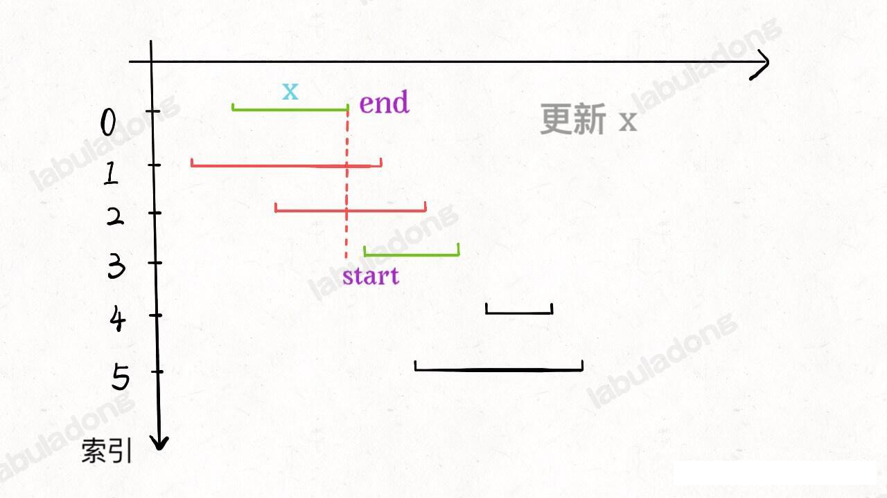
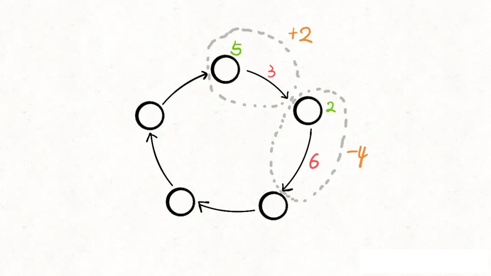
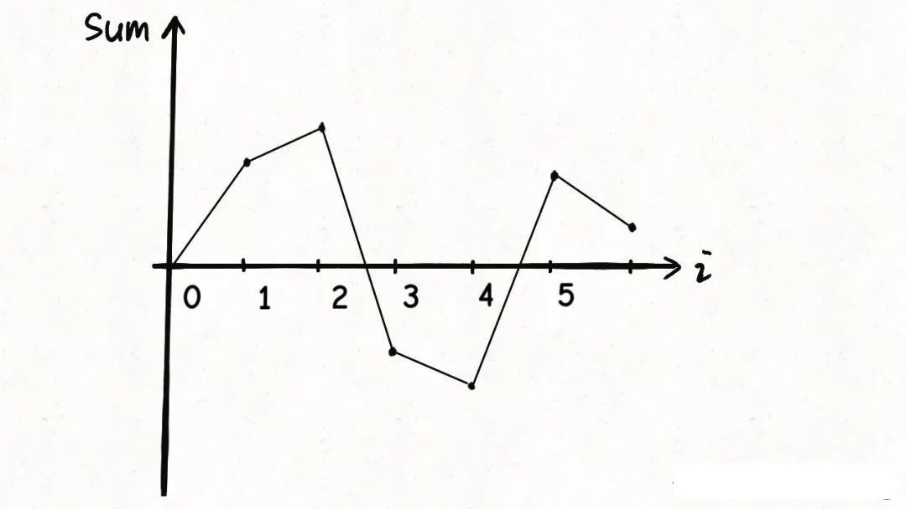
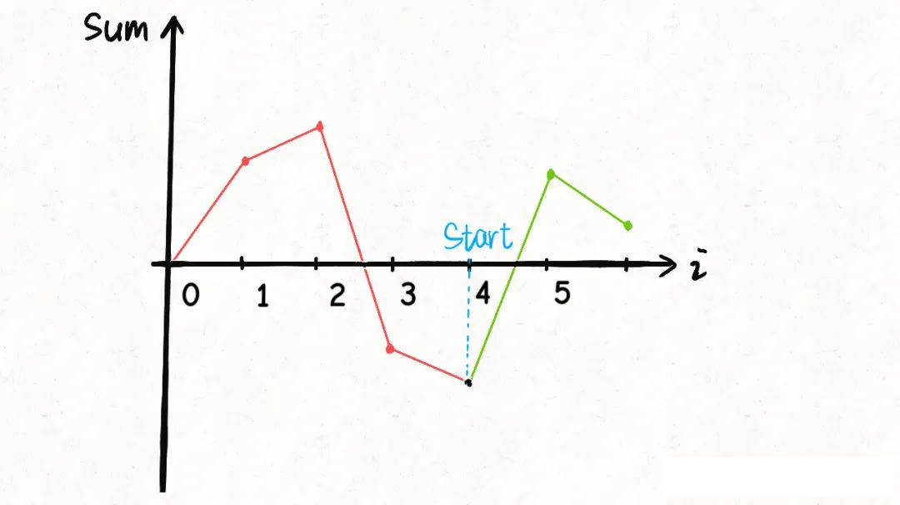
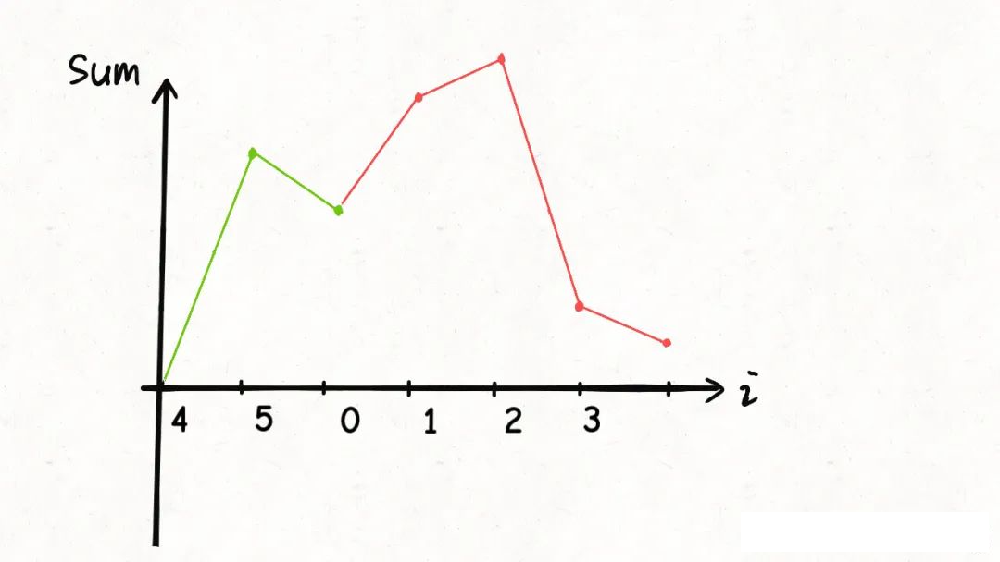

### 贪心算法
**贪心算法**（英语：greedy algorithm）,又称贪婪算法，是一种在每一步选择中都采取在当前状态下最好或最优(即最有利)的选择，从而希望导致结果是最好或最优的算法。比如在 旅行推销员问题中(https://zh.wikipedia.org/wiki/%E6%97%85%E8%A1%8C%E6%8E%A8%E9%94%80%E5%91%98%E9%97%AE%E9%A2%98)，如果旅行员每次都选择最近的城市，那这就是一种贪心算法。

贪心算法在最优子结构的问题中尤为有效。最优子结构的意思是局部最优解能决定全局最优解。简单地说，问题能够分解成子问题来解决，子问题的最优解能递推出最终问题的最优解。

贪心算法与动态规划的同步在于他对每个子问题的解决方案都做出选择，不能回退。动态规划则会爆粗以前的运算结果，并根据以前的结果对当前进行旋转，又回退功能。

贪心算法可以解决一些最优化的问题，比如，求图中的最小生成树，求哈夫曼编码。。。对于其他问题，贪心算法一般不能得到我们所要求的答案。一旦一个问题可以通过贪心法来解决，那么贪心法一般是解决这个问题的最好办法

#### 贪心算法之区间调度问题

##### 问题概述

leetcode 435. 无重叠区间

给定一个区间的集合 intervals ，其中 intervals[i] = [starti, endi] 。返回 需要移除区间的最小数量，使剩余区间互不重叠 。

示例 1:

输入: intervals = [[1,2],[2,3],[3,4],[1,3]]
输出: 1
解释: 移除 [1,3] 后，剩下的区间没有重叠。

这个问题，在生活中应用广泛，比如说您今天有好几个活动，每个活动都可以用区间 `[start, end]` 表示开始和结束时间，请你你今天**最多能参加几个活动那**？显然你一个人不能同时参加两个活动，索引说这个问题就是求**这些时间区间的最大不相交子集**。

言归正传，本题目是要解决一个很精单的贪心算法问题 Interval Scheduling (区间调度问题)，给你很多形如 `[start,end]` 的闭区间，请你设计一个算法，**算出这些区间中最多有几个互不相交的区间**。

```java
int  intervalSchedule(int[]][] intvs);
```

举个栗子，`intvs=[[1,3],[2,4],[3,6]]` ，这些区间最多有 2 个区间互不相交，即 `[1,3], [3,6] `， 你的算法应该返回 2。注意边界相同并不相交。


##### 贪心解法

这道题的思路也很简单，可以分为 3 步：
1、从区间集合 `intvs` 选择一个区间 `x`, 这个`x`是当前所有区间中**结束最早的**(`end` 最小).
2、把所有与 `x` 区间相交的区间从区间集合 `intvs` 中删除
3、重复步骤 1 和 2，直到 `intvs` 为空为止。上一次选出的 x 就是最大不相交子集

把这个思路实现成算法的话，可以按照每个区间的 end 数值升序排序，因为这样处理之后实现步骤 1 和 步骤2 都方便很多，如下图所示：



现在来实现算法，对于步骤 1 ，由于我们是预先按照 end 排了序，所有选择 x 是很容易的。关键在于，如何去除与 x 相交的区间，选择下一轮循环的 x 那？

**由于我们实现进行了排序**，不难发现所有与 x 相交的区间必然会与 x 的 end 相交；如果一个区间不想与 x 的 end 相交，它的 start 必须大于或等于 x 的 end，参考上图，

基于以上思想，代码实现如下：

```java
int intervalScheduleCount(int[][] intervals) {
        // 先按照 end 进行排序
        Arrays.sort(intervals,(a,b)->{
            return a[1]-b[1];
        });
        
        // 至少一个不想交区间
        int xcount =1;
        int xend = intervals[0][1];
        for(int i=1;i<intervals.length;i++) {
            int xstart = intervals[i][0];
            if(xstart>=xend) {
                xcount++;
                // 更新 xend
                xend =  intervals[i][1];
            }
        }
        return xcount;
    }
```

再说说 leetcode 452 题，「用最少的箭头射爆气球」

有一些球形气球贴在一堵用 XY 平面表示的墙面上。墙面上的气球记录在整数数组 points ，其中points[i] = [xstart, xend] 表示水平直径在 xstart 和 xend之间的气球。你不知道气球的确切 y 坐标。

一支弓箭可以沿着 x 轴从不同点 完全垂直 地射出。在坐标 x 处射出一支箭，若有一个气球的直径的开始和结束坐标为 xstart，xend， 且满足  xstart ≤ x ≤ xend，则该气球会被 引爆 。可以射出的弓箭的数量 没有限制 。 弓箭一旦被射出之后，可以无限地前进（在坐标上是从下到上，在二维数组矩阵中是从上到下直到底）。

给你一个数组 points ，返回引爆所有气球所必须射出的 最小 弓箭数 。

示例 1：

输入：points = [[10,16],[2,8],[1,6],[7,12]]
输出：2
解释：气球可以用2支箭来爆破:
-在x = 6处射出箭，击破气球[2,8]和[1,6]。
-在x = 11处发射箭，击破气球[10,16]和[7,12]。

其实稍微思考一下，这个问题和区间调度算法一模一样！如果最多有 `n` 个不重叠的区间，那么就至少需要 `n` 个箭头穿透所有区间


只有一个点不一样，在 `intervalSchedule` 算法中，如果两个区间的边界触碰，不算重叠；而按照这个题目的描述，箭头如果碰到气球的编辑气球也会爆炸，所以说相当于区间的边界碰触也算重叠：


所以只需要将之前的算法稍微修改，就是这个题目的答案：

```java
int intervalScheduleCount(int[][] intervals) {
        // 先按照 end 进行排序
        Arrays.sort(intervals,(a,b)->{
            return a[1]-b[1];
        });
        
        // 至少一个不想交区间
        int xcount =1;
        int xend = intervals[0][1];
        for(int i=1;i<intervals.length;i++) {
            int xstart = intervals[i][0];
            // 必须大于，才算一个新的区间，因此这里的 >= 改为 >
            if(xstart>xend) {
                xcount++;
                xend =  intervals[i][1];
            }
        }
        return xcount;
    }
```

#### 134. 加油站

在一条环路上有 n 个加油站，其中第 i 个加油站有汽油 gas[i] 升。

你有一辆油箱容量无限的的汽车，从第 i 个加油站开往第 i+1 个加油站需要消耗汽油 cost[i] 升。你从其中的一个加油站出发，开始时油箱为空。

给定两个整数数组 gas 和 cost ，如果你可以按顺序绕环路行驶一周，则返回出发时加油站的编号，否则返回 -1 。如果存在解，则 保证 它是 唯一 的。

示例 1:

输入: gas = [1,2,3,4,5], cost = [3,4,5,1,2]
输出: 3
解释:
从 3 号加油站(索引为 3 处)出发，可获得 4 升汽油。此时油箱有 = 0 + 4 = 4 升汽油
开往 4 号加油站，此时油箱有 4 - 1 + 5 = 8 升汽油
开往 0 号加油站，此时油箱有 8 - 2 + 1 = 7 升汽油
开往 1 号加油站，此时油箱有 7 - 3 + 2 = 6 升汽油
开往 2 号加油站，此时油箱有 6 - 4 + 3 = 5 升汽油
开往 3 号加油站，你需要消耗 5 升汽油，正好足够你返回到 3 号加油站。
因此，3 可为起始索引

题目不难理解，就是每到一个加油站 i，你可以加 gas[i] 升的油，但离开站点i 到下一个 i+1 站点，则需要消耗 cost[i] 升油，问你从那个站点出发，可以兜一圈回来。

要说暴力解法，肯定很容易想到，用一个 for 循环遍历所有站点，假设为 i 为起点，然后再套一层 for 循环，判断一下是否能够转一圈回到 i 起点。

```java
int n = gas.length;
for (int start = 0; start < n; start++) {
    for (int step = 0; step < n; step++) {
        int i = (start + step) % n;
        tank += gas[i];
        tank -= cost[i];
        // 判断油箱中的油是否耗尽
    }
}
```

很明显，时间复杂度是 O(N^2), 这么简单粗暴的解法一定不是最优的，我们视图分析一下是否有优化的余地。

暴力解法是否有重复计算的部分？我们是否可以抽象出「状态」，是否对同一个「状态」重复计算了多次？

通过观察，我们发现，变化的量有两个，分别是「起点」和「当前的邮箱的油量」，但这两个状态的组合下去肯定有不下O(N^2) 中，显然没有什么优化空间
（想象你下，你在二环开车，你分别从每个加油站作为起点出发）

**所以我们不能通过简单的剪枝来优化暴力解法的效率，而是需要发现一些隐藏较深的规律，从而减少一些冗余的计算**

下面我们介绍两种巧妙的方法来解这道题，分别是数学图像解法和贪心解法。

##### 图像解法

汽车进入站点 i 可以加 `gas[i]` 的油，离开站点会损耗 `cost[i]` 的油，那么可以把站点和其相连的路看做是一个整体，将 `gas[i]-cost[i]` 作为经过站点 `i` 的油量变化值：



这样，题目描述的场景就被抽象成一个唤醒数组，数组中的第 i 个元素就是 `gas[i]-cost[i]`。

**有了这个环形数组，我们需要判断这个环形数组组中是否能够找到一个起点 start, 使得这个起点开始的累加和一直大于等于 0。**

如果判断是否存在这样一个起点 `start` ? 又如何计算这个起点 start 的值那？

我们不妨把 0 作为起点，计算累加和的代码非常简单

```java
int n = gas.length, sum = 0;
for (int i = 0; i < n; i++) {
    // 计算累加和
    sum += gas[i] - cost[i];
}
```
sum 就相当于邮箱中油量的变化，上述代码中 sum 的变化过程可能是这样的：



显然，上图将 0 作为起点肯定是不行的，因为 sum 在变化的过程中小于 0 了，不符合我们「累加和一直大于等于 0」 的要求

如果 0 不能作为起点，那谁可以作为起点？

看图说话，图像最低点最有可能作为起点：



**如果把这个「最低点」作为起点，也就是说将这个点作为坐标轴的原点，就相当于把图像「最大限度」向上平移了**。

再加上这个数组是环形数组，最低点左侧的图像可以接到图像的最右侧：



这样，整个图像就保持在 x 轴上，所以这个最低点 4，就是我们要找的起点。

不过，经过平移后图像一定全部在 x 轴上吗？不一定，因为还有无解的情况：

**如果 `sum(gas[....]) < sum(cost[...])`**, 总油量小于总的消耗，那肯定是没办法患有所有站点的。

综上，我们可以写出代码：

```java
public int canCompleteCircuit(int[] gas, int[] cost) {
        int sum = 0, minSum = 0;
        int start = 0, n = gas.length;
        for (int i = 0; i < n; i++) {
            sum += gas[i] - cost[i];
            if (sum < minSum) {
                // 记录最小值
                minSum = sum;
                // 经过第 i 个站点后，使 sum 到达新低，
                // 所以 站点 i+1 就是最低点，因为 i 站点是最小点， 处于下降趋势中，会导致如果你在 i 点出发，加油 < 消耗(i->i+1)，
                // 最终导致无法到达 i+1 点
                start = i + 1;
            }
        }
        if (sum < 0) { // 表明加的总油量 < 消耗的总油量，无法兜一圈
            return -1;
        }
        return start == n ? 0 : start;
    }
```

以上是观察图像得出的解法，时间复杂度为 O(N), 比暴力解法效率高很多。

下面我们介绍一种使用贪心思路写出的算法，和上面这个解法比较相似，不过分析过程不尽相同

##### 贪心解法

用贪心思路解决这道题的关键在于一下这个结论：

**如果选择站点 `i` 作为起点「恰好」无法走到站点 `j`, 那么 `i` 和 `j` 中间的任意站点 `k` 都不能作为起点。**(ps: 贪心在我看来就是连坐，省扫一大片)。

比如说，如果从站点 1 触发，走到站点 5 的时候油箱中的油量「恰好」减到了负数，那么说明站点1「恰好」无法到达站点 5； 那么你从站点 2,3,4 任意一个站点出发都无法到达 5 ，因为到达站点 5 时的邮箱的容量也必然被减到负数。

如果证明这个结论？

假设 `oil` 记录当前邮箱中的油量，如果从站点 `i` 触发(oil=0), 走到 j 时恰好出现 oil < 0 的情况，那就说明 i,j 之间的任意站点 k 都满足tank >0 ，对吧。

也就是说，从 i 触发走到 k 好歹 tank >0, 都无法到达 j，现在如果让你从 k 出发(tank=0), 那更不可能走到 j 了吧

**综上，这个结论被证明了**

所以结论就是如果我发现从 i 触发无法走到 j，那么 i 以及 i,j 之间的所有站点都不可能作为起点。

看到冗余计算了吗？看到优化的点了吗？

**这就是贪心思路的本质，如果找不到重复计算，那就通过问题中的一些隐藏较深的规律，来减少冗余计算**。

根据这个结论， 代码贪心版如下：

```java
public int canCompleteCircuit2(int[] gas, int[] cost) {
        int sum = 0;
        int n = gas.length;
        for (int i = 0; i < n; i++) {
            sum += gas[i] - cost[i];
        }
        if (sum < 0) { // 总加油数量小于总消耗数量，无解的
            return -1;
        }
        int start = 0;
        // 记录油量
        int oil = 0;
        for (int i = 0; i < n; i++) {
            oil += gas[i] - cost[i];
            if (oil < 0) {
                start = i + 1;
                // 将 sum 重置为0，表示 从 start 开始出发
                oil = 0;
            }
        }
        return start == n ? 0 : start;
    }
```

这个解法的时间复杂度也是 O(N), 和之前的图像法的解题思路所有区别，但代码非常类似。

**其实，我们可以把这两个解法的思路结合图像来思考，可以发现他们本质上是一样的，只是理解方式不同而已。**

对于贪心算法，没有特别套路话的思维框架，主要还是依靠多做题多思考，将题目的场景进行抽象的联想，找出隐藏其中的规律，从而减少计算量，进行效率优化。