# 贪心算法
**贪心算法**（英语：greedy algorithm）,又称贪婪算法，是一种在每一步选择中都采取在当前状态下最好或最优(即最有利)的选择，从而希望导致结果是最好或最优的算法。比如在 旅行推销员问题中(https://zh.wikipedia.org/wiki/%E6%97%85%E8%A1%8C%E6%8E%A8%E9%94%80%E5%91%98%E9%97%AE%E9%A2%98)，如果旅行员每次都选择最近的城市，那这就是一种贪心算法。

贪心算法在最优子结构的问题中尤为有效。最优子结构的意思是局部最优解能决定全局最优解。简单地说，问题能够分解成子问题来解决，子问题的最优解能递推出最终问题的最优解。

贪心算法与动态规划的不同在于他对每个子问题的解决方案都做出选择，不能回退。动态规划则会保存以前的运算结果，并根据以前的结果对当前进行旋转，有回退功能。

贪心算法可以解决一些最优化的问题，比如，求图中的最小生成树，求哈夫曼编码。。。对于其他问题，贪心算法一般不能得到我们所要求的答案。一旦一个问题可以通过贪心法来解决，那么贪心法一般是解决这个问题的最好办法

比如说一个算法问题使用暴力解法需要指数级时间，如果能使用动态规划消除重叠子问题，就可以降到多项式级别的时间，如果满足贪心选择性质，那么可以进一步降低时间复杂度，达到线性级别的。

什么是贪心选择性质呢，简单说就是：每一步都做出一个局部最优的选择，最终的结果就是全局最优。注意哦，这是一种特殊性质，其实只有一部分问题拥有这个性质。

比如你面前放着 100 张人民币，你只能拿十张，怎么才能拿最多的面额？显然每次选择剩下钞票中面值最大的一张，最后你的选择一定是最优的。

然而，大部分问题明显不具有贪心选择性质。比如打斗地主，对手出对儿三，按照贪心策略，你应该出尽可能小的牌刚好压制住对方，但现实情况我们甚至可能会出王炸。这种情况就不能用贪心算法，而得使用动态规划解决

## 贪心算法之区间调度问题

### 问题概述

leetcode 435. 无重叠区间

给定一个区间的集合 intervals ，其中 intervals[i] = [starti, endi] 。返回 需要移除区间的最小数量，使剩余区间互不重叠 。

示例 1:

输入: intervals = [ [1,2],[2,3],[3,4],[1,3] ]
输出: 1
解释: 移除 [1,3] 后，剩下的区间没有重叠。

这个问题，在生活中应用广泛，比如说您今天有好几个活动，每个活动都可以用区间 `[start, end]` 表示开始和结束时间，请你你今天**最多能参加几个活动那**？显然你一个人不能同时参加两个活动，所以说这个问题就是求**这些时间区间的最大不相交子集**。

言归正传，本题目是要解决一个很精单的贪心算法问题 Interval Scheduling (区间调度问题)，给你很多形如 `[start,end]` 的闭区间，请你设计一个算法，**算出这些区间中最多有几个互不相交的区间**。

```java
int  intervalSchedule(int[][] intvs);
```

举个栗子，`intvs=[[1,3],[2,4],[3,6]]` ，这些区间最多有 2 个区间互不相交，即 `[1,3], [3,6] `， 你的算法应该返回 2。注意边界相同并不相交。


### 贪心解法

这个问题有许多看起来不错的贪心思路，却都不能得到正确答案。比如说：

也许我们可以每次选择可选区间中开始最早的那个？但是可能存在某些区间开始很早，但是很长，使得我们错误地错过了一些短的区间。或者我们每次选择可选区间中最短的那个？或者选择出现冲突最少的那个区间？这些方案都能很容易举出反例，不是正确的方案。

这道题的思路也很简单，可以分为 3 步：
1、从区间集合 `intvs` 选择一个区间 `x`, 这个`x`是当前所有区间中**结束最早的**(`end` 最小).
2、把所有与 `x` 区间相交的区间从区间集合 `intvs` 中删除
3、重复步骤 1 和 2，直到 `intvs` 为空为止。上一次选出的 x 就是最大不相交子集

把这个思路实现成算法的话，可以按照每个区间的 end 数值升序排序，因为这样处理之后实现步骤 1 和 步骤2 都方便很多，如下图所示：

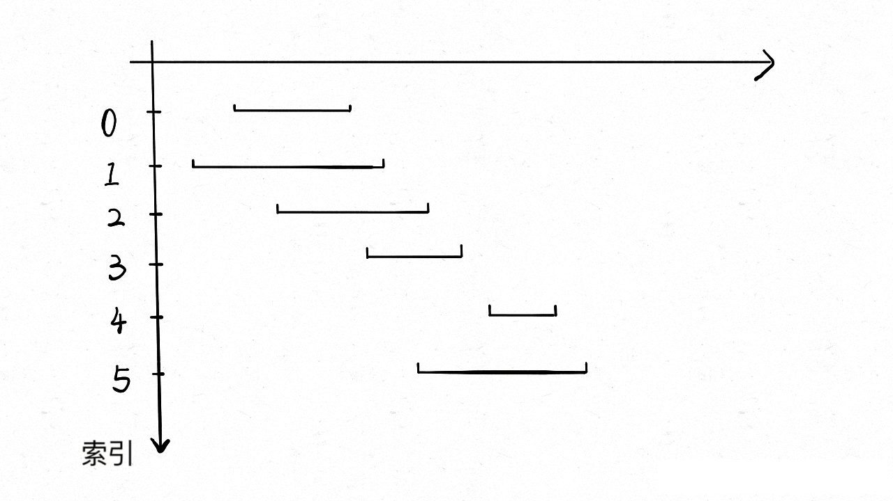

现在来实现算法，对于步骤 1 ，由于我们是预先按照 end 排了序，所有选择 x 是很容易的。关键在于，如何去除与 x 相交的区间，选择下一轮循环的 x 那？

**由于我们的实现进行了排序**，不难发现所有与 x 相交的区间必然会与 x 的 end 相交；如果一个区间不想与 x 的 end 相交，它的 start 必须大于或等于 x 的 end，参考上图，

基于以上思想，代码实现如下：

```java
int intervalScheduleCount(int[][] intervals) {
        // 先按照 end 进行排序
        Arrays.sort(intervals,(a,b)->{
            return a[1]-b[1];
        });
        
        // 至少一个不相交区间
        int xcount =1;
        int xend = intervals[0][1];
        for(int i=1;i<intervals.length;i++) {
            int xstart = intervals[i][0];
            if(xstart>=xend) {
                xcount++;
                // 更新 xend
                xend =  intervals[i][1];
            }
        }
        return xcount;
    }
```
### 应用举例

下面再举例几道具体的题目应用一下区间调度算法。

首先是力扣第 435 题「无重叠区间」问题：

输入一个区间的集合，请你计算，要想使其中的区间都互不重叠，至少需要移除几个区间？函数签名如下：

```java
int eraseOverlapIntervals(int[][] intvs);
```

其中，可以假设输入的区间的终点总是大于起点，另外边界相等的区间只算接触，但并不算相互重叠。

比如说输入是 `intvs = [[1,2],[2,3],[3,4],[1,3]]`，算法返回 1，因为只要移除 [1,3] 后，剩下的区间就没有重叠了。

我们已经会求最多有几个区间不会重叠了，那么剩下的不就是至少需要去除的区间吗？

```java
int eraseOverlapIntervals(int[][] intervals) {
    int n = intervals.length;
    return n - intervalSchedule(intervals);
}
```

再说说 leetcode 452 题，「用最少的箭头射爆气球」

有一些球形气球贴在一堵用 XY 平面表示的墙面上。墙面上的气球记录在整数数组 points ，其中points[i] = [xstart, xend] 表示水平直径在 xstart 和 xend之间的气球。你不知道气球的确切 y 坐标。

一支弓箭可以沿着 x 轴从不同点 完全垂直 地射出。在坐标 x 处射出一支箭，若有一个气球的直径的开始和结束坐标为 xstart，xend， 且满足  xstart ≤ x ≤ xend，则该气球会被 引爆 。可以射出的弓箭的数量 没有限制 。 弓箭一旦被射出之后，可以无限地前进（在坐标上是从下到上，在二维数组矩阵中是从上到下直到底）。

给你一个数组 points ，返回引爆所有气球所必须射出的 最小 弓箭数 。

示例 1：

输入：points = [ [10,16],[2,8],[1,6],[7,12] ]
输出：2
解释：气球可以用2支箭来爆破:
-在x = 6处射出箭，击破气球[2,8]和[1,6]。
-在x = 11处发射箭，击破气球[10,16]和[7,12]。

其实稍微思考一下，这个问题和区间调度算法一模一样！如果最多有 `n` 个不重叠的区间，那么就至少需要 `n` 个箭头穿透所有区间

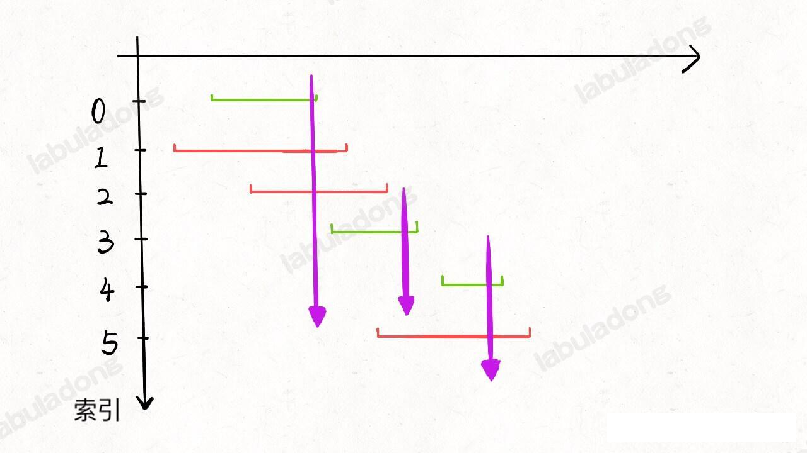

只有一个点不一样，在 `intervalSchedule` 算法中，如果两个区间的边界触碰，不算重叠；而按照这个题目的描述，箭头如果碰到气球的边界气球也会爆炸，所以说相当于区间的边界碰触也算重叠：

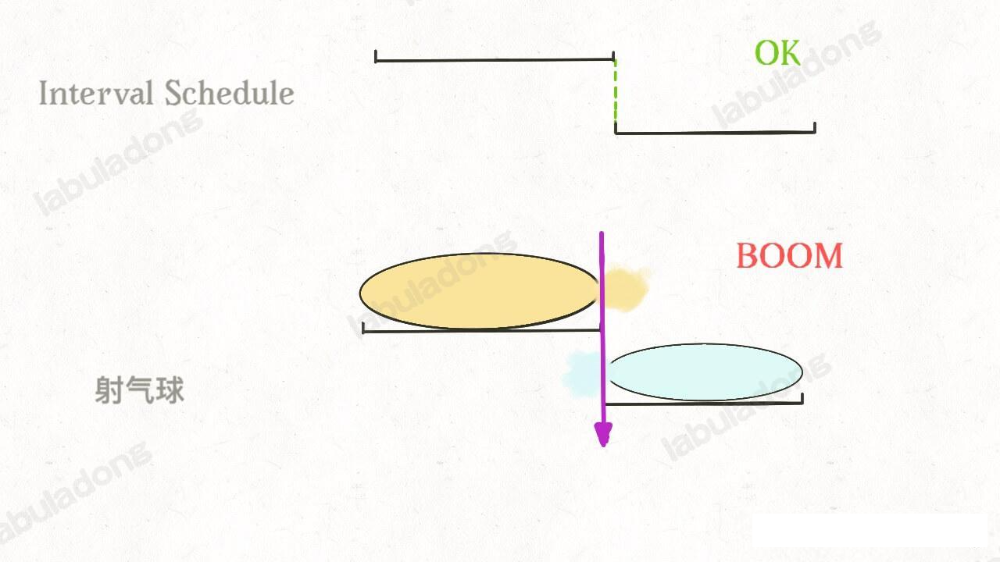

所以只需要将之前的算法稍微修改，就是这个题目的答案：

```java
int intervalScheduleCount(int[][] intervals) {
        // 先按照 end 进行排序
        Arrays.sort(intervals,(a,b)->{
            return a[1]-b[1];
        });
        
        // 至少一个不相交区间。不想交的区间数就是射箭的个数
        int xcount =1;
        int xend = intervals[0][1];
        for(int i=1;i<intervals.length;i++) {
            int xstart = intervals[i][0];
            // 必须大于，才算一个新的区间，因此这里的 >= 改为 >
            if(xstart>xend) {
                xcount++;
                xend =  intervals[i][1];
            }
        }
        return xcount;
    }
```

## 剪视频剪出一个贪心算法

leetcode 1024. Video Stitching

前面发过几个视频，也算是对视频剪辑入了个门。像我这种非专业剪辑玩家，不做什么宏大特效电影镜头，只是做个视频教程，其实也没啥难度，只需要把视频剪流畅，所以用到最多的功能就是切割功能，然后删除和拼接视频片接。

没有剪过视频的读者可能不知道，在常用的剪辑软件中视频被切割成若干片段之后，每个片段都可以还原成原始视频。

就比如一个 10 秒的视频，在中间切一刀剪成两个 5 秒的视频，这两个五秒的视频各自都可以还原成 10 秒的原视频。就好像蚯蚓，把自己切成 4 段就能搓麻，把自己切成 11 段就可以凑一个足球队。


```text
1024. 视频拼接 | 力扣  | LeetCode  |
你将会获得一系列视频片段，这些片段来自于一项持续时长为 time 秒的体育赛事。这些片段可能有所重叠，也可能长度不一。

使用数组 clips 描述所有的视频片段，其中 clips[i] = [starti, endi] 表示：某个视频片段开始于 starti 并于 endi 结束。

甚至可以对这些片段自由地再剪辑：

例如，片段 [0, 7] 可以剪切成 [0, 1] + [1, 3] + [3, 7] 三部分。
我们需要将这些片段进行再剪辑，并将剪辑后的内容拼接成覆盖整个运动过程的片段（[0, time]）。返回所需片段的最小数目，如果无法完成该任务，则返回 -1 。

示例 1：

输入：clips = [[0,2],[4,6],[8,10],[1,9],[1,5],[5,9]], time = 10
输出：3
解释：
选中 [0,2], [8,10], [1,9] 这三个片段。
然后，按下面的方案重制比赛片段：
将 [1,9] 再剪辑为 [1,2] + [2,8] + [8,9] 。
现在手上的片段为 [0,2] + [2,8] + [8,10]，而这些覆盖了整场比赛 [0, 10]。
示例 2：

输入：clips = [[0,1],[1,2]], time = 5
输出：-1
解释：
无法只用 [0,1] 和 [1,2] 覆盖 [0,5] 的整个过程。
示例 3：

输入：clips = [[0,1],[6,8],[0,2],[5,6],[0,4],[0,3],[6,7],[1,3],[4,7],[1,4],[2,5],[2,6],[3,4],[4,5],[5,7],[6,9]], time = 9
输出：3
解释： 
选取片段 [0,4], [4,7] 和 [6,9] 。
提示：

1 <= clips.length <= 100
0 <= starti <= endi <= 100
1 <= time <= 100
```

剪视频时，每个视频片段都可以抽象成了一个个区间，时间就是区间的端点，这些区间有的相交，有的不相交……

假设剪辑软件不支持将视频片段还原成原视频，那么如果给我若干视频片段，我怎么将它们还原成原视频呢？


函数签名如下：
```java
int videoStitching(int[][] clips, int T);
```


区间问题合集 写过求区间交集、区间并集、区间覆盖这几个问题。

上面的 《贪心算法之区间调度问题》 讲过利用贪心算法求不相交的区间。

算上本文的区间剪辑问题，经典的区间问题也就都讲完了。

### 思路分析

题目并不难理解，给定一个目标区间和若干小区间，如何通过裁剪和组合小区间拼凑出目标区间？最少需要几个小区间？

**前文多次说过，区间问题肯定按照区间的起点或者终点进行排序**。

因为排序之后更容易找到相邻区间之间的联系，如果是求最值的问题，可以使用贪心算法进行求解。

区间问题特别容易用贪心算法，下一篇的
贪心算法玩跳跃游戏，其实这个跳跃游戏就相当于一个将起点排序的区间问题，你细品，你细品。

至于到底如何排序，这个就要因题而异了，我做这道题的思路是先按照起点升序排序，如果起点相同的话按照终点降序排序。

为什么这样排序呢，主要考虑到这道题的以下两个特点：

1、要用若干短视频凑出完成视频 `[0, T]`，至少得有一个短视频的起点是 0。

这个很好理解，如果没有一个短视频是从 0 开始的，那么区间 `[0, T]` 肯定是凑不出来的。

2、如果有几个短视频的起点都相同，那么一定应该选择那个最长（终点最大）的视频。

这一条就是贪心的策略，因为题目让我们计算最少需要的短视频个数，如果起点相同，那肯定是越长越好，不要白不要，多出来了大不了剪辑掉嘛。

基于以上两个特点，将 `clips` 按照起点升序排序，起点相同的按照终点降序排序，最后得到的区间顺序就像这样：

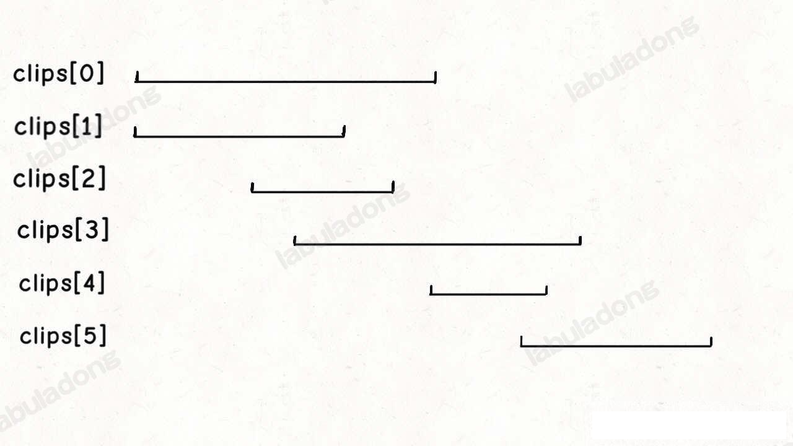

这样我们就可以确定，如果 `clips[0]` 是的起点是 0，那么 `clips[0]` 这个视频一定会被选择。

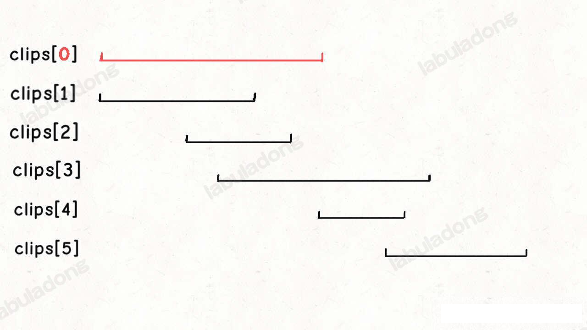

当我们确定 `clips[0]` 一定会被选择之后，就可以选出下一个会被选择的视频：

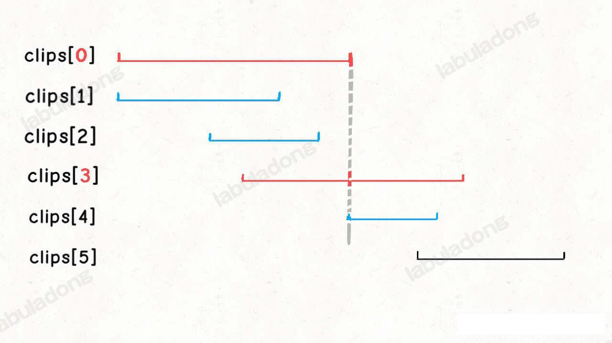


**我们会比较所有起点小于 clips[0][1] 的区间，根据贪心策略，它们中终点最大的那个区间就是第二个会被选中的视频**。

然后可以通过第二个视频区间贪心选择出第三个视频，以此类推，直到覆盖区间 `[0, T]`，或者无法覆盖返回 -1。

以上就是这道题的解题思路，仔细想想，这题的核心和后文 
贪心算法玩跳跃游戏 写的跳跃游戏是相同的，如果你能看出这两者的联系，就可以说理解贪心算法的奥义了。

### 代码实现

实现上述思路需要我们用两个变量 `curEnd` 和 `nextEnd` 来进行，如下 GIF 所示：

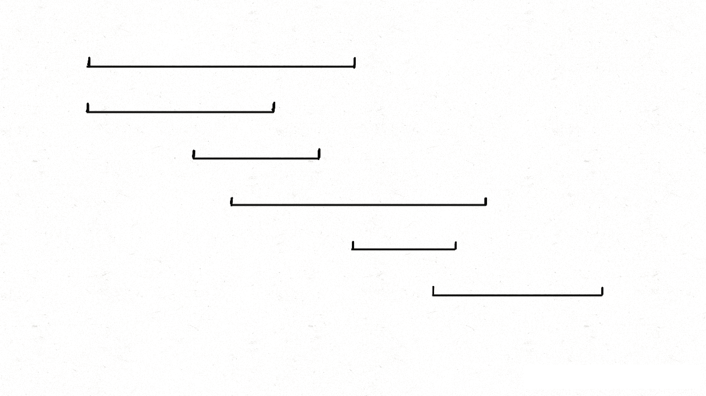

```java
class Solution {
    public int videoStitching(int[][] clips, int T) {
        if (T == 0) return 0;
        // 按起点升序排列，起点相同的降序排列
        Arrays.sort(clips, (a, b) -> {
            if (a[0] == b[0]) {
                return b[1] - a[1];
            }
            return a[0] - b[0];
        });
        // 记录选择的短视频个数
        int res = 0;

        int curEnd = 0, nextEnd = 0;
        int i = 0, n = clips.length;
        while (i < n && clips[i][0] <= curEnd) {
            // 在第 res 个视频的区间内贪心选择下一个视频
            while (i < n && clips[i][0] <= curEnd) {
                nextEnd = Math.max(nextEnd, clips[i][1]);
                i++;
            }
            // 找到下一个视频，更新 curEnd
            res++;
            curEnd = nextEnd;
            if (curEnd >= T) {
                // 已经可以拼出区间 [0, T]
                return res;
            }
        }
        // 无法连续拼出区间 [0, T]
        return -1;
    }
}
```

这段代码的时间复杂度是多少呢？虽然代码中有一个嵌套的 while 循环，但这个嵌套 while 循环的时间复杂度是 `O(N)`。因为当 i 递增到 `n` 时循环就会结束，所以这段代码只会执行 `O(N)` 次。

但是别忘了我们对 clips 数组进行了一次排序，消耗了 `O(NlogN)` 的时间，所以本算法的总时间复杂度是 `O(NlogN)`。


## 如何运用贪心思想玩跳跃游戏

我们可能经常会发问，动态规划和贪心算法到底有啥关系。我们上面的文章 
贪心算法之区间调度问题 就说过一个常见的时间区间调度的贪心算法问题。

说白了，贪心算法可以理解为一种特殊的动态规划问题，拥有一些更特殊的性质，可以进一步降低动态规划算法的时间复杂度。那么这篇文章，就讲 LeetCode 上两道经典的贪心算法：跳跃游戏 I 和跳跃游戏 II。

我们可以对这两道题分别使用动态规划算法和贪心算法进行求解，通过实践，你就能更深刻地理解贪心和动规的区别和联系了。

### Jump Game I
这是力扣第 55 题「跳跃游戏」，难度是中等，但实际上比较简单，看题目：

```text
55. 跳跃游戏 | 力扣  | LeetCode  |

给你一个非负整数数组 nums ，你最初位于数组的 第一个下标 。数组中的每个元素代表你在该位置可以跳跃的最大长度。

判断你是否能够到达最后一个下标，如果可以，返回 true ；否则，返回 false 。

示例 1：

输入：nums = [2,3,1,1,4]
输出：true
解释：可以先跳 1 步，从下标 0 到达下标 1, 然后再从下标 1 跳 3 步到达最后一个下标。
示例 2：

输入：nums = [3,2,1,0,4]
输出：false
解释：无论怎样，总会到达下标为 3 的位置。但该下标的最大跳跃长度是 0 ， 所以永远不可能到达最后一个下标。
提示：

1 <= nums.length <= 104
0 <= nums[i] <= 105

```

不知道大家有没有发现，有关动态规划的问题，大多是让你求最值的，比如最长子序列，最小编辑距离，最长公共子串等等等。这就是规律，因为动态规划本身就是运筹学里的一种求最值的算法。

那么贪心算法作为特殊的动态规划也是一样，也一定是让你求个最值。这道题表面上不是求最值，但是可以改一改：

请问通过题目中的跳跃规则，最多能跳多远？如果能够越过最后一格，返回 true，否则返回 false。

所以说，这道题肯定可以用动态规划求解的。但是由于它比较简单，下一道题再用动态规划和贪心思路进行对比，现在直接上贪心的思路：

```java
boolean canJump(int[] nums) {
    int n = nums.length;
    int farthest = 0;
    for (int i = 0; i < n - 1; i++) {
        // 不断计算能跳到的最远距离
        farthest = Math.max(farthest, i + nums[i]);
        // 可能碰到了 0，卡住跳不动了
        if (farthest <= i) {
            return false;
        }
    }
    return farthest >= n - 1;
}
```

你别说，如果之前没有做过类似的题目，还真不一定能够想出来这个解法(这 TM 的谁能想起来!!!)。每一步都计算一下从当前位置最远能够跳到哪里，然后和一个全局最优的最远位置 farthest 做对比，通过每一步的最优解，更新全局最优解，这就是贪心。

很简单是吧？记住这一题的思路，看第二题，你就发现事情没有这么简单。。。

### Jump Game II

这是力扣第 45 题「跳跃游戏 II」，也是让你在数组上跳，不过难度是 Hard，解法可没上一题那么简单直接：

```text

给定一个长度为 n 的 0 索引整数数组 nums。初始位置为 nums[0]。

每个元素 nums[i] 表示从索引 i 向前跳转的最大长度。换句话说，如果你在 nums[i] 处，你可以跳转到任意 nums[i + j] 处:

0 <= j <= nums[i] 
i + j < n
返回到达 nums[n - 1] 的最小跳跃次数。生成的测试用例可以到达 nums[n - 1]。

示例 1:

输入: nums = [2,3,1,1,4]
输出: 2
解释: 跳到最后一个位置的最小跳跃数是 2。
     从下标为 0 跳到下标为 1 的位置，跳 1 步，然后跳 3 步到达数组的最后一个位置。
示例 2:

输入: nums = [2,3,0,1,4]
输出: 2
提示:

1 <= nums.length <= 104
0 <= nums[i] <= 1000
题目保证可以到达 nums[n-1]
```


**现在的问题是，保证你一定可以跳到最后一格，请问你最少要跳多少次，才能跳过去**。

我们先来说说动态规划的思路，采用自顶向下的递归动态规划，可以这样定义一个 dp 函数：

```java
// 定义：从索引 p 跳到最后一格，至少需要 dp(nums, p) 步
int dp(int[] nums, int p);
```

我们想求的结果就是 `dp(nums, 0)`，base case 就是当 p 超过最后一格时，不需要跳跃：
```java
if (p >= nums.length - 1) {
    return 0;
}
```
根据之前
动态规划套路详解 的动规框架，就可以暴力穷举所有可能的跳法，通过备忘录 memo 消除重叠子问题，取其中的最小值最为最终答案：

```java
class Solution {
    int[] memo;
    // 主函数
    public int jump(int[] nums) {
        int n = nums.length;
        // 备忘录都初始化为 n，相当于 INT_MAX
        // 因为从 0 跳到 n - 1 最多 n - 1 步
        memo = new int[n];
        Arrays.fill(memo, n);

        return dp(nums, 0);
    }

    // 定义：从索引 p 跳到最后一格，至少需要 dp(nums, p) 步
    int dp(int[] nums, int p) {
        int n = nums.length;
        // base case
        if (p >= n - 1) {
            return 0;
        }
        // 子问题已经计算过
        if (memo[p] != n) {
            return memo[p];
        }
        int steps = nums[p];
        // 你可以选择跳 1 步，2 步...
        for (int i = 1; i <= steps; i++) {
            // 穷举每一个选择
            // 计算每一个子问题的结果
            int subProblem = dp(nums, p + i);
            // 取其中最小的作为最终结果
            memo[p] = Math.min(memo[p], subProblem + 1);
        }
        return memo[p];
    }
}
```

这个动态规划应该很明显了，按照前文 
动态规划套路详解 所说的套路，状态就是当前所站立的索引 p，选择就是可以跳出的步数。

该算法的时间复杂度是 递归深度 × 每次递归需要的时间复杂度，即 O(N^2)，在 LeetCode 上是无法通过所有用例的，会超时。

**贪心算法比动态规划多了一个性质：贪心选择性质**。我知道大家都不喜欢看严谨但枯燥的数学形式定义，那么我们就来直观地看一看什么样的问题满足贪心选择性质。

刚才的动态规划思路，不是要穷举所有子问题，然后取其中最小的作为结果吗？核心的代码框架是这样：

```java
int steps = nums[p];
// 你可以选择跳 1 步，2 步...
for (int i = 1; i <= steps; i++) {
    // 计算每一个子问题的结果
    int subProblem = dp(nums, p + i);
    res = min(subProblem + 1, res);
}
```
for 循环中会陷入递归计算子问题，这是动态规划时间复杂度高的根本原因。

但是，真的需要「递归地」计算出每一个子问题的结果，然后求最值吗？**直观地想一想，似乎不需要递归，只需要判断哪一个选择最具有「潜力」即可**：

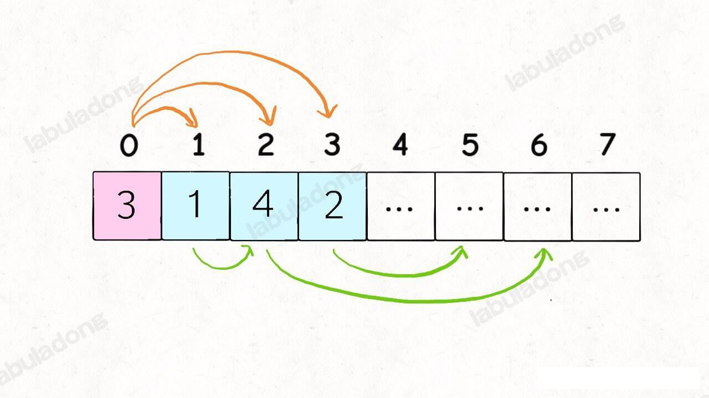

比如上图这种情况，我们站在索引 0 的位置，可以向前跳 1，2 或 3 步，你说应该选择跳多少呢？

**显然应该跳 2 步调到索引 2，因为 nums[2] 的可跳跃区域涵盖了索引区间 [3..6]，比其他的都大**。如果想求最少的跳跃次数，那么往索引 2 跳必然是最优的选择。

你看，**这就是贪心选择性质，我们不需要「递归地」计算出所有选择的具体结果然后比较求最值，而只需要做出那个最有「潜力」，看起来最优的选择即可**。

绕过这个弯儿来，就可以写代码了：

```java
int jump(int[] nums) {
    int n = nums.length;
    int end = 0, farthest = 0;
    int jumps = 0;
    for (int i = 0; i < n - 1; i++) {
        farthest = Math.max(nums[i] + i, farthest);
        if (end == i) {
            jumps++;
            end = farthest;
        }
    }
    return jumps;
}
```

结合刚才那个图，就知道这段短小精悍的代码在干什么了：

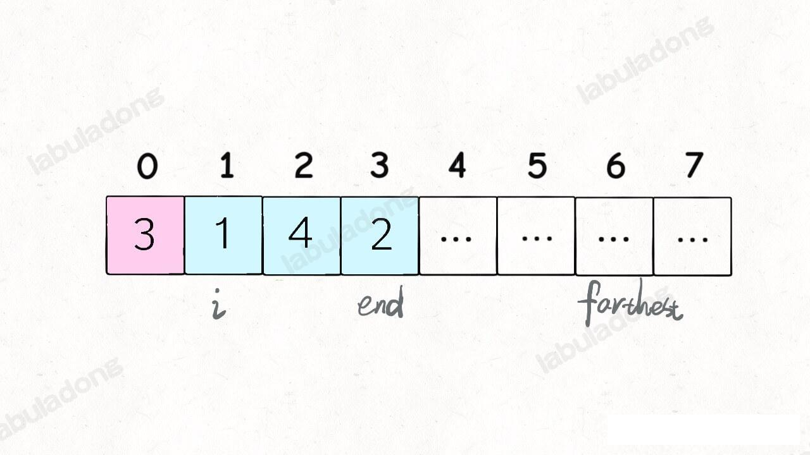

`i` 和 `end` 标记了可以选择的跳跃步数，farthest 标记了所有选择 `[i..end]` 中能够跳到的最远距离，jumps 记录了跳跃次数。

本算法的时间复杂度 O(N)，空间复杂度 O(1)，可以说是非常高效，动态规划都被吊起来打了。

至此，两道跳跃问题都使用贪心算法解决了。

其实对于贪心选择性质，是可以有严格的数学证明的，有兴趣的可以参看《算法导论》第十六章，专门有一个章节介绍贪心算法。这里限于篇幅和通俗性，就不展开了。

使用贪心算法的实际应用还挺多，比如赫夫曼编码也是一个经典的贪心算法应用。更多时候运用贪心算法可能不是求最优解，而是求次优解以节约时间，比如经典的旅行商问题。

不过我们常见的贪心算法题目，就像本文的题目，大多一眼就能看出来，大不了就先用动态规划求解，如果动态规划都超时，说明该问题存在贪心选择性质无疑了。

## 扫描线技巧：安排会议室

之前面试，被问到一道非常经典且非常实用的算法题目：会议室安排问题。

力扣上类似的问题是会员题目，你可能没办法做，但对于这种经典的算法题，掌握思路还是必要的。

先说下题目，力扣第 253 题「会议室 II」：

给你输入若干形如 [begin, end] 的区间，代表若干会议的开始时间和结束时间，请你计算至少需要申请多少间会议室。

函数签名如下：

```java
// 返回需要申请的会议室数量
int minMeetingRooms(int[][] meetings);
```

比如给你输入 `meetings = [[0,30],[5,10],[15,20]]`，算法应该返回 2，因为后两个会议和第一个会议时间是冲突的，至少申请两个会议室才能让所有会议顺利进行。

如果会议之间的时间有重叠，那就得额外申请会议室来开会，想求至少需要多少间会议室，就是让你计算同一时刻最多有多少会议在同时进行。

换句话说，**如果把每个会议的起始时间看做一个线段区间，那么题目就是让你求最多有几个重叠区间**，仅此而已。

我们之前也学习过区间相关的算法，如果我们对 
差分数组技巧 有印象，应该首先能想到用那个技巧来解决这个题。

这道题相当于是说，给你一个原本全是 0 的数组，然后给你若干区间，让你对每个区间中的元素都加 1，问你最后整个数组中的最大值是多少。这就是经典的差分数组实用场景对吧，直接套用之前的 `Difference` 类就可以解决这个问题了。

但是差分数组技巧有一个问题，就是你必须把那个全是 0 的初始数组构造出来。由于我们用数组的索引表示时间，所以这个数组的长度取决于时间区间的最大值(只有先理解了这段话，才能知道差分数组怎么使用，只看上面一段话，会懵逼)。

比如输入 `meetings = [[0,30],[5,10],[15,20]]`，那么你得构造一个长度为 30 的数组。那如果输入 meetings = [ [0,30],[5,10],[10^8,10^9] ]，这样的话你就得构造一个长度为 10^9 的数组，这显然是有问题的。不过这道题给的数据规模是时间的取值最多为 10^6，不算是特别大，用差分数组的方法应该可以通过。

但本文再教你另外的一个处理区间的技巧，不用构造这么大的数组，也能巧妙解决这个问题。

### 题目延伸

我们之前写过很多区间调度相关的文章，这里就顺便帮大家梳理一下这类问题的思路：

**第一个场景**，假设现在只有一个会议室，还有若干会议，你如何将尽可能多的会议安排到这个会议室里？

这个问题需要将这些会议（区间）按结束时间（右端点）排序，然后进行处理。

**第二个场景**，给你若干较短的视频片段，和一个较长的视频片段，请你从较短的片段中尽可能少地挑出一些片段，拼接出较长的这个片段。

这个问题需要将这些视频片段（区间）按开始时间（左端点）排序，然后进行处理，详见上文 剪视频剪出一个贪心算法。

**第三个场景**，给你若干区间，其中可能有些区间比较短，被其他区间完全覆盖住了，请你删除这些被覆盖的区间。

这个问题需要将这些区间按左端点排序，然后就能找到并删除那些被完全覆盖的区间了，详见上文 删除覆盖区间。

**第四个场景**，给你若干区间，请你将所有有重叠部分的区间进行合并。

这个问题需要将这些区间按左端点排序，方便找出存在重叠的区间，详见上文 合并重叠区间。

**第五个场景**，有两个部门同时预约了同一个会议室的若干时间段，请你计算会议室的冲突时段。

这个问题就是给你两组区间列表，请你找出这两组区间的交集，这需要你将这些区间按左端点排序，详见后文 区间交集问题。

**第六个场景**，假设现在只有一个会议室，还有若干会议，如何安排会议才能使这个会议室的闲置时间最少？

这个问题需要动动脑筋，说白了这就是个 0-1 背包问题的变形：

会议室可以看做一个背包，每个会议可以看做一个物品，物品的价值就是会议的时长，请问你如何选择物品（会议）才能最大化背包中的价值（会议室的使用时长）？

当然，这里背包的约束不是一个最大重量，而是各个物品（会议）不能互相冲突。把各个会议按照结束时间进行排序，然后参考前文 
0-1 背包问题详解 的思路和 TreeMap 即可解决。

力扣第 1235 题「规划兼职工作」就是类似的题目。

**第七个场景**，就是本文想讲的场景，给你若干会议，让你最小化申请会议室的数量。

好了，举例了这么多，来看看今天的这个问题如何解决。


### 题目分析

重复一下题目的本质：

**给你输入若干时间区间，让你计算同一时刻「最多」有几个区间重叠**。

题目的关键点在于，给你任意一个时刻，你是否能够说出这个时刻有几个会议？

如果可以做到，那我遍历所有的时刻，找个最大值，就是需要申请的会议室数量。

有没有一种数据结构或者算法，给我输入若干区间，我能知道每个位置有多少个区间重叠？

老读者肯定可以联想到之前说过的一个算法技巧：
差分数组技巧。

把时间线想象成一个初始值为 0 的数组，每个时间区间 `[i, j]` 就相当于一个子数组，这个时间区间有一个会议，那我就把这个子数组中的元素都加一。

最后，每个时刻有几个会议我不就知道了吗？我遍历整个数组，不就知道至少需要几间会议室了吗？

举例来说，如果输入 meetings = `[[0,30],[5,10],[15,20]]`，那么我们就给数组中 `[0,30],[5,10],[15,20]` 这几个索引区间分别加一，最后遍历数组，求个最大值就行了。

还记得吗，差分数组技巧可以在 O(1) 时间对整个区间的元素进行加减，所以可以拿来解决这道题。

不过，这个解法的效率不算高，所以我们这里不准备具体写差分数组的解法，有兴趣的话，可以自己尝试去实现。

**基于差分数组的思路，我们可以推导出一种更高效，更优雅的解法**。

我们首先把这些会议的时间区间进行投影：

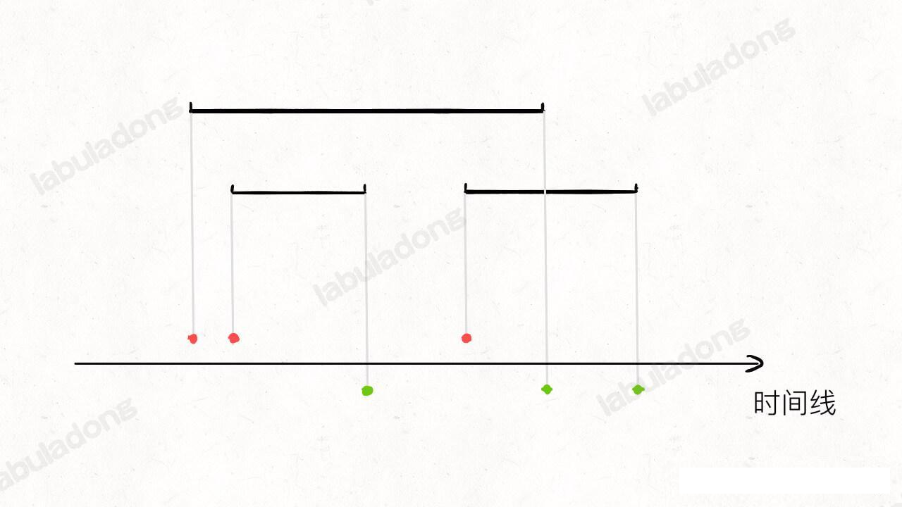

红色的点代表每个会议的开始时间点，绿色的点代表每个会议的结束时间点。

现在假想有一条带着计数器的线，在时间线上从左至右进行扫描，每遇到红色的点，计数器 `count` 加一，每遇到绿色的点，计数器 `count` 减一：

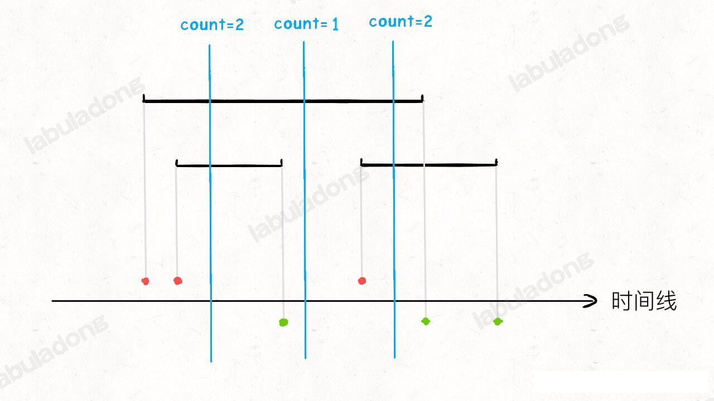

**这样一来，每个时刻有多少个会议在同时进行，就是计数器 count 的值，count 的最大值，就是需要申请的会议室数量**。

对差分数组技巧熟悉的读者一眼就能看出来了，这个扫描线其实就是差分数组的遍历过程，所以我们说这是差分数组技巧衍生出来的解法。

### 代码实现

那么，如何写代码实现这个扫描的过程呢？

首先，对区间进行投影，就相当于对每个区间的起点和终点分别进行排序：

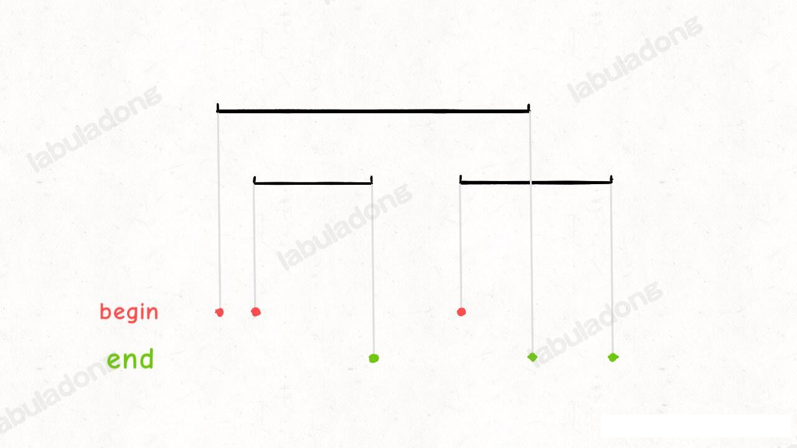

```java
int minMeetingRooms(int[][] meetings) {
    int n = meetings.length;
    int[] begin = new int[n];
    int[] end = new int[n];
    // 把左端点和右端点单独拿出来
    for(int i = 0; i < n; i++) {
        begin[i] = meetings[i][0];
        end[i] = meetings[i][1];
    }
    // 排序后就是图中的红点
    Arrays.sort(begin);
    // 排序后就是图中的绿点
    Arrays.sort(end);

    // ...
}
```

然后就简单了，扫描线从左向右前进，遇到红点就对计数器加一，遇到绿点就对计数器减一，计数器 `count` 的最大值就是答案：

```java
class Solution {
    int minMeetingRooms(int[][] meetings) {
        int n = meetings.length;
        int[] begin = new int[n];
        int[] end = new int[n];
        for(int i = 0; i < n; i++) {
            begin[i] = meetings[i][0];
            end[i] = meetings[i][1];
        }
        Arrays.sort(begin);
        Arrays.sort(end);

        // 扫描过程中的计数器
        int count = 0;
        // 双指针技巧
        int res = 0, i = 0, j = 0;
        while (i < n && j < n) {

            if (begin[i] < end[j]) {
                // 扫描到一个红点
                count++;
                i++;
            } else {
                // 扫描到一个绿点
                count--;
                j++;
            }
            // 记录扫描过程中的最大值
            res = Math.max(res, count);
        }
        
        return res;
    }
}
```

这里使用的是 双指针技巧，根据 `i, j` 的相对位置模拟扫描线前进的过程。

至此，这道题就做完了。当然，这个题目也可以变形，比如给你若干会议，问你 k 个会议室够不够用，其实你套用本文的解法代码，也可以很轻松解决。
