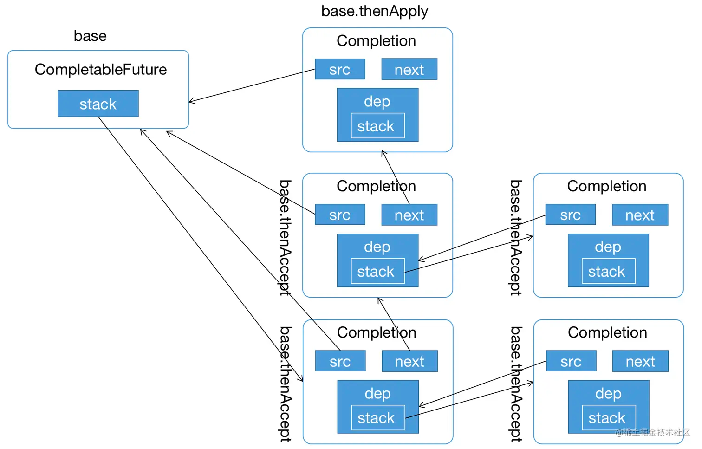
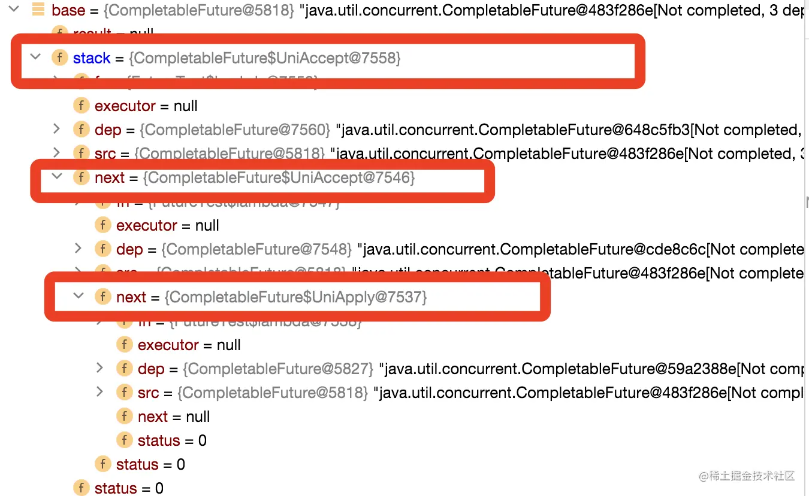

# CompletableFuture 
暂时先放到这里

## 示例代码
首先看下示例 3 的输入，基本上是按照 4-3-2-1 的顺序输出，说明 CompletableFuture 整体上是一个栈的结构，接下来我们就图解下这个过程

```java
private static void testCompletableFuture3() throws Exception {
    CompletableFuture<String> base = new CompletableFuture<>();
    CompletableFuture<String> future = base.thenApply(s -> {
      log.info(s);
      return s + " 2";
    });

    base.thenAccept(s -> log.info(s + "3-1")).thenAccept(Void -> log.info("3-2"));
    base.thenAccept(s -> log.info(s + "4-1")).thenAccept(Void -> log.info("4-2"));

    base.complete("1");
    log.info("base result : {}", base.get());
    log.info("future result:{} ", future.get());
  }
```
打印结果如下：

```text
20:52:08,147 INFO  org.swj.leet_code.binary_tree.bst.ForkJoinPoolSort            - 14-1
20:52:08,149 INFO  org.swj.leet_code.binary_tree.bst.ForkJoinPoolSort            - 4-2
20:52:08,149 INFO  org.swj.leet_code.binary_tree.bst.ForkJoinPoolSort            - 13-1
20:52:08,149 INFO  org.swj.leet_code.binary_tree.bst.ForkJoinPoolSort            - 3-2
20:52:08,149 INFO  org.swj.leet_code.binary_tree.bst.ForkJoinPoolSort            - 1
20:52:08,151 INFO  org.swj.leet_code.binary_tree.bst.ForkJoinPoolSort            - base result : 1
20:52:08,151 INFO  org.swj.leet_code.binary_tree.bst.ForkJoinPoolSort            - future result:1 2 
```

最终的结构如下所示：



(PS:上图画的有点问题，根据栈的特点 thenApply 这个 Completion/UniApply 应该是位于栈底，对应的  4-1 这个 thenAccept 的 UniAccept 是位于栈顶的，3 个 Completion 是通过 next 指针链表链起来)。

从代码的调试图也可以看出来，如下所示：





## 部分源码解读

```java
public boolean complete(T value) {
        boolean triggered = completeValue(value);
        postComplete();
        return triggered;
    }

final void postComplete() {
        /*
         * On each step, variable f holds current dependents to pop
         * and run.  It is extended along only one path at a time,
         * pushing others to avoid unbounded recursion.
         */
        //1. this 表示当前的 CompletableFuture 对象，也就是我们的 base
        CompletableFuture<?> f = this; Completion h;
        //2. 判断 stack 是否为空，或者如果 f 的栈为空但是 f 已经指向别的对象了
        while ((h = f.stack) != null ||
               (f != this && (h = (f = this).stack) != null)) {
            CompletableFuture<?> d; Completion t;
            // CAS 弹出栈顶元素
            if (f.casStack(h, t = h.next)) {
                if (t != null) { //出栈的 h 不是最后一个元素，如果是最后一个元素则直接执行 7 即可
                    if (f != this) { 
                        // 如果 f 不指向当前元素，则将刚出栈的h，压入当前元素的栈顶。
                        // 这个地方可能我刚开始读也有迷惑
                        pushStack(h);
                        continue;
                    }
                    h.next = null;    // detach
                }
                // 这里重置 f 指针，就可能导致 f 指针跟 this 不再指向同一个元素，
                // 从上图中我们可以看到 栈是嵌套结构
                f = (d = h.tryFire(NESTED)) == null ? this : d;
            }
        }
    }
```

## 参考文章

https://juejin.cn/post/7079695401619554312
https://zhuanlan.zhihu.com/p/165030484
