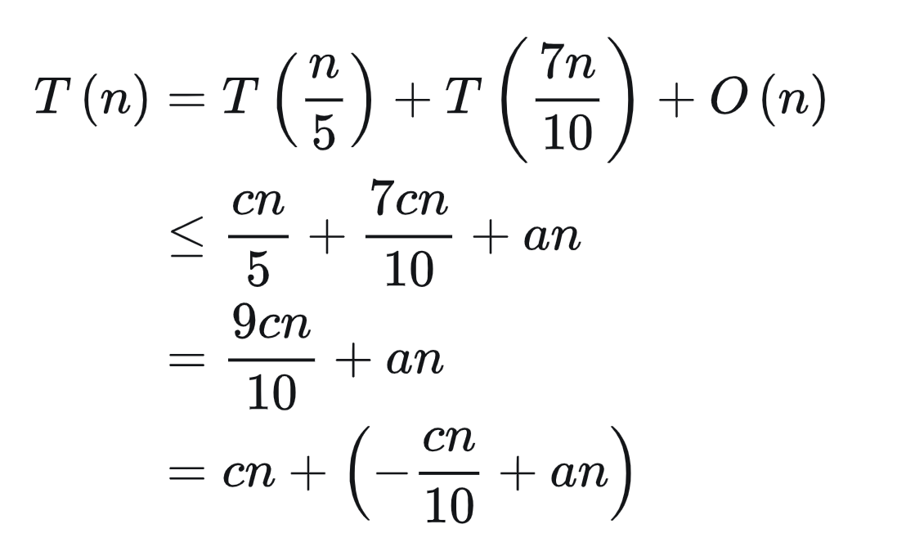

## 快速排序

### 三项快速排序

3 项快速排序法的基本思想，用 i,j,k 三个指针将数组切分成 4 部分，a[start,i-1] 表示小于 pivot1 的部分，a[i,k-1] 表示等于 pivot 的部分
a[j+1,end] 表示大于 pivot 的部分，而a[k,j] 表示未判定的元素(即不知道比 pivot 大还是比它小)。我们要注意 a[i] 始终位于等于 pivot 的部分
的第一个元素，a[i] 的左边是小于等于 pivot 的部分的第一个元素， a[i] 的左边是小于 pivot 的部分。如下图所示

我们选取最左边的元素作为 pivot 元素，初始化时，i=start, k = start+1, j = end；如下图所示

通过上一段的表述可知，初始化时 < pivot 的部分的元素个数为 0，等于 Pivot 部分的元素的个数为 1，大于 Pivot 部分的元素个数为0，
K 自左向右扫描直到与 j 相遇并错过(k>j)。我们扫描的目是为了逐个减少未知元素，并将每个元素按照和 pivot 的大胸关系放到不同的区间上。

在 k 的扫描过程中我们可以对 a[k] 分为如下三种情况讨论：

* (1) a[k] < pivot 交换 a[i] 和 a[k], 然后 i++,k++, k 继续扫描(符合单端分区的逻辑)
* (2) a[k] == pivot 则 k++, k 接着继续扫描
* (3) a[k] > pivot 这个时候显然 a[k] 应该放到最右端，大于 pivot 的部分。但是我们不能直接将 a[k] 与 a[j] 进行交换，因为现在 a[j] 与 pivot 的关系未知，所以这个时候我们需要将 j 从右至左右扫描，而 a[j] 与 pivot 的关系可以继续分为三种情况讨论：
  * 3.1) a[j] > pivot ，j--。j 继续扫描
  * 3.2) a[j] == pivot 交换 a[j] 和 a[k], j--, k++ 且 k 继续扫描.(注意此时 j 的扫描结束了)
  * 3.3) a[j] < pivot： 此时我们此时注意到 a[j] < pivot, a[k] > pivot, a[i] == pivot , 那么我们只需要将 a[j] 放到 a[i] 上，a[i] 放到 a[k] 上。 然后 i++,k++, j-- ，k 继续扫描(注意此时 j 的扫描也结束了)

注意，当扫描结束时，i 和 j 都表示了 == pivot 的部分的起始位置和技术位置。我们只需对小于 pivot 的部分和大于 Pivot 的部分重复上述操作即可。如下图所示

通过上一段的表述可知，初始化时 

我们选取最左边的元素作为 pivot, 初始化时，i=start, k = start+1, j = end

### 双轴快速排序

双轴快速排序的算法思路和三项快速排序算法的思路基本一致，双轴快速排序算法使用两个轴，通常选取最左边的元素作为 pivot1 和最优边的元素作为 pivot 2。首先要比较这两个轴的代销，如果 pivot1 > pivot2, 则交换两个遍历，保证 pivot1 <= pivot2。 双轴快速排序同样使用 i,j,k 三个变量将数组分成 4 个部分

a[start+1,i] 是小于 pivot1 的部分，a[i+1,k-1] 是大于 pivot1 且小于 pivot2 的部分，a[j,end] 是大于 pivot2 的部分，而 A[k,j-1] 是未知部分。和三项切分的快速排序算法一样，初始化 i=0, k=i+1, j = end； k 自左向右扫描知道 k 与 j 相交为止 (k==j)。我们扫描的目的是为了逐个减少未知元素，并将每个元素按照 pivot1 和 pivot2 的大小关系放到不同的区间上去。

在 k 的扫描过程中我们可以对 a[k] 分为如下三种情况讨论：

* (1) a[k] < pivot1 i 先自增，交换 a[i] 和 a[k], 然后 k++, k 继续扫描(符合单端分区的逻辑)
* (2) a[k] >= pivot1 && a[k] <= pivot2, 则 k++, k 接着继续扫描
* (3) a[k] > pivot2 这个时候显然 a[k] 应该放到最右端大于 pivot2 的部分。但是我们不能直接将 a[k] 与下一个位置 a[--j] 进行交换，因为现在 a[--j] 与 pivot1 和 pivot2 的关系未知，所以这个时候我们需要 j 从下一个位置 --j 从右至左右扫描，而 a[--j] 与 pivot 的关系可以继续分为三种情况讨论：
  * 3.1) a[--j] > pivot2 ，j 继续扫描
  * 3.2) a[--j] >= pivot1 且 a[j] <= pivot2, 交换 a[j] 和 a[k], k++ 且 k 继续扫描.(注意此时 j 的扫描结束了)
  * 3.3) a[--j] < pivot1： 先将 i++, 此时我们注意到 a[j] < pivot1, a[k] > pivot2, pivot1 <= a[i] <= pivot2 , 那么我们只需要将 a[j] 放到 a[i] 上，a[k] 放到 a[j] 上。 然后 k++ ，k 继续扫描(注意此时 j 的扫描也结束了)

注意：

1、pivot1 与 pivot2 始终不参与 k, j 的扫描过程
2、扫描结束是，A[i] 表示了 小于 pivot1 的部分的最后一个元素， A[j] 标了大大于 pivot2 的第一个元素，这时我们只需要交换 pivot1 (start swap i)， 交换 pivot2 (j swap end) , 同时我们可以确定 A[i] 和 A[j] 的位置在后续的排序过程中不会发生变化(这一步非常重要，否则可能引起无限递归导致的栈溢出),我们只需要 对 A[start,i-1], A[i+1,j-1], A[j+1, end] 这三部分继续递归上述操作即可。

## 快速排序参考文献

https://www.cnblogs.com/nullzx/p/5880191.html

## BFPRT 终极 TopK 解法
 
本来我觉得寻找 topK 元素使用小顶堆+快速选择法 两种解决方案已经够可以了，结果尼玛好不容易找到一个京东面试的机会
问了我又是 topK 的问题，然后问我有没有更简单的方法, 把我问懵逼了，我坚持认为只有小顶堆类似的 O(NLogN)的复杂度，
结果面试官提示我从中间划分，我想从中间划分，也不能使用二分法呀，二分法是有序数组才能使用的。我就没思路了，结果就被 pass 了
回来我就搜索了下 topK 相关的算法，你别说还真有一个被称为 bfprt 的算法，说是 5 个作者名称的简称，我在国内没有搜索到
这 5 个作者，试了下 bing 国外的搜索，嗯，找到了
https://github.com/gregorybchris/bfprt 这个 github 网页介绍了这个算法的论文来源，如下所示
https://people.csail.mit.edu/rivest/pubs/BFPRT73.pdf，知道了这 5 位大佬的名字。论文看不懂，没关系
https://courses.cs.washington.edu/courses/cse421/19wi/lectures/Lecture15/Lecture15_ho.pdf
华盛顿大学的关于这个算法的课程 ppt 简单易懂。看完还是懵逼怎么办，国内知乎的这篇文章介绍的很不错
https://zhuanlan.zhihu.com/p/291206708
我第一次看这篇文章的时候很懵逼，他写的也很糙。文章提到的时间复杂度算法计算公式如下，我当时看完确实懵逼

后来我看了 B 栈一个 up 主 30 分钟写完该算法后，明白了 median of median 的含义，但是 UP 主写的太快，想详细了解该算法，重新回到知乎帖子，最终明白了该算法复杂度的计算方式，而且 UP 主也提到了他算法的一个 Bug 所在，就是在计算 theone median 的时候，没有使用知乎博主所说的 bfprt 的递归，但是整体上来看，UP 主的思路是对的。该 UP 主在算法这块确实比我牛。

https://www.bilibili.com/video/BV1jf4y1v7c1/

因此概算的复杂度公式的 「T(n) <= T(3n/4) + T(n/5) + c n」 的 cn 为常数项

之前这个常数项把我误导的一愣一愣的，在算法中，比如 5_000_000 的数组，5 个一组，也有 1_000_000 的个数组，每个数组使用插入排序，插入排序的时间复杂度为 O(N^2) ，那就是 5^2=25, 15*1_000_00=25_000_000，这叫常数时间？这也是这个算法很难理解的原因之一

因此，知乎博主说，实际上很多库函数并不直接采用这一算法。原因是其隐含的常数因子比随机选择算法大很多，而且，随机快速选择算法在实际中的表现很好，因为在随机化的算法中，很难出现导致其进入最坏情况的案例。于是，有人提出了 IntroSelect 算法，该算法是随机快速选择算法与 BFPRT 算法的结合。它内部默认采用随机快速选择算法，同时监控是否出现退化现象，一旦发现退化，理解切换到 BFPRT。

  