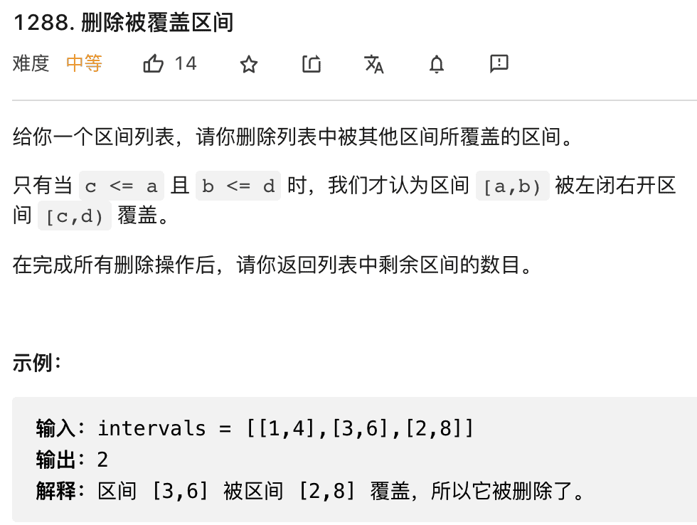
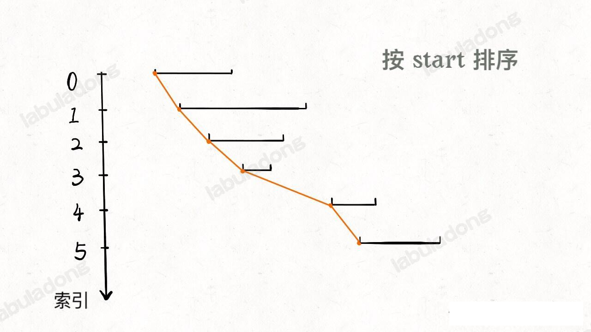
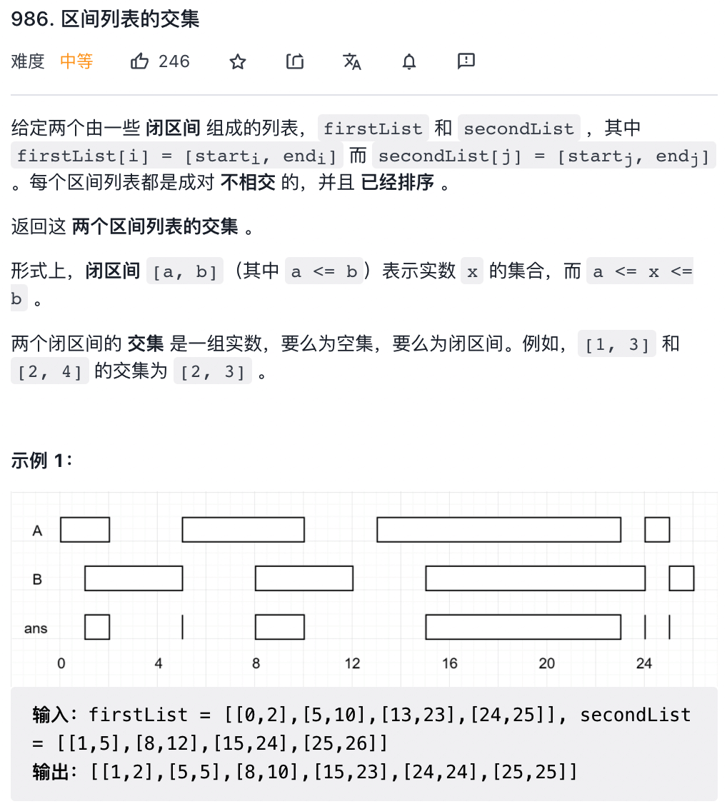
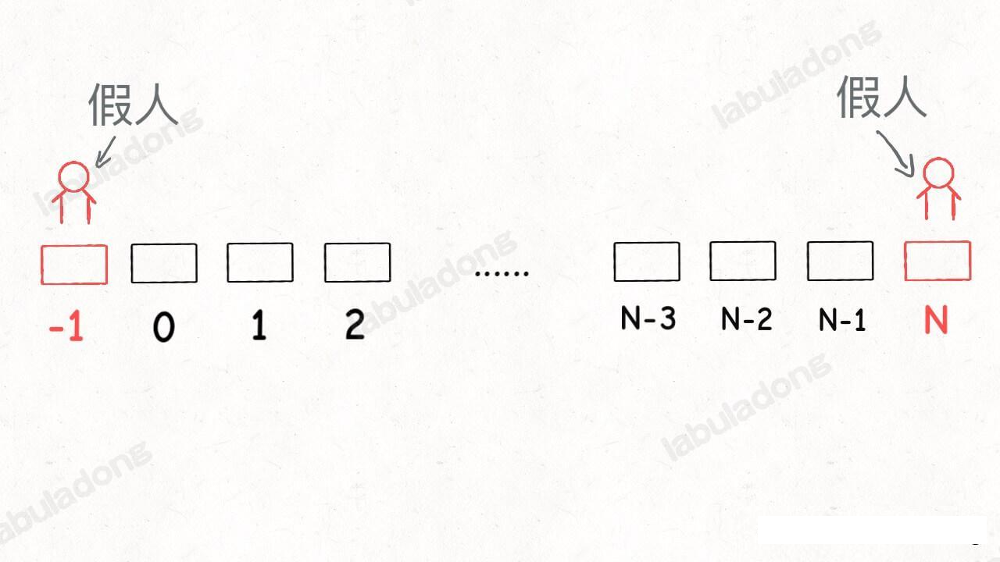
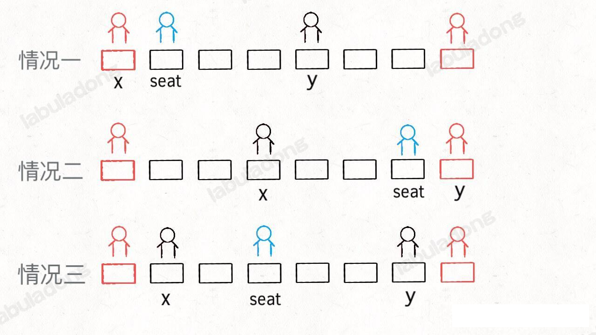
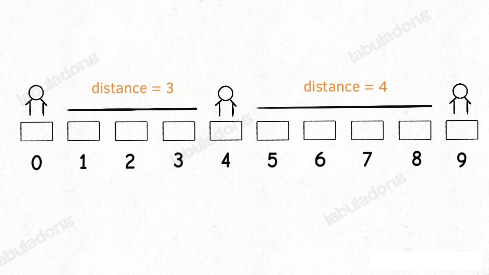
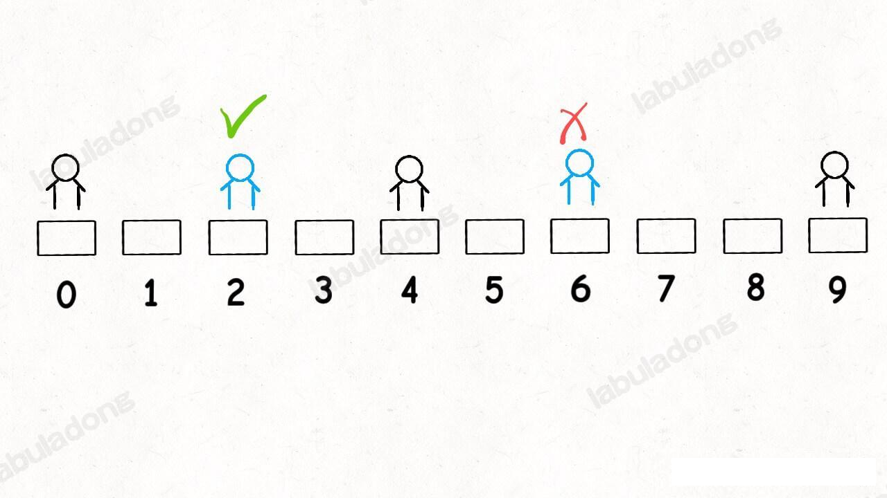
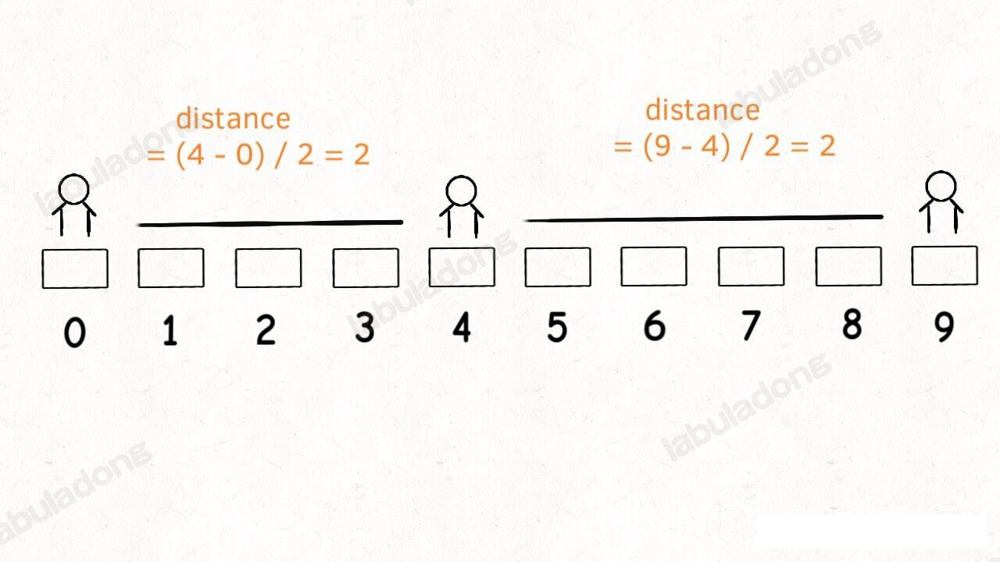
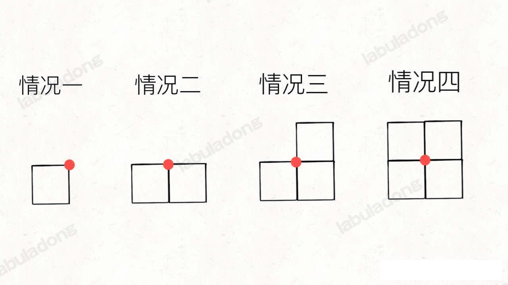
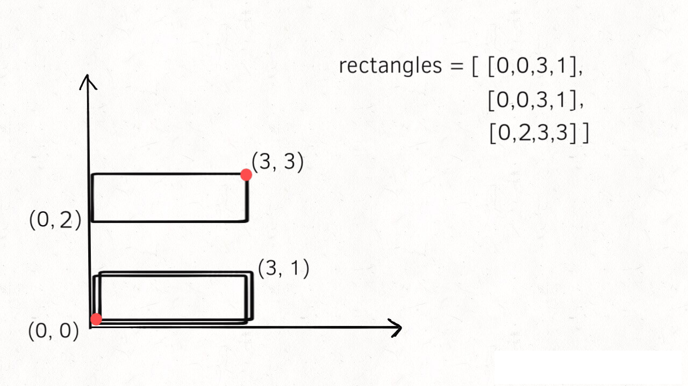

## 经典算法问题

### 一个方法解决三个区间问题

#### 区间覆盖问题

这是 leetcode 1288 题「删除被覆盖区间」，看下题目



题目问我们，取出覆盖区间之后，还剩多少区间，**那么我们可以先算一算，被覆盖区间有多少个，然后和总数相减就是剩余区间数**

对于这种问题，如果没啥头绪，先拍个血看看，比如我们按照区间的起点进行升序排序



排序后，我们能发现 3 中情况：
一、覆盖区间情况
二、两个区间可以合并成一个大区间
三、两个区间完全不相交。

#### 区间合并问题

之前已经做过，这里就忽略了，参考 DoublePointerHandleArray.merge 和 merge2 方法

#### 区间交集问题

leetcode 986 区间列表的交集，就是这个问题




### 斗地主的子序列算法

leetcode 659 题 ，分割数组为连续子序列

给你一个按 非递减顺序 排列的整数数组 nums 。

请你判断是否能在将 nums 分割成 一个或多个子序列 的同时满足下述 两个 条件：

每个子序列都是一个 连续递增序列（即，每个整数 恰好 比前一个整数大 1 ）。
所有子序列的长度 至少 为 3 。
如果可以分割 nums 并满足上述条件，则返回 true ；否则，返回 false 。

输入：nums = [1,2,3,3,4,5]
输出：true
解释：nums 可以分割成以下子序列：
[1,2,3,3,4,5] --> 1, 2, 3
[1,2,3,3,4,5] --> 3, 4, 5

示例 2：

输入：nums = [1,2,3,3,4,4,5,5]
输出：true
解释：nums 可以分割成以下子序列：
[1,2,3,3,4,4,5,5] --> 1, 2, 3, 4, 5
[1,2,3,3,4,4,5,5] --> 3, 4, 5

**对于这种设计到连续整数的问题，条件反映地想到排序**，不过，题目说了，输入的 `nums` 本就是排好序的。

那么，我们如何判断 `nums` 是否能够划分成若干符合条件的子序列那？其实就是下面这个代码逻辑：

```java
for (int v : nums) {
    if (...) {
        // 将 v 分配到某个子序列中
    } else {
        // 实在无法分配 v
        return false;
    }
    return true;
}
```
关键在于，我们怎么知道当前元素 `v` 是如何进行分配的？肯定得分情况讨论了，把情况讨论清楚，就知道如何下手了。

共有两种情况：

**1、当前元素 `v` 自成一派，「另立山头」构成一个长度至少为 3 的序列**。

比如输入 `nums=[1,2,3,6,7,8]`, 遍历到元素 `6` 时，它只能自己开头形成一个符合条件的子序列 `[6,7,8]`

**2、当前元素 `v` 已经连接到已经存在的子序列后面。**

比如输入 `nums=[1,2,3,4,5]`, 遍历到元数据 `4` 时，它只能接到已经存在的子序列 `[1,2,3]` 后面。它没有办法重新开头形成新的子序列，
这就是整体思路，实现方式有我自己先出来的 List<List<Integer>>  多个链表方式 还有阿东的双 Map 方式 (freq map 帮助一个元素判断自己是否能够作为开头，need map 帮助一个元素判断自己是否可以接到其他元素后面)
代码如下：
```java
 /**
         * 两个 map 的解决方案。
         */
        Map<Integer, Integer> need = new HashMap<>();
        Map<Integer, Integer> freq = new HashMap<>();
        for (int val : nums) {
            freq.put(val, freq.getOrDefault(val, 0) + 1);
        }
        Integer needs = 0;
        for (int val : nums) {
            // 如果可以匹配，则匹配
            if (freq.get(val) == 0) {// 该元素已经被使用
                continue;
            }
            // 跟在别人后面
            if (need.containsKey(val) && (needs = need.get(val)) > 0) {
                // val 被用上
                freq.put(val, freq.get(val) - 1);
                // val 的需求数量减 1。
                need.put(val, needs - 1);
                // val+1 的需求数量 +1
                need.put(val + 1, need.getOrDefault(val + 1, 0) + 1);
            } else if ((needs = freq.get(val)) != null && needs > 0 &&
                    (needs = freq.get(val + 1)) != null && needs > 0 &&
                    (needs = freq.get(val + 2)) != null && needs > 0) { // 成立一个新的门派

                freq.put(val, freq.get(val) - 1);
                freq.put(val + 1, freq.get(val + 1) - 1);
                freq.put(val + 2, freq.get(val + 2) - 1);
                // val+3 的需求量加 1。
                need.put(val + 3, need.getOrDefault(val + 3, 0) + 1);
            } else {
                // 自成体系
                // 否则返回 false
                return false;
            }
        }
        return true;
```

如果想现实中的斗地主那样需要至少 5 张顺子牌，我们这个逻辑只需要把 else if 的逻辑改下，联系判断 v 之后的连续 5 个元素即可。

那么，如果我们想要的不是一个布尔值，而是想把相关子序列都打印出来怎么办

我们需要把 need 改为 Map<Integer,List<Integer>>

### 如何调度考生的座位

leetcode 855 题，考场就做，有趣其有一定的代表性。这种题目不像动态规划这类算法拼智商，而是看你对常用的数据结构的理解和写代码的水平，个人认为非常值得重视和学习。

很多人都在问，算法框架是如何总结出来的，其实框架是慢慢从细节里面抠出来的。

题目描述如下：

在考场里，一排有 N 个座位，分别编号为 0, 1, 2, ..., N-1 。

当学生进入考场后，他必须坐在能够使他与离他最近的人之间的距离达到最大化的座位上。如果有多个这样的座位，他会坐在编号最小的座位上。(另外，如果考场里没有人，那么学生就坐在 0 号座位上。)

请你实现 ExamRoom(int N) 类，它有两个公开的函数：其中，函数 ExamRoom.seat() 会返回一个 int （整型数据），代表学生坐的位置；函数 ExamRoom.leave(int p) 代表坐在座位 p 上的学生现在离开了考场。每次调用 ExamRoom.leave(p) 时都保证有学生坐在座位 p 上。

类的构造如下：

```java
class ExamRoom {

    public ExamRoom(int n) {

    }
    
    public int seat() {

    }
    
    public void leave(int p) {

    }
}
```

示例：

>**输入**：
>["ExamRoom","seat","seat","seat","seat","leave","seat"], [[10],[],[],[],[],[4],[]]
>**输出**：[null,0,9,4,2,null,5]
>**解释**：
ExamRoom(10) -> null
seat() -> 0，没有人在考场里，那么学生坐在 0 号座位上。
seat() -> 9，学生最后坐在 9 号座位上。
seat() -> 4，学生最后坐在 4 号座位上。
seat() -> 2，学生最后坐在 2 号座位上。
leave(4) -> null
seat() -> 5，学生最后坐在 5 号座位上。

总结下题目的要求：
**如果将相邻的两个考生看做是线段的两个端点，新安排考生就是要找最长的线段，然后让考生在中间把这个线段「二分」，中间点就是给他分配的座位。`leave(p)` 其实就是去除端点 `p`, 使得跟 p 相邻的两个线段合二为一。**

核心思路很简单吧，所以这个问题实际上是在考察你对数据结构的理解。对于上述这个逻辑，你用什么数据结构来实现那？

#### 一、思路分析

根据上述死里，我们需要把坐在教室的学生抽象成线段，我们可以用一个大小为 2 的数组表示

另外，思路需要我们找到「最长」的线段，还需要去除线段，增加线段。

**但凡遇到在动态过程中求最值的的要求，肯定要使用有序的数据结构，我们常用的数据结构就是二叉堆和平衡二叉树了**。二叉堆实现的优先级队列存取最值的时间复杂度是 O(logN), 但是只能删除最大值。平衡二叉树可以取最值，也可以修改，删除任意一个值，而且复杂度都是 O(logN)

综上， 二叉堆不能满足 `leave` 操作，应该使用平衡二叉树。这里我们会用到 Java 的 `TreeSet`, 这是一种有序的数据结构，底层是由红黑树维护有序性。

这里顺便提一下，一说到集合（Set）或者映射（Map），有的人可能就想当然的认为是哈希集合（HashSet）或者哈希表（HashMap），这样理解是有点问题的。

因为哈希集合/映射底层是由哈希函数和数组实现的，特性是遍历无固定顺序，但是操作效率高，时间复杂度为 O(1)。

而集合/映射还可以依赖其他底层数据结构，常见的就是红黑树(一种自平衡二叉树)，特性就是自动维护元素的顺序，操作效率是 O(logN)。这种一般称为「有序集合/映射」

我们要使用的 TreeSet 就是一种有序集合，目的是为了保持线段长度的有序性，快速找到最大的线段，快速删除和插入。

##### 二、简化问题

首先，如果有多个可选座位，需要旋转索引最小的那个座位对吧？**我们先简化下问题，展示不要管这个需求**，来实现上述思路

这个问题还用到一个常用的编程技巧，就是使用一个「虚拟线段」来让算法正确启动，这就和链表里面的「虚拟头结点」是一个相似的道理。

示例代码如下：
```java
class ExamRoom {

        /**
         * 以 int p 为起点的线段
         */
        Map<Integer, int[]> fromDistance;
        // 以 p 为终点的 线段
        Map<Integer, int[]> toDistance;
        // 存放所有线段的容器
        TreeSet<int[]> distanceContainer;
        int limit;

        public ExamRoom(int n) {
            fromDistance = new HashMap<>();
            toDistance = new HashMap<>();
            distanceContainer = new TreeSet<>((a, b) -> {
                return distance(a) - distance(b);
            });
            // 先加入一个 dummy distance
            addInterval(new int[] { -1, n });
            this.limit = n;
        }

        // 计算线段的长度
        int distance(int[] interval) {
            return interval[1] - interval[0] - 1;
        }

        public int seat() {
            // 没有初始化数据
            if (distanceContainer.isEmpty()) {
                return -1;
            }
            int[] largestDistance = distanceContainer.last();
            int seat = 0;
            int x = largestDistance[0], y = largestDistance[1];
            int seat = 0;
            int x = largestDistance[0], y = largestDistance[1];
            if (x == -1) {
                seat = 0;
            } else if (y == this.limit) {
                seat = limit - 1;
            } else { // 中间节点
                seat = x + (y - x) / 2;
            }
            // 将最长的线段分割成 2 段
            int[] left = new int[] { x, seat };
            int[] right = new int[] { seat, y };
            removeInterval(largestDistance);
            addInterval(left);
            addInterval(right);
            return seat;
        }

        void addInterval(int[] interval) {
            int from = interval[0];
            int to = interval[1];
            fromDistance.put(from, interval);
            toDistance.put(to, interval);
            distanceContainer.add(interval);
        }

        void removeInterval(int[] interval) {
            int from = interval[0];
            int to = interval[1];
            fromDistance.remove(from);
            toDistance.remove(to);
            distanceContainer.remove(interval);
        }

        public void leave(int p) {
            iint[] right = null, left = null;
            if (fromDistance.containsKey(p)) {
                right = fromDistance.get(p);
                removeInterval(right);
            }
            if (toDistance.containsKey(p)) {
                left = toDistance.get(p);
                removeInterval(left);
            }
            if (right != null && left != null) {
                // 合并为一个线段
                int[] newDistance = new int[] { left[0], right[1] };
                addInterval(newDistance);
            }
        }
    }
```
「虚拟线段」其实是为了将所有作为表示为一个线段：




针对取座位的情况，下图给出选座位的示意图，就会比较好理解些



至此，算法基本能实现了，代码虽多，但是思路很简单：查找最长的线段， 从中间分割成两段，中间点就是 `seat()` 的返回值；找 `p` 的左右线段，合并成一个线段，这就是 `leave(p)` 的逻辑。


##### 三、进阶问题
但是，题目要求**多个**选择时选择索引最小的那个座位，我们刚才忽略了一个问题，比如说下面这种情况：



在现有有序集合里面有线段 `[0,4]` 和 `[4,9]`, 那么最长线段 `longest` 就是后者，按照 `seat` 的逻辑，就会分割 `[4,9]`，也就是会返回  6。但是正确答案应该是返回 2，因为 2 和 6 都满足最大化相邻考生的距离条件，二者应该取较小的。



**遇到这种题目要求，解决方式就是修改有序数据结构的排序方式**。具体到这个问题，就是修改 `TreeSet` 的比较函数逻辑

```java
 distanceContainer = new TreeSet<>((a, b) -> {
                // 只是简单的比较距离，在距离相等的时候的逻辑没有列出来
                // return distance(a) - distance(b);
                int distanceA = distance(a);
                int distanceB = distance(b);
                // 如果距离相等，就比较索引
                if (distanceA == distanceB) {
                    return b[0] - a[0];
                }
                return distanceA - distanceB;
            });
```

除此之外，还要改变 `distance` 函数，不能简单地让它计算一个线段两个断点之间的长度，而是让它计算改线中点点和端点之间的长度

```java
int distance(int[] interval) {
            // 不再只是简单的计算线段的距离
            // return interval[1] - interval[0] - 1;
            int from = interval[0], to = interval[1];
            int distance = 0;
            if (from == -1) {
                distance = to;
            } else if (to == this.limit) {
                distance = this.limit - 1 - from;
            } else { // 其他情况，去中点和端点之间的举例
                distance = (to - from) / 2;
            }
            return distance;
        }
```



这样，`[0,4]` 和 `[4,9]` 的 `distance` 值就相等了，算法会比较二者的索引，取较小的线段进行分割。
到此，这道题就完全解决了。

##### 四、最后总结

座位安排这个问题本身并不暗，虽然代码看起来比较多，但是核心问题就是考察有序数据结构的理解和使用，来梳理一下。

处理动态问题一般都会用到有序的数据结构，比如平衡二叉树或者二叉堆，二者的时间复杂度差不多，但是前者支持的操作更多。

既然平衡二叉树这么好用，还用二叉堆干嘛？因为二叉堆底层是数组，实现简单呀。所以，具体问题，还是要选择恰当的数据结构来解决。

### 如何判断矩形

leetcode 391. 完美矩形，这道题还是比较有难度的。

我们知道一个矩形有 4 个顶点，但是只要两个顶点的坐标就可以确定一个矩形了（比如左下角和右上角的两个顶点坐标）。

今天来看看 leetcode 391 完美矩形这一题，题目会给我们输入一个数组 `rectangles`, 里面装着若干四元组 `(x1,y1,x2,y2)`, 每个四元组是记录一个矩形的左下角和右上角坐标。
题目要求如下：
给你一个数组 rectangles ，其中 rectangles[i] = [xi, yi, ai, bi] 表示一个坐标轴平行的矩形。这个矩形的左下顶点是 (xi, yi) ，右上顶点是 (ai, bi) 。

如果所有矩形一起精确覆盖了某个矩形区域，则返回 true ；否则，返回 false 。


也就是说，输入的 `rectangles` 数组实际上就是很多小矩形，题目要求我们输出一个布尔值，判断这些小矩形能否构成一个「完美矩形」。函数签名如下：
```py
def isRectangleCover(rectangles: List[List[int]]) -> bool
```

**所谓「完美矩形」，就是 `rectangles` 中的小矩形拼成图必须是一个大矩形，且大巨星中不能有重叠和空缺**，举个栗子：

示例1：


>**输入**：rectangles = [[1,1,3,3],[3,1,4,2],[3,2,4,4],[1,3,2,4],[2,3,3,4]]
>**输出**：true
>**解释**：5 个矩形一起可以精确地覆盖一个矩形区域。

示例2：


>**输入**：rectangles = [[1,1,2,3],[1,3,2,4],[3,1,4,2],[3,2,4,4]]
>**输出**：false
>**解释**：两个矩形之间有间隔，无法覆盖成一个矩形。


示例3：


>**输入**：rectangles = [[1,1,3,3],[3,1,4,2],[1,3,2,4],[2,2,4,4]]
>**输出**：false
>**解释**：因为中间有相交区域，虽然形成了矩形，但不是精确覆盖。

这个题目的难度是 hard, 如果没有做过类似的题目，还真做不出来

常规的思路，起码要把最终形成的图形划出来吧，而且你要有方法区判断两个矩形是否有重叠，是否有空隙，虽然可以做到，但是感觉非常复杂

**其实，相判断最终形成的图形是否完美矩形，需要从「面积」和「顶点」两个角度来处理**。

先说说什么叫从「面积」的角度

`rectangles` 数组中的每个元素都是一个四元组 `(x1,y1,x2,y2)`, 表示一个小矩形的左下角顶点坐标和右上角顶点坐标

那么假设这些小矩形最终形成了一个「完美矩形」，你会不会求这个完美矩形的左下角顶点坐标(X1,Y1) 和 右上角顶点坐标 (X2,Y2) ?

很简单吧，左下角顶顶点 `(X1,Y1)` 就是 `rectangles` 中所有最小矩形中最靠左下角的那个小矩形的左下角顶点；右上角顶点`(X2,Y2)` 就是所有小矩形中最靠右上角的那个小矩形的顶点。

最终可以写出如下代码：

```python
# 左下角顶点，初始化为正无穷，以便记录最小值
X1, Y1 = float('inf'), float('inf')
# 右上角顶点，初始化为负无穷，以便记录最大值
X2, Y2 = -float('inf'), -float('inf')

for x1, y1, x2, y2 in rectangles:
    # 取小矩形左下角顶点的最小值
    X1, Y1 = min(X1, x1), min(Y1, y1)
    # 取小矩形右上角顶点的最大值
    X2, Y2 = max(X2, x2), max(Y2, y2)
```

这样我们就能求出完美矩形的左下角坐标 `(X1,Y1)` 和右上角顶点的坐标 `(X2,Y2)` 了。

**计算出 `X1,Y1,X2,Y2` 坐标是完美矩形的「理论坐标」**，如果所有小矩形的面积之和不等于这个完美矩形的理论面积，那么说明最终形成的图形肯定是存在空缺或者重叠，肯定不是完美矩形。

代码可以进一步：

```python
def isRectangleCover(rectangles: List[List[int]]) -> bool:
    X1, Y1 = float('inf'), float('inf')
    X2, Y2 = -float('inf'), -float('inf')
    # 记录所有小矩形的面积之和
    actual_area = 0
    for x1, y1, x2, y2 in rectangles:
        # 计算完美矩形的理论坐标
        X1, Y1 = min(X1, x1), min(Y1, y1)
        X2, Y2 = max(X2, x2), max(Y2, y2)
        # 累加所有小矩形的面积
        actual_area += (x2 - x1) * (y2 - y1)

    # 计算完美矩形的理论面积
    expected_area = (X2 - X1) * (Y2 - Y1)
    # 面积应该相同
    if actual_area != expected_area:
        return False

    return True
```

这样，「面积」这个维度就完成了，思路其实不难，无非就是假设最终形成的图形是个完美矩形，然后比较面积是否相等，如果不相等的话说明最终形成的图形一定存在空缺或者重叠，不是完美矩形。

但是反过来说，如果面积相同，是否可以证明形成的图形是完美矩形，一定不存在空缺或者重叠？

肯定是不行的，举个很简单的例子，你假想一个完美矩形，然后在中间挖掉一个小矩形，把这个小矩形向下平移一个单位。这样小矩形的面积之和没有变，但是原来的完美矩形就空缺了一部分，已经不是完美矩形了。

**综上， 即使面积相同，并不能完全保证不存在空缺或者重叠，所以我们需要从「顶点」的维度来辅助判断**。

下面我们从 顶点的维度来讲讲完美矩形。

先来说一道简单的智力题，给你一个矩形，切一刀，剩下的图形有几个顶点？答案是，如果沿着对角线切，就剩 3 个顶点；如果横着或者竖着切，剩 4 个顶点；如果只切掉一个小角，那么会出现 5 个顶点。

**显然，完美矩形定义只有 4 个顶点**。矩形嘛，按道理说应该只有 4 个顶点，但是如果存在空缺或者重叠的话，肯定不是 4 个顶点，比如下图所示


只要我们想办法计算 `rectangles` 中的小矩形最终形成的图形有几个顶点，就能判断最终的图形是不是一个完美矩形了。

那么顶点是如何形成的那？我们倒是一眼就看出顶点在哪里，问题是如何将计算机，让算法知道某一个顶点是不是顶点那？这也是本题的难点所在

看下图的四种情况：



图中画红点的地方，什么时候是顶点，什么时候不是顶点？显然，情况1和情况 3 的时候是顶点，而情况二和四不是顶点。

**也就是说，当某一个点同时是 2 个或者 4 个小矩形的顶点时，该顶点最终不是顶点；当某一个点同时是 1 个或者 3 个小矩形的顶点时，该点最终是一个顶点**。

也就是我们筛选顶点的依据是最终形成的图形中有几个顶点，筛选出那些出现奇数次的顶点。

```java
 public boolean isRectangleCover(int[][] rectangles) {
        // 左下角的坐标
        int X1 = Integer.MAX_VALUE, Y1 = Integer.MAX_VALUE;
        // 右上角的坐标
        int X2 = Integer.MIN_VALUE, Y2 = Integer.MIN_VALUE;
        // 各个矩形的累计面积和
        int calcArea = 0;
        int x1, x2, y1, y2;
        Set<String> points = new HashSet<>();
        // 矩形的四个顶点
        String p1, p2, p3, p4;
        // 在坐标轴上，左下角就是 (x,y) 最小，右上角就是 (x,y) 最大。
        for (int[] rec : rectangles) {
            x1 = rec[0];
            y1 = rec[1];
            x2 = rec[2];
            y2 = rec[3];

            calcArea += (x2 - x1) * (y2 - y1);
            X1 = Math.min(X1, x1);
            Y1 = Math.min(Y1, y1);

            X2 = Math.max(X2, x2);
            Y2 = Math.max(Y2, y2);

            p1 = ptr(x1, y1);
            p2 = ptr(x1, y2);
            p3 = ptr(x2, y1);
            p4 = ptr(x2, y2);
            for (String p : Arrays.asList(p1, p2, p3, p4)) {
                if (points.contains(p)) {
                    points.remove(p);
                } else {
                    points.add(p);
                }
            }
        }
        int actualArea = (X2 - X1) * (Y2 - Y1);
        // 面积不相等，则返回 false;
        if (calcArea != actualArea) {
            return false;
        }
        // 下面判断顶点
        return true;
    }

    String ptr(int x, int y) {
        return String.format("%s,%s", x, y);
    }
```

在这段代码中，我们用一个 `points` 集合记录了 `rectangles` 中小矩形最终的最终图形顶点坐标，关键逻辑在于如何向 `points` 中添加坐标

**如果一个顶点 `p` 存在于集合 `points` 中，则将它删除；如果不存在于集合 `points` 中，则将它插入**。

这个简单的逻辑，让 `points` 集合最终只会留下哪些出现了 1 次或者 3 次的顶点，哪些出现了 2 次或者 4 次顶点都会被抵消掉。

那么我们我们首先想到，`points` 集合中最后应该只剩下 4 个顶点对吧？如果 `points.size() != 4` 就说明最终构成的图形不是完美矩形。

但是如果 `points.size() == 4` 是否能说明最终构成的图形是完美矩形那？也不行，因为题目并没有说 `rectangles` 中的小矩形不存在重复，比如下面这幅图：



下面两个矩形重复了，按照我们的算法逻辑，它们的顶点都会被消除掉，最终只剩下上面那个矩形的 4 个顶点；在看面积，完美矩形的理论坐标是红色两个点，计算出来的面积和实际面积也是相同的。但是这种情况不是题目要求的完美矩形。

所以，不仅要保证 `points.size() == 4` ，还要保证 `points` 中的所有顶点都是完美矩形的四个理论坐标，代码参考