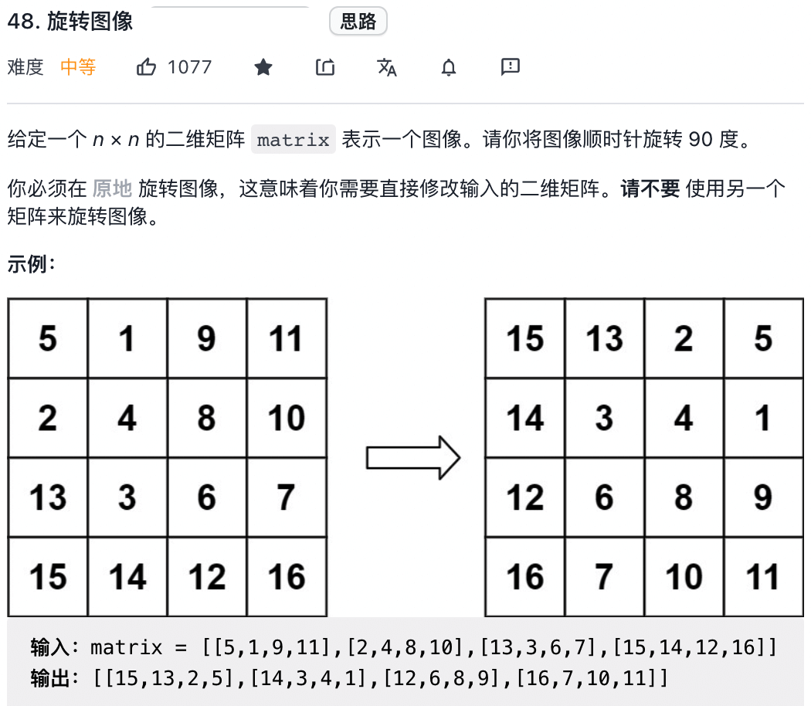
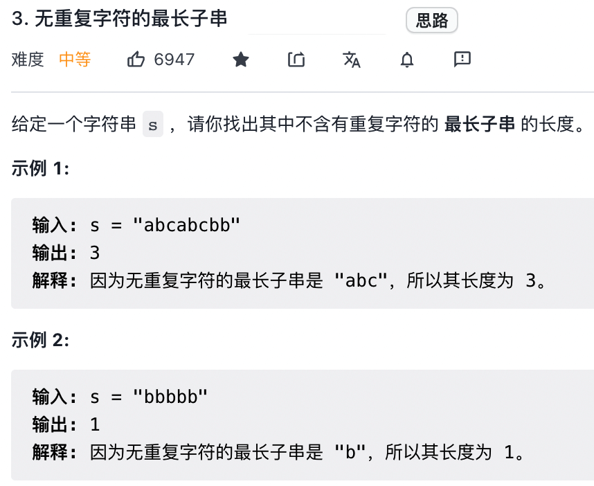

## 双指针解决数组相关 7 道题目

数组中没有真正意义的指针，但是我们可以把索引当做数组的指针，这样也可以在数组中实战双指针技巧，**本章节主要讲数组相关的双指针算法**

### 快慢指针技巧

**数组问题中比较常见的快慢指针技巧，是让你原地修改数组**

比如 leetcode 第 26 题「删除有序数组中的重复项」，让你在有序数组中去重：


函数签名如下：
```java
int removeDuplicates(int[] nums);
```

#### 数组原地删除元素 

leetcode 第 27 题，题目描述如下所示：


题目要求我们把 `nums` 中的所有值为 `val` 的元素原地删除，依然需要使用快慢指针技巧：

如果 `fast` 遇到值为 `val` 的元素，则直接跳过，否则就赋值给 `slow` 指针，并让 `slow` 前进一步。

这几本和前面说到了数组去重问题解法思路是完全一样的。直接上代码，参考removeElement()

#### 移动零

leetcode 第 283 题

给你输入一个数组 `nums`, 请你**原地修改**, 将数组中的所有值为 0 的元素移动到末尾，函数签名如下：

```java
void moveZeros(int[] nums);
```
这道题让我们将所有的 0 移动到最后，其实就相当于移除 `nums` 中的所有 0，然后再把后面的元素都复制为 0 即可。

___

到这里，原理修改数组的这些图姆就已经差不多了。数组中另一大类快慢指针的题目就是「滑动窗口算法」。滑动窗口算法会有一个专门的章节来讲解

### 左右指针的常用算法

#### 1、二分查找

二分查找会有一个专门的章节详细探讨二分搜索的细节问题，我们这里只写最简单的二分算法，旨在突出它的双指针特性.

#### 2、两数之和


**只要数组有序**，就应该想到双指针技巧。这道题的解法有点类似二分查找，通过调整 `left` 和 `right` 就可以调整 `sum` 的大小：

#### 3、 反转数组

一般编程语言都会提供 `reverse` 函数，其实这个函数的原理非常简单，leetcode 第 344 题，「反转字符串」就是类似需求，让你反转一个 `char[]` 类型的字符数组，函数签名为 `void reverseString(char[] s)`

#### 4、回文判断

首先明确一下，回文串就是正着读和反着读都一样的字符串。

比如说字符串 `aba` 和 `abba` 都是回文串，因为他们对称，反过来还是和本身一样；反之，字符串 `abac` 就不是回文串。

我们现在你应该感觉到回文串问题和左右指针肯定有密切的联系，比如让你判断一个字符串是不是回文串，我们就可以写出代码，参见 isPalindrome(String s)。
我们把强度提升下，leetcode 第 5 题，判断「最长回文子串」


函数签名如下：
```java
String longestPalindrome(String s);
```

找回文的难点在于，回文串的长度可能是奇数也可能是偶数，**解决该问题的核心是从中心向两端扩散的双指针技巧**。

如果回文串的长度为奇数，则它有一个中心字符串；如果回文串的长度为偶数，则可以认为它有两个中心字符串。我们可以先实现一个从中间获取回文的方法
```java
String palindromeString(String s,int i, int j) {
    while(i>=0 && j <= s.length()-1 &&
            s.charAt(i) == s.charAt(j)) {
                i--;
                j++;
    }
    return s.substring(i+1,j);
}
```

### 前缀和

#### 二维矩阵的前缀和


注意看这幅图，任意子矩阵的元素都可以转化成它周边几个大矩阵的元素和的运算

而这四大矩阵有一个共同的特点，就是左上角都是(0,0)原点。

我们维护一个 preSum 数组，专门记录以原点为顶点的矩阵的元素之和，就可以用几次加减运算出任何一个子矩阵的元素和。

代码如 sumRegion 方法

### 小而美的算法技巧：差分数组

**「前缀和」主要的使用场景是原始数组不会被修改的情况下，频繁查询某个区间的累加和**。
差分数组和前缀和的思想非常相似的算法技巧，**差分数组的主要适用场景是频繁对原始数组的某个区间的元素进行增减**。
比如说，我给你输入一个数组 `nums`, 然后又要求给区间 `nums[2..6]` 全部加上 1，再给 `nums[3..9]` 全部减 3，再给 `nums[0..4]` 全部加 2，再给...。一顿操作猛如虎，最后问你，`nums` 数组的值是什么？

常规思路就是操作哪个区间，就在哪个区间加一个 for 循环呗，还能咋样？这种思路的时间复杂度是 O(N), 由于这个场景下对 `nums` 的修改非常频繁，所以效率会非常低下。

这里就需要用到差分数组，类似「前缀和」的构造技巧 `preSum` 数组，我们先对 `nums` 数组构造一个差分数组 `diff`, `diff[i]` 就是 `nums[i]` 和 `nums[i-1]` 之差。

**最牛逼的地方来了，通过这个 `diff` 查分数组可以反推出原始数组 `nums` 的**

**这样构造查分数组 `diff` ，就业快速进行区间增减的操作**，如果我们想对区间 `nums[i..j]` 的元素全部加 3，那么只要让 `diff[i] +=3`, 然后再让 `diff[j+1] -=3 ` 即可：

原理很简单，diff[i] +=3 意味着给 nums[i..] 的所有元素都加了 3，diff[j+1] -=3 又意味着对 nums[j+1..] 再减 3，综合起来就是对 `nums[i..j]` 中的所有元素都加 3 了。

只要花费 O(1) 的时间，修改 `diff` 数组，就相当于给 `nums` 的整个区间做了修改。多次修改 `diff`, 然后通过 `diff` 数组反推，即可得到 `nums` 修改后的结果

#### 算法实践

leetcode 370 题，「区间加法」直接考察了差分数组的技巧(leetcode 会员)。


实现方法参加 DifferentArray 类

然而，实际上的算法可能需要我们对题目进行联想和抽象，不会那么直接地让我们看出来要用差分数组技巧，这里看一下 leetcode 1109 题「航班预订统计」：


解释如下：
```text
Input: bookings = [[1,2,10],[2,3,20],[2,5,25]], n = 5
Output: [10,55,45,25,25]
Explanation:
Flight labels:        1   2   3   4   5
Booking 1 reserved:  10  10
Booking 2 reserved:      20  20
Booking 3 reserved:      25  25  25  25
Total seats:         10  55  45  25  25
Hence, answer = [10,55,45,25,25]
```

这道题就是在那绕弯弯，其实它就是个差分数组，我们这里给翻译一下：
给你输入一个长度为 `n` 的数组 `nums`,其中所有元素都是0。再给你输入一个 `bookings`, 里面是若干三元组 `(i,j,k)`，每个三元组的含义就是要求你给 `nums` 数组的闭区间 `[i-1,j-1]` 中的所有元素都加上 `k`。请你返回最后的 `nums` 数组是多少？

这么一看，不就是一道标准的差分数组题嘛？我们可以直接复用 Different 类。

还有一道很类似的题目，leetcode 1094 题 「拼车」，这里简单描述下：

你是一个公交车司机，公交车的最大载客量为 `capacity`, 沿途要经过若干站，给你一份乘客行程表 `int[][] trips`, 其中 `trips[i] = [num,start,end]` 代表着有 `nums` 个旅客要从站点 `start` 上车，到站点 `end` 下车，请你计算是否能够一次把所有旅客运送完毕（不能超过最大载客量 `capacity`）。
函数签名如下：

```java
boolean canPooling(int[][] trips, int capacity);
```
比如输入：
```python
trips = [[2,1,5],[3,3,7]], capacity=4
```
就不能一次运完，因为 `trips[1]` 最多只能上 2 人，否则车就会超载。

相信我们大家已经联想到差分数组技巧了，**`trips[i]` 代表着一组空间操作，旅客的上下车就相当于数组区间的加减；只要结果数组中的元素都小于 `capacity` ，就说明可以不超载云诉讼素有的旅客**。

但问题是，差分数组的长度(车站的个数)应该是多少？题目没有值直接给出，但给出了数据取值范围：
```java
0 <= fromi < toi <= 1000
```
车站编号从 0 开始，最多到 1000，也就是最多有 1001  个车站，那么我们的差分数组长度可以直接设为 1001 ，这样索引刚好可以覆盖所有的车站编号：
参考 canPooling 

### 二维数组的花式遍历

框架可以解决大部分有套路可循的题目。

但是框架思维也不是万能的，有一些特定的技巧，属于会者不难，难者不会的类型，只能通过多刷题进行总结和积累。

本章节分享一些巧妙的二维数组的花式操作，这里我们有个印象，以后遇到此类题目就不会懵圈了。

#### 顺/逆时针旋转矩阵

对二维数组进行旋转是常见的笔试题，力扣第 48 题「旋转图像」就是很经典的一道：



题目很好理解，就是让你将一个二维矩阵顺时针旋转 90 度，**难点在于「原地」修改**，函数签名如下：
```java
void rotate(int[][] matrix);
```
如何「原地」旋转二维数组？稍微想一下，感觉操作起来非常复杂，可能要设置巧妙的算法机制来「一圈一圈」旋转矩阵：

**但实际上，这道题不能走寻常路**，在详细描述这道题的解法之前，我们先看另一道谷歌曾经考过的算法题热热身：
给你一个包含若干单词的空格的字符串 `s`, 请你写一个算法，**原地**反转所有单词的顺序。 比如给你输入一个这样的字符串：

```java
s="hello world java"
```
你的算法需要**原地**反转这个字符串中的单词顺序
```java
s="java world hello"
```

常规的方式是把 `s` 按空格 `split` 成若干单词，然后 `reverse` 这些单词的顺序，最后再把这些单词 `join` 成句子。但是这种方式使用了额外的空间，并不是「元地反转」单词。

**正确的做法是，先将整个字符串 `s` 反转**：

```java
s = "avaj dlrow olleh"
```
**然后再将每个单词反转**

```java
s="java world hello"
```
这样，就实现了原地反转所有单词顺序的目的。leetcode 第 151 题 「颠倒字符串中的单词」就是类似的问题，我们会尝试去解决一下

这里提这道题的目的是什么那？

**旨在说明，有时候我们拍脑袋的常规思维，在计算机看来可能并不是最优雅的；但是计算机觉得最优雅的思维，对我们来说却不是那么直观**。这也许就是算法的魅力所在吧。

回到之前说的顺时针旋转二维矩阵的问题，常规的思路就是去寻找原始坐标和旋转后做的映射规律，但我们是否可以让思维跳跃一下，尝试把矩阵进行反转，镜像对称等操作，可能会出现新的突破口。


**然后再对矩阵的每一行进行反转**:


发现结果就是 `matrix ` 顺时针旋转 90 度的结果，将上述思想翻译成代码，即可解决本问题

#### 矩阵的螺旋遍历

leetcode 第 54 题，螺旋矩阵


该函数的签名如下：

```java
List<Integer> spiralOrder(int[][] matrix);
```

**解题的核心思路是按照右、下、左、上的顺序遍历数组，并用四个变量圈定未遍历元素的边界**：


随着螺旋遍历，相应的边界会收缩，直到螺旋遍历完整个数组，根据这个思路，我们写出代码就比较容易了。


#### 旋转矩阵 II

leetcode 第 59 题，也是类似的题目，只不过是反过来，让你按照螺旋的顺序生成矩阵：


函数签名为 `int[][] generateMatrix(int n)`

有了上面的铺垫，稍微改一下代码即可完成这道题

___

### 滑动窗口算法，改编成一首诗

这里抄阿东的一首小诗来歌颂滑动窗口的伟大。
        滑动窗口防滑记      
链表子串数组题，用双指针别犹豫。
双指针家三兄弟，个个都是万人迷。

**快慢指针**最神奇，链表操作无压力。
归并排序找中点，链表成环搞判定。

**左右指针**最常见，左右两端相向行。
反转数组要靠它，二分搜索是弟弟。

**滑动窗口**老猛男，子串问题全靠它。
左右指针划窗口，一前一后齐并进。

自诩十年老司机，怎料农村道路滑。
一不小心滑到了，鼻青脸肿少颗牙。
算法思想很简单， 出了 bug 想升天。

关于双指针的快慢指针和左右指针用法，之前的例子已经不少了，本章节解决一类最难掌握的技巧：滑动窗口技巧。总结出一套框架，熟练掌握之后，可以闭着眼写出正确的解法。

滑动窗口的算法思想很简单，就是维护一个窗口，不断滑动，然后更新答案。 leetcode 上面起码有 10 道题运用滑动窗口算法，难度都是中等和困难。该算法的大致逻辑如下：

```java
int left =0,right =0;
while(left < right && right < s.length()) {
    //增大窗口
    window.add(s[right]);
    right++;
    
    while(window should shrink) {
        // 缩小窗口
        window.remove(s[left]);
        left++;
    }
}
```
这个算法的时间复杂度是 O(N), 比字符串暴力算法要高效的多。

其实困扰我们大家的不是思路问题，而是各种细节问题。比如合适添加元素，如何缩小窗口，在窗口滑动的哪个阶段更新结果。即便你明白这些细节，也容易出现 Bug，bug 还不容易找到，挺让人烦的。

**今天本章节总结出一套框架，以后遇到相关问题，直接套框架，基本就可以解决问题了**

#### 最小覆盖子串

leetcode 第 76 题，描述如下：


就是说要在 `S`(source)中找到包含 `T(target)` 中全部字母的一个子串，且这个子串一定是所有可能子串中最短的。

暴力解法大概是这样的
```java
for(int i=0;i<s.length();i++) {
    for(j=i+1;j<s.length();j++) {
        if s[i:j] 包含 t 中所有的字母:
            更新答案
    }
}
```
思路很简单，但是显然，这个算法的复杂度肯定大于 O(N^2) 了，不好。

下面结合步骤图来理解一下，`needs` 和 `windows` 相当于计数器，分别记录 `T` 中字母出现次数 和 「窗口」中的相应字符出现次数。

初始状态：


增加 `right` ,直到窗口 `[left,right)` 包含了 `T` 中所有字符。


现在开始缩小窗口`[left, right)`，增加 `left`:


直到窗口中的字符串不再符合要求，`left` 就不再继续移动


之后重复上述过程，先移动 `right`，再移动 `left`... 直到 `right` 指针到达字符串 `S` 的末端，算法结束。

在开始套模板之前，需要思考一下几个问题：
1、什么时候应该移动 right 扩大窗口？窗口加入字符时，应该更新哪些数据？
2、什么时候窗口应该暂停扩大，开始移动 `left` 缩小窗口？从窗口移出字符时，应该更新哪些数据
3、我们要的结果应该在扩大窗口时还是缩小窗口时进行更新？


接下里请参考代码 SlidingWindow.java

接下来我们来回答上述 3 个问题：
1、每遇到一个字符的时候就应该移动 right 扩大窗口。窗口加入字符，应该进行当前字符计数器的更新，使用 map 来维护。如果窗口内的当前字符 c 和 目标字符c 的数量一致，则还要更新符合记录的数量

2、当满足有一个完整覆盖的时候，停止扩大窗口，开始移动 left 缩小窗口。从窗口中移出字符数时，跟移入字符时一个逆操作，就是要先根据条件判断是否需要减少符合条件的字符个数，然后再减少当前窗口内当前字符的计数

3、我们要的结果是要在获取覆盖字符后缩小窗口前进下计算，从而获取最小的覆盖字符串


#### 字符串排列

leetcode 第 567 题，字符串的排列


注意哦，输入的 s1 是可以包含重复字符的，所以这个题难度不小

这种题目，是明显的滑动窗口算法，**相当于给你一个 `S` 和一个 `T`，请问你 `S` 中是否存在一个子字符串，包含`T` 中所有的字符且不包含其他字符？**

这道题的解法几乎跟最小覆盖一模一样。主需要改几个地方：
1、移动 left 缩小窗口的时机是窗口大于等于 t.size()，因为排列(是子串，不是子序列)嘛，显然长度应该是一样的。
2、当发现 `valid == need.size()` 时，就说明窗口中是一个合法的排列，所以应该立即返回 true

至于其他的处理窗口的扩大和缩小，和最小覆盖子串完全相同。

#### 查找所有字母异位词

leetcode 438 题，「查找字符串中所有字母异位词」，描述如下


这里的字母异位词，不就是排列嘛，整个高端的说法就能糊弄人？**相当于，输入一个串 `S`, 一个串 `T`，找到 S 中所有的 T 的排列，并返回他们的起始索引**。

详见 findAnagrams 方法。


#### 无重复字符的最长子串

leetcode 第 3 题


这道题我之前做过，不过应该不是用滑动窗口的，这里使用滑动窗口重做一版

### 其他数组技巧

#### 田忌赛马背后的算法决策

田忌赛马的故事就略了，总结出一句话就是，**打得过就打，打不过就拿自己的垃圾和对方的精锐互换**。

leetcode 第 870 题，「优势洗牌」，就是田忌赛马的加强版

给你输入两个**长度相等**的数组 `nums1` 和 `nums2`，请你重新组织 `nums1` 中元素的位置，使得 `nums1` 的「优势最大」

如果 `nums1[i] > nums2[i]`, 就是说 `nums1` 在索引 `i` 上 对 `nums2[i]` 有「优势」。优势最大化也就是说让你重新组织 `nums1` **尽可能多的让 `nums[i] > nums2[i]`。**

算法签名如下：
```java
int[] advantageCount(int[] nums1, int[] nums2);
```
Example 1:

>Input: nums1 = [2,7,11,15], nums2 = [1,10,4,11]
>Output: [2,11,7,15]

Example 2:

>Input: nums1 = [12,24,8,32], nums2 = [13,25,32,11]
>Output: [24,32,8,12]

Example2 非常像田忌赛马的场景，**`nums1` 就是田忌的马，`nums2` 就是齐王的马，数组中的元素就是马的战斗力，你就是孙膑，展示你真正的技术吧**。

仔细想想，这个题的解法还是有点扑朔迷离的。什么时候应该放弃抵抗送人头，什么时候应该硬刚？这里面应该有一种算法策略来最大化「优势」。

最终我们给出的策略就是：**将齐王和田忌的马按照战斗力排序，然后按照排名一一对比。如果田忌的马能赢，那就比赛，如果赢不了，那就换个垫底的来送人头，保存实力**。

上述思路的代码逻辑如下：

```java
int n = nums1.length;

sort(nums1); // 田忌的马
sort(nums2); // 齐王的马

// 从最快的马开始比
for(int i=n-1;i>-0;i--) {
    if(nums1[i] > nums2[i]) {
        // 比得过，跟他比
    } else {
        //比不过，换个垫底的来送人头。
    }
}
```
根据这个思路，我们需要对两个数组排序，但是 **`nums2` 中的元素顺序是不能改变的，因为计算结果的顺序依赖 `nums2` 的顺序，所以不能直接对 `nums2` 进行排序，而是利用其他数据结构来辅助**。

同时，最终的解法还用到了前文的头尾双指针技巧，头指针用来获取送人头的马，尾指针是用来比得过的时候 pk 的马。

参见 DoublePointerHandlerArray.advantageCount 方法

#### 实现随机集合

leetcode 第 380 题 「常数时间的插入、删除和获取随机元素」，题目描述如下：


让我们实现一个如下的类 
```java
class RandomizedSet {
    public boolean insert(int val) {}

    public boolean remove (int val) {}

    public int getRandom() {}
}
```

本题的难点在于两点：

**1、插入，删除，获取随机元素这三个操作的时间复杂度必须是O(1)**
**2、`getRandom` 方法返回的元素必须是等概率的返回随机元素**，也就是说，如果结合里面有 `n` 个元素，每个元素被返回的概率笔试是 `1/n`。

我们先来分析一下：对于插入，删除，查找这借个操作，哪种数据的时间复杂度是O(1)?

`HashSet` 肯定算一个对吧。哈希集合的底层原理就是一个大数组，我们把元素通过哈希函数映射到一个索引上；如果冲突，则用拉链法去解决，那么这个索引可能连着一个链表或者红黑树。

那么请问对于这样一个标准的 `HashSet`, 你能否在 O(1) 的时间内实现 `getRandom` 函数？

其实是不能的，因为根据刚才锁的底层实现，元素是被哈希函数「散列」到整个数组中，有负载因子，就有一定的数组元素是空的，跟别说还有拉链法等解决哈希冲突的机制，所以做不到O(1) 时间「等概率」随机获取元素。

除了 `HashSet` , 还有一些类似的数据结构，比如哈希链表 `LinkedHashSet`, 本质上是 Hash 配合双链表，元素存储在双链表中。

但是 `LinkedHashSet` 只是给 `HashSet` 增加了有序性，依然无法要求实现我们的 `getRandom` 函数，因为底层用链表结构存储元素的话，是无法在O(1)的时间内访问某一个元素的。

根据上面的分析，对于 `getRandom` 方法，如果想「等概率」且「O(1)的时间」取出元素，一定要满足：**底层用数组实现，且数组必须是紧凑的(不能是散列的)**。

这样我们就可以直接生成随机数作为索引，从数组中取出该随机索引对应的元素，作为随机元素。

**如果我们用数组存储元素的话，插入，删除的时间复杂度怎么可能是O(1)那？

可以做到！对数组尾部进行插入和删除操作不会涉及数据搬运，时间复杂度是O(1)。（这句话不完全对，数组尾部操作要想一直保持O(1) ，则数组需要能动态扩容，很显然这里 ArrayList 之类的符合要求）。

**所以，如果我们想在O(1)的时间删除数组中的某一个元素 `val`, 可以先把这个元素交换到数组尾部，然后再 `pop` 掉**。

交换两个元素必须通过索引进行交换，那么我们就需要一个哈希表 `valToIndex` 来记录每个元素值对应的索引。

有了这些思路，我们就可以直接写代码。

### 数组去重

leetcode 316 「去除重复字母」，难度级别为复杂

本章节所讲的问题应该是去重相关算法中难度最大的了，把这个问题搞清楚，就再也不用怕数组去重问题了。

这道题和 1081 题的「不同字符的最小子序列」的解法是完全相同的，我们可以直接套用。

题目的要求总结出来有三点：

要求一：要去重
要求二：去重字符串中的字符顺序**不能打乱 `s` 中字符出现的相对顺序**。
要求三：在所有符合上一条要求的去重字符串中，**字典序最小**的作为最终结果。

上述三条要求中，第三条要求有点难以理解，举个栗子：

比如说输入字符串 `s= "babc"`, 去重并且符合相对位置的字符串有两个，分别是 `"bac"` 和 `"abc"` ,但是我们的算法得返回 `"abc"`, 因为它的字典顺序更小。（在数学中，字典或词典顺序（也称为词汇顺序，字典顺序，字母顺序或词典顺序）是基于字母顺序排列的单词按字母顺序排列的方法）

按理说，如果我们想要的有序的结果，那就得对原字符串排序对吧，但是排序后就不能保证符合 `s` 中字符出现的顺序了，这似乎是矛盾的。

**我们先暂时忽略要求三，用「栈」来实现一下要求一和要求二**，至于为什么要用栈实现，主要是为了实现最终的目的而引进的。

```java
String removeDuplicateLetters(String s) {
        // 使用 256 长度的数组，来封装所有的 ascii 字符容器
        boolean[] inStack = new boolean[256];
        char[] chs = s.toCharArray();

        Stack<Character> stack = new Stack<>();
        for (char ch : chs) {
            // 如果字符存在栈中，则排重
            if (inStack[ch]) {
                continue;
            }
            // 若不存在，则插入栈顶，并标记已存在
            stack.push(ch);
            inStack[ch] = true;
        }
        StringBuilder sb = new StringBuilder();
        while (!stack.isEmpty()) {
            sb.append(stack.pop());
        }
        return sb.reverse().toString();// 从 stack 中接受的字符串，需要翻转下，还原为正常顺序的字符串
    }
```

这段代码使用布尔数组 `inStack` 记录栈中的元素，达到去重的目的，**此时栈中的元素都是没有重复的**。

如果输入 `s = "bcabc" `, 这个算法会返回 "bca", 已经符合要求一和要求二了，但是题目希望要的答案是 `"abc"` 对吧。

那需要进一步想想，如果想满足要求三，保证字典顺序，需要做什么修改？

在向栈 `stack` 中插入字符 `a` 的时候，我们的算需要知道，字符 `a` 的字典序和之前的两个字符 `b` 和 `c` 相比，谁大谁小？

**如果当前字符 `'a'` 比之前的字符字典序小，就需要把之前前面的字符 pop 出栈，让 `a` 排在前面，对吧**？

这里我们先改一版

```java
 String removeDupliatLetters2(String s) {
        //省略相同代码...
        for(char ch : chs) {
            if(inStack[ch]) {
                continue;
            }
            while(!stack.isEmpty() && stack.peek() > ch) {
                // 将比当前字符 ch 的字符弹出来
                stack.pop();
            }
            stack.push(ch);
        }
        //省略相同代码...
    }
```

这样对于输入 `s= "bcabc"` ,我们就可以得出正确的结果 `"abc"` 了。

但是，如果我们改一下输入，假设 `s= "bcac" `,按照刚才的算法逻辑，返回的结果是 `"ac"`, 而正确的答案是 `"bac"`, 分析一下怎么回事？

因为字符串 s 中只有一个字符 `'b'` , 即便字符 `'a'` 的字典比字符 `b` 要小，字符 `'b'` 也不应该被 pop 出去。

那问题处在哪里？

**我们的算法在 `stack.peek() > c` 时才会 pop 元素，其实这时候应该视情况而定**：

情况一：如果 `stack.peek()` 这个字符之后还回出现，那么可以安心地把它 pop 出去，反正后面还会有该字符嘛，后面再 push 到栈里，刚刚符合字典顺序的要求。

情况二：如果 `stack.peek()` 这个字符之后就不会再出现了，前面我们也说了栈中不会存在重复的元素，那么就不能把它 pop 出去，否则我们就永久失去了这个字符，这明显不符合题目的要求。

所以，**问题的关键在于，如何让算法知道字符 `a` 之后有几个 `b` 有几个 `c` 那**？ 凡是需要提前记住什么东西多少个，在哪里之类的，都需要借助其他数据结构，这里我们使用一个数组维护字符的记录数，当字符的记录数降低为 0 时，我们就认为栈中只存在一个该字符，不能被 pop 出去


