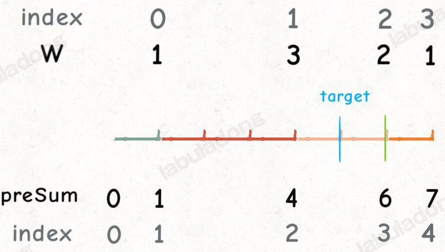
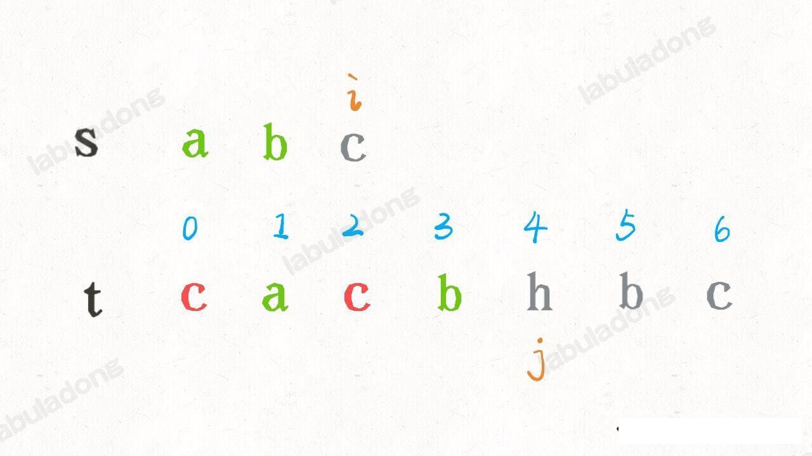

### 伟大的二分搜索

#### 二分搜索赞美诗

跟滑动窗口一样，对二分搜索来首阿东的诗
        二分搜索升天词      
二分搜素不好记，左右边界让人迷。
小于等于变小于，mid 加一又减一。
就算这样还没完，return 是否再 -1 ？
信心满满刷力扣，AC 比率二十一。
我本将心向明月，奈何明月照沟渠
问君能有几多愁？恰似深情喂了狗。

赐君一法写二分，不用拜佛与念经
**管他左侧还右侧，搜索区间定乾坤**

搜索一个元素时，搜索区间两端闭。
while 条件带等号，否则需要打补丁
if 相等就返回，其他的事甭超心。
mid 必须加减一，因为区间两端闭。
while 结束就凉了，凄凄惨惨返 -1。

搜索左右边界时，搜索区间要阐明。
左闭右开最常见，其余逻辑便自明
while 要用小于号，这样才能不漏掉。
if 相等别返回，利用 mid 锁边界。
mid 加一或减一，要看区间开或闭。
while 结束不算完，因为你还没返回。
索引可能出边界，if 检查保平安。

**左闭右开最常见，难道常见就合理？**
奉劝大家不信邪，偏要改成两端闭。
搜索区间记于心，或开或闭有何异
二分搜索变三体，逻辑统一容易记。
一套框架该两行，胜过千言和万语。

#### 基本的二分查找

leetcode 704 二分查找

参见方法 binarySearch。下面我们探讨一下最基本的二分法的一些细节：

**1、为什么 while 循环中的条件是 <= ，而不是 <** ?

答：因为初始化 `right` 的赋值是 `nums.length-1`,即最后一个元素的索引，而不是 `nums.length` 。

这个算法中使用的是 `[lfet,right]` 两段都是闭区间。**这个区间其实就是每次搜索的区间**。

什么时候应该停止搜索那？当然，找到了目标值的时候可以终止。如果没有找到，就需要 while 循环终止，然后返回 -1。while 循环什么时候应该终止，**搜索区间为空的时候应该终止**。

`while(left<=right)` 的终止条件是 `left = right+1`。当然， 如果我们非要使用 `while(left<righg)` 也可以，我们已经知道了出错的原因，打个补丁就好
```java
    //...
    while(left < right) {
        // ...
    }
    return nums[left] == target ? left : -1;
```

**2、为什么 `left = mid + 1`, `right = mid -1` ? 我看有的代码是 `right = mid` 或者 `left = mid` ,没有这些加加减减，到底怎么回事，怎么判断**

答：这也是二分法的一个难点，不过我们只要能理解前面的内容， 就很容易判断。

刚才明确了「搜索区间」的概念，而且这个算法搜索区间是两端都闭。那当我们发现我们搜索的 mid 不是要找的 target，下一步去哪里搜素？
当然是去区间 `[left,mid-1]` 或者 区间 `[mid+1, right]` 对不对？**因为 mid 已经搜索过了，应该从该区间中删除**。

**3、此算法有什么缺陷**?

答：这个算法存在局限性。比如说给你有序数组 `[1,2,2,2,3]` ，`target` 为 2，此算法返回的索引是 2, 没错。但是如果我想得到 `target` 的左侧边界，即索引 1，或者我想得到 `target` 的右侧边界，即索引 3，这样的话此算法是无法处理的。

这样的需求很常见，**也许我们会说，找到了一个 `target`, 然后向左或者向右线性搜索不就行了吗？可以，但是不好，因为这样很难保证二分查找对数级的复杂度了**。

下面我们会讨论这两种二分查找的算法。

#### 二、寻找左侧边界的二分搜索。

以下是最常见的代码形式，其中的标记是需要注意的细节：

```java
int leftBound(int[] nums, int target) {
        int left =0;
        int right = nums.length;// 注意

        while(left < right) {
            int mid = left + (right - left) / 2;
            if(nums[mid] == target) {
                right = mid;//
            } else if(nums[mid] < target) {
                left = mid+1;
            } else if(nums[mid] > target) {
                right = mid; // 注意
            } 
        }
        return  left;// 注意
    }
```
**1、为什么 while 中是 `<` 而不是 `<=`** ?

答：用相同的方法分析，因为 `right=nums.length` 而不是 `nums.length-1` 。因为每次循环的搜索区间是 `[left,right) ` 左闭右开。

`while(left < right)` 终止条件是 `left == right`, 此时搜索区间 `[left, left)` 为空，所以可以正确终止。

**2、为什么没有返回 -1 的操作？如果 `nums` 中不存在 target 这个值，怎么办** ?

答：这个很简单，在返回的时候判断一下 `nums[left]` 是否等于 `target` 就行了，如果不等于，说明 target 不存在。需要注意的是，访问数组索引之前要保证索引不越界
```java
while(left < right) {
    //...
}
//判断下 left 索引位的值是否越界
if(left <0 || left >= nums.length) {
    return -1;
}
return nums[left];
```

**3、为什么 `left=mid+1`， `right=mid` ？和之前的不一样** ?

答：这个很好解释，因为我们的「搜索区间」是 `[left, right)` 左闭右开，所以当 `nums[mid]` 被检测之后，下一步应该去 `mid` 的左区间或者右区间搜索，即 `[left,mid)` 或者 `[mid+1,right)` 。

**4、为什么该算法都能够到达算法的左边界**?

答：关键在于 `nums[mid] == target` 的处理：

```java
if(nums[i] == target) {
    right=mid;
}
```
可见，找到 target 时不要立即返回，而是缩小「搜索区间」的上界 `right`，在区间 `[left,mid)` 中继续搜素，即不断向左搜索，从而达到锁定左侧边界的目的。

**5、为什么返回 `left` 而不是 `right`** ?

答：都是一样的，因为 while 终止的条件是 `left == right`。

**6、能不能想办法把 `right` 变成 `nums.length - 1`, 也就是继续使用两边都闭的「搜索区间」？这样就可以和第一种二分搜索在某种程度上统一了** ?

答：当然可以了，只要我们明白了『搜素区间』这个概念，就能有效避免遗漏元素，随便你怎么改都行。方法 leftBound2 就是这样改的


#### 搜索右侧边界的二分查找

类似寻找左侧边界的算法，这里也会提供两种

```java
int rightBound(int[] nums,int target) {
        int left =0,right = nums.length;
        while(left < right) {
            int mid = left  + (right-left) /2;
            if(nums[mid] > target) {
                right = mid; // right 是开区间，所以可以赋值为 mid
            } else if(nums[mid] == target) {
                left = mid + 1; //这里注意， mid 已经搜索过了，下次需要排除。left 是闭区间，所以需要 + 1
            } else if(nums[mid] < target) {
                left = mid +1;
            }
        }
        int pos = right-1;
        if(pos < 0 || pos>nums.length-1) {
            return -1;
        }
        return nums[pos]==target ? pos : -1; // 或者是 left -1 因为 left == right  是退出条件
    }
```

**1、为什么最后返回 `left - 1` 而不像左侧边界的函数，返回 `left`？而且我觉得这里既然是搜索右侧边界，应该返回 `right` 才对**。

答：首先，while 循环结束的条件是 `left == right`, 所以 `left` 和 `right` 是一样的，如果非要体现右侧的特点，返回 `right -1` 就好了。

至于为什么要减一，这是搜素右边界的一个特殊点，关键在锁定右边界时候的这个条件判断

```java
// 增大 left，锁定右侧边界
if (nums[mid] == target) {
    left = mid + 1;
    // 这样想: mid = left - 1。然后最后需要的最后一个相等的 mid，因此返回 left -1
```


#### 逻辑统一

有了搜索左右编辑的二分搜索，我们就可以解决 leetcode 第 34 题 「在排序数组中查找第一个和最后一个元素的位置」。接下来总结一些这些细节差异的因果逻辑：

**第一个，就基本的二分法**
```py
因为我们初始化 right = nums.length-1
所以决定了我们的「搜索区间」是「left，right」
所以决定了 while(left <= right)
同时也决定了 left = mid+1 和 right =mid -1

因为我们只需要找到一个 target 的索引即可
所以当 nums[mid] == target 的时候可以立即返回
```

**第二个，寻找左侧边界的二分查找**

```py
因为我们初始化 right = nums.length
所以决定了我们的「搜索区间」是[left, right)
所以决定了 while(left < right)
同时也决定了 left = mid+1 和 right = mid

因为我们需要找到 target 的最左则索引
所以当 nums[mid] == target 时不要立即返回
而要收紧右侧边界以锁定左侧边界
```

**第三个，寻找右侧边界的二分查找**

```py
因为我们初始化了 right=nums.length
所以决定了我们的「搜索区间」是[left, right)
所以决定了 while(left < right)
同时也决定 left = mid+1 和 right =mid

因为我们需要找到 target 的最右侧索引
所以当 nums[mid] == target 时不要立即返回
而要收紧左侧边界以便锁定右侧边界

又因为收集左侧边界时必须 left = mid+1
所以最后无论是返回 left 还是 right，必须减一
```

**这里我们总结出，两端都闭的「搜索区间」，只要修改修改两处可变化出三种写法**
请参考方法 binarySearch，leftBound2 和 rightBound2 方法

总结一下：

1、分析二分查找代码时，不要出现 else，全部展开成 else if 方便理解。

2、注意「搜索区间」和 while 的终止条件，如果存在漏掉的元素，记得在最后检查。

3、如需定义左闭右开的「搜索区间」搜索左右边界，只要在 `nums[mid] == target` 时做修改即可，搜索右侧时需要减一。

4、如果将「搜索区间」全都统一成两端都闭，好记，只要稍改 `nums[mid] == target` 条件处的代码和返回的逻辑即可，推荐此作为二分搜索模板。

最后浓缩成一句话：以上二分搜索的框架属于「术」的范畴，如果上升到「道」的层面，**二分思维的精髓就是：通过已知信息尽可能多地收缩（折半）搜索空间**，从而增加穷举效率，快速找到目标。

___
### 带权重的二分选择算法

leetcode 528 题，按权重随机选择，题目描述如下：


我们就来思考一下这个问题，解决按权重随机选择元素的问题。

这道题我们用前文出现的 前缀技巧 加上 二分法搜索 能够解决带权重的随机选择算法。

这个随机选择算法和前缀以及二分搜索技巧能扯上啥关系，我们慢慢分析

假设题目给我们的输入权重数组是 ` w = [1,3,2,1]`, 我们想让概率符合权重，那么可以抽象一下，根据权重画出一条彩色的线段

如果我们在线段上面随机丢一个石子，石子落在哪个颜色上，我们就寻找改颜色对应的权重索引，那么每个索引被选中的概率是不就是就和权重相关联了？

**所以，我们在仔细看看这条彩色线段像什么？这不就是 前缀和数组 嘛**：


那么接下来，如何模拟在线段上扔石子？

当然是随机数，比如上述 前缀和数组 `preSum`, 取值范围为 `[1, 7]`, 那么我们生成一个在这个区间的随机数 `target=5`，就好像在这条线段中随机扔了一颗石子：


还有个问题，`preSum` 中并没有 5 这个元素，我们应该选择比 5 大的最小元素，也就是 6，即 `preSum` 素组的索引 3：


**如何快速寻找数组中大于等于目标值的最小元素？二分搜索法是我们想要的**。

到这里，这道题的核心思路就说完了，主要分为几步：

1、根据权重数组 w 生成前「前缀和数组」`preSum`。

2、生成一个取值在 `preSum` 之内的随机数，用二分法搜索寻找大于等于这个随机数的最小元素索引。

3、最后对这个索引减一(因为前缀和数组中有一位索引偏移)，就可以作为权重数组的索引，即最终答案：




##### 解法代码：

上述思路应该不难理解，但是写代码的时候，坑可就多了。

要知道设计开闭区间，索引偏移以及二分搜索的题目，需要我们对算法的细节把控非常精确，否则会出现各种难以排查的 Bug。

下面来继续抠细节, 继续前面的例子：


比如这个 `preSum` 数组，你觉得随机数 `target` 应该在什么取值范围？闭区间 `[0, 7]` 还是左闭右开 `[0, 7)` ?

都不是，应该在区间 `[1, 7]` 中选择，**因为「前缀和数组」中的 0 本质上是个占位符**, 仔细体会下：


所以代码要这样写：

```java
int n = preSum.length;
int target = random.nextInt(preSum[n-1]) + 1;
```
___

### 二分搜索的实践

前面的二分搜索代码框架仅仅局限于「在有序数组中搜索指定元素」这个基本场景，具体的算法问题可能没有这么直接，也许我们很难看出这个问题能用到二分搜索。

所以我们这里就总结一套二分法使用的框架套路，以便以后在遇到二分搜索算法的实际问题时，能够有条理地思考分析、步步为营、写出答案。

#### 原始的二分搜索代码

**在具体的算法问题中，常用到的是「搜索左侧边界」和「搜索右侧边界」这两种场景**，很少让我们单独「搜索一个元素」。

因为算法题一般都是让我们求最值，比如求吃香蕉的「最小速度」，求轮船的「最低运载能力」，求最值的过程，必然是搜索一个边界的过程，所以后面我们就详细分析一下这两种搜索边界的二分算法代码。

#### 二分搜索问题的泛化

什么问题可以运用二分搜索技巧？

**首先，你要从题目中抽象出一个自变量 `x`, 一个关于 `x` 的函数 `f(x)`, 以及一个目标值 `target`**。
同时，`x,f(x)，target ` 还要满足以下条件：

**1、`f(x)` 必须是在 `x` 上的单调函数 （单调递增递减都可以）**。

**2、题目是让你计算满足约束条件 `f(x) == target` 时的 `x` 的值**。

上述规则听起来有点抽象，我们举个栗子：

给你一个升序排列的有序数组 `nums` 以及一个目标元素 `target`, 请你计算 `target` 在数组中的索引位置，如果有多个目标元素，返回最小的索引。

这就是「搜索最左侧边界」这个基本题型，这些代码之前都写了，但这里面 `x，f(x), target` 分别是什么那？

我们可以把数组中的元素索引认为是自变量 `x`, 函数关系 `f(x)` 就可以这样设定：

```java
// 函数 f(x) 是关于自变量 x 的单调递增函数
// 入参 nums 是不会改变的，所以可以忽略，不算自变量
int f(int x, int[] nums) {
    return nums[x];
}
```

其实这个函数 `f` 就是在访问数组 `nums` ，因为题目给我们的数组 `nums` 是升序排列的，所以函数 `f(x)` 就是在 `x` 上是单调递增函数。

最后，题目让我们求什么来着？是不是让我们年计算元素 `target` 的最左侧索引？

是不是就相当于问我们 「满足 `f(x) == target` 的 `x` 的最小值是多少」

画个图，如下：


**如果遇到一个算法问题，能够把它抽象成这幅图，就可以对它运用二分搜索法**。

算法代码如下：
```java
int f(int x, int[] nums) {
    return nums[x];
}

int leftBound(int[] nums, int target) {
    if (nums.length == 0) return -1;
    int left = 0, right = nums.length;
    
    while (left < right) {
        int mid = left + (right - left) / 2;
        if (f(mid, nums) == target) {
            // 当找到 target 时，收缩右侧边界
            right = mid;
        } else if (f(mid, nums) < target) {
            left = mid + 1;
        } else if (f(mid, nums) > target) {
            right = mid;
        }
    }
    return left;
}
```

这段代码把之前的代码微调了下，把直接访问 `nums[mid]` 套了一层函数 `f`, 其实就是多此一举，但是，这样能抽象出二分搜索思想在具体算法中的框架。

#### 运用二分搜素的套路框架

想要运用二分搜索解决具体的算法问题，可以从一下代码框架中着手思考：

```java
// 函数 f 是关于自变量 x 的单调函数
int f(int x) {
    //...
}

// 主函数，在 f(x) == target 的约束下求 x 的最值
int solution (int[] nums, int target) {
    if(nums.length == 0) return -1;
    // 问自己：自变量 x 的最小值是多少？
    int left = ...;
    // 自变量 x 的最大值是多少
    int right  = ... + 1;

    while(left < right) {
        int mid = left + (right - left) /2;
        if(f(mid) == target) {
            // 问自己，题目要求是求左边界还是右边界？
            //...
        } else if(f(mid) < target) {
            // 问自己，怎么才能让 f(x) 大一点
        } else if(f(mid) > target) {
            // 问自己，怎么才能让 f(x) 小一点
        }
    }
    return left;
}
```

具体来说，要想用二分法搜素算法解决问题，分为以下几步：

**1、确定 `x, f(x)， target` 分别是什么，并写出函数 `f` 的代码**

**2、找到 `x` 的取值范围作为二分搜索的搜索区间，初始化 `left` 和 `right` 变量**。

**3、根据题目要求，确定应该使用搜索左侧还是搜索右侧的二分搜索算法，写出解法代码**

（2024.06.19 今天刚看了 Kafka 的 AbstractIndex 索引搜索的源码，其方法 indexSlotRangeFor 就是运用了带有 LRU 优化后的二分法，其中的 compareIndexEntry 就是这里的 f(x) 函数，看完源码，直接来复习算法，就是这么衔接)。

##### 例题一，珂珂吃香蕉。

leetcode 875 题，爱吃香蕉的珂珂


珂珂每小时最多只能吃一堆香蕉，如果吃不完的话留到下个小时再吃；如果吃完了这一堆还有胃口，也会等到下个小吃才吃下一堆。

它想在警卫回来之前吃完所有香蕉，让我们确定吃香蕉的**最小速度 `K`**。函数签名如下：

```java
int minEatingSpeed(int[] piles, int H);
```
那么对于这道题，如果运用刚才总结的套路，写出二分搜索的解法代码

**1、确定 `x, f(x)， target` 分别是什么，并写出函数 `f` 的代码**。

自变量 x 是什么那？回忆之前的函数图像，二分搜索的本质是在搜索自变量。

所以，题目让求什么，就把什么设为自变量，因此珂珂吃香蕉的速度就是自变量 `x`。

那么，在 `x` 上的单调函数关系 `f(x)` 是什么？

显然，吃香蕉的速度越快，吃完所有香蕉堆所需的时间就越少，速度和时间就是一个单调函数关系。

所以 `f(x)` 可以这样定义：

吃香蕉的速度为 `x` 根/小时，则需要 `f(x)` 小时吃完所有香蕉，代码实现如下：

```java
// 定义：速度为 x 时，需要 f(x) 小时吃完所有香蕉
// f(x) 随着 x 的增加单调递减
long f_keke_eat_all_bananas_time(int[] bananas, int eat_speed_x) {
        long hours = 0;
        for (int banana_pile : bananas) {
            // 每堆香蕉吃完的时间。其实用减法更能直接地描述吃香蕉的过程，但是算法效率不高，除法效率更高
            hours += banana_pile / eat_speed_x;
            if (banana_pile % eat_speed_x != 0) {
                hours += 1;
            }
        }
        return hours;
    }
```

2 找到 `x` 的取值范围作为二分搜索的区间，初始化 `left` 和 `right` 变量。

珂珂吃香蕉的速度最小是多少？最大是多少？

显然，最小速度应该是 1，最大速度是 `piles` 数组中的元素的最大值，因为每小时最多吃`一个堆` 的香蕉。

`piles` 中的元素取值范围是多少？ 根据题述要求，`1 <= piles[i] <= 10^9`, 那么我们可以确定二分搜索的区间边界
```java
int left = 1;
int right = 1000000000;
```
因为二分搜索是对数级别的复杂度，所以即使 right 的值很大，算法的效率依然很高。

**3、根据题目要求，确定应该使用搜索左侧还是搜索右侧的二分搜索算法，写出解法代码**

现在我们明确了自变量 x 是吃香蕉的速度，f(x) 是单调递减的函数，target 就是吃香蕉的时间限制 H，题目要求我们计算最小速度，也就是 x 的取值竟可能小,如下图所示：


这就是搜索左边界的二分搜索嘛，不过注意 `f(x)` 是单调递减的，不要盲目套框架，需要结合上图进行思考，参考方法 koko_eat_bananas

##### 运送货物

leetcode 1011 题，在 D 天内送达包括的能力


要在 `D` 天内按顺序运输完所有货物，货物不可分割，如何确定运输量的最小载重那？

1、确定 x,f(x) 和 target 分别是什么，并写出 f(x) 函数

题目问什么，什么就是自变量 ，也就是说，船的运载能力就是自变量 x。函数 f(x) 的实现如下：

##### 分割数组

leetcode 410 题，题目的描述如下：


这道题目有点类似动态规划的 「高楼扔鸡蛋」，题目比较绕，又是最大值又是最小值的。

简单说给你输入一个数组 `nums` 和数字 `m` ，你要把 `nums` 分割成 m 个子数组。

肯定有不止一种分割方法，每种分割方法都会把 `nums` 分割成 `m` 个子数组，这 `m` 个子数组中肯定有一个和最大的子数组对吧。

我们现在要找到一个分割方法，该方法分割出的「最大子数组和」是所有方法中的最大子数组和中最小的。

请你的算法返回这个分割方法对应的最大子数组和。

看完这个需求，是不是脑瓜子嗡嗡的？完全没思路？这题怎么套用我们之前的二分法思路那？

**其实，这道题和上面讲的运输问题一模一样，我们来改写下题目**（ps，leetcode 也提示我们了，这两道题很相似）

你有一搜货船，现在有若干货物，每个货物的重量是 `nums[i]`, 现在你需要在 `m` 天内将这些货物运走，请你的船的最小载重是多少？

这不就是我们刚才解决的 1101 「在 D 天内运送包裹的能力」吗？

货船每天运走的货物就是 `nums` 的一个子数组；在 `m` 天内运完就是将 `nums` 划分成 `m` 个子数组；让货船的载重尽可能小，就是让所有子数组中最大的子数组元素之和尽可能小。

所以这道题的解法直接复制粘贴运输问题的解法代码即可。

#### 搜索旋转排序数组


有一个整数数组 `nums` 按升序排列，数组中的值**互不相同**。

但在传递给函数之前，`nums` 在预先未知的某个下标 `k` `(0<=k <= nums.length)` 上进行了**旋转**，使数组变为 `[nums[k], nums[k+1], ..., nums[n-1], nums[0], nums[1], ..., nums[k-1]]`。例如 `[0,1,2,4,5,6,7]` 在下标 `3` 处旋转可变为 `[4,5,6,7,0,1,2]`。

给你**旋转后**的数组 `nums` 和一个整数 `target`，如果 `nums` 中存在这个目标值 `target`，则返回它的下标，否则返回 `-1`。

示例1：

```py
输入：nums = [4,5,6,7,0,1,2], target = 0
输出：4
```

示例2：
```py
输入：nums = [4,5,6,7,0,1,2], target = 3
输出：-1
```

##### 基本思路

这是一个经典的二分搜索题目，只要把图画出来并且正确理解了 `二分搜索框架` ,难度不大

把一个排好序的数组就好比一段斜向上的山坡，沿着一个元素旋转数组，相当于将山坡切断并旋转，在原本平滑的山坡上产生一个「断崖」：


注意「断崖」左侧的所有元素都比右侧所有元素大，我们是可以在这一一个存在断崖的山坡上二分搜索算法搜索元素，主要分成两步：

**1、确定 mid 重点落在「断崖」左侧还是右侧。**

**2、在第 1 步的基础上，根据 `target` 和 `nums[left],nums[right],nums[mid]` 的相对大小收缩搜索区间。**

具体来说，我们首先可以根据 `nums[mid]`和`nums[left]` 的相对大小确定 `mid` 和 「断崖」的相对位置：

```java
if(nums[mid] >= nums[left]) {
    // mid 落在断崖左侧，此时 nums[left...mid] 有序
} else {
    // mid 落在断崖右侧，此时 nums[mid..right] 有序
}
```


假设 mid 在断崖左侧，那么可以肯定 nums[left..mid] 是连续且有序的，如果 `nums[left]<= target < nums[mid]` 可以收缩右边界 right = mid-1，否则 (target >= nums[mid])应该收缩左边界 left = mid+1

假设 mid 在断崖右侧，那么可以肯定 nums[mid...right] 是连续且有序的，如果 `nums[mid]< target <= nums[right]` 可以收缩左边界，否则收缩右边界

#### 81. 搜索旋转排序数组 II

已知存在一个按非降序排列的整数数组 nums,**数组中存在重复元素**。

在传递给函数之前，`nums` 在预先未知的某个下标 k (`0<=k<= nums.length`) 上进行了**旋转**，使数组变为 `[nums[k], nums[k+1], ..., nums[n-1], nums[0], nums[1], ..., nums[k-1]]`。例如 `[0,1,2,4,4,4,5,6,6,7]` 在下标 `5` 处旋转可变为 `[4,5,6,6,7,0,1,2,4,4]`。

给你**旋转后**的数组 `nums` 和一个整数 `target`，如果 `nums` 中存在这个目标值 `target`，则返回`true`，否则返回 `false`。你必须尽可能减少整个操作的步骤。

示例1：
```py
输入：nums = [2,5,6,0,0,1,2], target = 0
输出：true
```

示例2：
```py
输入：nums = [2,5,6,0,0,1,2], target = 3
输出：false
```

##### 基本思路

这个题和上一个题很类似，不过本题的关键在于说题目中可能存在重复元素

上题的解法中，在一个存在「断崖」的山坡上用二分法搜索元素主要分为两个步骤：

**1、确定 mid 重点落在「断崖」左侧还是右侧。**

**2、在第 1 步的基础上，根据 `target` 和 `nums[left],nums[right],nums[mid]` 的相对大小收缩搜索区间。**

对于这道题，`nums` 中存在重复元素，会影响到第 1 步，你比如说旋转后数组 `nums=[2,2,2,2,0,1,2]` ，画成图就是这样：


如上图：`mid` 会落在左侧的直线上，此时 `nums[left] == nums[mid] == mums[right]`, 无法根据他们的相对大小判断「断崖」到底在 mid 的左侧还是右侧，从而无法进入第 2 步的逻辑

而我们的解决方案就是，不出现 `nums[left] == nums[mid] == mums[right]` 的情况，**即在计算 `mid`之前，提前收缩`left,right` 的边界，提前消除重复元素**：


这样 `mid` 必然出现在山坡上，不会和 `nums[left],nums[right]` 相等，然后就可以正常执行第 2 步的逻辑了，和第 33 题的解法完全相同，参考 BinarySearchOther.search3() 方法


### 二分法高效判定子序列

#### 判断子序列

二分法本身不难理解，难就难在如何巧妙地运用二分查找算法技巧

对于一个问题，你可能很难想到它跟二分查找有关系，比如之前的最长递增子序列就借助一个纸牌游戏衍生的二分查找解法。

今天我们要再说两道借助二分查找算法来巧妙解题的方法，问题一：leetcode  392 「判断子序列」

给定字符串 s 和 t ，判断 s 是否为 t 的子序列。

字符串的一个子序列是原始字符串删除一些（也可以不删除）字符而不改变剩余字符相对位置形成的新字符串。（例如，"ace"是"abcde"的一个子序列，而"aec"不是）。

进阶：

如果有大量输入的 S，称作 S1, S2, ... , Sk 其中 k >= 10亿，你需要依次检查它们是否为 T 的子序列。在这种情况下，你会怎样改变代码？

举两个例子

```text
s = "abc", t = "**a**h**b**gd**c**", return true.

s = "axc", t = "ahbgdc", return false.
```

题目很容易理解，而且看起来很简单，但很难想到这个问题跟二分法有关系对吧？

##### 一、 问题分析

首先一个简单的解法是这样的：

```java
public boolean isSubsequence(String s, String t) {
        int i = 0, j = 0;
        while (i < s.length() && j < t.length()) {
            if (s.charAt(i) == t.charAt(j)) {
                j++;
            }
            i++;
        }
        return j == t.length();
    }
```
到这里，我们很多人都会问，这不就是最优解吗？时间复杂度只需要 O(N),N 为 `t` 的长度。

是的，如果仅仅是这个我那天，这解法就足够好了，**不过这个问题有个 follow up**:

「如果有大量输入的 S，称作 S1, S2, ... , Sk 其中 k >= 10亿，你需要依次检查它们是否为 T 的子序列。在这种情况下，你会怎样改变代码？」

```java
boolean[] isSubsequence(String[] sn, String t);
```
你也许会问，这不是很简单吗，刚才的逻辑加个 for 循环不就行了。

可以，但是此解法处理的每个 `s` 的时间复杂度仍然是 O(N), 而如果巧妙运用二分查找，可以将时间复杂度降低，大约是 O(MlogN)。由于 N相对于 M 大很多，所以后者效率更高。

##### 二、二分思路

二分思路主要是对 `t` 进行预处理，用一个字典 `index` 将每个字符出现的索引位置按顺序记录存储下来。
```java
 List<Integer>[] indexList = new ArrayList[256];
        for (int i = 0, len = t.length(); i < len; i++) {
            List<Integer> list = indexList[t.charAt(i)];
            if (list == null) {
                indexList[t.charAt(i)] = list = new ArrayList<>();
            }
            list.add(i);
        }
```
如下图所示：


比如对于下面的情况, 匹配了 "ab", 应该匹配 "c" 了：




按照之前的解法，我们需要在 `j` 线性前进扫描字符串 "c", 但借助 `index` 中记录的信息，我们可以**有意搜索 `index[c]` 中那个比 j 大的索引位置**，在上图的例子中，就是在 `[0,2,6]` 中搜索比 4 大的那个索引：


这样就可以得到下一个 "c" 的索引。现在的问题是，如何利用二分计算那个恰好比 4 大的索引那？答案是，寻找左侧边界的二分搜索就可以做到。

##### 三、再谈二分查找

在前面的 二分查找详解中，了解了如何正确写出是三种二分查找算法的细节。二分查找分会目标值 `val` 的索引，对于搜索 **左边界** 的二分查找，有一个特殊性质：

**当 `val` 不存在时，得到的索引恰好就是比 `val` 大的最小元素索引**。

什么意思那，就是说如果在数组 `[0、1、3、4]` 中搜索元素 2，算法就会返回索引 2，也就是元素 3 的位置，元素 3 是数组中大于 2 的最小元素。所以我们可以利用二分搜索来避免线性扫描。
具体代码参考 BinarySearchOther.isSubsequence2(String s, String t) 方法
算法的执行过程如下所示：


可见借助二分查找，算法的效率是可以大幅提升的。

明白了这个思路，我们可以直接拿下 leetcode 792 题「匹配子序列的单词数」：给你输入一个字符串列表 `words` 和 一个字符串 `s`,问你 `words` 中有多少字符串是 `s` 的子序列

函数签名如下：

```java
int numMatchingSubseq(String s, String[] words)
```
示例 1:

>输入: s = "abcde", words = ["a","bb","acd","ace"]
>输出: 3
>解释: 有三个是 s 的子序列的单词: "a", "acd", "ace"。

解题思路，参见 BinarySearchOther.numMatchingSubseq 方法