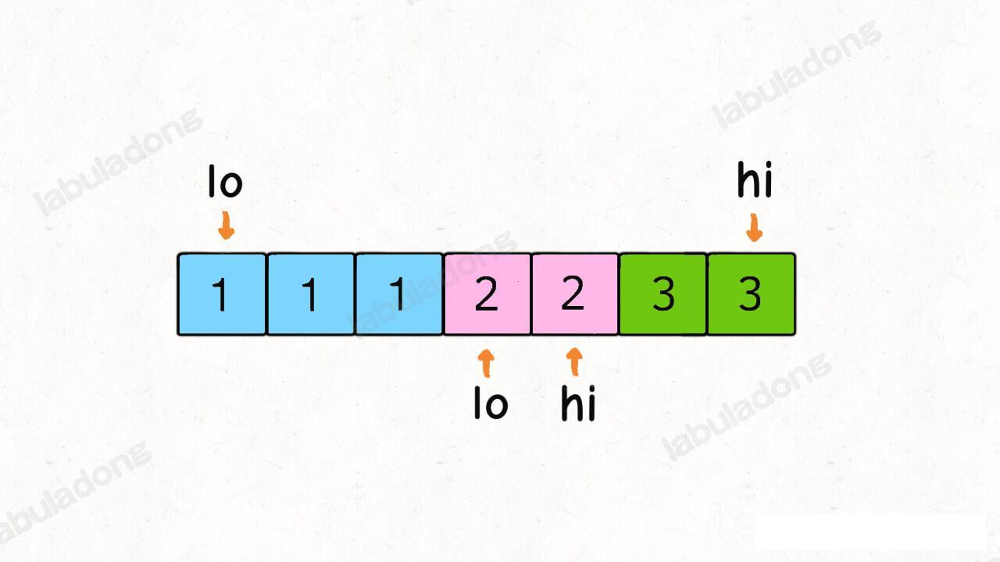
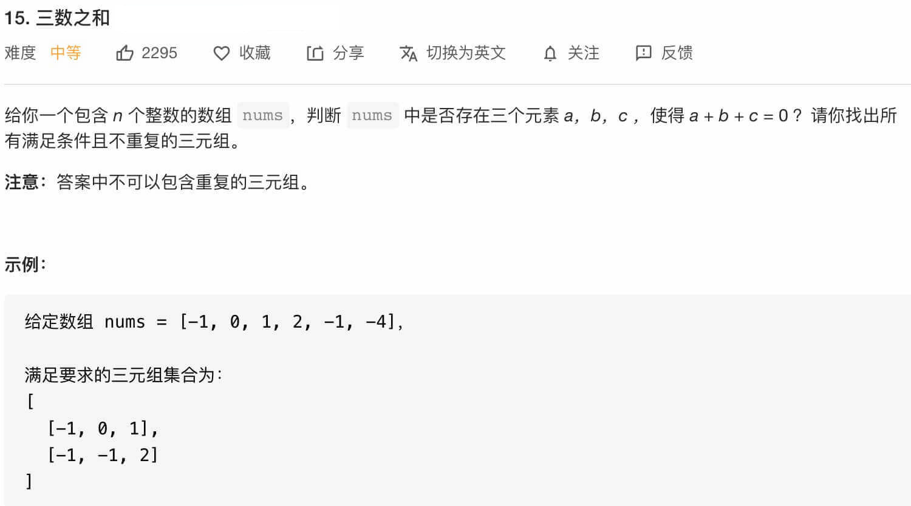
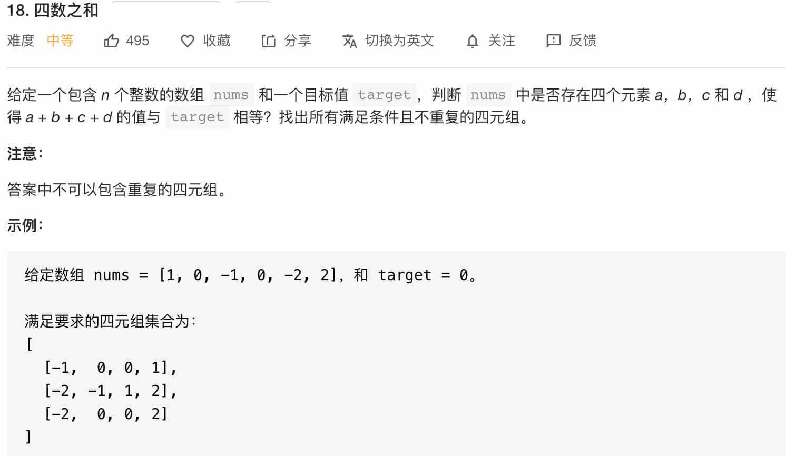
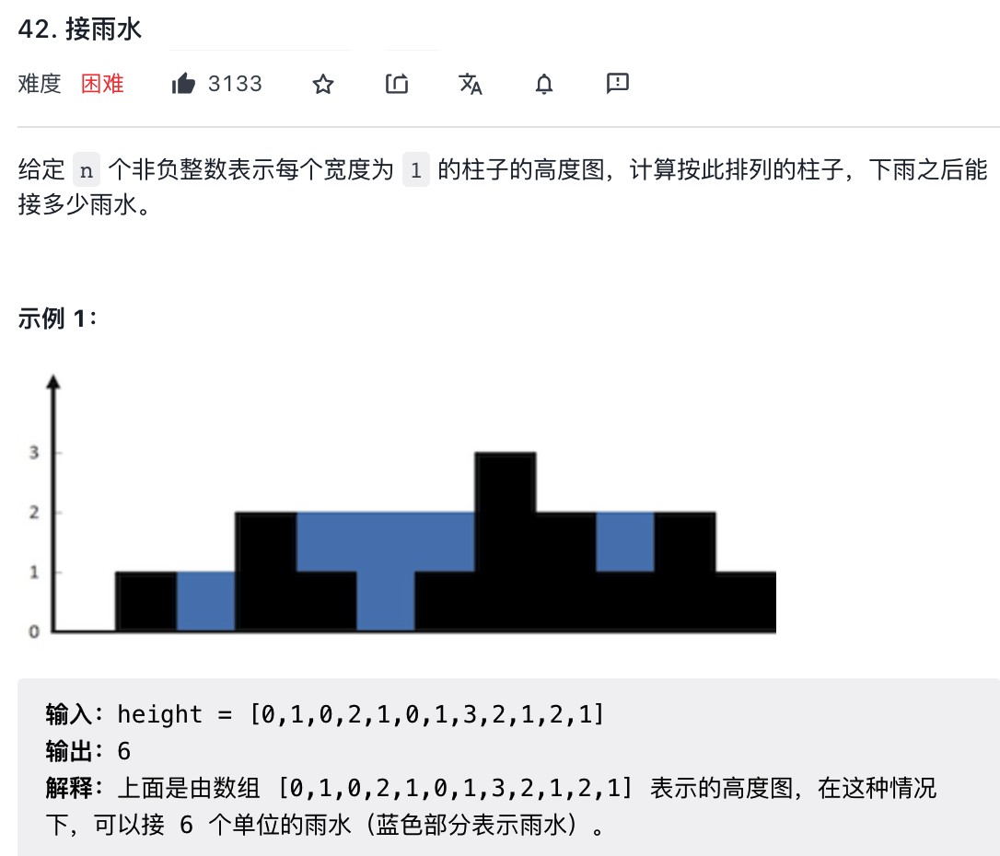
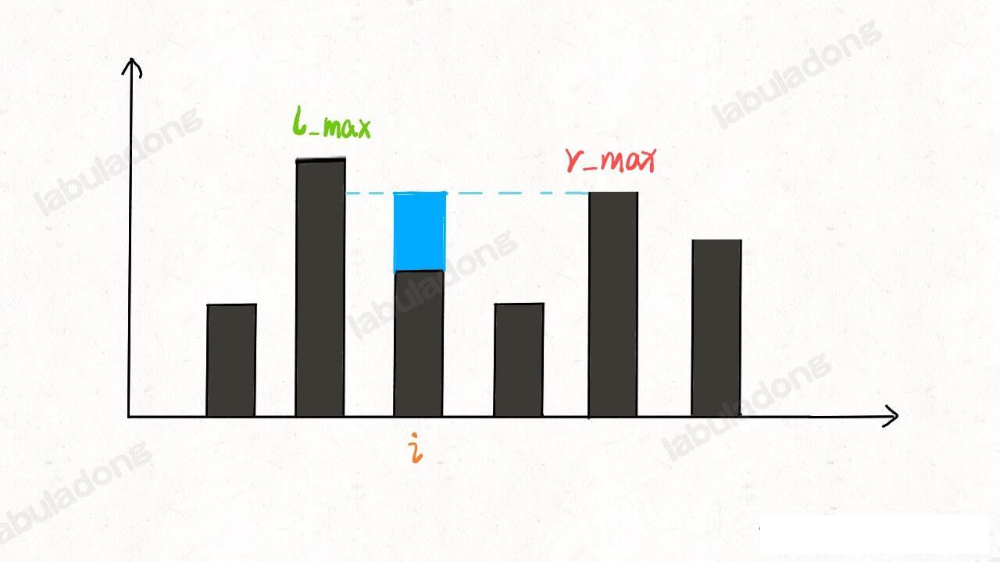
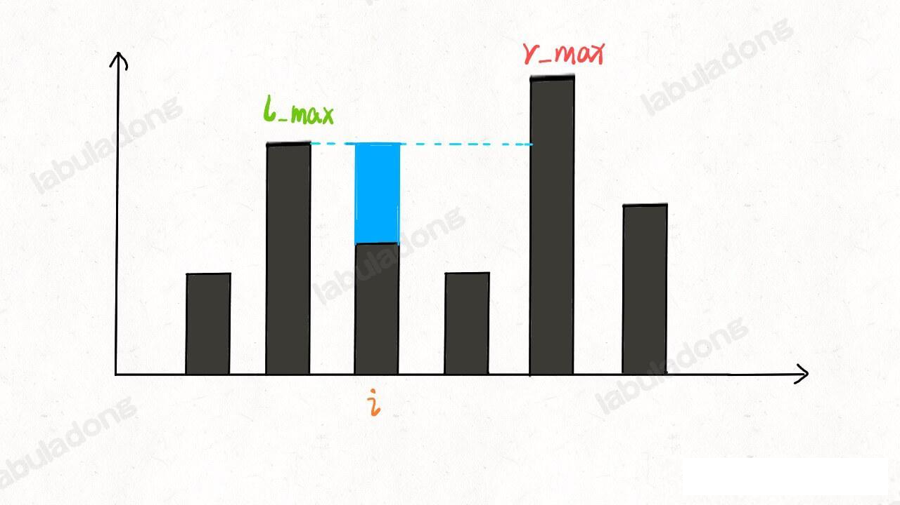
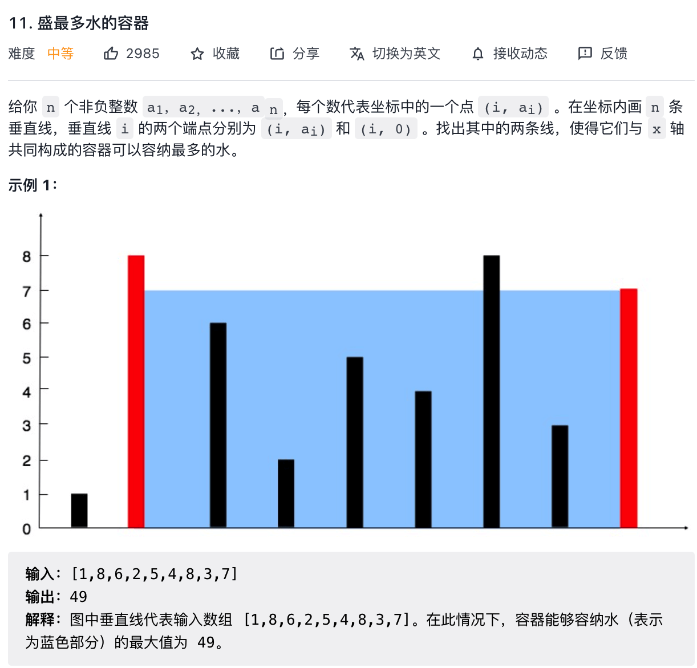

## nSum 问题 和 如何高效接雨水
### nSum 问题

leetcode 上面除了 `twoSum` 问题，还有 `3Sum`,`4Sum`, 以后如果出现 `5sum`，`6sum` 也不是不可以。

总结来说，这类 `nSum` 问题即使给你输入一个数组 `nums` 和一个目标 `target`， 让你从 `nums` 选择 `n` 个数，使得这些数字之和为 `target`。

那么，对于这类问题有没有什么好的办法用套路解决那？本章节就由浅入深，层层推进，用一个函数来解决 `nSum` 类型的问题。

**`nums` 中可能出现多对元素之和都等于 `target` 的元素对，其中不能出现重复。**

函数签名如下：

```java
public List<List<Integer>> twoSumTarget(List<Integer> nums, int target)
```

比如说输入为 `nums = [1,3,1,2,2,3]`, target = 4，那么算法返回的结果就是：[[1,3],[2,2]]（注意，我要求返回元素，而不是索引）。

对于修改后的问题，关键难点在于可能有多个和为 `target` 的数对，还不能重复，比如上述例子中的 `[1,3]` 和 `[3,1]` 就算重复，只能算一次。

首先，基本思路还是排序加双指针：

```java
public List<List<Integer>> twoSumTarget(int[] nums, int target) {
    // 先对数组排序
    Arrays.sort(nums);
    List<List<Integer>> res = new ArrayList<>();
    int lo = 0, hi = nums.length - 1;
    while (lo < hi) {
        int sum = nums[lo] + nums[hi];
        // 根据 sum 和 target 的比较，移动左右指针
        if (sum < target) {
            lo++;
        } else if (sum > target) {
            hi--;
        } else {
            res.add(Arrays.asList(nums[lo],nums[hi]));
            lo++;
            hi--;
        }
    }
    return res;
}
```

但是这样，不能解决重复的问题，比如说 `nums=[1,1,2,2,3,3], target=4`，得到的结果中 `[1,3]` 肯定会重复。

出问题的地方在于 `sum == target` 条件的 if 分支，当给 `res` 加入一次结果后，`lo` 和 `hi` 不应该简单的相向而行，而是应该跳过所有重复的元素。



所以，可以对双指针的 while 循环做出如下修改：
```java
res.add(Arrays.asList(left,right));
while(lo < hi && nums[lo] == left) lo++;
while(lo < hi && nums[hi] == right) hi--;
```

这样就可以保证一个答案只被添加一次，重复的结果都会被跳过，可以得到正确的答案。不过，受这个思路的启发，其实前面的两个 if 分支也可以做一点效率优化，跳过相同的元素：

```java
List<List<Integer>> twoSumTarget(List<Integer> nums, int target) {
    // nums 数组必须有序
    Collections.sort(nums);
    int lo = 0, hi = nums.size() - 1;
    List<List<Integer>> res = new ArrayList<>();
    while (lo < hi) {
        int sum = nums.get(lo) + nums.get(hi);
        int left = nums.get(lo), right = nums.get(hi);
        if (sum < target) {
            while (lo < hi && nums.get(lo) == left) lo++;

        } else if (sum > target) {
            while (lo < hi && nums.get(hi) == right) hi--;
        } else {
            res.add(Arrays.asList(left, right));
            while (lo < hi && nums.get(lo) == left) lo++;
            while (lo < hi && nums.get(hi) == right) hi--;
        }
    }
    return res;
}
```

接雨水的问题，我是看到 leetcode 第 11 题，盛水最多的容器，看完这道题我就懵了。这怎么解，完全陷入题目的思维当中不能自拔，没有办法跳出来思考数组常用的解法：双指针，前后指针，二分法，滑动窗口这些，这也难关，我刚从链表那里过来，直接看数组的，确实可能思维固定了。点开阿东的解题文章，重新记录笔记和思维扩散过程吧，没办法，还是得多练

这样，一个通用化的 `twoSum` 函数就写出来了，后面我们解决 `3Sum` 和 `4Sum` 的时候会复用这个函数。

这个函数的时间复杂度也非常容易看出来，双指针操作的部分虽然有很多 while 循环，但是时间复杂度还是 O(n), 而排序的时间复杂度是 O(NlogN), 所以这个函数的时间复杂度是 `O(NlogN)`。

#### 3Sum 问题

这是 leetcode 第 15 题 「三数之和」



题目就是让我们找 `nums` 中和为 0 的三个元素，返回所有可能的三元组 (tripe)，函数签名如下：

```java
List<List<Integer>> threeSum(int[] nums);
```

我们抽象下这个题，计算和为 `target` 的三元组把，跟上面的 twoSum 一样，也不允许重复的结果：

```java
List<List<Integer>> threeSum(int[] nums) {
    return threeSumTarget(nums, target);
}
List<List<Integer>> threeSumTarget(int[] nums,int target);
```

这个问题怎解决那？**很简单，穷举呗**。(这里我的思维又被局限了，心想三个数，两个数是两个指针，三个数那就是3个指针被，如果是 n 个数，那就 n 个指针，后来一想，n 个指针怎么移动？开玩笑吧？然后有看了下别人的解法，才发现我局限了，幼稚了，思维僵化了)

现在我们想找和为 `target` 的三个数，那么对于第一个数字，可能是什么？`nums` 中的每一个元素 `nums[i]` 都有可能。

那么确定了第一个数字之后，剩下的两个数字可以是什么那？其实就是和为 `target-nums[i]` 的两个数字呗，那不就是 `twoSum` 函数解决的问题吗？

因此，把 twoSum 函数稍作修改就可以复用
参考 threeSumTarget 方法，需要注意的是，类似 `twoSum`, `3Sum` 的结果也可能重复，比如输入的是 `nums=[1,1,1,2,3], target=6`, 结果会重复。

**关键点在于，不能让第一个数重复，至于后面的两个数，我们用 `twoSum` 函数保证他们不重复**。所以代码中必须用一个 while 循环来保证 `3Sum` 中第一个元素不重复。

至此，`3Sum` 问题解决了，时间复杂度不难算，排序的复杂度为 `O(NlogN)`, `twoSumTarget` 函数的双指针操作为 `O(N)`, `threeSumTarget` 函数在 for 循环中调用 `twoSumTarget`, 所以总的事件复杂度就是 `O(Nlog+N^2)=O(N^2)`。

#### 4Sum 问题，

这是 了额吐槽窦娥 18 题「四数之和」



函数签名如下：
```java
public List<List<Integer>> fourSum(int[] nums, int target);
```

都到这个份上了，`4Sum` 完全可以用相同的思路：穷举一个数字，然后调用 `3Sum` 函数计算剩下三个数，最后组合出和为 `target` 的四元组。

#### 100Sum

在 leetcode 上,`4Sum` 已经到头了，**但是回想刚才写 `3Sum` 和 `4Sum` 的过程，实际上是遵循相同的模式的。**
那么如果题目让我们求 `100Sum` 问题，怎么办？其实我们观察上面这些解法，统一出一个 `nSum` 函数：

### 接雨水问题

leetcode 第 42 题，「接雨水」挺有意思，面试中出现的频率还挺高的，讲解下这道题：

题目如下：



就是用一个数组表示一个条形图，用你这个条形图最多能接多少水。

函数签名如下：

```java
public int trap(int[] height);
```
下面我们就由浅入深介绍暴力解法->备忘录解法->双指针解法，在 O(1) 时间空间内解决这个问题

#### 一、核心思想

对于这种问题，我们不要向整体，而应该去想局部；就像之前的动态规划处理字符串问题，不要考虑处理整个字符串，而是去思考如何处理每一个字符。

这么一想，可以发现这道题的思路其实很简单。具体来说，仅仅对于位置 `i`,能装下多少水


能装 2 格水，因为 `height[i]` 的高度为 0 ，而这里最多能盛 2 格水，2-0=2.

为什么位置 `i` 最多能盛2格水那？因为，位置 `i` 能达到的水柱高度和其左边的最高柱子，右边的最高柱子有关，我们粉笔称这两柱子高度为 `l_max` 和 `r_max`; 位置 i 最大的水柱高度就是 `min(l_max,r_max)`。

更进一步，对于位置 `i`, 能够装的水为：

```java
water[i] = min(
    // 左边柱子的最大高度
    max(height[0...i]),
    // 右边柱子的最大高度
    max(height[i..end])
) - height[i]
```





这就是本问题的核心思路，我们可以简单写一个暴力算法：

参考 NSumAndRain.java 的 trapVolient 方法

有之前的思路，这个解法应该是很直接暴力的，时间复杂度O(N^2), 空间复杂度为O(1)。但是很明显这种计算 `l_max` 和 `r_max` 的方式很笨拙，一般的优化方法就是使用备忘录。

#### 二、接雨水暴力解法备忘录优化

之前的暴力解法，，不是在每个位置 `i` 都要计算 `r_max` 和 `l_max` 吗？我们直接把结果都提提前计算出来，别傻不拉几的每次都遍历，这是家复杂度不就讲下来了吗

**我们开两个数组 `l_max` 和 `r_max` 充当备忘录，`l_max[i]` 表示位置 `i` 左边最高的柱子高度，`r_max[i]` 表示位置 `i` 右边最高的柱子高度**。预先把这两个数组计算好，避免重复计算：

参考 NSumAndRain 类的 trapWithMemo 方法

这个优化其实和暴力解法思路差不多，就是避免了重复计算，把时间和空间复杂度降低为 O(N),已经是最优了，空间复杂度为O(N)。接下来看一下精妙一些的解法，能够把空间复杂度降低到O(1)。

#### 三、接雨水双指针解法

这种解法思路是完全相同的，但是在实现上手法非常巧妙，我们这次也不要提前准备备忘录了，而是用双指针，**边走边算**，节省空间复杂度。

```java
public int trap(int[] height) {
    if(height == null || height.length < 1) {
      return 0;
    }
    int left =0,right =height.length-1;
    int l_max=0,r_max=0;
    int res=0;
    while(left < right) {
      l_max = Math.max(l_max, height[left]);
      r_max=Math.max(r_max, height[right]);
      // 以上的  lmax 代表 [0,left] 之间的最高柱子，rmax 代表 [right, end] 之间的最高水柱
      if(l_max < r_max) { // 这列为什么 l_max 小就 left++，这就是我们双指针常用的方式，也符合求最大值的基本原理，
        // 因为我们求的是 min(l_max,r_max) ，如果不让 left++ ，则后面的 min(l_max,r_max) 都永远小于等于 l_max
        // 因此为了求 l_max 最大值，也就是求最大盛雨量，谁小谁先走是符合要求的
        res += l_max - height[left];
        left ++;;
      } else {
        res += r_max+ - height[right];
        right--;
      }
    }
    return res;
  }
```

#### 扩展延伸

下面我们看一道和雨水问题非常类似的题目，力扣第 11 题 「盛水最多的容器」：



函数签名如下：
```java
public int maxArea(int[] height) {
        
    }
```
这题和 接雨水问题非常类似，可以完全套用前文的思路，而且还更简单。两道题的区别在于：

**接雨水问题给出的类似一个直方图，每个左边都有宽度，而本题给出的每个恒左边是一条竖线，没有宽度**。

我们前文讨论了半天 `lmax` 和  `rmax` ，实际上都是为了计算 `height[i]` 能够装多少水(`min(lmax,rmax) - height[i]`)； 而本题中没有了 `height[i]` 的宽度问题，那自然就好办。

举个栗子，如果在接雨水的问题中，如果你知道了 height[left] 和 height[right] 的高度，你能算出来 `left` 和 `right` 之间能够盛多少水吗？

不能，因为你不知道 `left` 和 `right` 之间每个柱子具体能盛多少水，你得通过每个柱子的 `l_max` 和 `r_max` 来计算才行。

反过来，就本题而言，你知道了 `height[left] ` 和 `height[right]` 的高度，能算出 `left` 和 `right` 之间的能够盛下多少水吗？

可以，因为本题中竖线没有宽度，不考虑也就是竖线的容积，所以 `left` 和 `right` 之间能够盛的水就是：

```py
min(heigh[left],height[right]) * (right - left)
```

类似接雨水的问题，高度依旧是由 `min(height[left], height[right])` 较小的值决定的。

解决这道题依然是采用双指针技巧：

**用 `left` 和 `right` 两个指针从两段向中心收缩，一边搜索一遍计算 `[left,right]` 之间的巨型面积，取最大面积即使答案**
