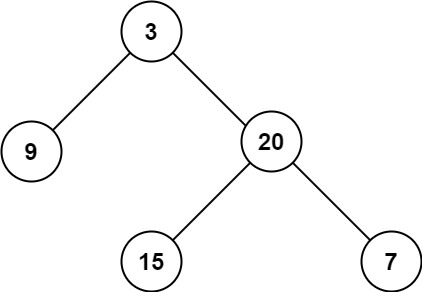
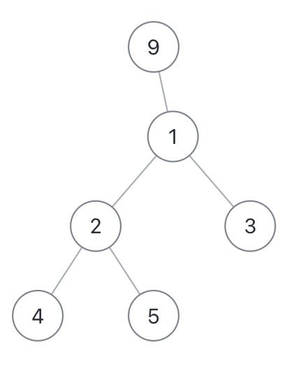

## 二叉树

### 二叉树，纲领篇

二叉树的思维分两类：

**1、*是否可以通过遍历一遍二叉树得到答案**？如果可以，用一个 `traverse` 函数配合外部变量来实现，这叫「遍历」的思维模式。

**2、是否可以定义一个递归函数，通过子问题(子树)的答案推导出原问题的答案**？如果可以，写出这个递归函数的定义，并充分利用这个函数的返回值，这叫「分解问题」的思维模式。

无论使用那种思维模式，我们都要思考：

**如果单独抽出一个二叉树节点，它需要做什么事情？需要在什么时候(前/中/后序位置)做**？ 其他的节点不用我们操心，递归函数会帮我们在所有的节点上执行相同的操作。

二叉树的思维非常重要，如果熟练掌握之后，反手就可以用到 动态规划，回溯算法(即将展开)，分治算法(即将展开)，图论算法(即将展开)，这也是我们一直强调的框架思维的原因。

#### 深入理解前中后序

带着问题去思考：

1、你理解的二叉树前中后序遍历是什么，仅仅是三个顺序不同的 List 吗？
2、请分析，后续遍历有什么特殊之处？
3、情分析，为什么对多叉树没有中序遍历？

下面给出二叉树的遍历框架：
```java
void traverse(TreeNode node) {
    if(node == null) {
        return;
    }
    // 前序位置
    traverse(root.left);
    // 中序位置
    traverse(root.right);
    // 后序位置
}
```

先不管所谓前中后序，单看 `traverse` 函数，你说它在做什么？

其实它就是一个能够遍历所有二叉树节点的函数，和之前我们遇到的数组或者链表本质上没有任何区别：

单链表和数组的遍历可以是迭代的，也可以是递归的，**二叉树这种结构无非就是二叉链表**，由于没有办法简单改写成迭代形式，所以一般来说二叉树的遍历框架都是递归的形式。

我们也注意到，只要是递归的形式遍历，都可以有前序位置和后序位置，分别在递归之前和递归之后。

**所谓前序位置，就是刚进入一个节点(元素)的时候，后序位置就是即将离开一个节点（元素）的时候**，那么进一步，你把代码卸载不同位置，代码执行时机也不同。

**前中后序遍历二叉树过程中处理每一个节点的三个特殊时间点**，绝不仅仅是三个顺序不同的 List：

前序位置的代码在刚刚进入一个二叉树节点的时候执行；

后序位置的代码在将要离开一个二叉树节点的时候执行；

中序位置的代码在一个二叉树节点左子树都遍历完，即将开始遍历右子树的时候执行。

**二叉树的所有问题，就是让你在前中后序位置注入巧妙的代码逻辑，去达到自己的目的，你只需要单独思考一每一个节点应该做什么，其他的不用你管，抛给二叉树遍历框架，递归会在所有节点上做相同的操作**。

#### 两种解题思路

**二叉树的递归分解分为两类思路，第一类是遍历，第二类是通过分解问题计算出答案，这两类思路分别对应着 回溯算法 和 动态规划核心框架**

leetcode 第 104 题，「二叉树的最大深度」

所谓的最大深度，就是根节点到「最远」叶子节点的最长路径的节点数，比如下面这颗二叉树，算法应该返回 3：



解法参见 maxDepth() 方法，

这个解法应该很好理解，但是为什么需要在前序位置增加 depth，在后序位置减小 depth ?

因为前面说了，前序位置是进入一个节点的时候，后序位置是离开一个节点的时候，depth 记录当前递归到的节点深度，你把 traverse 理解成在二叉树上游走的一个指针，所以当然要这样维护。

至于对 maxDepth 的维护，我们放到前中后序的位置都可以，只要保证在进入节点之后，离开节点之前就行了。

当然，我们也很容易发现一颗二叉树的最大深度可以通过子树的最大深度推导出来，**这就是分解问题计算答案的思路**。

```java
int maxDepth2(TreeNode node) {
        if (node == null) {
            return 0;
        }
        int maxLeftDepth = maxDepth2(node.left);
        int maxRightDepth = maxDepth2(node.right);
        return Math.max(maxLeftDepth, maxRightDepth) + 1;
} 
```

只要明确递归函数的定义，这个解法也不难理解，但是为什么主要的代码逻辑集中在后序位置？

因为这个思路正确的核心在于，你确实可以通过子树的最大深度推导出原树的深度，所以当然要首先利用递归函数的定义算出左右子树的最大深度，然后推算出原树的最大深度，主要逻辑自然放在后续位置。

综上，遇到一道二叉树的题目时通用的思考过程是：

**1、是否可以通过遍历一遍二叉树得到答案**？如果可以，用一个 `traverse` 函数配合外部变量来实现。

**2、是否可以定义一个递归函数，通过子问题(子树)的答案推导出原问题的答案**？如果可以，写出这个递归函数的定义，并充分利用这个函数的返回值。

**3、无论使用哪一种思维模式，你都要明白二叉树的每一个节点需要做什么，需要在什么时候(前中后序)做**。

#### 后续位置的特殊之处

说后序位置之前，先简单说下中序和前序。

中序位置主要用在 BST 场景中，你完全可以把 BST 的中序遍历(左中右)认为是遍历有序数组。

前序位置本身其实没什么特别的性质，之所以你发现好像很多问题都是在前序位置写代码，实际上是因为我们习惯把哪些对前中后序位置不敏感的代码写在前序罢了。

我们会发现，**前序位置的代码执行时自顶向下的，而后序位置的代码执行时自底向上的**

**但这里面大有玄妙，意味着前序位置的代码只能从函数参数中获取父节点传递过来的数据，而后续位置的代码不仅可以获取参数数据，还可以获取到子树通过函数返回值传递回来的数据**。

举个具体的例子，现在给你一颗二叉树，问 2 个简单的问题：

1、如果把根节点看做第 1 层，如何打印出每一次的那个节点所在的层数？

2、如何打印出每个节点的左右子树各多少节点？

第一题可以这样写出代码：

```java
// 二叉树遍历函数
void traverse(TreeNode root, int level) {
    if (root == null) {
        return;
    }
    // 前序位置
    printf("节点 %s 在第 %d 层", root, level);
    traverse(root.left, level + 1);
    traverse(root.right, level + 1);
}

// 这样调用
traverse(root, 1);
```

第二个问题可以这样写

```java
// 定义：输入一棵二叉树，返回这棵二叉树的节点总数
int count(TreeNode root) {
    if (root == null) {
        return 0;
    }
    int leftCount = count(root.left);
    int rightCount = count(root.right);
    // 后序位置
    printf("节点 %s 的左子树有 %d 个节点，右子树有 %d 个节点",
            root, leftCount, rightCount);

    return leftCount + rightCount + 1;
}

```

**这个问题的根本区别在于：一个节点在第几层，你从根节点遍历过来的过程就能顺带记录，用递归函数的参数就能传递下去；而以一个节点为根的整棵子树有多少节点，你需要遍历完子树后才能数清楚，然后通过递归函数的返回值拿到答案**。

leetcode 543 题，「二叉树的直径」，让你计算一颗二叉树的最长直径长度

所谓二叉树的「直径」长度，就是任意两个节点之间的路径长度。最长「直径」并不一定要穿过根节点，比如下面这颗二叉树



它的最长直径是 3，即 `[4,2,1,3]`,`[4,2,1,9]` 或者 `[5,2,1,3]` 这几条「直径」长度。

解决这题的关键在于，每一条二叉树的「直径」长度，就是一个节点的左右子树的最大深度之和。

最大深度的算法我们刚才实现过了，上述思路就可以写成如下代码：
```java
class Solution {
    // 记录最大直径的长度
    int maxDiameter = 0;

    public int diameterOfBinaryTree(TreeNode root) {
        // 对每个节点计算直径，求最大直径
        traverse(root);
        return maxDiameter;
    }

    // 遍历二叉树
    void traverse(TreeNode root) {
        if (root == null) {
            return;
        }
        // 对每个节点计算直径
        int leftMax = maxDepth(root.left);
        int rightMax = maxDepth(root.right);
        int myDiameter = leftMax + rightMax;
        // 更新全局最大直径
        maxDiameter = Math.max(maxDiameter, myDiameter);
        
        traverse(root.left);
        traverse(root.right);
    }

    // 计算二叉树的最大深度
    int maxDepth(TreeNode root) {
        if (root == null) {
            return 0;
        }
        int leftMax = maxDepth(root.left);
        int rightMax = maxDepth(root.right);
        return 1 + Math.max(leftMax, rightMax);
    }
}
```

这个解法是正确的，但是运行时间很长，原因也很明显，`traverse` 遍历每个节点的时候还回调用递归函数 `maxDepth`, 而 `maxDepth` 是要遍历子树的所有节点，所以最好时间复杂度是  O(N^2)。

这就出现了前面所说的问题，**前序位置无法获取子树的信息，所以只能让每个节点调用 `maxDepth` 函数去算子树的深度**。

那如何优化？我们应该把计算「直径」的逻辑放在后序位置，准确地说是放在 maxDepth 的后序位置，因为 maxDepth 的后序位置是知道左右子树的最大深度的。稍微改下代码，如下所示

```java
int diameterOfBinaryTree(TreeNode root) {
        maxDepth3(root);
        return maxDiameter;
    }

    int maxDepth3(TreeNode node) {
        if(node == null) {
            return 0;
        }
        int leftMaxDepth = maxDepth3(node.left);
        int rightMaxDepth = maxDepth3(node.right);
        // 后续位置，顺便计算最大直径
        // 对每个节点计算直径
        int diameter = rightMaxDepth + leftMaxDepth;
        // 更新全局最大直径
        maxDiameter = Math.max(maxDiameter, diameter);

        return Math.max(leftMaxDepth, rightMaxDepth) + 1;
    }
```

这下时间复杂度只有 `maxDepth` 函数的 O(N) 了。

这里照应一下前文，：遇到子树问题，首先想到的是给函数设置返回值，然后在后续位置做文章。

### 以树的视角看 动态规划/回溯/DFS 算法的区别联系。

动态规划/回溯算法就是二叉树算法的两种不同表现形式。另外 **DFS 算法和回溯算法非常类似，只是在细节上有所区别**。

这个细节上的差别是什么那？其实就是「做选择」和「撤销选择」到底是在 for 循环里面还是外面，DFS 算法在外面，回溯算法在里面。

**动归/DSF/回溯算法都可以看做二叉树问题的扩展，只是他们关注点不同**：

* **动态规划算法属于分解问题的思路，它的关注点在整颗「子树」**
+ **回溯算法属于遍历的思路，它的关注点在节点间的「树枝」**。
+ **DFS 算法属于遍历的思路，它的关注点在单个「节点」**。

下面举三个例子来说明，

**第一个例子**，给你一颗二叉树，请用分解问题的思路写一个 `count` 函数，计算这颗二叉树共有多少节点。代码很简单：

```java
int count(TreeNode node) {
        if(node == null) {
            return 0;
        }
        int leftCount = count(node.left);
        int rightCount = count(node.right);
        return leftCount + rightCount + 1;
    }
```
**你看，这就是动态规划分解问题的思路，它的着眼点永远都是结构相同的整个子问题，类比到二叉树上就是「子树」**。

第二个例子，给你一颗二叉树，请你用遍历的思路写一个 `traverse` 函数，打印出遍历这颗二叉树的过程，代码如下：

```java
void traverse(TreeNode root) {
    if (root == null) return;
    printf("从节点 %s 进入节点 %s", root, root.left);
    traverse(root.left);
    printf("从节点 %s 回到节点 %s", root.left, root);

    printf("从节点 %s 进入节点 %s", root, root.right);
    traverse(root.right);
    printf("从节点 %s 回到节点 %s", root.right, root);
}
```
不难理解吧，我们现在从二叉树进阶成多叉树，代码也是类似的：

```java
// 多叉树节点
class Node {
    int val;
    Node[] children;
}

void traverse(Node root) {
    if (root == null) return;
    for (Node child : root.children) {
        printf("从节点 %s 进入节点 %s", root, child);
        traverse(child);
        printf("从节点 %s 回到节点 %s", child, root);
    }
}
```

这个多叉树的遍历框架就可以延伸出 回溯算法框架 ：

```java
void backtrack(...) {
    for (int i = 0; i < ...; i++) {
        // 做选择
        ...

        // 进入下一层决策树
        backtrack(...);

        // 撤销刚才做的选择
        ...
    }
}
```

**你看，这就是回溯算法遍历的思路，它的着眼点永远是在节点之间移动的过程，类比到二叉树就是「树枝」**。

```java
// 回溯算法核心部分代码
void backtrack(int[] nums) {
    // 回溯算法框架
    for (int i = 0; i < nums.length; i++) {
        // 做选择
        used[i] = true;
        track.addLast(nums[i]);

        // 进入下一层回溯树
        backtrack(nums);

        // 取消选择
        track.removeLast();
        used[i] = false;
    }
}

```

第三个例子，给你一颗二叉树，请你写一个 traverse 函数，把这颗二叉树上的每个节点的值都加一。代码很简单，如下所示：
```java
void traverse(TreeNode root) {
    if (root == null) return;
    // 遍历过的每个节点的值加一
    root.val++;
    traverse(root.left);
    traverse(root.right);
}
```

你看，这就是 DFS 算法遍历的思路，它的着眼点永远是在单一的节点上，类比到二叉树就是处理每个「节点」。

有了上面两个例子，我们就能很好地理解回溯算法和 DSF 算法代码中的「做选择」和「撤销选择」的位置不同了，请看下面两段代码：

```java
// DFS 算法把「做选择」「撤销选择」的逻辑放在 for 循环外面
void dfs(Node root) {
    if (root == null) return;
    // 做选择
    print("我已经进入节点 %s 啦", root)
    for (Node child : root.children) {
        dfs(child);
    }
    // 撤销选择
    print("我将要离开节点 %s 啦", root)
}

// 回溯算法把「做选择」「撤销选择」的逻辑放在 for 循环里面
void backtrack(Node root) {
    if (root == null) return;
    for (Node child : root.children) {
        // 做选择
        print("我站在节点 %s 到节点 %s 的树枝上", root, child)
        backtrack(child);
        // 撤销选择
        print("我将要离开节点 %s 到节点 %s 的树枝上", child, root)
    }
}
```

#### 层序遍历(其实就是图论中的宽度优先遍历)

二叉树题型主要是用来培养递归思维的，而层序遍历属于迭代遍历，也比较简单，这就过一下代码框架把：

```java
void levelTraverse(TreeNode root) {
    if(root==null) return;
    Queue<TreeNode> queue = new LinkedList<TreeNode>();
    queue.add(root);
    while(!queue.isEmpty()) {
        int sz = queue.size();
        for(int i=0;i<sz;i++) {
            TreeNode node = queue.poll();
            //做业务处理
            printf(node.val)
            // 将下一层节点放入队列
            if(node.left != null) queue.offer(node.left);
            if (node.right != null) queue.offer(node.right);
        }
    }
}
```

宽度优先框架那也就是 BFS 基本上都是采用这个套路，常用于求无权图的最短路径问题。

当然这个框架还可以灵活修改，题目不需要记录层数(步数)时可以去掉框架中的 for 。
