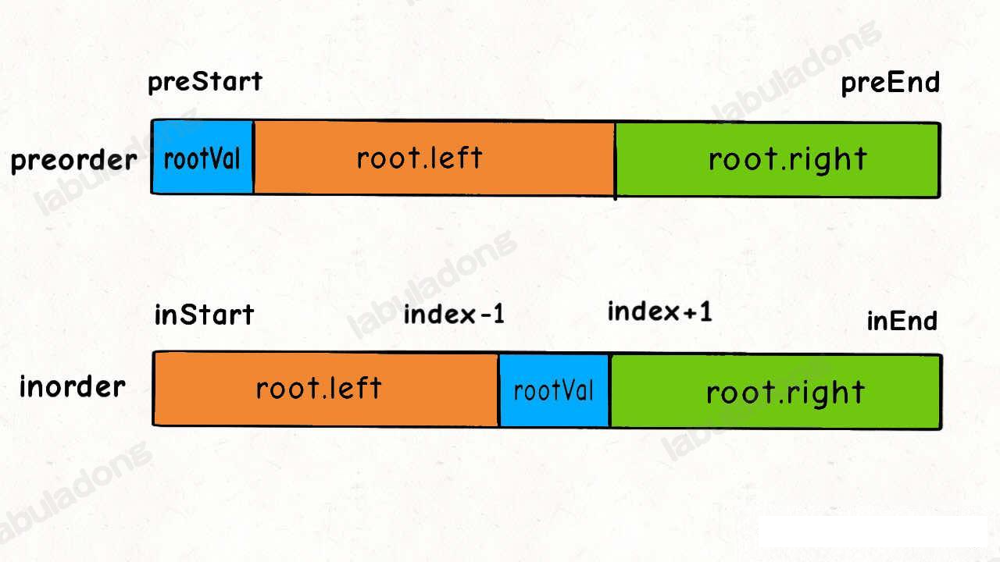
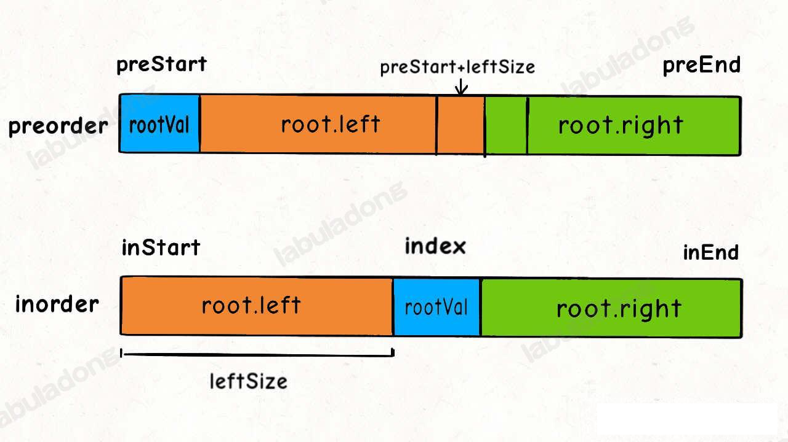
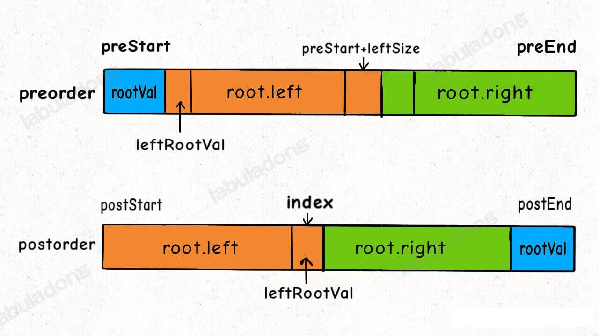
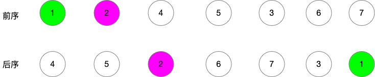
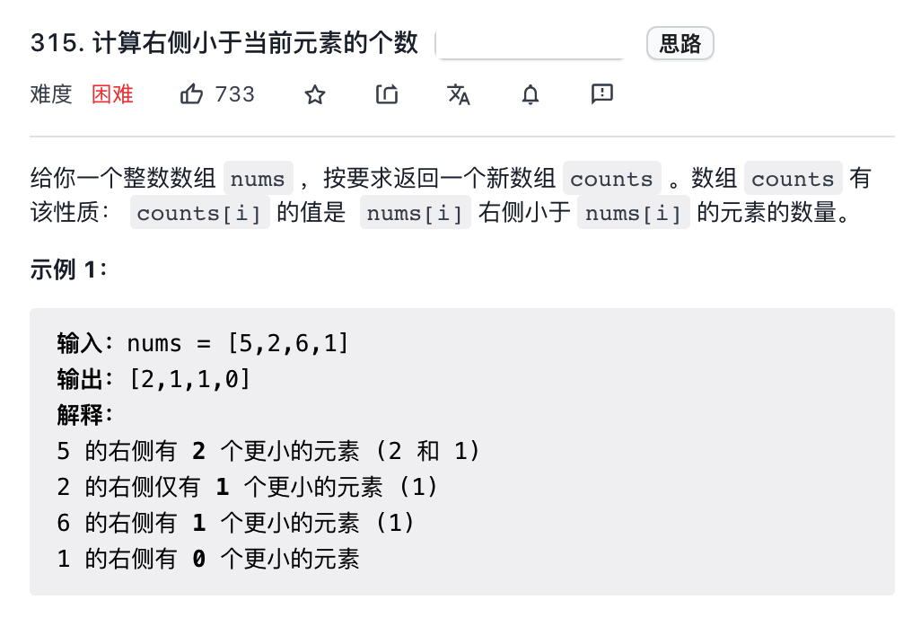
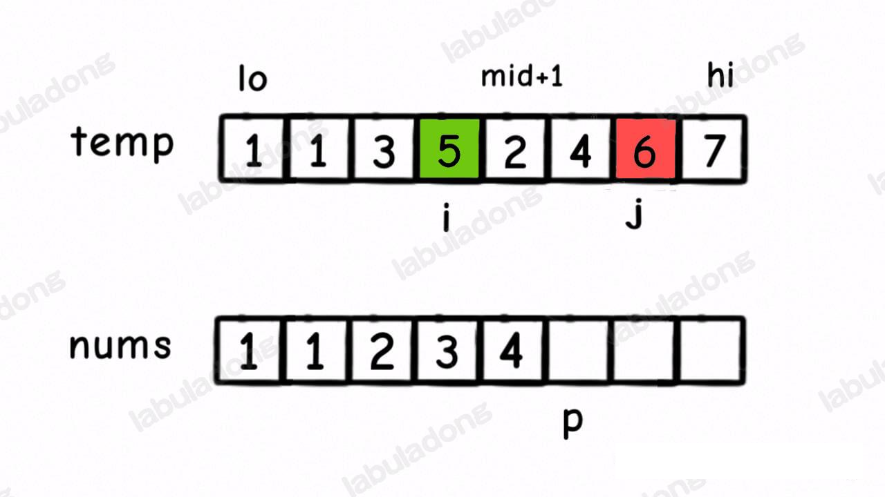
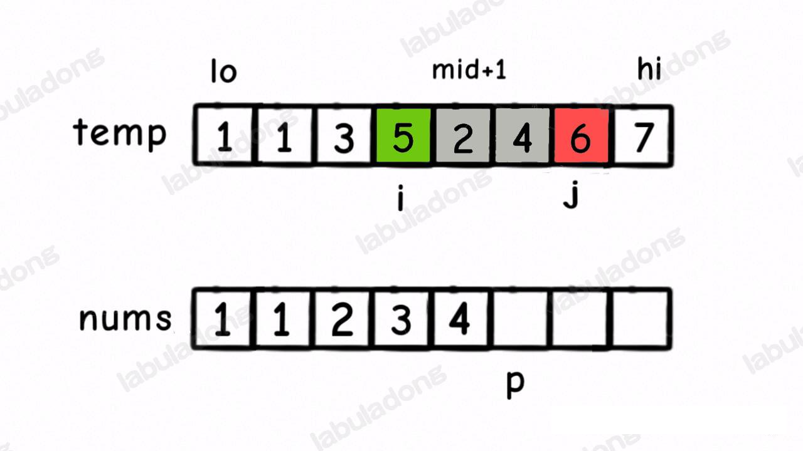
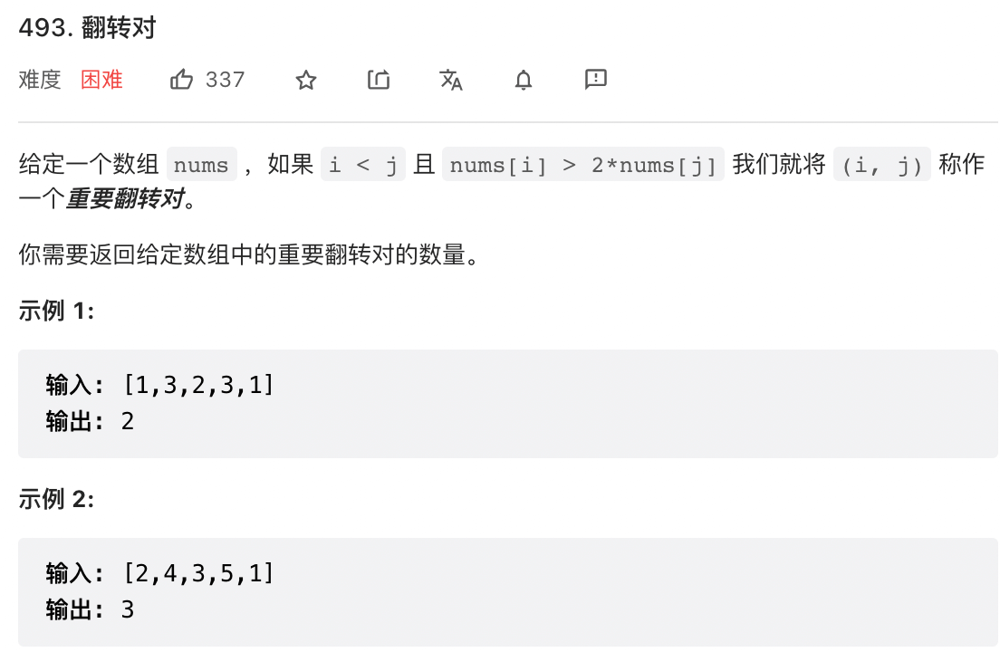
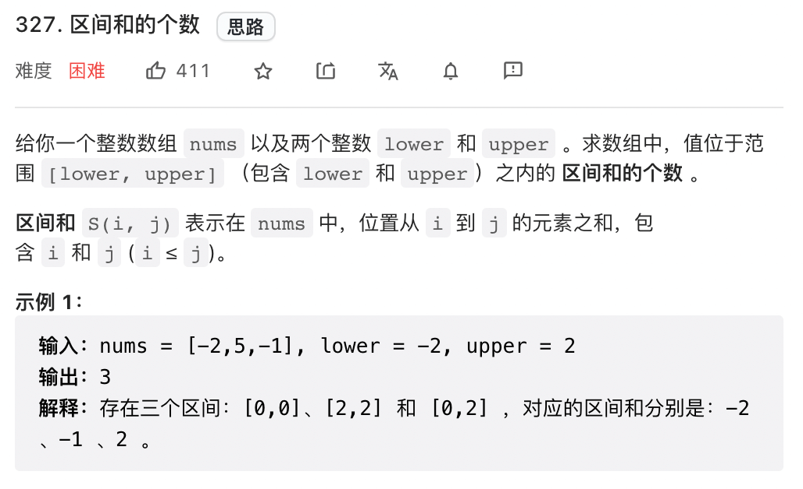

### 构造二叉树



最终构造树的索引结果如下所示



上图为前序和中序构造二叉树

下图为 前序和后序构造二叉树





通过图我们可以发现 leftLength = index - postStart + 1;


### 二叉树的序列化和反序列化

总结概括，当**二叉树中节点的值不存在重复时**：

1. 如果你的序列化结果中**不包含空指针信息**，且只给出**一种**遍历顺序，那么你无法还原出唯一的一颗二叉树。
2. 如果你的序列化结果中**不包含空指针信息**，且会给出**两种**遍历顺序，那么按照前文构造二叉树所说，分为两种情况：
   2.1 如果你给出的前序和中序，或者后序和中序，那么可以还原出唯一的二叉树。
   2.2 如果你给出的是前序和后序，那么你无法还原出唯一的一颗二叉树。
3. 如果你的序列化结果中包**含空指针信息**，且你只给出**一种**遍历顺序，也要分两种情况：
   3.1 如果你给出的是前序或者后序，那么你可以还原出唯一的一颗二叉树
   3.2 如果你给出的是中序，那么你无法还原出唯一的二叉树。


### 归并排序在二叉树中的使用

#### 计算右侧小于当前元素的个数

leetcode 315 题



这道题用比较数学的语言描述一下，就是题目让你求一个 count 数组，使得:
```sql
count[i] = COUNT(j) where j > i and nums[j] < nums[i];
```
这道题和归并有什么关系呢，主要在 merge 函数，**我们在使用 merge 函数合并两个有序数组的时候，其实是可以知道一个元素 nums[i] 后面有多少个元素比 nums[i] 小的**

具体来说，比如下面这个场景：



这时候我们应该把 temp[i] 放到 nums[p] 上，因为 temp[i] < temp[j]。

但是就在这个场景下，我们还可以知道一个信息，5 后面比 5 小的元素个数就是区间  [mid+1,j) 中的元素个数，即 2 和 4 这两个元素。



**换句话说，在对 nums[lo..hi] 合并的过程中，每当执行 nums[p] = temp[j] 时，就可以确定 temp[i] 这个元素后面比它小的元素个数为 j-mid-1**。(j是开区间，个数刚刚 j - (mid+1))。

发现这个规律后，我们需要在 merge 中添加两行代码即可解决这个问题。

#### 翻转对



我们把这道题的表述方式修改下，注意和上一道题对比：

这里我们同样是给出一个 count 数组，其中 
```sql
count[i] = COUNT(j) where j>i and nums[i] > 2*nums[j]
```

然后求出这个 count 数组的所有元素之和。

你看这样说其实和题目一个以上，而且和上一道题非常类似，只不过上一题求的是 nums[i] > nums[j], 这里求的是 nums[i] > 2*nums[j] 罢了

详细方法参见 mergeAndReversePair

#### 区间和的个数



这道题说的比较隐晦，其实是让我们计算区间和落在 [lower, upper] 中的所有子数组的个数。

拍脑袋暴力的解法这里就不说了，依然是嵌套for 循环，这里还是说利用归并排序实现的高效算法

解决这道题，要用到前面所学的 前缀数组 preSum 区间和 distanceSum[i,j] 就是 preSum[j+1] - preSum[i]

继续使用 sql 来表示的话，就是如下：
```sql
count[i] = count(j) where lower <= preSum[j] - preSum[i] <= upper
```
然后求出这个 count 数组中所有元素的和。

有了前面两道题的铺垫，我们来试着写出答案