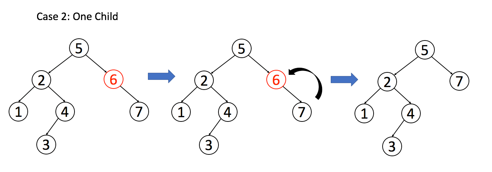

## 二叉搜索树

### 二叉搜索树的基本操作

#### 验证合法的 BST
leetcode 98 题，「验证二叉搜索树」，就是让你判断输入的 BST 是否合法。注意，按照 BST 左小右大的特性，每个节点都要判断你自己是否是合法的 BST 节点，要做的事情除了比较自己和左右孩子，还要注意一些其他东西，举个栗子


如上图所示，如果只是比较根节点及其左右子节点，那么上图是符合要求的，但是根据 BST 的定义，BST 的每个节点应该小于右子树的**所有节点**。

**出现问题的原因在于，对于每一个节点 root, 代码如果只是检查了它的左右孩子是否符合左小右大的原则；但是根据 BST 的定义，root 整个左子树都要小于 root.val ， 整个右子树都要大于 root.val**。

解决问题的关键是我们要想办法把祖父节点带上，这样递归的时候加上祖父节点的限制

#### 在 BST 中搜素元素

leetcode 700 题，「二叉搜索树中的搜素」，就是让你在 BST 中搜索值为 target 的节点

跟怒 bst 的特性，我们搜素的时候 让 根节点和 target 比较，如果 根节点 < target ，则去 右子树，如果 根节点 <  target 则取左子树搜索
这样就能实现二分搜索 BST 


#### 在 BST 中插入一个数

对数据结构的操作无非就是遍历 + 访问，遍历就是「找」，访问就是「改」。具体到问题，插入一个数，就系先找到插入位置，然后进行插入操作。

上一个问题，我们总结了 BST 中的遍历框架，就是「找」的问题。直接套框架，加上「改」的操作即可。**一旦涉及到「改」，就类似二叉树的构造问题(ps:还没涉及)，函数就要返回 TreeNode 类，并且要对递归调用的返回值进行接收**

#### 在 BST 中删除一个元素

这个问题稍微复杂，跟插入操作类似，先「找」再「删」，先把框架写出来再说
```java
TreeNode deleteNode(TreeNode root, int key) {
    if(root.val == key) {
        // 找到了，进行删除
    } else if(root.val > key) {
        // 去左子树寻找
        root.left = deleteNode(root.left, key);
    } else if(root.val < key) {
        // 去右子树寻找
        root.right = deleteNode(root.right,key);
    }
    return root；
}
```
找到了目标节点，比如说是节点 A， 如何删除这个节点，这是难点。因为删除节点的同时不能破坏 BST 的性质。有三种情况，用图片来说明。

**情况1**：`A` 恰好是末端节点，两个子节点都为空，那么它可以当初去世了。


```java
if(root.left == null && root.right == null) {
    return null;
}
```

**情况2**：`A` 只有一个非空子节点，那么它要让这个孩子接替自己的位置



```java
// 排除了情况 1 之后
if(root.left == null) return root.right;
if(root.right == null) return root.left;
```

**情况 3**：`A` 有两个子节点，麻烦了，为了不破坏 BST 的性质，`A` 必须找到左子树最大的那个节点，或者右子树最小的那个节点来代替自己。我们以第二种方式讲解


```java
if(root.left != null && root.right != null) {
    // 找到右子树最小的节点
    TreeNode minNode = getMin(root.right);
    // 把 root 改成 minNode
    root.val = minNode.val;
    // 转而去删除 minNode
    root.right = deleteNode(root.right, minNode.val);
}
```

三种情况分析完毕，填入框架，简化下代码，

#### 在 BST 中寻找第 k 个元素

leetcode 第 230 题，「寻找搜索树中第 k 小的元素」，题目如下：


这个需求很常见，一个直接的思路就是升序排序，然后找第 `k` 个元素呗。BST 的中序遍历其实就是升序排序的结果，寻找第 `k` 个元素肯定不是什么难事

```java
TreeNode kthNode;
    int counter;

    TreeNode kthSmallest(TreeNode root, int k) {
        traverseMidBST(root, k);
        return kthNode;
    }

    void traverseMidBST(TreeNode root,int k) {
        if(root == null) {
            return ;
        }
        traverseMidBST(root.left, k);
        // 中序遍历
        counter++;
        if(counter == k) {
            kthNode = root;
        }
        traverseMidBST(root.right, k);
    }
```

这道题就做完了，不过还是要多说几句，因为这个解法并不是最高效的解法，而是仅仅适合用于这道题。

按照我们刚才所说，利用「BST 中序遍历就是升序排序结果」这个性质，每次寻找第 k 小的元素都要中序遍历一遍，最坏的时间复杂度是 O(N), N 是 BST 的节点数。

要知道 BST 的性质是非常牛逼的，像红黑树这种改良的自平衡 BST，增删改查都是 O(longN) 的复杂度，让你算一个第 k 小的元素，时间复杂度竟然要 O(N), 有点低效了。

我们想一下 BST 的操作为什么这么高效？就拿搜索某一个元素来说，BST 能够在对数时间找到该元素的根本原因还是在 BST 的定义里，左子树小右子树大嘛，所以每个节点都可以通过对比自身的值判断去左子树还是右子树搜索目标值，从而避免全树遍历，达到对数级复杂度。

那么回到这个问题，如果想找到第 k 小的元素，或者说找到排名为 k 的元素，如果想达到对数级别的复杂度，关键在于每个节点得知道他自己排第几。

比如说题目要求查找排名为 k 的元素，当前节点知道自己的排名为 m， 那么我们可以找到比较 m 和 k 的大小：

1、如果 m==k, 显然就是找到了第 k 个元素，返回当前节点就行

2、如果 `k<m`, 那么说明排名为 k 的元素在左子树。

3、如果 `k>m`, 那么说明排名为 k 的元素在右子树，所以可以去右子树搜索第 k -m -1 个元素

这样就可以把时间降低到 `O(logN)` 了。

那么如果让每个节点知道自己的排名那？

这就是我们之前说的，需要在二叉树节点中维护额外的信息。**每个节点需要记录，以自己为根的这颗二叉树有多少个节点**。

也就是 TreeNode 类中需要增加 size 这个变量。

有了 size 字段，外加 BST 节点左小右大的性质，对于每个节点就可以通过 node.left 推导出 node 的排名？(有些节点 node.left 为null，但是有排名)

当然，size 字段需要在增删元素的时候维护。（后面我们会重写一般参考算法 4 的 BST，在增删元素的时候维护 size 值）

(PS: 最终我使用剑指 offer 中的循环方式实现遍历，解决了此问题，leetcode 中运行耗时为 0ms)


#### BST 转化累加树


leetcode 第 538 题和 1038 题都是这道题，完全一样。


题目应该不难理解，比如图片中的节点 5，转化和曾累加树的话，比 5 大的节点有 6,7,8 ，加上 5 本身，所以累加树这个基点的值应该是 5+6+7+8=26。


### 快速排序与二叉搜索树

首先我们来看下快速排序的代码框架

```java
void sort(int[] nums,int lo, int hi) {
    if(lo>=hi) {
        return 
    }
    // 对 nums[lo..hi] 进行切分，使得 nums[lo..p-1] <= nums[p] <= nums[p+1..hi]
    int p = partition(nums,lo,hi);
    // 再对左右子数组进行切分
    sort(nums,lo, p-1);
    sort(nums, p+1, hi);
}
```
其实对比之后，你会发现，快速排序就是一个二叉树的前序遍历(ps：这个是针对递归方法的快速排序，循环方式的快速排序，就跟二叉树的前序遍历八竿子打不着了)

针对递归版本的快速排序，总结成一句话就是

**快速排序是先将一个元素排好序，然后再将剩余元素排好序**。（ps:这里说的排好序，是指将一个元素所在的位置找到，比如 pivort 的值），也就是上述框架中 `partition `函数干得事情，其实就是把 `nums[p]` 这个元素排好序。

一个元素被排好序，然后呢？你再把剩下的元素排好序不就得了

剩下的元素有哪些？左边一坨，右边一坨，然后对子数组进行递归，利用 `partition` 函数把剩下的元素也排好序。

**从二叉树的视角，我们可以把子数组 `nums[lo..hi]` 理解成二叉树节点上的值，`sort` 函数理解成二叉树的遍历函数**。

最后形成的这颗二叉树是什么？是一颗**二叉搜索树BST**。

**我们甚至可以这样理解：快速排序的过程是一个构造二叉搜索树的过程**。

谈到二叉搜索树的构造，那就不得不说二叉搜索树不平衡的极端情况，极端情况下二叉搜索树会退化成一个链表，导致操作效率大幅降低。

快速排序也有类似的情况，如果每次partition 选取的 pivort 都运气特别背，这样会导致每次选取的元素一边特别少，一边特别多。这样的话，时间复杂度会大幅上升。

**为了避免这种极端情况，我们可以引入随机性**。随机性的常见方式是排序之前对整个数组执行 shuffle 算法进行打乱，或者在 `partition` 函数中随机选取元素作为切分点，我们这里采用前者。

##### 快速排序代码的实现
```java
static class Quick {
        public static void sort(int[] nums) {
            Random random = new Random();
            shuffle(nums, random);
            sort(nums, 0, nums.length - 1);
        }

        static void shuffle(int[] nums, Random random) {
            for (int i = 0; i < nums.length; i++) {
                int j = i + random.nextInt(nums.length - i);
                swap(nums, i, j);
            }
        }

        static void swap(int[] nums, int i, int j) {
            if (i == j) {
                return;
            }
            int temp = nums[i];
            nums[i] = nums[j];
            nums[j] = temp;
        }

        static void sort(int[] nums, int start, int end) {
            if (start >= end) {
                return;
            }
            int p = partition(nums, start, end);
            sort(nums, start, p - 1);
            sort(nums, p + 1, end);
        }

        private static int partition(int[] nums, int start, int end) {
            int pivort = nums[start];
            int i = start;
            int j = end;
            while (i <= j) {// 当 i>j 时循环结束，以保证区间 [start, end] 都被覆盖
                while (i <= j && nums[i] <= pivort) {
                    // 找到 左边大于 pivort 的 i。 while 退出时 nums[i] > pivort
                    i++;
                }
                while (i <= j && nums[j] > pivort) {
                    // 找到右边 小于 pivort 的元素。while 退出时 nums[j] <= pivort
                    j--;
                }
                // 此时 [start,i) <=pivot && (j,end] > pivot 交换 i 和 j 的元素值
                if(i<=j) {
                    swap(nums, i, j);
                }
            }
            // 将 j 的位置和 pivort 交换
            swap(nums, j, start);
            return j;
        }
    }
```

这里我们重点强调下 `partition` 函数的实现，正如之前二分搜索框架所说，想要正确寻找切分点非常考验你对边界的控制，稍有差错就会产生错误的结果。

**处理边界细节的一个技巧就是，你要明确每个变量的定义以及区间的开闭情况**。具体的细节看代码注释。

接下来分析一下快速排序的时间复杂度。

显然，快排的时间复杂度主要消耗在 `partition` 函数上，因为这个函数中存在循环。

所以 `partition` 函数到底执行了多少次？每次执行的时间复杂度是多少？总的时间复杂度是多少？

和归并排序类似，需要结合画图来从整体上分析：


**`partition` 的执行次数是是二叉树的节点个数，每次执行的复杂度就是节点代表的子数组 `nums[lo..hi]` 的长度，所以总的时间复杂度就是整棵树中「数组元素」的个数。**

假设数组元素的个数为 N，那么二叉树每一层的元素个数之和就是 O(N); 切分点 `p` 每次都落在数组正中间的理想情况下，树的层数为 `O(longN)`,
所以理想的总时间复杂度为 `O(NlogN)`。

由于快速排序没有使用任何辅助数组，所以空间复杂度就是递归堆栈的深度，也就是树高`O(logN)`

当然，我们之前说快排的效率存在一定随机性，如果每次 `partition` 切分的结果都极不均匀，快排就会退化成选择排序，树高为 `O(N)`, 每层节点个数从 N 开始递减，总的时间复杂度为
```py
N + (N-1) + (N-2) +....+1 = O(N^2)
```
所以我们说，快速排序理想情况下的时间复杂度是 O(NlogN), 空间复杂度是 O(logN), 极端情况下最坏时间复杂度是 O(N^2), 空间复杂度是 O(N)。

不过我们不用担心，经过随机化的 partition 函数很难出现极端情况，所以快速排序的效率还是很高的。

**还有一点需要注意，快速排序时「不稳定排序」，与之相对的，归并排序是「稳定排序」**。

对于序列中相同的元素，如果排序之后他们的相对位置没有发生变化，则称该排序算法为「稳定排序」，反之称为「不稳定排序」。

如果单单排序 int 数组，那么稳定性没有什么意义。但如果排序一些结构复杂的数据，那么稳定排序就有更大的优势。

比如说你有若干顶大， 已经按照订单号排好序了，向左你相对订单的交易日期再进行排序；

如果使用稳定排序算法(比如归并排序)，那么这些订单不仅按照交易任期排好序了，而且相同的交易日期的订单的订单号依然是有序的。

如果使用不稳定排序算法（比如快排），那么虽然排序结果依然会按照交易日期排序，但相同交易日期的订单会丧失订单号的有序性。

快速排序来解决 leetcode 912 题 「排序数组」


#### 快速选择算法

快排有一些有趣的变体，最知名的就是快速选择算法 (Quick Select)

leetcode 第 215 题，「数组中第 K 个最大元素」，就是一道类似的题目。

这种问题有两种解法，一种是二叉堆(优先队列)的解法，另一种是快速选择算法，我们分别来看。

二叉堆的解法比较简单，但是时间复杂度高，直接上代码

二叉堆的插入和删除的时间复杂度和堆中的元素个数有关，在这里我们堆的大小不会超过 `k`, 所以插入和删除元素的时间复杂度是 `O(logk)` ,再套一层 for 循环，假设数组元素的总数为 N , 总的时间复杂度就是 O(Nlogk)。

这个解法的空间复杂度显然是二叉堆的大小，为 O(k)。

**快速选择算法是快速排序的变体，效率更高**。

首先，题目问「第 `k` 个最大元素」，相当于数组升序排序后「排名第 `n-k` 的元素」，为了方便表述，这里使用 ```k`=n-k```。

如何知道排名 k' 的元素那？其实在快速排序算法 `partition` 函数执行的过程中就可以管中窥豹

我们刚才说，`partition` 函数将 `nums[p]` 排到正确的位置，使得 `nums[lo..p-1] < nums[p] < nums[p+1..hi]` :

这个时候，虽然还没有把整个数组排好序，但我们已经让 `nums[p]` 左边的元素都比 `nums[p]` 小了，也知道 `nums[p]` 的排名了。

**那么我们可以把 `p` 和 `k'` 比较, 如果 p<k' 说明第 k 大的元素在 nums[p+1..hi] 中，如果 p > k'，则说明第 k' 大的元素在 nums[lo..p-1] 中**。

进一步，去 `nums[lo..p-1]` 或者 `nums[p+1..hi]` 这两个子数组中执行 partition 函数，就可以进一步缩小排在 `k' `的元素范围，最终找到目标元素。

