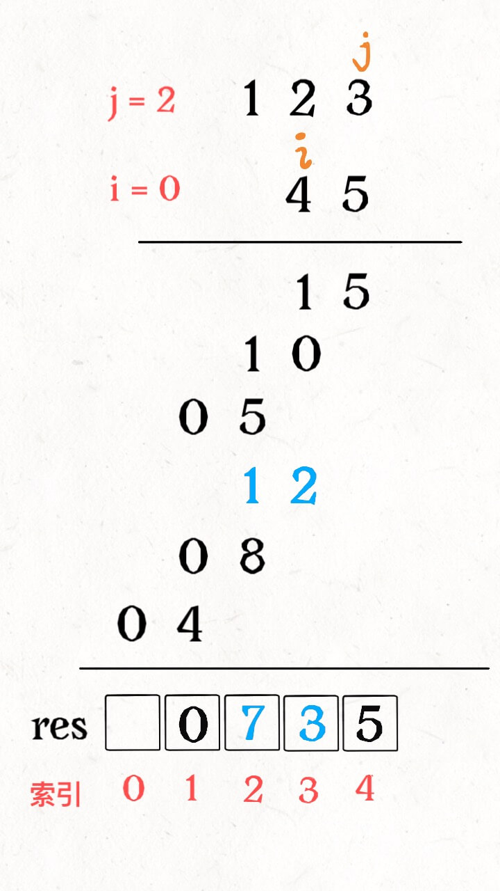

## 数字问题

### 阶乘问题

#### 阶乘后的零

leetcode 172

给定一个整数 n ，返回 n! 结果中尾随零的数量。

提示 `n! = n * (n - 1) * (n - 2) * ... * 3 * 2 * 1`

示例 1：

> 输入：n = 3
>输出：0
>解释：3! = 6 ，不含尾随 0

示例 2：

>输入：n = 5
>输出：1
>解释：5! = 120 ，有一个尾随 0

肯定不可能真去把 `n!` 的结果算出来，阶乘增长可是比指数增长都恐怖，趁早死了这条心吧！

那么，结果的末尾的0从哪里来的？我们有没有投机取巧的方法计算出来？

首先，两个数相乘结果末尾有0，一定能柜式两个数中有因子 2 和 5，因为 10=2x5。

**也就是说，问题转化为：`n!` 最多可以分解除多少个因子 2 和 5**？

比如说 `n=25`, 那么 `25!` 最多可以分解除几个 2 和 5 想成？这个主要取决于能分解除几个因子 5 ，因为每个偶数都能分解出因子 2，因此因子 2 肯定比因子 5 多得多。

`25!` 中 5 可以提供一个，10 可以提供一个，15 可以提供一个，20 可以提供一个，25 可以提供两个，总共有 6 个因子5，所以 `25!` 的结果末尾就有 6 个 0。

**现在，问题转化为 `n!` 最多可以分解出多少个因子 5**?

这样，我们假设 `n=125`, 来算一算 `125!` 的结果末尾有几个 0：

首先 ，125/5=25，这一步就是计算出有多少个像，5,10,15,20,25 这些 5 的倍数，他们一定可以提供一个因子 5。

但是这些足够吗？刚才说了，像 25,50，75 这些 25 的倍数，可以提供两个因子 5，那么我们在计算出 `125!` 中有 125/25=5 个 25 的倍数，它们每个人都可以额外在再供一个因子 5。

够了吗？我们发现 125 = 5x5x5 ，向 125,250 这些 125 的倍数，可以提供 3 个因子 5，那么我们还得在计算出 `125!` 中有 125/125=1 个 125 的倍数，它还可以额外再提供一个因子 5。

这些应该够了，`125!` 最多可以分解除 25+5+1=31 个因子 5，也就是阶乘的结果有 31 个 0.

理解了这个思路，我么就可以理解解法代码了：

```java
public int trailingZeroes(int n) {
        long dividor = 5;
        int res = 0;
        while (dividor <= n) {
            res += n / dividor;
            dividor *= 5;
        }
        return res;
    }
```

这里 `dividor` 变量使用 long 型，因为加入 `n` 比较大，考虑到 while 循环结束的条件， `dividor` 可能出现整型溢出。

上述代码可以更加简洁：

```java
public int trailingZeros2(int n) {
        int res = 0;
        for (long dividor = 5; dividor <= n; dividor *= 5) {
            res += n / dividor;
        }
        return res;
    }
```

这样，这道题就解决了，时间复杂度是底数为 5 的堆数，也就是 `O(logN)`, 我们看看如何基于这道题的解法来解决一道更深层次的问题。

### 793. 阶乘函数后 K 个零

`f(x)` 是 `x!` 末尾是 0 的数量。回想一下 `x! = 1 * 2 * 3 * ... * x`，且 0! = 1 。
 * 例如， `f(3) = 0` ，因为 `3! = 6` 的末尾没有 0 ；而 `f(11) = 2` ，因为 `11!= 39916800` 末端有 2 个 0 。

给定 `k`, 找出返回能满足 `f(x) = k` 的非负整数 `x` 的数量

函数签名如下：
```java
public int preimageSizeFZF(int k) {

    }
```

示例1：
>输入：k = 0
>输出：5
>解释：0!, 1!, 2!, 3!, 和 4! 均符合 k = 0 的条件。

一个直观暴力方法就是穷举，因为随着 `n` 的增加， `n!` 肯定是递增的，`trailingZeroes(n!)` 肯定也是递增的，伪代码如下

```java
int res=0;
for(int n=0;n<+inf;n++) {
    if(trailingZeroes(n) < k) {
        continue;
    }
    if(trailingZeroes(n) > k) {
        break;
    }
    if(trailingZeroes(n) == k) {
        res++;
    }
}
return res;
```
之前做二分查找的时候说过，**对于这种具有单调性的函数，用 for 循环遍历，可以用耳返查找进行降维打击**, 对吧。

搜索多少个 `n` 满足 `trailingZeroes(n) == k`, 其实就是在问，**满足条件的 `n` 最小是多少，最大是度多少，最大值和最小值一减，就可以算出多少个 `n` 满足条件了**，对吧？这不就是二分查找中「搜索最左侧边界」和「搜索最右侧边界」这两个事吗？

先不着急写代码，因为二分查找需要一个搜索区间，也就是上界和下界，上述伪代码中 n 的下界自然是0，但是上界是 `+inf`, 这个正无穷如何表示出来那？

首先，数学上的争取穷是无法用编程表示出来的，我们一般的方法是用一个非常大的值，达到这个值一定不会被取到。比如说 int 类型的最大值 `INT_MAX`(2^31-1,大约 31 亿)，这还不够的话 long 类型的最大值 `LONG_MAX`（2^63-1，这个值就大到离谱了）。

那么我们怎么知道需要多大才能「一定不会被取到」那？**这就需要认真看题目的要求了**。

题目要求是 ： `k` 是在 `[0,10^9]` 区间的整数，也就是说，`trailingZeroes(n)` 的结果最大可以达到 `10^9`。

然后我们可以反推，当 `trailingZeroes(n)` 的结果为 `10^9` 时，`n` 为多少？这个不需要你精确计算出来，你只要找到一个数 `hi`,使得 `trailingZeroes(hi)` 比 `10^9` 大，就可以把 `hi` 当做正无穷，作为搜索区间的上限。

刚才说了 `trailingZeroes` 函数时单调函数，那么我们就可以猜，先算一下 `trailingZeroes(INT_MAX)` 的结果， 比`10^9` 小一些，再用 `LONG_MAX` 算一下，远超 `10^9`了，所以 `LONG_MAX` 可以作为搜索的上界。

这里为了避免整形溢出，把 `trailingZeroes` 函数把所有的数据类型都改成 long

现在明确了问题：

**在区间 [0,LONG_MAX] 中寻找满足 `trailingZeroes(n) == k`的左侧边界和右侧边界。**


### 游戏中的随机算法

```java
public class RandomAlgorithm {
    private final Random random;
    int[] original;

    public RandomAlgorithm() {
        random = new Random();
    }

    public RandomAlgorithm(int[] nums) {
        original = nums;
        random = new Random();
    }

    public int[] reset() {
        return original;
    }

    public int[] shuffle() {
        int n = original.length;
        int[] copy = Arrays.copyOf(original, n);
        for (int i = 0; i < n; i++) {
            // 生成一个 [i...n) 之间的随机数
            int j = i + random.nextInt(n - i);
            // 交换 nums[i] 和 nums[j]
            swap(copy, i, j);
        }
        return copy;
    }

    void swap(int[] arr, int i, int j) {
        int tmp = arr[i];
        arr[i] = arr[j];
        arr[j] = tmp;
    }
}
```
洗盘算法的时间复杂度为O(N), 而且逻辑很简单，关键在于让你证明为什么这样做是正确的。排序算法的结果是唯一可以很容易检验的，但是随机乱治算法不一样，乱可以有很多种，你怎么证明你的算法是「真的乱」那？

**分析洗盘算法准确性的准则：产生的结果必须有 `n!` 种可能**。这个很好解释，因为一个长度为 `n` 的数组的全排列就有 `n!` 种，也就是说打乱结果总共有 `n!` 种。算法必须能够反应这个事实，才是正确的。

有了这个原则看代码就比较容易理解了：

对于 `nums[0]`, 我们把它随机换到了索引 `[0,n)` 上，共有 `n` 种可能性；

对于 `nums[1]`, 我们把它随机换到索引 `[1,n)`上，共有 `n-1` 种可能性；

对于 `nums[2]`, 我们把它随机换到索引 `[2,n)`上，共有 `n-2` 种可能性；

以此类推，该算法可以生成 `n!` 种可能的结果，所以这个算法是正确的，能够保证随机性。

#### 水塘抽样算法

学会了洗牌算法，扫雷游戏的初始化问题就解决了。补补欧冠别忘了，洗牌算法只是一个取巧的方案，我们还是得面对「在若干元素中选择`k` 个元素」这个终极问题

要知道洗牌算法能够生效的前提是你使用的数组这种数据结构。如果让你在一条链表上随机选择 `k` 个元素，肯定不能再用洗牌算法来蒙混过关了。

再比如，假设我们的扫雷游戏棋盘的长和宽都非常大，已经不能在内存中装下一个大小为 `M*N` 的 `board` 数组了，我们只能维护一个大小为 `k` 的数组记录雷的位置：

```java
class Game {
        // 棋盘的行数和列数(非常大)
        int m, n;
        // 长度为 k 的数组，记录 k 个雷的一维索引
        int[] mines;

        // 将二维数组中的坐标 (x,y) 转化为一维数组中的索引
        int encode(int x, int y) {
            return x * n + y;
        }

        // 将一维数组中的索引转化为二维数组中的坐标(x,y)
        int[] decode(int pos) {
            return new int[] { pos / n, pos % n };
        }
    }
```

这样的haul，我们必须想办法在 `[0,m*n)` 中随机选取 `k` 个不同的数字了。

**这就是常见的随机抽样常见，常用的解法是水塘抽样算法(Reservior Sampling)**。水塘抽样算法是一种随机概率算法，会者不难，难者不会。

谷歌有一道算法题，给你**一个未知长度**的单链表，请你设计一个算法，**只能遍历一次**，随机返回链表上的一个节点。leetcode 382 「链表随机节点」也是类似问题。

这里说的随机是均匀随机(uniform random), 也就是说，如果有 `n` 个元素，每个元素都被旋转的概率都是 `1/n`, 不可用有统计意义上的偏差。

一般的想法是，我先遍历一遍链表，得到链表的总长度 `n`, 在省城一个 `[0,n-1)` 之间的随机数为索引，然后找到索引对应的节点。但这不符合只能遍历一遍链表的要求。

这个问题的难点在于随机选择是「动态」的，比如说你现在已经**遍历**了 5 个元素，你已经随机选取了其中的某个元素 `a` 作为结果，但是现在再给你你一个新元素 `b`, 你应该留着 `a` 还是将 `b` 作为结果那？以什么逻辑做出选择，才能保证你的选择方法在概率上是公平的那？

**先说结论，当你遇到第 `i` 个元素时，应该有 `1/i` 的概率选择该元素，`1-1/i` 的概率保持原有的选择**。看代码很容易理解这个思路：

```java
public class RandomAlgorithm {
private final Random random;
    ListNode head;

    public RandomAlgorithm(ListNode head) {
        random = new Random();
        this.head = head;
    }
public int getRandom() {
        ListNode p = head;
        int i = 0;
        int res = 0;
        while (p != null) {
            i++;
            // 生成一个 [0,i) 的随机数，这个随机数等于 0 的概率是 1/i。
            // 如何证明，请参考 digit.md 文档中有关 随机数的描述
            if (0 == random.nextInt(i)) {
                res = p.val;
            }
            p = p.next;
        }
        return res;
    }
}
```

对于概率算法，代码往往都是很浅显的，但是这种问题的关键在于证明，你的算法为什么是对的？为什么每次以`1/i` 的概率更新结果就可以保证是平均随机的？

那么我们来证明下，假设总共有 `n` 个元素，我们要的随机性无非就是每个元素被选中的概率都是 `1/n` 对吧，那么对于第 `i` 个元素，他被选择的概率就是：


第 `i` 个元素备选择的概率是 `1/i`, 在第`i+1` 不被选中的概率是 `1-1/(i+1)`, 在 `1+2` 次不被选中的概率是 `1-1/(i+2)`, 以此类推，相乘的结果是第 `i` 个元素最终被选中概率，也就是 `1/n` 。因此，该算法的逻辑是正确的。

**同理，如果在单链表中随机选择 `k` 个数，在要在第 `i` 个元素处以 k/i 的概率选择该元素，以 `1-k/i` 的概率保持原有的选择即可**。代码如下：

```java
int[] getKofRandomVal(ListNode head, int k) {
        ListNode p;
        // 前 k 个元素先选上
        int[] res = new int[k];
        p = head;
        for (int i = 0; i < k && p != null; i++) {
            res[k] = p.val;
            p = p.next;
        }

        int count = k;
        int j = 0;
        // while 循环遍历链表
        while (p != null) {
            count++;
            // 生成一个 [0...count) 之间的随机数 j
            // 这个整数 j 小于 k 的概率就是 k/count
            if ((j = random.nextInt(count)) < k) {
                res[j] = p.val;
            }
            p = p.next;
        }
        return res;
    }
```

对于该算法数学上的证明，和上面的区别不大：


虽然每次更新选择的概率增大了 k 倍，但是宣导具体第 i 个元素的概率还是要乘以 1/k, 也会回到了上一个推导。

类似的，回到扫雷游戏的初始问题，我们可以写这样一个 sample 抽样函数

```java
public int[] getRandomRange(int k, int lo, int hi) {
        int[] res = new int[k];
        // 先填充前 k 个数
        for (int i = 0; i < k; i++) {
            res[i] = lo + i;
        }
        int count = k;
        int j;
        while (count < hi - lo) {
            count++;
            // 生成一个[0...count) 之间的随机数
            // 如果 小于 k
            if ((j = random.nextInt(count)) < k) {
                res[j] = lo + count - 1;
            }
        }
        return res;
    }
```

这个函数能够在一定的区间内随机选择 k 个数字，确保抽样结果均匀随机的且只需要 O(N) 的时间复杂度。

### 常用的位操作

##### 一、几个有趣的位操作

**1、利用或操作 `|` 和空格将字符转换成小写**
```java
('a' | ' ') = 'a'
('A' | ' ') = 'a'
```

**2、利用与操作 `&` 和下划线将字符转换成大写**

```java
('b' & '_') = 'B'
('B' & '_') = 'B'
```

**3、利用逻辑或操作 `^` 和空格将字符进行大小写互换**

```java
('d' ^ ' ') = 'D'
('D' ^ ' ') = 'd'
```
以上操作能够产生奇特的效果的原因是在于 ascii 编码。

4、不用临时变量交换两个数
```java
int a=1,b=2;
a=a^b;
b=a^b;
a=a^b;
// 现在a=2，b=1
```
5、判断连个数是否异号(就是正负号是否相同)

```java
int x = -1, y = 2;
boolean f = ((x ^ y) < 0); // true

int x = 3, y = 2;
boolean f = ((x ^ y) < 0); // false

 // 1：~n=-(n+1)或者~(n-1) = -n,比如 ~3=-4
 // 2: 获取整数 n 的二进制串中的最后一个 1：-n&n=~(n-1)&n
 // 3:去掉整数n 的二进制串中的最后一个 1：n&(n-1)

```

该技巧主要是利用 补码编码的符号位

#### 二、`n&(n-1)` 的运用

`n&(n-1)` 这个操作在算法中比较常见，作用是消除数字 `n` 的二进制表示中的最后一个 1。看个图就容易理解多了：


和核心罗就是，`n-1` 一定可以消除最后一个 1，同时把其后的 0 都变成1，这样在和 n 做一次 & 运算，就可以仅仅把最后一个 1 变成 0 了。

**1、leetcode 191 题计算汉明权重(Hanmming weight)**

编写一个函数，输入是一个无符号整数（以二进制串的形式），返回其二进制表达式中数字位数为 '1' 的个数（也被称为汉明重量）。

就是让你返回 n 的二进制表示中有几个 1 。因为 `n&(n-1)` 可以消除最后一个 1 ，所以可以利用这个不停地消除1 的同时计数，知道n 变成 0 为止。

**2、判断一个数是不是 2 的幂次**

leetcode 231 就是这样一道题

一个数如果是 2 的幂次，那么它的二进制一定只含有一个1

```java
public boolean isPowerOfTwo(int n) {
        if (n < 1) {
            return false;
        }
        //2 的幂次只有 1 个 1.
        return (n & (n - 1)) == 0;
    }
```

##### 三、`a ^ a = 0` 的运用

异或运算的性质需要我们牢记的：

一个数和它本身做异或运算的结果为0，即 `a^a=0`; 一个数和 0 做异或运算的结果是它本身，即 `a^0=a`。

**1、查找只出现1次的元素**

leetcode 136 题

给你一个 非空 整数数组 nums ，除了某个元素只出现一次以外，其余每个元素均出现两次。找出那个只出现了一次的元素。

你必须设计并实现线性时间复杂度的算法来解决此问题，且该算法只使用常量额外空间。

 

示例 1 ：

输入：nums = [2,2,1]
输出：1
示例 2 ：

输入：nums = [4,1,2,1,2]
输出：4
示例 3 ：

输入：nums = [1]
输出：1

**2、丢失的数字**

Leecode 268

```java

     * 丢失的数字 leetcode 268
     * 给定一个包含 [0, n] 中 n 个数的数组 nums ，找出 [0, n] 这个范围内没有出现在数组中的那个数。
     * 
     * 示例 1：

输入：nums = [3,0,1]
输出：2
解释：n = 3，因为有 3 个数字，所以所有的数字都在范围 [0,3] 内。2 是丢失的数字，因为它没有出现在 nums 中。
     * @param nums
     * @return
     */
    public int missingNumber(int[] nums) {

    }
```

这道题不难的，很容易想到，把这个数组排个序，然后遍历一遍，不就容易找到那个缺失的元素了吗？

或者说，借助数据结构的特性，用一个 Set 把数组出现的数字都存储下来，在遍历 `[0,n]` 之间的数字，去 Set 中查询，也可以很容易查到那个缺失的元素。

排序的时间复杂度为 O(NlonN),HashSet 解法的空间复杂度为O(N), 但是还需要O(N) 的空间复杂度存储 HashSet。

题目的意思可以这样理解：现在有个等差数列 0, 1, 2,..., n，其中少了某一个数字，请你把它找出来。那这个数字不就是 sum(0,1,..n) - sum(nums) 嘛？

```java
int missingNumber(int[] nums) {
    int n = nums.length;
    // 虽然题目给的数据范围不大，但严谨起见，用 long 类型防止整型溢出
    // 求和公式：(首项 + 末项) * 项数 / 2。n*(n+1)/2
    long expect = (0 + n) * (n + 1) / 2;
    long sum = 0;
    for (int x : nums) {
        sum += x;
    }
    return (int)(expect - sum);
}
```

不过，本文的主题是位运算，我们还是要说说如何通过位运算来解决这道题

异或运算满足交换律和结合律，也就是说
```java
2 ^ 3 ^ 2 = 3 ^ (2 ^ 2) = 3 ^ 0 = 3
```
而这道题就可以通过这个性质巧妙地算出缺失的那个元素

### 一行代码就能解决的算法题

一、Nim 游戏

leetcode 292

你和你的朋友，两个人一起玩 Nim 游戏：

桌子上有一堆石头。
你们轮流进行自己的回合， 你作为先手 。
每一回合，轮到的人拿掉 1 - 3 块石头。
拿掉最后一块石头的人就是获胜者。
假设你们每一步都是最优解。请编写一个函数，来判断你是否可以在给定石头数量为 n 的情况下赢得游戏。如果可以赢，返回 true；否则，返回 false 。

**我们解决这类问题的思路一般都是烦着思考**

如我我能赢，那么最后轮到我取石子的时候必须要剩下 1~3 颗，这样我才能一把拿完。

那如何营造这个局面那？显然，如果队首拿的时候只剩下 4 颗石头，无论他怎么拿，总会剩余 1~3 颗石子，我就能赢。

如何能逼迫对手面对 4 颗石子那？要想办法，让我选择的时候还有 5~7 颗石子，这样的话我就有把握让对方不得不面对 4 颗石子。

如何营造 5~7 颗石子的局面那？让对手面对 8 颗石子，无论他怎么拿，多会给我剩 5~7 颗，我就能赢。

这样一直循环下去，我们发现，只要踩到 4 的倍数，就落入了全套，永远逃不出 4 的倍数，而且一定会输。所以这道题的解法很简单：

```java
public boolean canWinNim(int n) {
    return n % 4 !=0;        
    }
```

#### 石头游戏

你和你的朋友面前有一排石头堆，用一个数组 piles 表示，piles[i] 表示第 i 堆石子有多少个。你们轮流拿石头，一次拿一堆，但是只能拿走最左边或者最右边的石头堆。所有石头被拿完后，谁拥有的石头多，谁获胜。

你和你的朋友面前有一排石头堆，用一个数组 piles 表示，piles[i] 表示第 i 堆石子有多少个。你们轮流拿石头，一次拿一堆，但是只能拿走最左边或者最右边的石头堆。所有石头被拿完后，谁拥有的石头多，谁获胜。

假设你们都很聪明，由你第一个开始拿，请你写一个算法，输入一个数组 piles，返回你是否能赢（true 或 false）。

注意，石头的堆的数量为偶数，所以你们两人拿走的堆数一定是相同的。石头的总数为奇数，也就是你们最后不可能拥有相同多的石头，一定有胜负之分。

举个例子，piles=[2, 1, 9, 5]，你先拿，可以拿 2 或者 5，你选择 2。

piles=[1, 9, 5]，轮到对手，可以拿 1 或 5，他选择 5。

piles=[1, 9] 轮到你拿，你拿 9。

最后，你的对手只能拿 1 了。

这样下来，你总共拥有 2 + 9 = 11 颗石头，对手有 5 + 1 = 6 颗石头，你是可以赢的，所以算法应该返回 true。

你看到了，并不是简单的挑数字大的选，为什么第一次选择 2 而不是 5 呢？因为 5 后面是 9，你要是贪图一时的利益，就把 9 这堆石头暴露给对手了，那你就要输了。

这也是强调双方都很聪明的原因，算法也是求最优决策过程下你是否能赢。

这道题又涉及到两人的博弈，也可以用动态规划算法暴力试，比较麻烦。但我们只要对规则深入思考，就会大惊失色：只要你足够聪明，你是必胜无疑的，因为你是先手。(我一口盐汽水。。。)

```java
boolean stoneGame(int[] piles) {
    return true;
}
```

这是为什么呢，因为题目有两个条件很重要：一是石头总共有偶数堆，石头的总数是奇数。这两个看似增加游戏公平性的条件，反而使该游戏成为了一个割韭菜游戏。我们以 piles=[2, 1, 9, 5] 讲解，假设这四堆石头从左到右的索引分别是 1，2，3，4。

如果我们把这四堆石头按索引的奇偶分为两组，即第 1、3 堆和第 2、4 堆，那么这两组石头的数量一定不同，也就是说一堆多一堆少。因为石头的总数是奇数，不能被平分。

而作为第一个拿石头的人，你可以控制自己拿到所有偶数堆，或者所有的奇数堆。

你最开始可以选择第 1 堆或第 4 堆。如果你想要偶数堆，你就拿第 4 堆，这样留给对手的选择只有第 1、3 堆，他不管怎么拿，第 2 堆又会暴露出来，你就可以拿。同理，如果你想拿奇数堆，你就拿第 1 堆，留给对手的只有第 2、4 堆，他不管怎么拿，第 3 堆又给你暴露出来了。

也就是说，你可以在第一步就观察好，奇数堆的石头总数多，还是偶数堆的石头总数多，然后步步为营，就一切尽在掌控之中了。

#### 点灯开关问题

leetcode 319 题

初始时有 n 个灯泡处于关闭状态。第一轮，你将会打开所有灯泡。接下来的第二轮，你将会每两个灯泡关闭第二个。

第三轮，你每三个灯泡就切换第三个灯泡的开关（即，打开变关闭，关闭变打开）。第 i 轮，你每 i 个灯泡就切换第 i 个灯泡的开关。直到第 n 轮，你只需要切换最后一个灯泡的开关。

找出并返回 n 轮后有多少个亮着的灯泡。

示例1：


输入：n = 3
输出：1 
解释：
初始时, 灯泡状态 [关闭, 关闭, 关闭].
第一轮后, 灯泡状态 [开启, 开启, 开启].
第二轮后, 灯泡状态 [开启, 关闭, 开启].
第三轮后, 灯泡状态 [开启, 关闭, 关闭]. 

你应该返回 1，因为只有一个灯泡还亮着。

我们当然可以用一个布尔数组表示这些灯的开关情况，然后模拟这些操作过程，最后去数一下就能出结果。但是这样显得没有灵性，最好的解法是这样的：

```java
int bulbSwitch(int n) {
    return (int)Math.sqrt(n);
}
```
 什么，这个问题跟平方根有什么关系？其实这个解法挺精妙的，如果没人告诉你解法，还真不好想明白

首先，因为电灯一开始都是关闭的，所以某一盏灯最后如果是点亮的，必然被按奇数次开关。

我们假设有 6 盏灯，而且我们只看第 6 盏灯。需要进行 6 轮操作对吧，请问对于第 6 盏灯，会被按下几次开关那？这不难得出：第1轮会被按，第2轮，第3轮，第 6 轮都会被按。

为什么 1、2、3、6 会被按那？因为 `6-1*6=2*3`。一般情况下，因子都是成对出现的，也就是开关被按的次数都是偶数次。但是有特殊情况的，比如说总共 16 盏灯，那么第 16 盏灯会被按几次？

`16=1*16=2*8=4*4`

其中因子 4 重复出现，所以第 16 盏灯会被按 5 次，奇数次。现在你应该理解这个问题为什么跟平方根又关了吧？

不过，最后不是要算有几盏灯亮着吗？这题直接平方根一下是啥意思呀？稍微思考一下就能理解了

我们假设现在共有 16 盏灯，我们求 16 的平方根，等于 4，这就说明最后会有 4 盏灯亮着，他们分别是第 `1*1=1`盏，第 `2*2=4` 盏，第 `3*3=9` 盏 ，第 `4*4-16`盏。

就算有的 `n` 平方根结果是小数，强转成 int 类型，也相当于一个最大整数的上界，比这个上界小的所有的整数，平方后的索引都是亮着的灯的索引。

所以说我们把这个平方根转成整数，就是这个问题的答案


#### 字符串相乘

把我们平时计算数字相乘的过程记忆不拆分，比如 `123 x 45` 可以拆分成 `123 x 4` 和 `123 x 5`,然后进一步拆分，如下所示：


如果 `123` 代表的 Nums1 字符串比较长的话，是无法直接计算乘积的。我们可以用一个数组在低下接收相加结果：


整个计算过程大概是这样，**有两个指针 `i,j` 在 `nums1` 和 `nums2` 上游走，计算乘积，同时将乘积叠加到 `res` 的正确位置上，如下 gif 所示**


现在还有一个关键问题，如何将乘积叠加到 `res` 的正确位置，或者说，如何通过 `i,j` 计算 `res` 对应的索引那？

其实细心观察之后，**就会发现 `nums1[i]` 和 `nums[j]` 的乘积对应的就是 `res[i+j]` 和 `res[i+j+1]` 这两个位置**



明白这一点，就可以用代码模拟出计算过程了，代码如 DigitProblems.multiply2 所示


