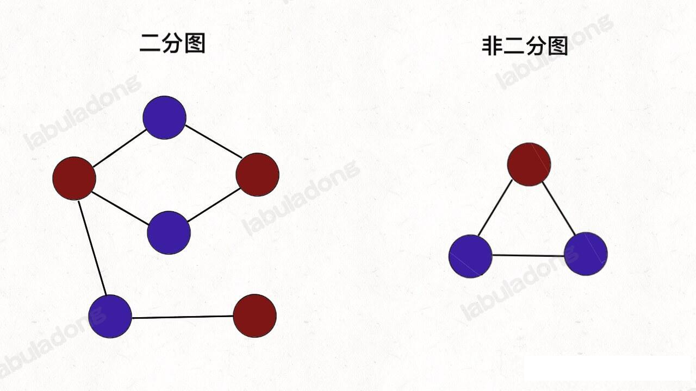
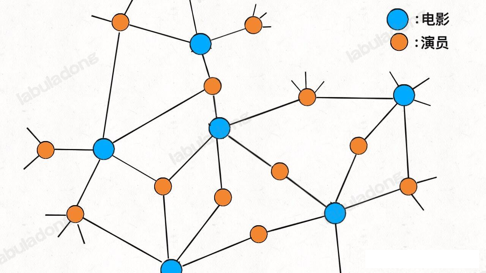
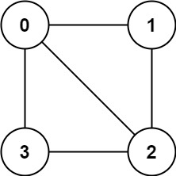
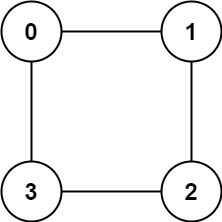
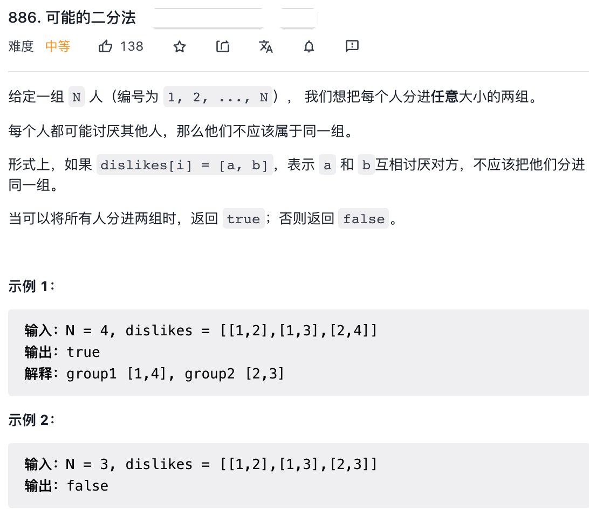

### 二分图

#### 二分图简介

在讲述二分图的判定算法之前，我们先来看看百度百科对「二分图」的定义：

>二分图的定点集可分割为两个互不相交的子集，图中每条边依附的两个顶点都分属于这两个子集，且两个子集内的顶点不相邻


其实图论中的很多术语都比较拗口，不容易理解。我们甭管这个死板的定义，弄个游戏来说明下：

**给你一幅「画」，请你用两种颜色将图中的所有顶点着色，且使得任意一条边的两个端点的颜色都不相同，你能做到吗？**

这就是图的「双色问题」，其实这个问题就等同于二分图的判定问题，如果你能成功地将图染色，那么这幅图就是一副二分图，反之则不是：



在描述具体的二分图判定算法之前，我们先来说说计算机大佬闲着无聊解决双色问题的目的是什么？

首先，二分图作为一种特殊的图模型，会被很多高级图算法（比如最大流量）用到，不过这些高级算法我们不是特别有必要掌握，感兴趣的话，可以自驾上网查资料。

从简单实用的角度来看，二分图结构在某些场景下可以更高效低存储数据。

比如说我们需要一种数据结构来存储电影和演员之间的关系：某一部电影肯定是有很多演员演出的，且某一位演员可能会出现多部电影。你使用什么数据结构来存储这种关系那？

既然是存储映射关系，最简单的不就是使用哈希表嘛？我们可以使用一个 `HashMap<String,List<String>>` 来存储电影到演员的映射，如果给你一部电影的名字，就能很快得到该电影的演员。

但是如果给出一个演员的名字，我们想很快得到该演员演出的所有电影，怎么办？这就需要「反向索引」，对之前那的哈希表进行一些操作，新建另一个哈希表，把演员作为键，把电影列表作为值。

显然，如果用哈希表，需要两个哈希表分别存储「每个演员到电影列表」的映射和「每部电影到演员列表」的映射。但是如果用「图」结构存储，将电影和演员连接，很自然第就成了一副二分图：



每个电影节点的相邻节点就是参演该电影的所有演员，每个演员的相邻节点就是该演员参演的所有电影，非常直观方便。

下面，进入正题，说说如何判定一幅图是否二分图

#### 二分图判定思路

判定二分图的算法很简单， 就是用代码解决「双色问题」

**说白了就是遍历一幅图，一边遍历一边染色，看看能不能用两种颜色给所有节点染色，且相邻节点的颜色都不同**。

既然说到遍历，也不涉及最短路径之类的，当然是 DFS 算法和 BFS 算法皆可了，DFS 算法相对更常用些，所以我们先来看看如何用 DFS 算法判断双色图

首先，基于框架写出 图 深度优先遍历的框架
```java
int[] visited;
void traverse(Graph graph ,int v) {
    if(visited[v]) return;
    visited[v] = true;
    for(Vertex neighbour : graph.neighbors(v)) {
        traverse(graph, neighbour);
    }
}
```

因为图中可能存在环，所以用 `visited` 数组防止走回头路。

这里我们习惯把 return 语句放在函数开头，因为一般 return 语句都是 base case，集中在一起可以让算法更清晰

其实如果我们愿意，也可以让 if 判断放在其他地方，比如图遍历框架可以稍微改改：

```java
int[] visited;
void traverse(Graph graph ,int v) {
     visited[v] = true;
    for(Vertex neighbour : graph.neighbors(v)) {
         if(!visited[neighbour]) {
            // 之遍历没有标记过的相邻节点
            traverse(graph, neighbour);
         }
    }
}
```

这种写法对 `visited` 的判断放到递归调用之前，和之前的写法唯一的不同就是，你需要保证调用 `traverse(v)`的时候，`visited[v] == false`。

为什么要特别说这种写法那？因为我们判断二分图的算法会用到这种写法

二分图怎么判断，其实就是让 `traverse` 函数一边遍历，一遍给节点染色，尝试让每对相邻节点的颜色都不一样。

```java
int[] visited;
// 图遍历框架
void traverse(Graph graph ,int v) {
     visited[v] = true;
    for(int neighbour : graph.neighbors(v)) {
         if(!visited[neighbour]) {
            // 相邻节点 neighbor 没有被访问过
            // 那么应该给节点 neighbor 涂上和节点 v 不同的颜色
            traverse(graph, neighbour);
         } else {
            // 相邻节点 neighbor 已经被访问过
            // 那么应该比较节点 neighbor 和 节点 v 的颜色
            // 若相同，则此图不是二分图
         }
    }
}
```

leetcode  785 题「判断二分图」就是原图，给你输入一个 邻接表 表示一副无向图，请你判断这幅图是否是二分图。函数签名如下：请你判定这幅图是否是二分图。

函数签名如下：
```java
boolean isBipartite(int[][] graph);
```
比如题目给的例子，输入的例子`graph = [[1,2,3],[0,2],[0,1,3],[0,2]]` ,也就是这样一幅图：



显然无法对节点着色使得每两个相邻节点的颜色都不相同，所以算法返回 false。

但如果输入的是 `graph = [[1,3],[0,2],[1,3],[0,2]]`, 也就是这样一幅图：



如果把节点 `{0, 2}` 涂一个颜色，节点`{1, 3}` 涂另外一个颜色，就可以解决「双色问题」，所以这是一副二分图，算法返回 true。

结合之前的代码框架，我们可以额外使用一个 `color` 数组来记录每个节点的颜色，从而写出代码(ps:jdk 的treeMap 中的红黑树的颜色也是用 boolean 来表示)，请参见：isBipartite。BFS 遍历方式的请参见 
isBipartiteBFS。

#### 可能的二分法




**其实这道题考察的就是二分图的判定**：

如果你把每个人看做图中的节点，相互讨厌的关系看做图中的边，那么 `dislikes` 数组就可以组成一幅图；

又因为题目说相互讨厌的人不能放在同一个组里，相当于图中的所有邻接点都要放进两个不同的组里。

那就回到了「双色问题」，如果能够用两种颜色着色所有节点，且相邻节点颜色不同，那么我们按照颜色把这些节点分成两组不就行了。

所以这道题的关键是构建图，然后用 二分图的方法进行判断当前图是否是二分图即可。参见方法 `possibleBipartition(int n, int[][] dislikes);`

至此，这道题也用 DFS 算法解决了，如果你想用 BFS 算法，和之前写的解法完全一样，可以自己尝试实现。

二分图的判定就到这里吧。


