## 最小生成树-MST

什么是最小生成树 ：Minimum Spanning Tree, MST

**先说「树」和「图」的根本区别：树不会包含环，图可以包含环**。

如果一幅图没有环，完全可以拉伸成一棵树的模样。说的专业一点，树就是「无环连通图」。

什么是图的「生成树」那？其实按字面意思也好理解，就是在图中找到一颗包含图中所有节点的树。专业点说，生成树是含有图中所有顶点的「无环连通子图」。

容易想到：一幅图可以有很多不同的生成树，比如下面这幅图，红色的边就组成了两棵不同的生成树：

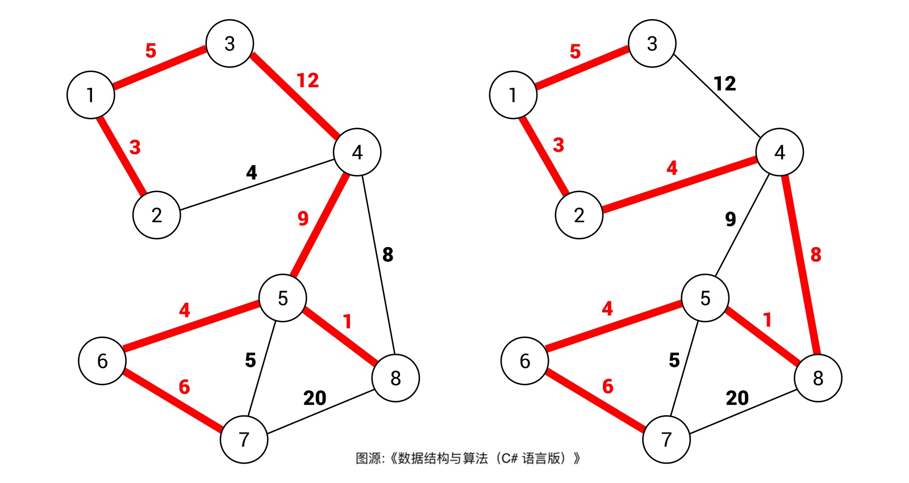

对于加权图，每条边都有权重，所以每棵生成树都有一个权重值。比如上图，右侧的权重和明显比左侧的权重和要小。

**那么最小生成树很好理解，所有可能的生成树中，权重和最小的那颗生成树就叫「最小生成树」**

注意：一般来说，我们都是在无向加权图中计算最小生成树，所以使用最小生成树的现实场景中，图的边权重一般代表成本、距离这样的标量。

### Kruskal 最小生成树算法

#### Kruskal 算法的前置条件：Union-Find

Kruskal 算法的一个难点是保证生成树的合法性，因为在构造生成树的过程中，你首先得保证生成的那玩意是棵树(不包含环)对吧，那么 Union-Find 算法就是帮你干这个事的。怎么做到那？先来看看 leetcode 261 题，「以图判树」。

函数签名如下：

```java
boolean validTree(int n, int[][] edges);
```

比如输入如下：
```sh
n = 5
edges=[[0,1],[0,2],[0,3],[1,4]]
```
这些边构成一棵树，算法应该返回 true：

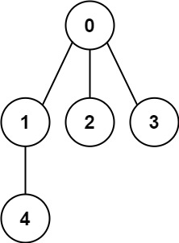

但如果输入：

```java
n = 5
edges=[[0,1],[1,2],[2,3],[1,3],[1,4]]
```
形成了就不是树状结构了，因为包含环

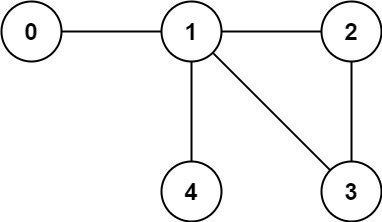

**对于这道题，我们可以思考一下，什么情况下加入一条边会使得树变成图（出现环）**？

显然，像下面这样添加边会出现环：

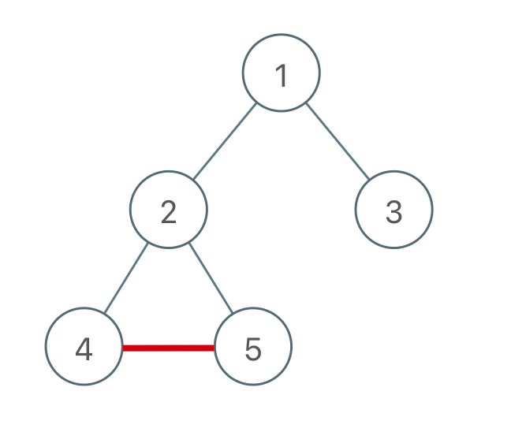

而这样添加边则不会出现环

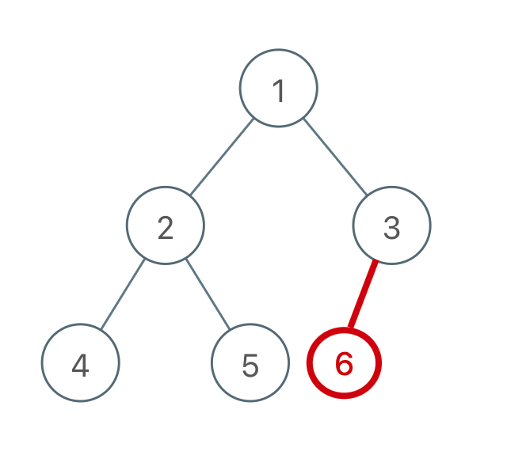

总结一下规律就是：

**对于添加的这条边，如果改边的两个节点本来就在同一个连通分量里，那么添加这条表会产生环；反之，如果改边的两个节点不在同一个连通分量里，则添加这条边不会产生环**

而判断两个节点是否连通(在同一个连通分量中)就是 Union-Find 算法的拿手绝活，所以这道题使用 UF 解法很 easy，解法如下：

```java
public boolean validTree(int n, int[][] edges) {
        UF uf = new UF(n);
        for (int[] edge : edges) {
            int u = edge[0];
            int v = edge[1];
            // 如果两个节点已经在同一个连通分量里面，则会产生环
            if (uf.connected(v, u)) {
                return false;
            }
            uf.union(v, u);
        }
        // 最后保证只形成了一棵树，只有一个连通分量。
        return uf.count() == 1;
    }
```
#### Kruskal 算法

所谓的最小生成树，就是图中若干边的集合(简称 `mst`) ，我们要保证这些边：

1、包含图中所有的节点
2、形成的结构是树结构(即不存在环)
3、权重和最小

有了之前题目的铺垫，前两条可以很容易利用 Union-Find 算法做的，关键在第 3 条，如何保证得到的这棵生成树是权重和最小的。

这里用到了贪心算法：

**将所有的边权重按照从小到大排序，从权重最小的边开始遍历，如果这条边和 `mst` 中的其他边不会形成环，则这条边是最小生成树的一部分，将它加入 `mst` 集合；否则，这条边不是最小生成树的一部分，不能加入 `mst` 集合。**

这样，最后 `mst` 集合中的边就形成了最小生成树，下面我们看两道 例题来运用一下 Kruskal 算法。

leetcode 1135 题，「最低成本连通所有城市」，这是一道标准的最小生成树的问题：

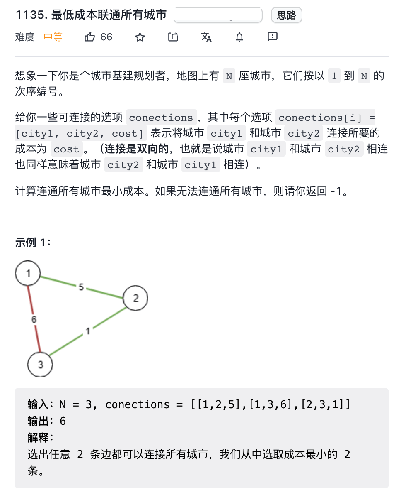

函数签名如下：

```
int minimumCost(int n, int[][] connections);
```

每座城市相当于图中的节点，连通城市的成本相当于边的权重，连通所有城市的最小成本即使最小生成树权重之和。

```java
public int mimimunCost(int n, int[][] connections) {
        // 因为题中给的连通节点起始索引为 1。
        UnionFind.UF uf = new UnionFind.UF(n + 1);
        // 首先将 connections 按照权重进行排序
        Arrays.sort(connections, (a, b) -> {
            return a[2] - b[2];
        });
        int totalWeight = 0;
        for (int[] cn : connections) {
            int v = cn[0];
            int w = cn[1];
            int weight = cn[2];
            // 如果 这条边的两个节点已经在同一个连通分量上，则不需要再次连通，防止出现环
            if (uf.connected(w, v)) {
                continue;
            }
            uf.connected(w, v);
            // 增加权重
            totalWeight += weight;
        }

        // 保证所有节点都以连通，
        // 理论上 uf.count() == 1 说明所有节点都被连通
        // 但是因为 0 位置没有使用，会占用一个连通位置，因此连通分量最少为 2 ，
        return uf.count() == 2 ? totalWeight : -1;
    }
```

这道题就这样解决了，整体思路和上一道题非常类似，我们可以认为**树的判定算法加上权重排序的逻辑就变成 Kruskal 算法**。

再来看看 leetcode 1584 题，「连接所有点的最小费用」

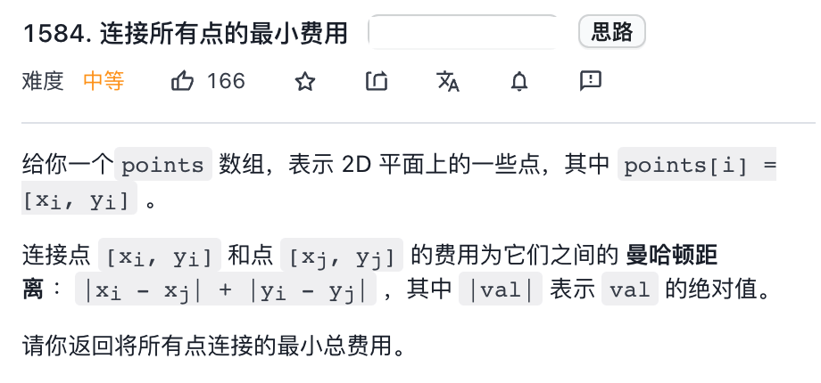

比如题目给的例子：

```text
points = [[0,0],[2,2],[3,10],[5,2],[7,0]]
```
算法应该返回 20，按如下的方式连通各点：

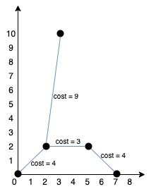

函数签名如下：

```java
int minCostConnectPoint(int[][] points);
```

很显然，这也是一个标准的最小生成树的问题：没个点就是无向加权图中的节点，变得权重就是哈曼顿距离，连接所有店的最小费用就是最小生成树的权重和。

所以解法思路就是先生成所有的边以及权重，然后对这些边执行 Kruskal 算法即可：

参见 minCostConnectPoints 方法

这道题做了一个小的变通，每个坐标点是一个二元组，那么按理说应该用五元组表示一条带权重的边，但这样的话，不方便执行 UF 算法；所以我们用 `points` 数组中的所以那代表每个节点，这样也可以直接复用之前的 Kruskal 算法逻辑了。

通过以上三道题，相信我已经掌握了 Kruskal 算法，主要的难点在于利用 Union-Find 并集查找算法向最小生成树中添加边及其权重，配合排序的贪心算法，从而得到一棵权重和最小的生成树

下面树下 Kruskal 算法的复杂度分析：

假设一幅图的节点个数为 `V`, 边的条数为 `E`, 首先 `O(E)` 空间装下所有的边(List<int[]> 的size), 而且 Union-Find 算也需要 `O(V)` 的空间，所以 Kruskal 的总的空间复杂度为 `O(E+V)`.

时间复杂度主要消耗在排序，需要 `O(ElogE)` 的时间，Union-Find 所有的所有操作复杂度都是 O(1), 套一个 for 循环 也不过是  `O(E)`, 所以总的时间复杂度还为 `O(ElogE)`

### Prim 算法实现的最小生成树

Prim 算法和 Kruskal 算法都是经典的最小生成树，对比 Kruskal 算法，有如下区别：

#### 对比 Kruskal 算法

图论的最小生成树问题，就是让你从图中找到若干边形成一个边的集合 `mst`, 这些边要满足上述 3 个条件：

1、无环
2、包含所有节点
3、权重和最小

**首先，Kruakal 算法用到了贪心思想**，来满足权重之和尽可能小的问题：

先对所有边按权重从小到大排序，从最小权重的边开始，选择合适的边加入 `mst` 集合，这样挑出的边组成的权重和就是最小的。
其次，Kruskal 算法用到了 Union-Find 并集查找算法，俩保证挑出来的这些边组成一定是一棵树，而不是包含环或者形成一片「森林」：

如果一条边的两个节点已经是连通的，则这条边会使树中出现环；如果醉的连通分量总数大于 1 ，则说明形成的是「森林」而不是一颗「树」。

那么，本文的主角 `Prim ` 算法是使用什么逻辑来计算最小生成树的那？

**首先，Prim 算法也是使用贪心思想来让生成树的权重尽可能小**，也就是「切分原理」，这个后面会解释。

**其次，Prim 算法使用 BFS 算法思想 和 `visited` 布尔数组避免成环**, 来保证选出来的边最终形成的一定是一棵树。

Prim 算法不需要事先对所有的边排序，而是利用优先级队列动态事先排序的效果，所以我觉得 Prim 算法类似于 Kruskal 动态过程。

下面介绍一下 Prim 算法的核心原理：**切分定理**

#### 切分定理

「切分」这个术语其实很好理解，就是将一幅图分为两个**不重叠且非空**的节点集合：

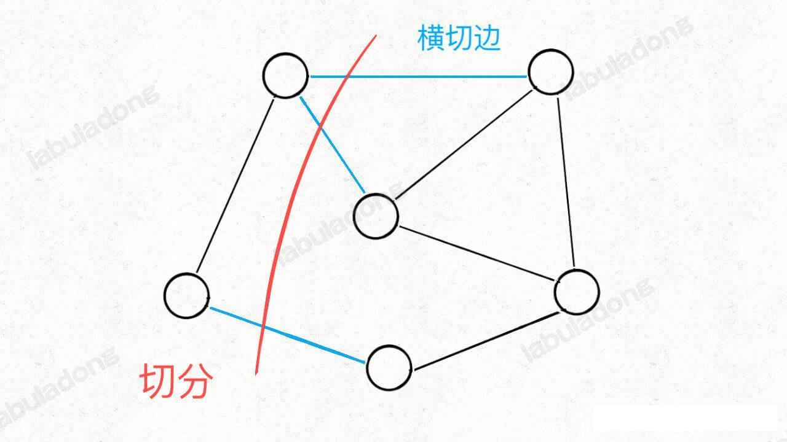

红色的这一刀把图中的节点分成了两个集合，这就是一种「**切分**」，其中被红线切中的边（标记为蓝色）叫做「横切边」。

当然，一幅图肯定可以有若干种切分，因为根据切分的定义，只要你能一刀把节点分成两部分就行。接下来我们引入「切分定理」：

**对于任意一种「切分」，其中重权重最小的那条「横切边」一定是构成最小生成树的一条边**。

这应该很容易证明，如果一副加权无向图存在最小生成树，假设下图中用绿色标出来的边就是最小生成树：

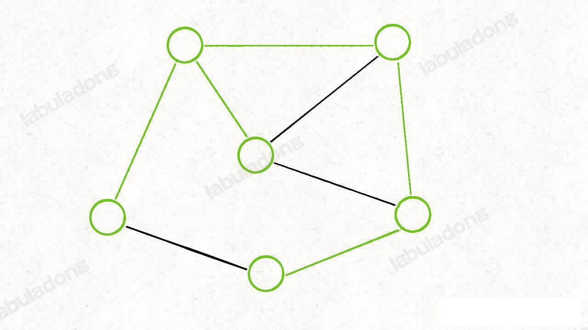

那么，你肯定可以扎到若干「切分」方式，将这个最小生成树切成两棵子树。比如下面这种切分：

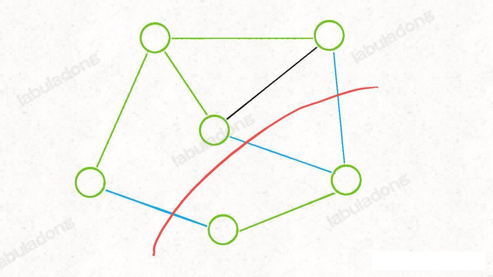

你会发现，任选一条蓝色的「横切边」都可以将这两条子树连起来，构成一颗生成树。

那么为了让最终这颗生成树的权重和最小，你说你要怎么选？

肯定选权重最下的那条「横切边」对吧，这就证明了切分定理。

关于切分定理，我们还可以用反证法证明：

给定一幅图的最小生成树，那么随便给一种「切分」，一定至少有一条「横切边」属于最小生成树。

假设这条「横切边」不是权重最小的，那么说明最小生成树的权重和还有再减小的余地，那这就矛盾了，最小生成树的权重和本来是最小的，怎么再减？所以切分定理是正确的。

有了这个切分定理，我们大概就有了一个计算最小生成树的算法思路：

**既然每次「切分」一定可以找到最小生成树的一条边，那我就随便切呗，每次都把权重最小的「横切边」拿出来加入最小生成树，知道把构成最小生成树的所有边都切出来为止**（其实，我第一次学习 Prim 算法，最小边是选出来的，把树看成 N 条边的集合，每次从这里面选权重最小的边，只要不构成环路，直到把所有的节点都包含进去，就是 Prim 算法的实现。）

可以说这就是 Prim 算法的核心思路，不顾具体实现起来，还是有些技巧的。

因为你没有办法理解什么叫「随便切」，所以应该设计机械化的规则和章法来调教你的算法，并尽量减少无用功。

#### Prim 算法实现

我们思考问题的时候，如果问题的一般情况不好解决，可以从比较简单的特殊情况入手，Prim 算法就是使用这种思想。

按照「切分的」定义，只要把图中的节点切成两个 **不重叠非空**的节点集合即可算作一个合法的「切分」，那么我只切出来一个节点，是不是也算是一种合法的「切分」？

是的，这是最简单的「切分」，而且「横切」也很好确定，就是这个节点所有的边。

那我们就随便选一个点，假设从 A 点开始切分：

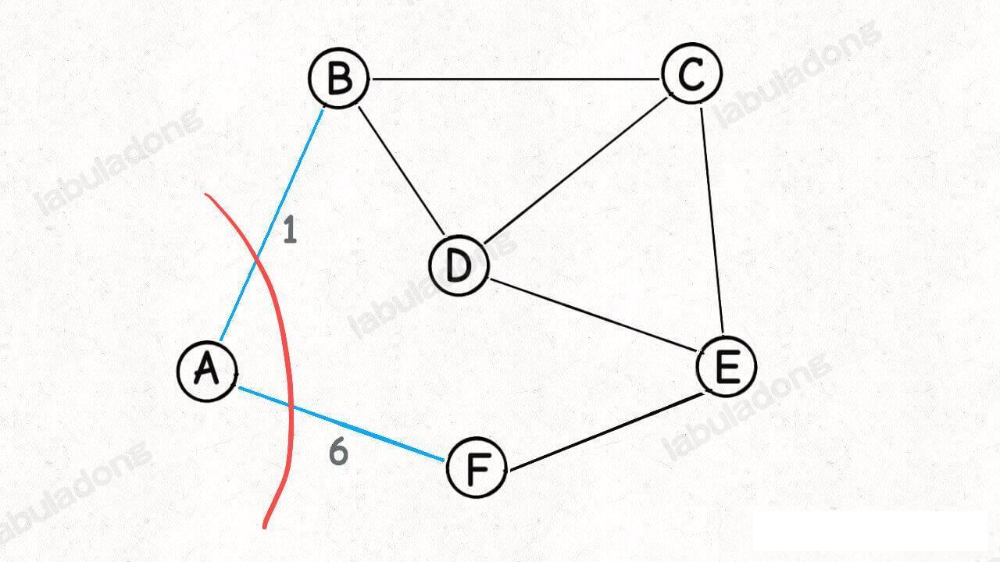

既然是一条合法的「切分」，那么按照切分定理，这些「横切边」`AB,AF` 中权重最小的边一定是最小生成树中的一条边

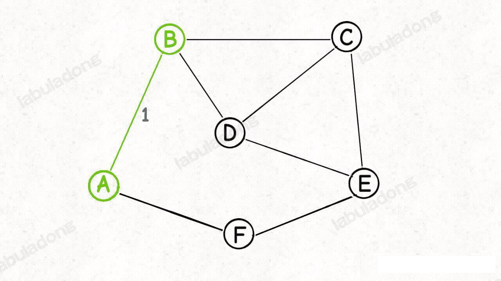

好，现在已经找到了最小生成树的第一条边(边 `AB`), 然后呢，如何安排下一次「切分」？

按照 Prim 算法的逻辑，我们接下来可以围绕 `A` 和 `B` 这两个节点做切分：

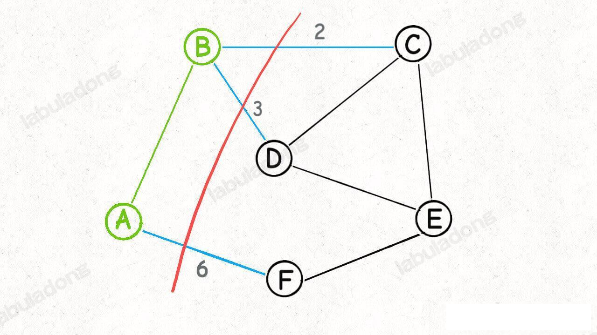

然后又可以从这个切分产生的横切边（图中蓝色的边）中找出权重最小的一条边，这就又找到了最小生成树的第二条边 `BC`:

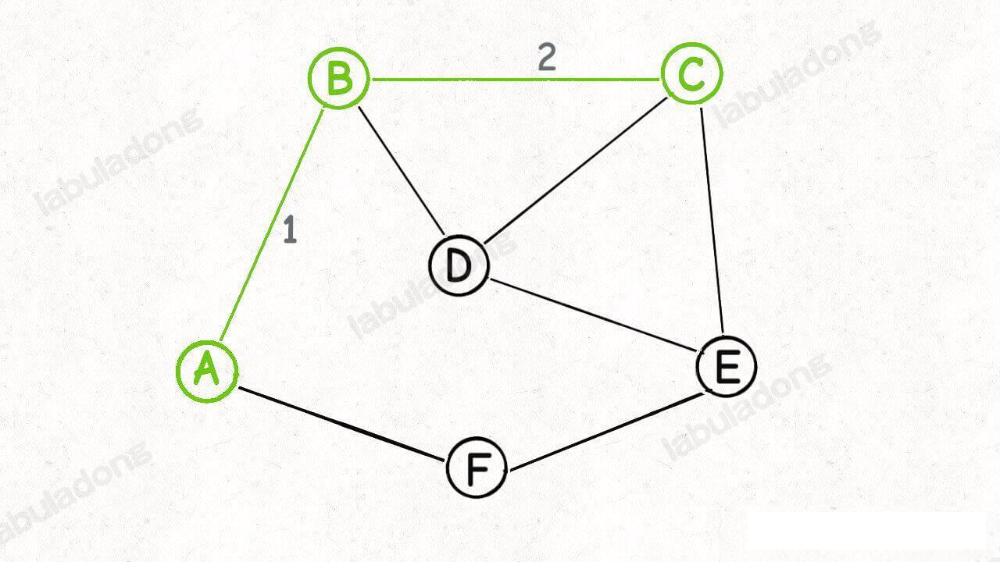

接下来那？也是类似，再围绕着 `A，B，C` 这三个点做切分，产生的横切边权重最小的便是 `BD`,那么 `BD` 就是最小生成树的第三条边：

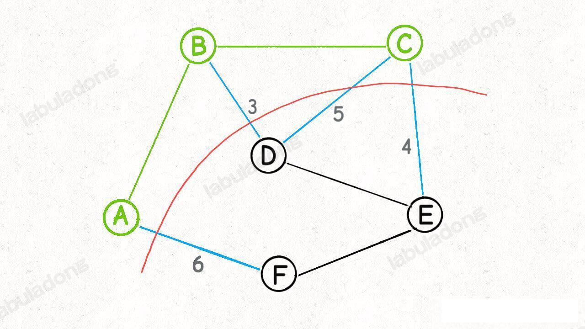

接下来再围绕着 `A，B，C，D` 这四点做切分.....

**Prim 算法的逻辑就是这样，每次切分都能找到最小生成树的一条边，然后又可以进行新一轮的切分，直到找到最小生成树的所有边为止**。

这样设计算法有一个好处，即使比较容易确定每次新的「切分」所产生的的横切边。

比如回顾刚才的图，当我们直到了节点 `A, B` 的所有「横切边」（不妨表示为`cut({A,B})`), 也就是图中蓝色的边：


是否可以快速算出 `cut({A,B,C})`，也就是节点 `A,B,C` 的所有「横切边」有哪些？


是可以的，因为我们发现：

```java
cut({A,B,C}) = cut({A,B}) + cut({C})
```
而 `cut({C})` 就是节点 C 的所有邻边：

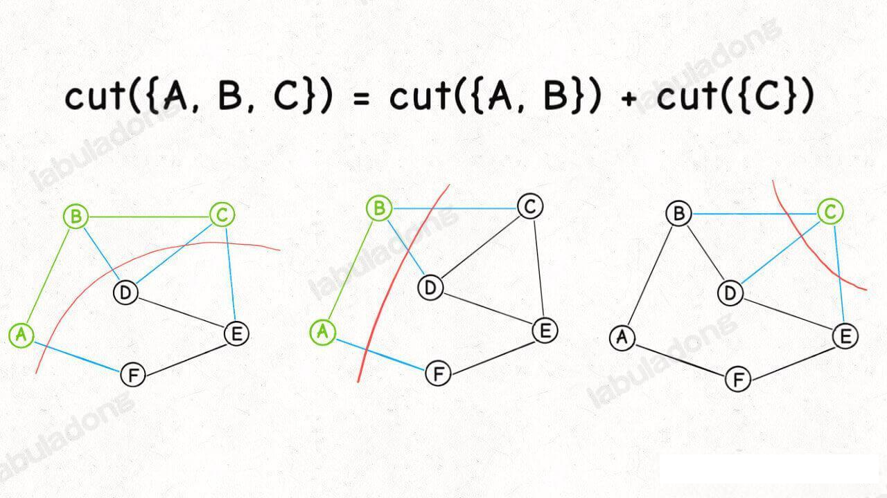

这个特点使我们用写代码实现「切分」和处理「横切边」成为可能：

再进行切分的过程中，我们只要不断把新节点的邻边加入横切边集合，就可以得到新的切分的所有横切边。

当然，细心的我们肯定发现了，`cut({A,B,C})` 的横切边和 `cut({C})` 的横切边中 `BC` 边重复了。

不过很好处理，用一个布尔数组 `inMST` 辅助，防止重复计算横切边就行了。

最后一个问题，我们求横切边的目的是找权重最小的横切边，怎么做到那？

很简单，用一个优先级队列存储这些横切边，就可以动态计算权重最小的横切边了。

**明白了上述算法，来看看 Prim 算法的代码实现**：


