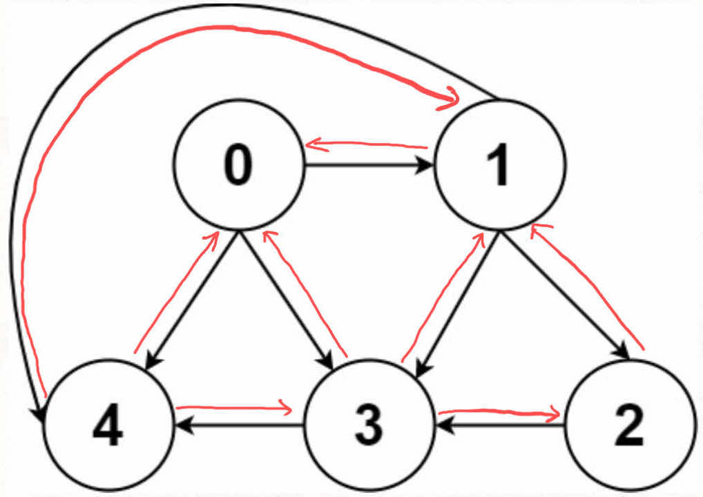
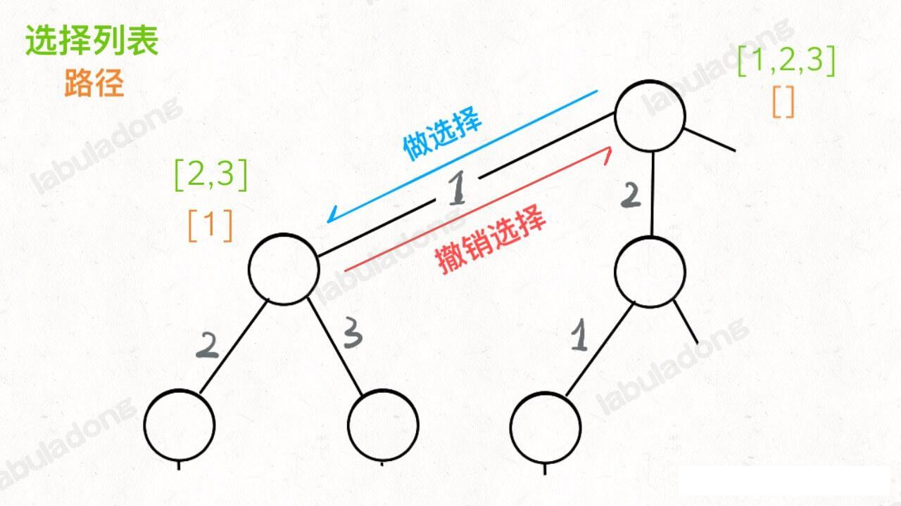
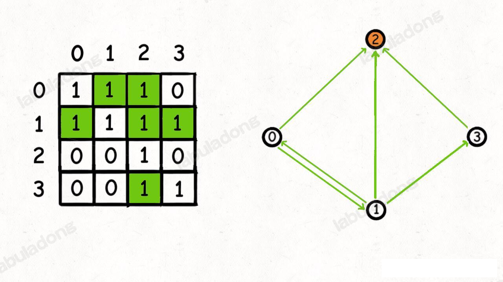
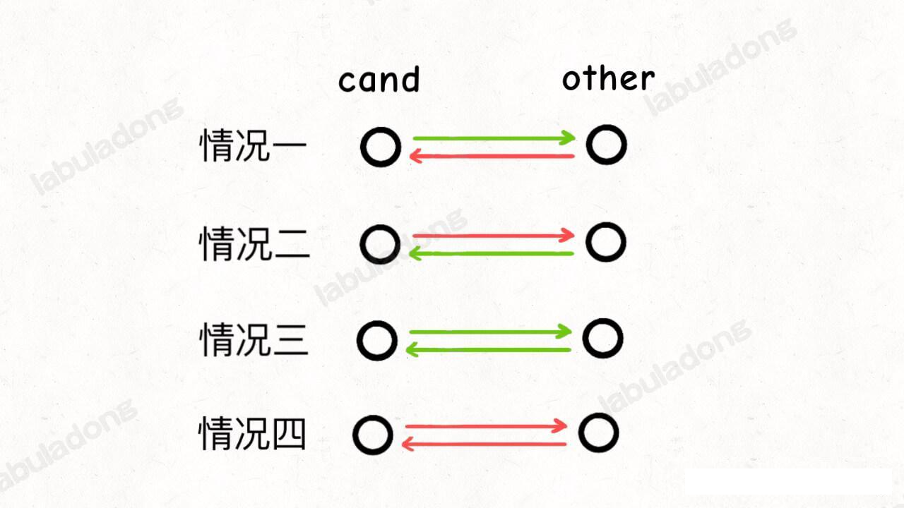

## 图论

### 图论基础以及遍历算法

#### 图的逻辑结构与具体实现

一幅图是由**节点**和**边**构成的，逻辑结构如下:


**什么叫「逻辑结构」？就是说为了方便，我们把图抽象成这个样子**。

根据这个逻辑结构，我们可以人给每个节点的实现如下：
```java
class Vertex {
    int id;
    Vertex[] neighbours;
}
```

看到没有，有没有很熟悉？它和我们之前说的多叉树几乎完全一样：

```java
/* 基本的 N 叉树节点 */
class TreeNode {
    int val;
    TreeNode[] children;
}
```
所以说，图真的没啥高深的，本质上就是个高级点的多叉树而已，适用于树的 DFS/BFS 遍历算法，全部适用于图。

不过那，上面的这种实现是「逻辑上的」，实际上我们很少使用这个 `Vertex` 类来实现图，而是用常说的 **邻接表和邻接矩阵**来实现。

比如上图中，如果用邻接表和邻接矩阵的存储方式如下：


邻接表很直观，我把每个节点 x 的邻居都存储到一个列表中，然后把 x 和这个列表关联起来，这样就可以通过一个节点 x 找到它相邻的所有节点。

邻接矩阵则是一个二维布尔数组，我们全切称为 `matrix`, 如果节点 x 和 y 是相连的，那么就把 `matrix[x][y]` 设置为 `true`。 如果想找节点 x 的邻居节点，去扫描以下 `matrix[x][..]` 就行了。

如果用代码的形式来表现，邻接表和邻接矩阵大概长这样：

```java
// 邻接表
// graph[x] 存储 x 的所有邻居节点
List<Integer>[] graph;

// 邻接矩阵
// matrix[x][y] 记录 x 有一条指向节点 y 的边
boolean[] matrix[][];

```
**那么，为什么会有这两种存储图的方式那？肯定是因为他们各有优势**。

对于邻接表，好处是占用的空间少。

你看邻接矩阵空着那么多位置，肯定需要更多的存储空间。

但是，邻接表无法快速判断两个节点是否相邻。

比如说，我想判断节点 1 和节点 3 是否相邻，我要去邻接表 `1` 对应的列表中查找 3 是否存在。但是对于邻接矩阵就简单了，直接看看 `matrix[1][3]` 就知道了，效率高。

所以说，要使用哪种数据结构，要看具体情况。

最后，我们再明确一个图论中特有的**度(degree)**的概念，在无向图中，「度」就是每个节点相连的边的条数。

由于有向图的边有方向，所有有向图的每个节点「度」都可以被细分为**入度**(indegree) 和 **出度**(outdegree)，还比如第一幅图

其中节点 3 的入度为 3（有三条边指向它），出度为 1 （它有 1 条边指向别的节点）。

好了，对于「图」这种数据结构，能看懂上面的这些就绰绰有余了。

至于其他的无向图，加权图等等 **这些更复杂的模型都是基于这个最简单的图衍生出来的**。**有向加权图怎么实现呀**？，很简单：

如果是邻接表，我们不仅仅存储某个节点 x 的所有邻居，还存储 x 到每个邻居的权重，不就是有向加权图了吗

如果是邻接矩阵，`matrix[x][y]` 不再是布尔值，而是一个 int 值，0 表示没有连接，其他表示权重，不就变成加权有向图了吗？

**无向图怎么实现**？也很简单，所谓的「无向」，不就是等于「双向」？



如果是连接无向图中的节点 x 和 y，把 `matrix[x][y]` 和 `matrix[y][x]` 都变成 `true` 不就行了；邻接表也是类似的操作，在 `x` 的邻居列表中添加 y ，同时在 y 的邻居列表中添加 x。

把上面的技巧合起来，就是加权无向图。。。

好了，关于图的基本介绍就到这里，我们来看看素有数据结构都逃不过的问题：遍历。

#### 图的遍历

**各种数据结构被发明出来，无非即使为了遍历和访问，所以「遍历」就是所有数据结构的基础**。

图怎么遍历？还是那句话，参考多叉树，多叉树的 DFS 遍历框架如下：

```java
/* 多叉树遍历框架 */
void traverse(TreeNode root) {
    if (root == null) return;
    // 前序位置
    for (TreeNode child : root.children) {
        traverse(child);
    }
    // 后序位置
}
```

图和多叉树最大的区别就是，图是可能包含环的，你从图中某一个节点开始遍历，有可能走了一圈又回到这个节点，而树不会出现这种情况，从某个节点触发必然走到叶子节点，绝不可能回到它自身。

所以，如果图含有环，遍历框架就需要一个 `visited[]` 数组来进行辅助。

```java
// 记录被遍历过的节点
boolean[] visited;
// 记录从起点到当前节点的路径
boolean[] onPath;
// 图遍历框架
void traverse(Graph garph,int s) {
    if(visited[s]) return ;
    visited[s] = true;
    onPath[s] = true;
    for(int neighbor : graph[s]) {
        traverse(graph, neighbor);
    }
    // 撤销选择，节点 s 离开路径
    onPath[s] = false;
}
```

注意 visited 数组和 onPath 数组的区别，因为二叉树算是特殊的图，所以用遍历的二叉树过程理解这两个数组的区别，类比贪食蛇游戏，visited 记录蛇经过的路径，onPath 进记录蛇身。在图的遍历过程中，onPath 用于判断是否成环，类比贪食蛇自己咬到自己(成环)的场景，我们就能理解二者的区别了。

如果让我们处理路径相关的问题，这个 onPath 变量是肯定会被用到的，比如后文说的 拓扑排序 中就有运用。

另外，我们注意到，这个 onPath 数组的操作很像前文 回溯算法核心套路 中的「做选择」和「撤销选择」，区别在于位置：回溯算法的「做选择」和「撤销选择」在for 循环里面，而 onPath 数组的操作在 for 循环外面。

为什么有这个区别，这样就是之前我们说的回溯算法和 DFS 算法区别，回溯算法关注的不是节点，而是树枝。回溯算法，我们需要在「树枝」上做选择和撤销选择：



它们的区别，反应到代码上就是这样：

```java
// DFS 算法，关注点在节点
void traverse(TreeNode root) {
    if (root == null) return;
    printf("进入节点 %s", root);
    for (TreeNode child : root.children) {
        traverse(child);
    }
    printf("离开节点 %s", root);
}

// 回溯算法，关注点在树枝
void backtrack(TreeNode root) {
    if (root == null) return;
    for (TreeNode child : root.children) {
        // 做选择
        printf("从 %s 到 %s", root, child);
        backtrack(child);
        // 撤销选择
        printf("从 %s 到 %s", child, root);
    }
}
```
如果这段代码执行的是回溯算法，那么你就会发现根节点被漏掉了：
```java
void traverse(TreeNode root) {
    if (root == null) return;
    for (TreeNode child : root.children) {
        printf("进入节点 %s", child);
        traverse(child);
        printf("离开节点 %s", child);
    }
}
```

所以这里对于图的遍历，我么应该使用 `DFS` 算法，即把 `onPath` 的操作放到 for 循环的外卖，否则会有漏掉记录起始点的遍历。

说了这么多 `onPath` 数组，再说下 `visited` 数组，其目的很明显了，由于图可能含有环，`visited` 数组就是防止递归重复遍历同一个节点进入死循环的。

当然，如果题目告诉我们图中不含有环，可以把 `visited` 数组都省掉，基本就是多叉树的遍历。

#### 题目实践：所有可能的路径

leetcod 797 题，函数签名如下：
```java
List<List<Integer>> allPathsSourceTarget(int[][] graph);
```
题目输入一副 **有向无环图**，这个图包含 `n` 个节点，标号为 `0,1,2,...,n-1`，请你计算所有从节点 `0` 到 `n-1` 的路径。

输入的这个 `graph` 其实就是「邻接表」表示的一幅图，`graph[i]` 存储的这个节点 `i` 的所有邻居节点，比如输入：`graph=[[1,2],[3],[3],[]]` ，就表示下面这幅图：


该算法应返回 `[[0,1,3],[0,2,3]]`，即 `0` 到 `3` 的所有路径。

**解法很简单，以 0 为起点的遍历图，同时记录遍历过的路径，当遍历到终点时将路径记录记录下来即可**

既然输入的图是无环的，我们就不需要 `visited`


### 寻找名流

给你 n 个人的社交关系（你知道任意两个人之间是否认识），然后请你找出这些人中的「名人」。
所谓「名人」有两个条件：
1、所有其他人都认识「名人」
2、「名人」不认识其他所有人。
概括成图的结论就是，「名人」节点的入度为 `n-1`, 出度为 0。

这是一个图相关的算法问题，社交关系嘛，本质上可以抽象成一幅图。

前文图论基础说过，图有两种存储形式，一种是邻接表，一种是邻接矩阵，邻接表的主要优势是节约存储空间；邻接矩阵的主要优势是可以迅速判断两个节点是否相邻；

对于名人问题，显然会经常需要判断两个人之间是否认识，也就是两个节点是否相邻，所以我们可以使用邻接矩阵来表示人与人之间的社交关系。

那么，把名流问题描述成算法的形式是这样的：

给你一个大小为 `n x n` 的二维数组(邻接矩阵) `graph` 表示一幅有 `n` 个节点的图，每个人都是图中的一个节点，编号为 `0` 到 `n-1`。

如果 `graph[i][j] == 1` 代表第 `i` 个人认识第 `j` 个人，如果 `graph[i][j] == 0` 代表第 `i` 个人不认识第 `j` 个人。

有了这幅人与人之间的关系，请你计算，这 n 个人中，是否存在「名人」？

如果存在，返回名人的编号，如果不存在，算法返回 -1。

函数签名如下：

```java
int findCelebrity(int[][] graph);
```

比如输入的邻接矩阵长这样：



那么算法应该返回 2。

力扣第 227 题 「搜索名人」就是这个经典问题，不过并不是直接把邻接矩阵传给你，而是只告诉你总人数 n, 同时提供一个 API `knows` 来查询人和人之间的社交关系：

```java
// 可以直接调用，能够返回 i 是否认识 j
boolean knows(int i, int j);

// 请你实现：返回「名人」的编号
int findCelebrity(int n) {
    // todo
}
```

很明显，`knows` API 的本质还是在访问邻接矩阵。为了简单起见，我们后面就按力扣的题目形式来探讨一下这个经典问题。

```java
int findCelebrityViolent(int n) {
        for (int cand = 0; cand < n; cand++) {
            int other;
            for (other = 0; other < n; other++) {
                if (cand == other)
                    continue;
                // 保证其他人都认识 cand(candidant) ，并且 cand 不认识其他人
                // 否则 kind 就不可能是名人
                if (knows(cand, other) || !knows(other, cand)) {
                    break;
                }
            }
            // other == n，说明 cand 满足名人的条件，即：跟所有人都不认识，且所有人都认识 cand
            if (other == n) {
                return cand;
            }
        }
        // 没有找到 cand
        return -1;
    }
```
cand 是候选人 (candidate) 的缩写，我们的暴力算法从头开始穷举，把每个人都是为候选人，判断是否符合「名人」的条件。

刚才说了，`knows` 函数底层就是访问一个二维的邻接矩阵，一次调用的时间复杂度是 O(1), 所以这个暴力解法的整体时间复杂度是 O(N^2)。

那么，是否有其他高明的办法来优化时间复杂度那？其实有的，我们想想，最耗时的地方在哪？

对于每个候选人 `cand` , 我们都要使用一个内层 for 循环去判断这个 `cand` 到底符不符合「名人」的条件。

这个内层 `for` 看起来就蠢，虽然判断一个人是「名人」得用一个 for 循环，但是判断一个人「不是名人」就不用那么麻烦了。

**因为「名人」的定义保证了「名人」的唯一性，所以我们可以利用排除法，先排除那些显然不是「名人」的人，从而避免 for 循环的嵌套，降低时间复杂度**。

而根据名人的定义，它保证了人群中最多有一个名人。

**换句话说，只要观察任意两个候选人的关系，我们一定能确定其中的一个人不是名人，把他排除**。

至于另外一个人是不是名人，只看两个人的关系肯定不能确定的，但这不重要，重要的是排除掉一个必然不是名人的候选人，缩小了包围圈。

这个是优化的核心，也是比较难理解的，所以我么你先来观察任意两个候选人的关系，就能排除掉一个。

两个人的关系可能有哪几种？无非就就是 4 种：我认识你，你认识我，你我都认识，你我都不认识。

如果把人比作节点，红色的有向边表示不认识，绿色的有向边表示认识，画个图如下所示：



不妨设两个人的编号分别是 cand 和 other，然后我们对号入座，逐一分析，看看怎么排除掉一个人：

对于情况1：cand 认识 other，所以 cand 肯定不是名人，排除。因为名人不可能认识别人。

情况2：other 认识 cand，所以 other 肯定不是名人，排除

情况三，两人都相互认识，肯定都不是名人，可以随便排除一个。

情况四：他俩都相互不认识，肯定都不是名人，可以随便排除一个。因为名人应该被所有人认识。

综上，只要观察任意两个人之间的关系，就至少可以确定一个人是不是名人，上述情况可以用如下代码表示

```java
if(knows(cand, other) || !knows(other,cand)) {
    //cand 不可能是名人
} else {
    // cand 可能是名人，other 不可能是名人
}
```

如果能理解这个特点，那么写出优化解法就简单了。

**我们可以不断地从候选人中选出两个，然后排除掉一个，知道剩下最后一个候选热， 这时候再利用 for 循环判断这个候选新人是否是货真价实的「名人」**。

```java
int findCelebrityON(int n) {
        Stack<Integer> stack = new Stack<>();
        for (int i = 0; i < n; i++) {
            stack.push(i);
        }
        // 弹出两个候选人，进行判断
        while (stack.size() >= 2) {
            int cand = stack.pop();
            int other = stack.pop();
            if (knows(cand, other) || !knows(other, cand)) {
                // cand 不是名人
                stack.push(other);
            } else {
                // other 不是名人，cand 可能是名人
                stack.push(cand);
            }
        }
        // 到这里，栈中只有一个元素了
        int cand = stack.pop();
        // 使用一个 for 循环判断是否是名人
        for (int other = 0; other < n; other++) {
            if (cand == other)
                continue;
            // cand 不是名人
            if (knows(cand, other) || !knows(other, cand)) {
                return -1;
            }
        }
        return cand;
    }
```

这个算避免了嵌套 for 循环，时间复杂度降为 O(N) 了，不过引入了一个栈来存储候选人集合，使用了 O(N) 的空间复杂度。

是否可以进一步优化，把空间复杂度也优化掉？

##### 最终解法

如果我们能够理解上面的优化解法，其实可以不需要额外的存储空间解决这个问题，代码如下：

```java
int findCelebritySimplify(int n) {
        // 先假设 0 好为 名人
        int cand = 0;
        for (int other = 1; other < n; other++) {
            // cand 不是候选人，将 other 作为cand
            if (knows(cand, other) || !knows(other, cand)) {
                cand = other;
            } else {
                // other 不是候选人，cand 可能是候选人，则 do nothing。
            }
        }

        // 到这里，cand 可能是候选人，做一遍验证
        for (int other = 0; other < n; other++) {
            if (cand == other)
                continue;
            // cand 不是名人
            if (knows(cand, other) || !knows(other, cand)) {
                return -1;
            }
        }
        return cand;

    }
```

我们之前的解法用到了 Stack 充当一个栈，用于存储候选人集合，而这个优化解法利用 other 和 cand 的交替变化，模拟了我们之前的压栈出栈的操作，避免了使用额外的存储空间。

现在，名人问题的解法时间复杂度是 O(N)，空间复杂度是 O(1)，已经是最优的解法了。