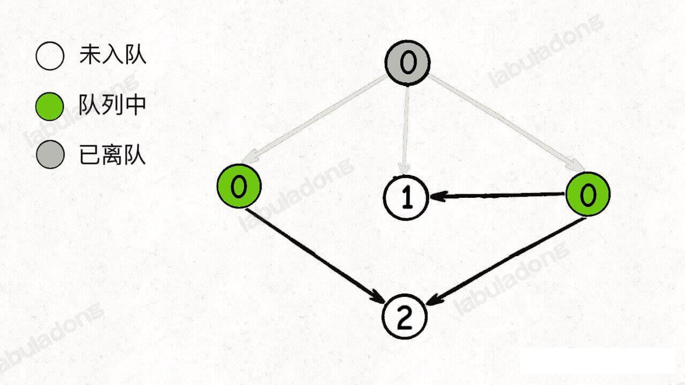

### 环检测以及拓扑排序算法

图这种数据结构有一些比较特殊的算法，比如二分图判断，有环无环图的判断，拓扑排序，以及最经典的最小生成树，单源最短路径问题，更难的就类似网络流这样的问题。

我们只要不是打竞赛，向网络流这样的没时间的话就没必要学了，像**最小生成树** 和 *最短路径问题*，虽然从刷题的角度用到的不多，但他们属于经典算法，学有余力的可以掌握以下；像 二分图判定，拓扑排序这一类，属于比较基本且实用的算法，应该比较熟练地掌握。

本章节就结合具体的算法问题，**来说说两个图论算法，有向图的环检测，拓扑排序算法**

这两个算法既可以使用 DFS 思路解决，也可以使用 BFS 思路解决，相对而言，BFS 算法从代码实现上看着更简洁些(不用递归，而是使用循环)，但 DFS 解法更有助于你进一步理解 递归遍历数据结构 的奥义，所以本章节我们先说 DFS 遍历的思路，再讲 BFS 的遍历思路。

#### 环检测算法(DFS版本)

先来看看 leetcode 207 题「课程表」


函数签名如下：

```java
canFinish(int numCourses,int[][] prerequisites);
```

题目应该不难立即，什么时候无法修完所有的课程？当存在循环依赖的时候。

其实这种场景在显示生活中也十分常见，比如我们的 java 项目存在循环依赖的时候，编译器会报错，所以编译器也用了类似的算法来判断你的代码能否成功编译。（JDK 的 jstack 工具 的死锁检测应该也是运用了这种思想）

**看到依赖问题，首先想到的就是把问题转化成「有向图」这种数据结构，只要图中存在环，那就说明存在循环依赖**。

具体来说，我们首先可以把课程看成是「有向图」中的节点，节点标号分别是 `0,1,...,numCourses-1`, 把课程之间的依赖关系看做是节点之间的有向边。

比如说必须修完课程1，才能去修课程 3 ，那么就有一条边从节点 1 指向节点 3。

我们可以根据题目提供的 `prerequisites` 数组生成一副类似这样的图：


**如果发现这幅图中存在环，那就说明可能之间存在循环依赖，肯定没办法全部上完；反之，如果没有环，那么肯定能上完所有课程**。

如何转化成图？图常用的存储结构是两种：邻接表和邻接矩阵。以我的经验来说，常见的存储形式是使用邻接表，比如下面这种形式：

```java
List<Integer>[] graph;
```
**`graph[i]` 是一个列表，存储着节点 `s` 所指向的节点。也就是节点 s 的所有出度边。**

所以我们可以先写一个建图函数
```java
List<Integer>[] buildGraph(int numCourses, int[][] prerequisites) {
        // 有 numCourses 门课程，就有 numCourses 个节点
        List<Integer>[] graph = new LinkedList[numCourses];
        for (int i = 0; i < numCourses; i++) {
            graph[i] = new LinkedList<>();
        }

        for (int[] courses : prerequisites) {
            // prerequisites 的形式 [1,0] 表示要想修课程1 必须先修课程0，也就是说选修课程的顺序必须是 从 0 到 1，
            // 我们这里建一条从 from 到 to 的边
            int from = courses[1], to = courses[0];
            // 将 to 加到 from 的目标节点集合中，形成一条边
            graph[from].add(to);
        }
        return graph;
    }
```

图建好以后，我们先来思考如何遍历这幅图，**只要会遍历，就可以判断图中是否存在环了**。

之前图论基础 写了 DFS 的算法遍历框架，无非就是从多叉树遍历框架扩展过来，加了个 `visited` 数组罢了。

另外，图的遍历和多叉树的遍历差不多，所以到这里我们应该很能容易理解。

思考如何判断图中是否存环，之前的图论中也就说了，我们可以使用 onPath 判断是否在图中

```java
void traverse(List<Integer>[] graph, int s) {
        if (onPath[s]) {
            hasCycle = true;
        }
        // 如果发现有环，或者已经遍历过的节点，则返回
        if (hasCycle || visited[s]) {
            return;
        }
        visited[s] = true;
        onPath[s] = true;
        // 深度优先遍历 DFS
        for (int to : graph[s]) {
            traverse(graph, to);
        }
        // 退出 s 节点
        onPath[s] = false;
    }

    boolean canFinish(int numCourses, int[][] prerequisites) {
        // 先构造图
        List<Integer>[] graph = buildGraph(numCourses, prerequisites);
        visited = new boolean[numCourses];
        onPath = new boolean[numCourses];

        // 对每一个节点开始 DFS 遍历，因为有些节点是独立的，跟其他节点不相连
        for (int i = 0; i < numCourses; i++) {
            traverse(graph, i);
        }
        return !hasCycle;
    }
```

onPath 和 visited 数组类比贪食蛇游戏，其中 onPath 仅仅记录蛇身，visited 表示蛇经过的格子。onPath 用于判断是否成环，类比当贪食蛇要到自己(成环)的场景。

如果题目要求我们，不仅仅判断是否存在环，还要返回这个环具体有哪些节点，怎办？

你可能说，`onPath` 里面的为 true 的索引，不就是组成环的节点编号吗？

不是的，假设下图中绿色的节点是递归的路径，他们在 `onPath` 中的值都是 true，但是显然成环的节点只是其中一部分


这个问题我们后面解决

**接下来，我们再讲一个经典的图算法：拓扑排序**

看下力扣 210 题 「课程表 II」


这道题就是上道题的进阶版，不是仅仅让大家判断是否可以完成所有课程，而是进一步返回一个合理的上课顺序，，保证开始修每个课程时，前置的课程都已经修完。函数签名如下
```java
public int[] findOrder(int numCourses, int[][] prerequisites) {
        
    }
```
这道题那，就是使用拓扑排序来解决了，拓扑排序(Topological Sort)，在之前的 firstMac 项目中数据结构部分，参考自 《算法 4》，已经接触过，这里继续温习下，给出一副百度百科的图片来直观感受下


注意，图中的拓扑排序顺序有误，`C7->C8->C6` 应该改为 `C6->C7->C8`。

**直观地说就是让你把一幅图「拉平」，而且这个「拉平」的图里面，所有的箭头方向是一致的**，比如上面的所有箭头都是朝右的。

很显然，如果一幅有向图中存在环，是无法进行拓扑排序的，因为肯定做不到所有箭头方向一致；反过来，如果是一幅「有向无环图」，那么一定是可以进行拓扑排序的。

这道题跟拓扑排序啥关系那？

**其实不难看出来，如果把课程抽象成节点，课程之间的依赖关系抽象成边，那么这幅图的拓扑排序结果就是上课顺序**。

首先，我们需要先判断输入的课程是否成环，成环的话是无法进行拓扑排序的，所以我们可以复用上一道题的主函数

```java
public int[] findOrder(int numCourses,int[][] prerequisites) {
    if(!canFinish(numCourses, prerequisetes)) {
        return new int[];
    }
    //
}
```

有的解法是拓扑排序不用对后续遍历的结果进行反转，这是为什么？

我们确实可以看到这样的解法，原因是建图的时候对边的定义不同。我这里建图的图中的箭头方向是「被依赖」关系，比如说 节点 1 指向 2，含义是节点 1 被节点 2 依赖，其实比较拗口，简单说是 节点2 依赖节点1，说白话就是先做节点1 才能继续去做节点2。

如果我们反过来，把有向边定义为「依赖」关系，整幅图中的边全部翻转，就可以不对后续遍历的结果反转。具体来说就是把建图过程中的 `graph[from].add(to)` 改为 `graph[to].add(from)` 就可以不用反转了。

**不过那，现实中一般都是从初级任务到高阶任务，所以像我们这样把边定义为「流向或者被依赖」关系可能比较符合我们的认知习惯**。

代码参见  findOrder 方法。

代码虽然看起来多，但是路基应该是很清楚的，只要图中无环，那么我们就对图中所有的就对进行 DFS 遍历，记录后续遍历结果，最后把结果反转，作为最终答案。

**那为什么后续遍历的反转结果就是拓扑排序那**？

我们这里也避免数学证明，用一个直观的例子来解释，我们就说二叉树，二叉树的老生常谈的遍历框架：
```java
void traverse(TreeNode root) {
    // 前序遍历代码位置
    traverse(root.left)
    // 中序遍历代码位置
    traverse(root.right)
    // 后序遍历代码位置
}
```
二叉树的后续遍历是什么时候？遍历完左右子树之后才会执行后续遍历位置的代码。换句话说，当左右子树的节点都被装在列表里面了，根节点才会被装进去。

**后序遍历的这个特点很重要，之所以拓扑排序的基础是后序遍历，是因为一个任务必须等到它依赖的所有任务完成之后才能开始执行**。

你把二叉树理解成一幅图，边的方向是由父节点指向子节点，那么就是下面这幅图：


按照我们的定义，边的含义是「被依赖」关系，那么上图中的拓扑排序首先应该是节点 1 ，然后是 2, 3 ，以此类推。

但是很显然，标准的后续遍历结果是不满足拓扑排序的，而如果把遍历结果反转，就是拓扑排序了。


以上，我们直观地解释了一下为什么「拓扑排序结果就是反转之后的后序遍历结果」，当然，我们的解释没有严格的数学证明，感兴趣的话可以自己去查查。

#### 环检测算法 （BFS版本）

刚才我们讲了 DFS 算法用 `onPath` 数组判断是否存在环，也讲了用 DFS 算法利用逆后续遍历进行拓扑排序。

其实 BFS 算法借助 `indgree` 数组记录每个节点的「入度」，也可以实现这两个算法。

所谓「出度」和「入度」是「有向图」中的概念，很直观：如果一个节点 x 有 a 条边指向别的几点，同时被 b 条边所指，则称节点 x 的出度为 a，入度为 b。

我们这里先说环检测算法，参考 canFinishBFS 方法

这里总结下 BFS 算法的思路：

1、构建邻接表，和之前一样，边的方向表示「被依赖的关系」。
2、构建一个 `indegree`  数组记录每个节点的入度，即 `indegree[i]` 记录节点 `i` 的入度。
3、对 BFS 队列进行初始化，将入度为 0 的节点首先装入队列。
4、**开始执行 BFS 循环(BFS 一般都不递归），不断弹出队列中的节点，减少相邻节点的入度，并将入度为 0 的节点加入队列**

5、**如果最终所有节点都被遍历过(`count` 等于节点数)，则说明不存在环，反之则说明存在环**

思路第 5 条为什么说 count == 节点数 就能保证 环存在不存在。下面我们开始给出相关图示：

比如下面这幅图，节点中的数字，代表该节点的入度


队列进行初始化，入度为 0 的节点首先被加入队列：


开始执行 BFS 循环，从队列中弹出一个节点，减少相邻节点的入度，同时将**新产生的入度为 0 的节点**加入队列：



继续从队列中弹出节点，并减少相邻接点的入度，这一次没有产生新的入度为 0 的节点：


继续从队列中弹出节点，并减少相邻节点的入度，同时将**新产生的入度为 0 的节点**加入队列：


继续弹出节点，直到队列为空


这个时候，所有节点都被遍历一遍，也就说明图中不存在环。

反过来说，如果按照上述逻辑执行 BFS 算法，存在节点没有被遍历，则说明成环。

比如下面这种情况，队列中最初只有一个入度为 0 的节点:


当弹出这个节点并减小相邻节点的入度之后队列没为空，但并没有产生新的入度为 0 的节点加入队列，所以 BFS 算法终止：


我们看到，**如果存在节点没有被遍历，那么就说明图中存在环**，现在回头去看看 BFS 的代码，我们就能很容易理解其中的逻辑了。

#### 拓扑排序(BFS) 版本

**如果你能看到那个 BFS 版本的环检测算法，那么很容易得到 BFS 版本的拓扑排序算法，因为节点的遍历顺序就是拓扑顺序**

比如刚才举的例子：下面每个节点的的值即入队的顺序：


显然，这个顺序就是一个可行的拓扑排序结果。

所以我们稍微修改一下 bfs 环状检测的代码，记录节点的遍历顺序即可。。。

参考 findOrderBfs 方法，只是在 finishCourseBFS 稍微加了点东西

按道理，图的遍历 都需要 `visited` 数组防止走回头路，这里的 BFS 算法其实是通过 `indgree` 数组实现 `visited` 数组的作用，**只有入度为 0 的节点才能入队，从而保证不会出现死循环**。

好了，到这里环检测算法，拓扑排序算法的 BFS 版本，也讲完了，BFS 算法，成环的节点有哪些？

下面就是我的解决方法，请参考