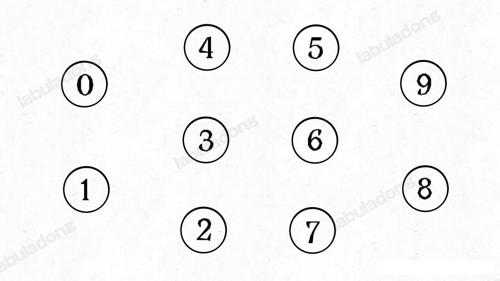
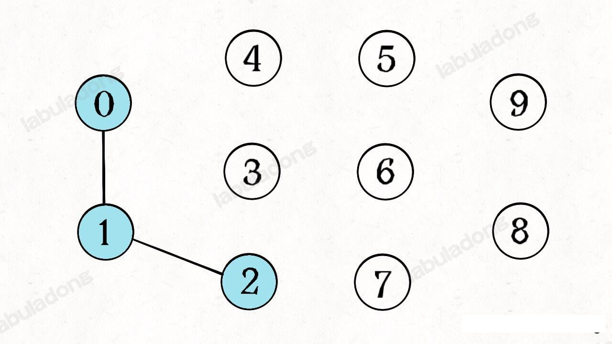
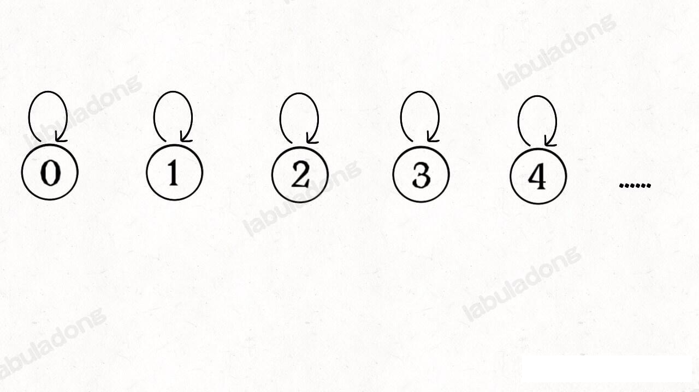
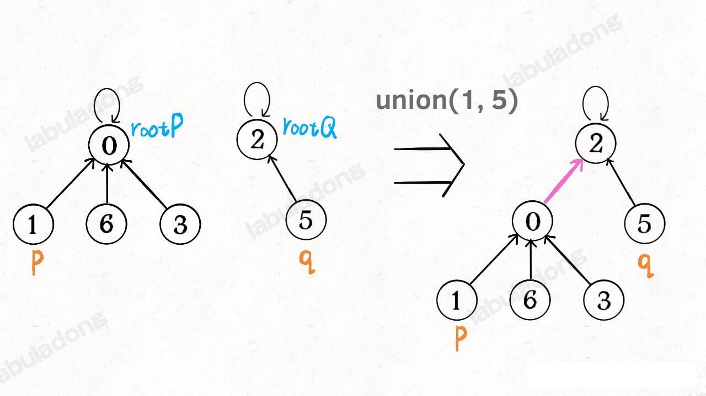
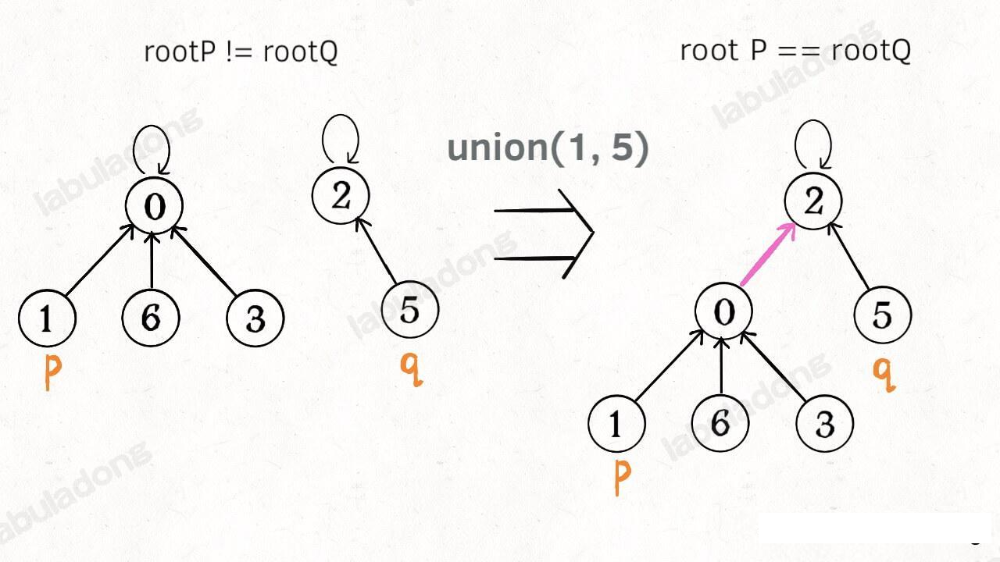
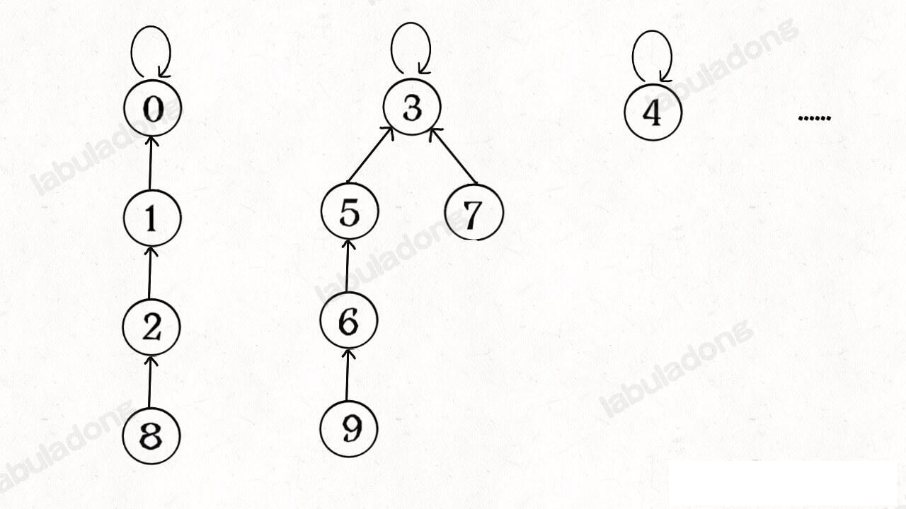
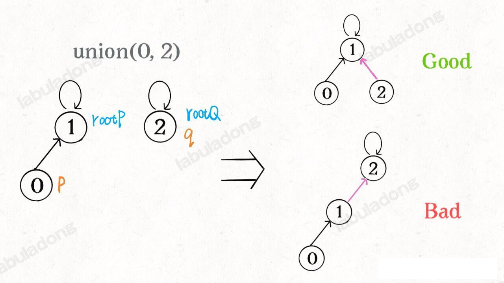
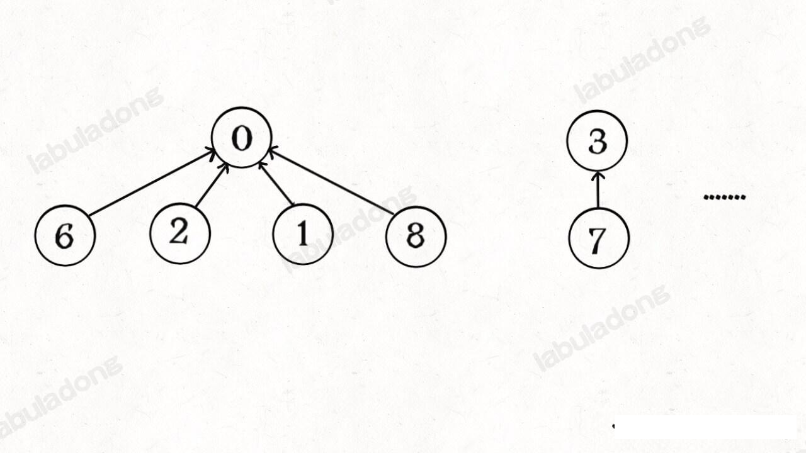
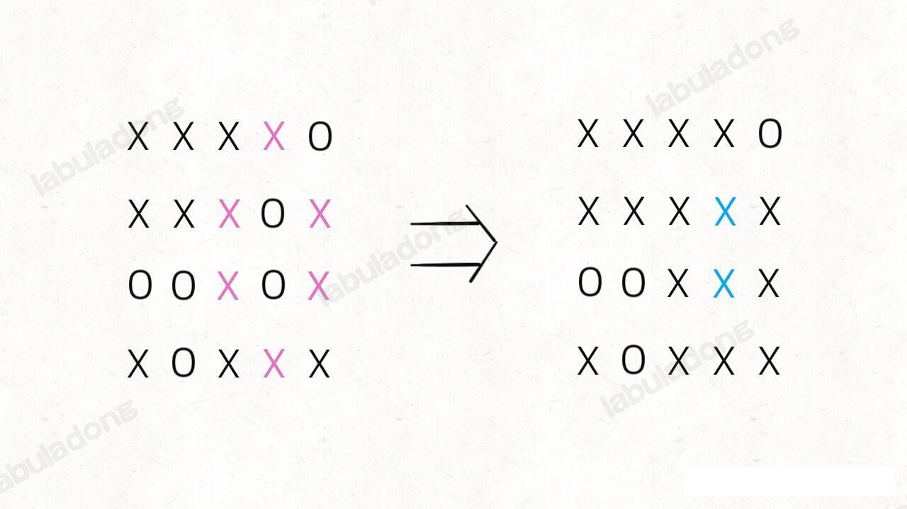
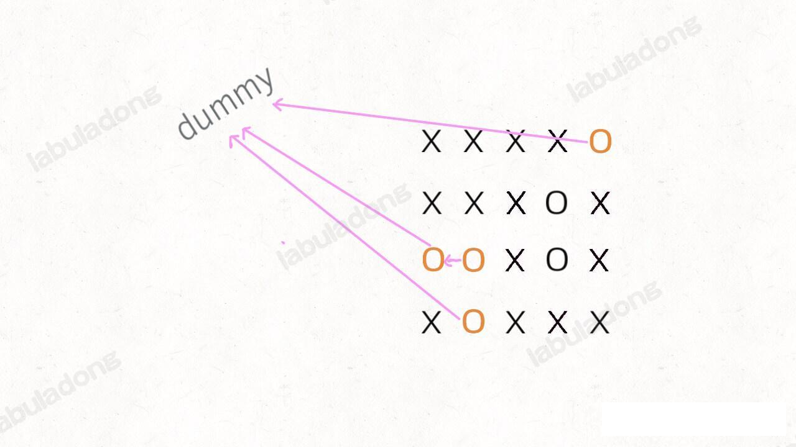

### 并查集

并查集(Union-Find) 算法是一个专门针对「动态连通性」的算法，这个算法是最小生成树的前置知识，本章节争取一次讲明白

首先，从什么是图的动态连通性开始讲。

#### 一、动态连通性

简单说，动态连通性其实可以抽象成一幅图连线。比如下面这幅图，共有 10 个节点，他们之间互不相连，分别用 0-9 标记：



现在我们的 union-find 算法主要实现这两个 api：

```java
class UF {
    /* 将 p 和 q 连接 */
    public void union(int p, int q);
    /* 判断 p 和 q 是否连通 */
    public boolean connected(int p, int q);
    /* 返回图中有多少个连通分量 */
    public int count();
}
```

这里所说的「联通」是一种等价关系，也就是说具有如下三个性质：

1、自反省：节点 p 和 q 是联通的。

2、对称性：如果节点 p 和 q 是联通的，那么 q 和 p 也是联通的

3、 传递性，如果节点 p 和 q 是联通的，q 和 r 是联通的，那么 p 和 r 也是联通的。

比如上面这幅图，0-9任意两个点都不连通，调用 connected 都会返回 false，联通分量为 10 个。

现在如果调用 `union(0,1)`, 那么 0 和 1 被连通，连通分量被降为 9。

再调用 `union(1,2)`, 这时候 0,1,2 都被连通，调用 `connected(0,2)` 也会返回 true，连通分量变为 8 个。



判断这种「等价关系」非常适用，比如说编译器判断同一个变量的不同引用。

这样，你应该大概明白什么是动态连通性了，Union-Find 算法的关键就在于 `union` 和 `connected` 函数的效率。那么用什么模型来表示这幅图的连通性那？用数据结构怎么实现代码那？

#### 二、基本思路

注意我们工厂把「模型」和具体的「数据结构」分开说，这么做是有原因的。因为我们使用森林(若干棵树)来表示图的动态连通性，用数组来具体实现这个森林。



```java
class UF {
    // 记录连通分量
    private int count;
    
    // 节点 x 的父节点是 parent[x]
    private int[] parent;

    public UF(int n) {
        // 一开始不连通
        this.count=n;
        this.parent = new int[n];
        // 刚开始父指针只想自己
        parent[i] = i;
    }

    /* 其他函数*/
}
```

**如果某两个节点被联通，则让其中的（任意）一个节点的根节点连接到另一个节点的根节点上。** 如下图所示



```java
class UF {
    // 省略上面的diam
    public void union(int p, int q) {
        int rootP = find(p);
        int rootQ = find(q);
        if(rootP == rootQ) {
            return;
        }
        // 将 rootP 的父节点连到 rootQ
        parent[rootP] = rootQ;
        // parent[rootQ] = rootP 也一样
        count--; // 二者连通，则连通分量合二为一。
    }

    int find(int x) {
        while(parent[x] != x) {
            x = parent[x];
        }
        return x;
    }

    int count() {
        return count;
    }
}
```
这样，如果节点 p 和 q 连通的话，他们一定有相同的根节点：



```java
class UF {
    //...省略生疏代码
    public boolean connected(int p, int q) {
        int rootP = find(p);
        int rootQ = find(q);
        return rootP == rootQ;
    }
}
```

至此，Uinon-Find 算法就基本完成了。**<font color='red'>是不是很神奇？竟然可以使用数组来模拟出一个森林</font>**，如此巧妙地就解决这个比较复杂的问题！

那么这个算法的复杂度是多少那？我们发现，主要 API `connected` 和 `union` 的复杂度都是 `find` 函数造成的，所以说他们的复杂度和 `find` 一样。

`find` 主要功能就是从某个方向上向上遍历到树根，其时间复杂度就是树的高度，我们可能习惯性认为树的高度就是 `logN`, 但这并不一定。`logN` 的高度在存在于平衡二叉树，对于一般的可能出现极端不平衡的情况，使得「树」几乎退化成「链表」，树的高度最坏情况下可能变成 N。



所以说，上面这种解法，`find`,`union`,`connected` 的时间复杂度都是 O(N)。这个复杂度很不理想，你想如果我们把算法应用到社交网络这样数据规模巨大的问题，对于 `union` 和 `connected` 的调用非常频繁，每次调用需要线性时间完全无法接受。

**问题的关键在于，如果想办法避免树的不平衡** ？ 大神们给出了各种骚操作。

#### 三、平衡性优化

我们要知道那种情况下可能会出现不平衡现象，关键在于 `union` 过程，因为 union 过程会将 两节点的根节点的进行连通。在连通的过程中，可能出现不平衡

我们一开始就简单粗暴地把 p 所在的树接到 q 所在的树的根节点下面，那么这里面可能出现「头重脚轻」的不平衡状况，比如下图：



**长此以往，树可能生长的很不平衡。我们其实希望，小一些的树接到大一些的树下面，这样就能避免头重脚轻， 更平衡些**。解决方法是额外使用一个 size 数组，记录每棵树包含的节点数，我们不妨称为「重量」（也可以叫 level 数组，算法 4 中是这么叫的）

比如说 `size[3]=5` 表示，以节点 3 为根的那棵树，总共有 5 个节点。这样我们可以修改一下 `union` 方法

```java
class UF {
    void union(int p ,int q) {
        int rootP = find(p);
        int rootQ = find(q);
        if(size[rootP] > size[rootQ]) {
            parent[rootQ] = rootP;
            size[rootP] += size[rootQ]
        } else {
            parent[rootP] = rootQ;
            size[rootQ] += size[rootP]
        }
        count --;
    }
}
```

这样，通过比较树的重量/层级，我们就能保证树的生长相对平衡，树的高度大致在 `logN` 这个数量级，极大地提升执行效率。

此时，`find`,`union`,`connected` 的时间复杂度都下降到 `O(logN)`, 即便上亿的数据规模，所需时间也非常少。

#### 4、路径压缩

这步优化，虽然代码简单，但是原理却非常巧妙。

**其实我们并不在乎每棵树的结构长啥样，只在乎根节点**。

因为无论树长啥样，树上的每个节点的根节点都是相同的，所以能不能进一步压缩每棵树的高度，使树高始终保持在常数？


这样每个紧挨的父节点就是整棵树的根节点,`find` 就能以 O(1) 的时间找到某一节点的根节点，相应的，`connected` 和 `union` 复杂度都下降为 O(1)。

要做到这一点主要是修改 `find` 函数逻辑，非常简单，但我们可能会看到两种不同的写法。

第一种，在  find 函数中加一行代码：

```java
class UF {
    int find(int x) {
        while(x != parent[x]) {
            //进行代码路径压缩
            // 有点父指针的二叉树的感觉，x.parent = x.parent.parent;
            // 最终结果是 x.parent 和 x 都指向 祖父节点
            parent[x] = parent[parent[x]];
            x=parent[x];
        }
        return x;
    }
}
```
用语言描述就是，每次 while 循环都会让部分子节点向上移动，这样每次调用 `find` 函数向树根遍历的同时，顺手就将树高缩短了。

第二种写法是这样的：

```java
class UF {    
    // 第二种路径压缩的 find 方法
    public int find(int x) {
        if (parent[x] != x) {
            parent[x] = find(parent[x]);
        }
        return parent[x];
    }
}
```

这个递归过程有点不好理解，我们可以自己手画一下递归过程。我这里把这个递归函数翻译成迭代的形式，方便我们理解路径压缩：

```java
class UF {
    find(int x) {
        int root =x;
        while(root!=parent[root]) {
            root=parent[root];
        }
        // 然后把 x 到根节点之间的所有节点直接连接到根节点下面
        int old_parent = parent[x];
        while(x!=root) {
            parent[x] = root;
            x=old_parent;
            old_parent=parent[old_parent];
        }
        return root;
    }
}
```

这种路径压缩的效果如下：



比起第一种压缩，显然这种方法压缩得更彻底，直接把一整条树枝压平，一点意外都没有。就算一些极端的情况下产生了一颗比较高的树，只要一次路径压缩就能大幅降低树高，所有操作的时间复杂度依然是 O(1), 所以从效率的角度来说，推荐使用这种路径压缩算法。

**另外如果使用路径压缩的技巧，那么 `size` 数组的平衡优化就不是特别必要了。**

所以最终的 UF  参见 UnionFind 类的内部类 UF

到这里，我们的 Union-Find 算法基本已经讲完了，总结一下优化算法的过程。

1、用 `parent` 数组记录每个节点的父节点，相当于指向父节点的指针，所以 `parent` 数组内实际存储着一个森林（若干可多叉树），
2、用 `size` 数组记录着每个树的重量，目的是让 union 后树依然平衡，保证额各个 API 时间复杂度为 O(logN)。
3、在 find 函数中进行路径压缩，保证任意树的高度保持在常数，使得各个 API 时间复杂度为 O(1)。使用了路径压缩之后，可以不使用 size 数组。

#### 题目实战：无向图中连通分量数目。

leetcode 323 无向图中连通分量数目 就是最基本的联通分量题目：

给你输入一个包含 n 个节点的图，用一个整数 n 和 一个数组 edges 表示，其中 edges[i] =[ai,bi] 表示图中节点 ai 和 bi 之间的有一条边。请你计算这幅图的连通分量个数。

```java
public int countComponent(int n, int[][] edges) {
        UF uf = new UF(n);
        for(int[] edge : edges) {
            uf.union(edge[0], edge[1]);
        }
        // 返回连通分量个数。
        return uf.count();
    }
```

另外一些使用 DFS 深度优先算法解决的问题，也可以使用 Union-Find 算法解决。

比如 leetcode 130 题，被围绕的区域：

给你一个 MxN 的二维矩阵，其中包含字符 `X` 和 `O`，让你找到矩阵中**四面**被 `X` 包围的 `O`, 并且把它替换成 X。
函数签名为:
```java
void slove(int[][] board);
```

注意哦，必须是四面被围的 O 才能被换成 X ，也就是说边角上的 O 一定不会被围，进一步，与边角上 O 相连的 O 也不会被 X 围四面，也不会被替换。



这个题解法一是使用 DFS 算法求解：
先用 for 循环遍历棋盘四边，用 DFS 算法将哪些与边界相连的 O 换成一个特殊字符，比如 #; 然后再遍历整个棋盘，把剩下的 O 替换成 X，把 # 恢复成 O。这样就完成题目的要求，时间复杂度为 O(MN)

解法二是使用 Union-Find 算法解决，虽然实现复杂些，甚至效率也略低，但这是使用 Union—Find 算法的通用思想，值的一学。

**我们可以把哪些不需要被替换的 O 看成是一个拥有独立绝技的门派，它们都有一个共同的「祖师爷」叫 `dummy`, 这些 O 和 `dummy` 相互连通，而那些需要被替换的 O 则与 dummy 不连通**



这就是 Union-Find 的核心思路，明白这个图，就很容易懂代码了。

首先要解决的是，根据我们的实现，Union-Find 底层用的是一维数组，构造函数需要传入这个数组的大小，而题目给的是一个二维棋盘。

这个很简单，二维坐标`(x,y)` 可以转换成 `x * n + y` 这个数(m 是前盘的行数，n 是棋盘的列数)。**请注意，这是将二维数组映射到一维数组的常用技巧**。

其次，我们之前描述的「祖师爷」是虚构的，需要给他留个位置。索引 `[0..m*n-1]` 都是棋盘内坐标的一位映射，那就让虚拟的 dummy 节点占据索引 m*n 就好了。

solve 这个方法的代码很长，其实就是上面说的思路实现，只有和边界 0 相连的 0 才具有 dummy 的连通性，它们不会被替换。

其实用 Union-Find 算法解决这个简单的问题有点杀鸡用牛刀，它可以解决更复杂，更具有技巧性的问题，**主要思路是实时增加虚拟节点，想办法让元素「分门别类」，建立动态连通性关系。**

leetcode 第 990 题「等式方程的可满足性」用 Union-Find算法就显得十分优美了，题目描述如下：

```text
给定一个由表示变量之间关系的字符串方程组成的数组，每个字符串方程 equations[i] 的长度为 4，并采用两种不同的形式之一："a==b" 或 "a!=b"。在这里，a 和 b 是小写字母（不一定不同），表示单字母变量名。

只有当可以将整数分配给变量名，以便满足所有给定的方程时才返回 true，否则返回 false。
```
题目限制条件：
1. 1 <= equations.length <= 500
2. equations[i].length == 4
3. equations[i][0] 和 equations[i][3] 是小写字母
4. equations[i][1] 要么是 '='，要么是 '!'
5. equations[i][2] 是 '='