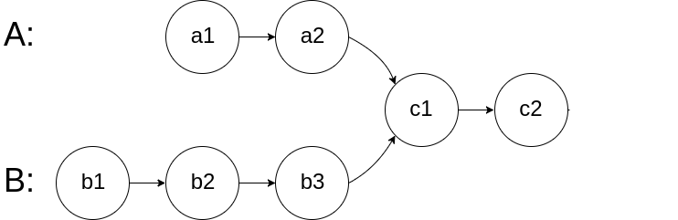

### 链表操作

#### 两个链表是否相交
leetcode  160 题，给你输入连个链表的头结点 `headA` 和 `headB`，这两个链表可能存在相交。
如果相交，你的算法应该返回相交的那个节点，如果不想交，则返回 null。

比如题目给的例子,如果输入的两个链表如下图所示：


那么这道题我们的算法应返回 `c1` 这个节点

这个体直接的想法是使用 HashSet，但需要额外的存储空间。如果不用 HashSet  ，只使用两个指针，该如何做？


如果使用两个指针 `p1` 和 `p2` 分别在两条链表上前进，并不能同时走到公共节点，也就无法得到相交的节点 c1.

**解决这个问题的关键是，通过某些方式，让 `p1` 和 `p2` 能够同时达到相交节点 `c1`**。

所以， 我们可以让 `p1` 遍历完链表 `A` 之后开始遍历链表 `B`，让 `p2` 遍历完链表 `B` 之后开始遍历链表 `A` （理解这句话非常重要，不理解的话看下图），这样就相当于「逻辑上」两个链表连接在了一起。

如果这样进行拼接，就可以让 `p1` 和 `p2` 同时进入公共部分，也就是同时到达相交节点 `c1` :


___
### 递归魔法，反转链表

#### 递归反转整个链表 

leetcode  第 206 题。

**对于递归算法，最重要的是明确递归函数的定义。** 具体来说，我们的 `reverse` 函数定义是这样的：
**输入一个节点 `head`, 将「以`head` 为起点」的链表反转，并返回反转之后的头结点**。

#### 反转链表前 n 个节点：

这次我们实现这样一个函数:
```java
// 将立案表的前 n 个节点反转 (n <= 链表长度)
ListNode reverseNode(ListNode,int n);
```
对于下图链表，执行 `reverseN(head,3)`:


解决思路和反转整个链表差不多

#### 反转链表的一部分

现在解决翻转链表的大 Boss。给你一个索引区间 `[m, n]` (索引从 1 开始)，仅仅反转区间中的链表元素。
```java
ListNode reverseBetween(ListNode head, int m, int n);
```

首先，如果 `m == 1`，就相当于方砖链表开头的 `n` 个元素嘛，也就是我们实现的功能：
```java
ListNode reverseBetween(ListNode head, int m, int n) {
    // base case
    if(m==1) {
        // 相当于反转前 n 个元素。
        return reverseN(head,n)
    }
    //...
}
```

如果 `m != 1` 怎么办？如果我们把 `head` 索引视为 1，那么我们是想从第 `m` 个元素开始反转对吧？如果把 `head.next` 的索引视为 1  呢？那么相等对于 `head.next`，反转区间应该是从第 `m - 1` 个元素开始的；那么对于 `head.next.next` 呢......

区别与迭代思想，这就是递归思想，所以我们可以完成以下代码：

#### 总结

递归思想相对迭代思想，稍微有点难以理解，处理掉技巧是：不要跳进递归，而是利用明确的定义来实现算法逻辑。
处理看起来比较困难的问题，可以尝试化整为零，把一些简单的解法修改修改，解决复杂的问题。

值得一提的是，递归操作链表并不高效。和迭代法相比，虽然事件复杂度都是 O(N), 但是迭代解法的空间复杂度是O(1)，而递归解法需要堆栈，空间复杂度是O(N)。所以队规操作链表可以作为对递归算法的联系，但是要考虑效率的话，还是使用迭代算法比较好。


### 如何 K 个一组反转链表。

先看题目描述


#### 分析问题

通过之前的学习，我们知道，链表是一种兼具递归和迭代性质的数据结构，认真思考一下可发现**这个问题具有递归性质**。

什么叫递归性质？直接上图理解,比如说我们对这个链表调用 `reverseKGroup(head,2)`，即以 2 个节点为一组进行反转链表：


如果我们射吧把前 2 个节点反转，那么后面的那些节点怎么处理？后面的这些节点也是一条链表，而且规模(长度)比原来的这条链表小，这就叫**子问题**。


我们可以把原先的 `head` 指针后移到后面这一段链表的开头，然后继续递归调用 `reverseGroup(head,2)`, 因为子问题(后面这部分链表)和原问题(整条链表)的结构完全相同，这既是所谓的递归性质。

发现了递归性质，就可以得到大致的算法流程。

**1、先反转以 `head` 开头的 `k` 个元素**。


**2、将第 `k+1` 个元素作为 `head` 递归调用 `reverseKGroup `**。


**3、将上述两个过程的结果连接起来**。


(这个图画的不好，应该是 2->1->4->3)。

整体思路就是这样了，最后一点值得注意的是，递归函数有个 base case，对于这个问题是什么那？

题目说了，如果最后的元素不足 `k` 个，就保持不变。这就是base case。（我当时想到的是 startIndex ==0 ,可是链表不比数组，没有什么明显的 startIndex ，所以我的思维还老是停留在用数组来解决链表的问题的阶段，没有发散开。）

#### 代码实现

首先，我们实现一个迭代版的 reverse 函数，反转一个区间之内的元素。迭代反转整个链表，这个已经实现了，参考 reverseLoop 函数。

反转一个区间的元素，只需要把对 null 的判断改为区间末尾的元素即可。


#### 总结

很多算法思想都是源于数据结构。什么动归、回溯、分治算法，其实都是树的遍历，树这种数据结构它不是就是个多叉树吗？你能处理基本数据结构的问题，解决一般的算法问题应该不会太费事。

那么如何分解问题，实现递归那？这个只能多联系。

___
### 如何判断回文链表

leetcode 234 回文链表

在前面的子序列问题中讲到了回文子序列以及回文相关的概念。寻找回文的中心思想是从中心向两段扩展：
```java
String palindrome(String , int left, int right) {
    while(left >= 0 && right < s.length() && s.charAt(left) == s.chartAt(right)) {
        left--;
        right++
    } 
    return s.substring(left+1,right);
}
```

因为回文串长度可能为奇数也可能是偶数，长度为奇数时只存在一个中心点，而长度为偶数时存在两个中心点，所以上面这个函数需要传入 `l` 和 `r`。

而**判断**一个字符串是不是回文串就简单多了，不需要考虑奇偶情况，只需要双指针技巧，从两段向中间逼近就行
```java
boolean isPlaindrome(STring s) {
    int left=0,right = s.length() -1;
    while(left < right ) {
        if(s.charAt(i) != s.charAt(j)) {
            return false;
        }
        left++;
        right--;
    }
    return true;
}
```
以上代码很好解释把，**因为回文是对称的，所以睁着度和倒着读应该是一样的，这一特点是解决回文串问题的关键**。

下面我们来扩展这一最简单情况，来解决：如何判断一个「单链表」是不是回文。

#### 一、判断回文单链表

leetcode 第 234 题
输入一个单链表头结点，判断你这个链表中的数组是不是回文，函数签名如下：
```java
boolean isPalindrome(ListNode head);
```
比如
```text
输入: 1->2->null
输出: false

输入: 1->2->2->1->null
输出: true
```

这道题的关键在于，单链表无法倒着遍历，无法使用双指针技巧。

那么最简单的办法就是，把元是链表反转存入一个新的链表，然后比较这两条链表是否相同。关于如何反转链表，请参考上面的反转链表部分。

其实，**借助于二叉树遍历的思路，不需要显式翻转链表也可以倒叙遍历链表**，下面来具体聊聊。

对于二叉树的集中遍历，我们在熟悉不过了
```java
void traverse(TreeNode root) {
    // 前序遍历逻辑代码写这里
    traverse(root.left);
    // 中序遍历的话代码逻辑写这里
    traverse(root.right)
    // 后续遍历代码逻辑写这里
}
```
经过前面的学习，我们发现，链表兼具递归结构，树结构不过是链表的衍生。那么，**链表其实也可以有前序遍历和后续遍历**
```java
traverse(ListNode head) {
    //前序遍历代码
    traverse(head.text);
    // 后续遍历代码
}
```

这个框架的指导意义在于：如果我们想正序打印链表中的 val 值，可以在前序遍历位置写代码；反之，如果向倒序遍历链表，就可以在后续遍历位置操作：

```java
/* 倒序打印单链表中的元素值 */
void traverse(ListNode head) {
    if (head == null) return;
    traverse(head.next);
    // 后序遍历代码
    print(head.val);
}
```

说到这里，其实可以稍作修改，模拟双指针实现回文判断的功能

```java
// 左侧指针
ListNode left;

    boolean isPalindromeLinkList(ListNode head) {
        left = head;
        return reversePalindromeRecursively(head);
    }

    boolean reversePalindromeRecursively(ListNode right) {
        if(right == null) {
            return true;
        }
        boolean res = reversePalindromeRecursively(right.next);
        // 后续遍历代码逻辑
        res = res && (left.val == right.val);
        left = left.next;
        return res;
    }
```
这么做的核心逻辑是什么？**实际上是把链表放入一个栈，然后再拿出来，这时候元素舒心就是反的**，只不过我们利用的是递归函数的堆栈而已。
当然，无论造一条反转链表还是利用后续遍历，算法的时间和空间复杂度都是O(N)。下面我们想象，能不能利用额外的空间，解决这个问题那？

#### 二、算法空间复杂度

思路是这样的：

**1、先通过 `双指针`中的快慢指针来找到链表的中点：**
```java
ListNode slow,fast;
slow=fast=head;
while(fast != null && fast.next != null) {
    slow = slow.next;
    fast = fast.next.next;
}
// slow 指针现在指向链表中点
```


**2 如果 `fast` 指针没有指向 `null`，说明链表长度为奇数，`slow` 还需要再前进一步** if (slow != null) {slow = slow.next;}


**3、从 `slow` 开始反转后面的链表，现在就可以开始比较回文串了：**

```java
ListNode left = head;
ListNode right = reverse(slow);
while(right != null) {
    if(left.val != right.val) {
        return false;
    }
    left = left.next;
    right = right.next;
}
```


至此，把上面 3 段代码合并在一起就高效地接解决了这个问题了，其中 `reverse` 函数很容易实现。