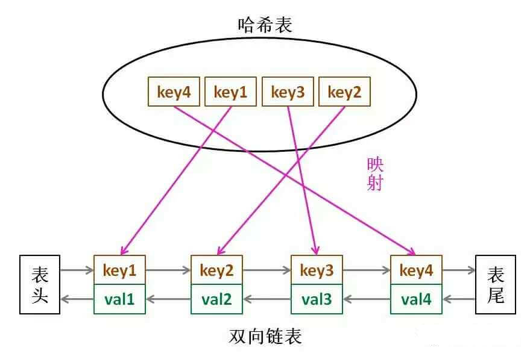

### LRU 

#### LRU 算法描述

LRU 算法描述,leetcode 146 题，LRU 缓存机制，就是让你设计数据结构：

首先要接收一个 `capacity` 参数作为缓存的最大容量，然后实现两个 API，一个是 `put(key,val)` 方法存入键值对，另一个是 `get(key)` 方法获取 `key` 对应的 `val`,如果 `key` 不存在则返回 -1。

注意：`get` 和 `put` 方法必须在 `O(1)` 的时间复杂度，我们举例来看看 LRU 算法是怎么工作的 

```java
LRUCache cache = new LRUCache(2);
// 你可以把 cache 理解成一个队列，假设左边是队头，右边是队尾，最近使用的排在队头，久未使用的排在队尾
cache.put(1,1);
cache.put(2,2);
// cache = [(2,2),(1,1)]
cache.get(1);// 返回 1
// cache = [(1,1),(2,2)] ，因为最近访问了键 1，所以提前至队头，返回键 1 对应的值 1.
cache.put(3,3);
//cache=[(3,3),(1,1)]。解释：缓存容量已满，需要删除内容腾出位置，优先删除久未使用的数据，也就是队尾的数据。然后把新数据查获如队头
cache.get(2); // 返回 -1(未找到), 因为 键 2 已经在上一步中被移除
cache.put(1,4); // cache=[(1,4),(3,3)]。解释：键1 已经存在，把原始值 1 覆盖为 4，同时要把键 (1) 提到队首。
```

#### LRU 算法设计

分析上面的操作过程，要让 `put` 和 `get` 方法的时间复杂度为 O(1), 我们可以总结出 `cache` 这个数据结构的必要条件：

1、显然 `cache` 中的元素必有时序，以区分最近使用的和久未使用的数据，当容量满了之后要删除最久未使用的那个元素腾出位置

2、我们要在 `cache` 中快速地找到某个 `key` 是否已经存在并得到应用对应的 `val`;

3、每次访问 `cache` 中的某个 `key`, 需要将这个元素变为最近使用，也就是说 `cache` 要支持在任意位置快速插入和删除元素。

那么，什么数据结构能满足以上条件那？哈希表查找块，但是数据无固定顺序；链表有顺序之分，插入删除块，但是查找慢。所以结合一下，就形成了一种新的数据结构：哈希链表 `LinkedHashMap`, 不过我们这次不打算用 JDK 的，而是要用我们自己手写。



1、如果我们每次默认从链表链表尾部添加元素，那么显然越靠近尾部的元素是最近使用的，越靠近头部的元素就是最久未使用的。

2、对于某一个 `key`, 我们可以通过哈希表快速定位到链表中的节点，从而得到对应的 `val`。

3、链表显然是支持在任意位置快速插入和删除的，改改指针就行。只不过传统的链表无法按照索引快速访问某一个位置的元素，这里借助于哈希表，可以通过 `key` 快速映射到任意一个链表节点，然后进行插入和删除。

**为什么要用双链表，单链表不行吗？哈希表中已经存储了 key，链表中只存储 val 不行吗**？

代码实现的过程中，就自然知道其中的用处了。参考代码 CustomLRU 类。


### LFU

#### 思路分析

一切从最简单的开始，根据 LFU 的算法逻辑，我们先列举出执行过程中的杰哥显而易见的事实：

1、调用 `get(key)` 方法时，要返回 `key` 对应的 `val` 。

2、调用 `get` 或者 `put` 方法访问某一个`key` 时，该`key` 的 `freq` 要加一。

3、如果在容量满了的时候进行插入，则需要将 `freq` 最小的 `key` 删除，如果最小的 `freq` 对应多个 `key`, 则删除最旧的那个。

好了，我们希望在 O(1) 的时间内解决这些需求，可以使用基本数据结构来逐个击破：

1、使用一个 HashMap 来存储 key 到  val 的映射，就可以快速计算 `get(key)`。

2、使用一个 HashMap 来存储 key 到 freq 的映射，就可以快速操作 key 对应的 freq。

3、第三个需求是 LFU 算法的核心，所以我们分开说：

3.1 首先，肯定是需要 `freq` 到 `key` 的映射， 用来寻找 `freq`最小的 `key`。

3.2 将 `freq` 最小的 `key`删除，那你就得快速得到当前所有`key`最小的 `freq` 是多少。想要时间复杂度是 O(1)的话，肯定不能遍历一遍去找，那就用一个变零 `minFreq` 来记录当前最小的 `freq` 吧。

3.3 可能有多个`key` 拥有相同的 `freq`, 所以 **`freq` 对 `key` 是一对多的关系**，即一个 `freq` 对应一个 `key` 的列表。

3.4 希望 `freq` 对应的 `key` 的列表是存在时序的，便于快速查找并删除最旧的 `key`。

3.5、希望 **能够快速删除 `key` 列表中的任何一个 `key`**，因为如果频次为 `freq` 的某个 `key`被访问，那么它的频次就会变成 `freq+1`, 就应该快速从 `key` 列表中删除，加到对应的 `freq+1` 对应的 `key` 的列表中。这个结构如下：

```java
Map<Integer/*freq*/, LinkedHashSet<Integer>> freqToKeys;
int minFreq;
```

介绍一下这个 `LinkedHashSet`, 它满足上述的 3.3,3.4,3,5 这个几个需求。你会发现普通的链表 `LinkedList` 能够满足 3.3,3.4 的这两个需求，但是由于普通链表不能快速访问链表中的某一个节点，所以我发满足 3.5 的需求。