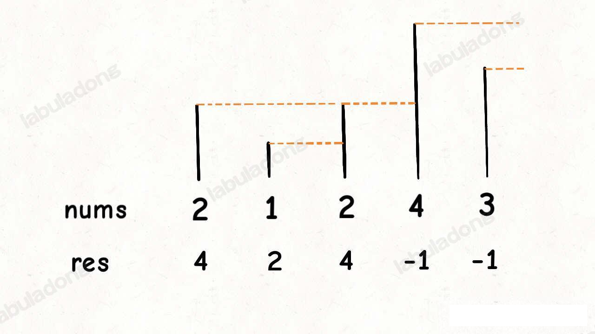
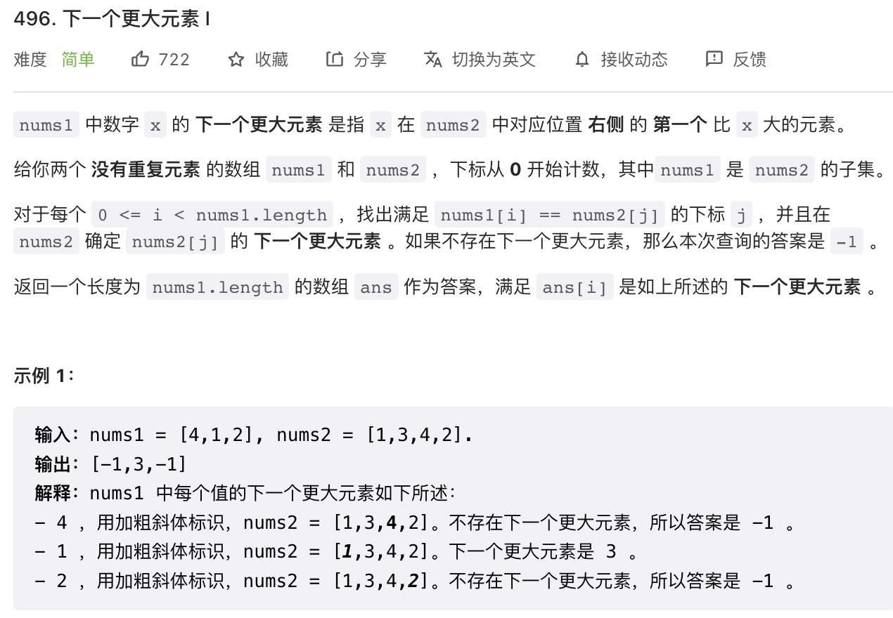
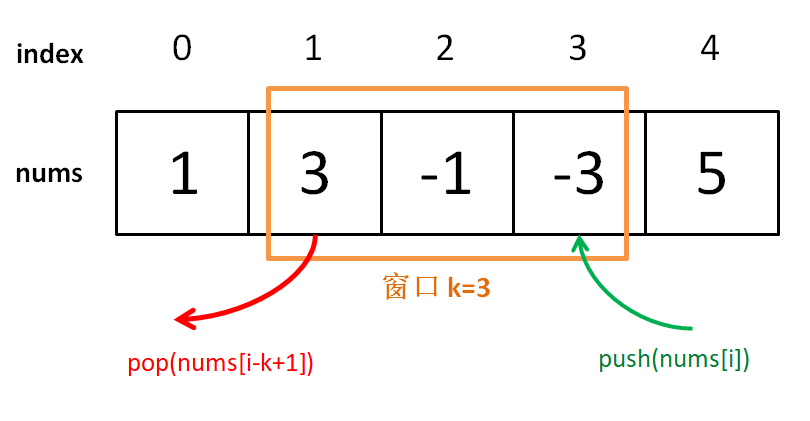

## 单调的栈或者队列来解决几个问题

### 单调栈

#### 单调模板



根据上面的图，我们来看下 leetcode 496 的问题

leetcode 496 下一个更大的元素：




### 单调队列

单调队列也没啥难的，就是一个队列，只是使用了一点巧妙的方法，使得队列中的元素全部是单调递增(递减)的。

为啥要发明「单调队列」这种结构那，主要是为了解决下面的这个场景：

**给你一个数组 `window` , 已知其最值为 `A`，如果给 `window` 中添加一个元素 `B`，那么比较一下 `A` 和 `B` 就可以立即算出其最新的最值；但如果从 `window` 数组中减少一个数，就不能直接得到最值了，因为如果减少的这个数敲好是`A`，就需要遍历 `window` 中的所有元素重新寻找新的最值。**

这个场景很常见，但不用单调队列也可以，比如优先级队列也是一种特殊的队列，专门用来动态寻找最值，我们创建一个大（小）顶堆，不就很快可以拿到最值了吗？

如果单纯地维护最值的话，优先级队列很专业，队头元素就是最值。但是优先级队列无法满足标准队列「先进先出」的**时间顺序**，因为优先级队列底层使用二叉堆对元素进行动态排序，元素的出队顺序是元素的大小顺序，和入队的先后顺序完全没有关系。

所以现在需要一种新的队列结构，既能够维护队列元素「先进先出」的时间顺序，也能够正确维护队列中所有元素的最值，这就是「单调队列」结构。

「单调队列」这个数据结构主要是用来辅助解决滑动窗口相关的问题，有些复杂的滑动窗口只靠两个指针不能解决，需要上更先进的数据结构。

比如说，经典滑动窗口的更新时机，每当扩大窗口(`right++`) 和窗口缩小(`left++`) 时，我们仅凭移出和移入窗口的元素即可决定是否更新答案。

但是本章节所说的判断一个窗口中最值的例子，你无法单凭移出窗口的那个元素更新窗口的最值，除非重新遍历整个窗口元素，那这样的话，时间复杂度就上来了，这是我们不希望看到的。

leetcode 239 题 「滑动窗口的最大值」，就是一道标准的需要单调队列的滑动窗口问题

给你输入一个数组 `nums` 和一个正整数 `k`，有一个大小为 `k` 的窗口在 `nums` 上从左至右滑动，请你输出每次窗口中 `k` 个元素的最大值。

函数签名如下：

```java
int[] maxSlidingWindow(int[] nums, int k);
```

比如说 leetcode 给出的一个例子：


接下来，我们就借助单调队列结构，用 `O(1)` 的时间算出每个滑动窗口的最大值，使得整个算在限行时间内完成。

##### 一、搭建解题框架

单调队列的 API 如下：

```java
interface MonotonicQueue {
        void push(int item);
        // 如果队头元素是 n，则删除它。
        void pop(int n);
        // 返回队列中的最大值
        int max();
    }
```
滑动窗口的 框架：

```java
int[] maxSlidingWindow(int[] nums, int k) {
        int[] res = new int[nums.length - k + 1];
        MonotonicQueue window = new MonotonicQueueImpl();
        // 先填充 window，形成 k 大小的滑动窗口
        for (int i = 0; i < nums.length; i++) {
            if (i < k - 1) {
                // 先填满窗口 k -1 个元素
                window.push(nums[i]);
            } else {
                // 窗口向前滑动，加入新数字
                window.push(nums[i]);
                // 记录窗口的最大值
                res[i - k + 1] = window.max();
                // 移出窗口首位元素
                window.pop(nums[i - k + 1]);
            }
        }
        return res;
    }
```


思路比较简单，能理解吧，下面我们开始单调队列的实现：

##### 二、实现单调队列

```java
static class MonotonicQueueImpl implements MonotonicQueue {
        Deque<Integer> queue = new LinkedList<>();

        @Override
        public void push(int item) {
            // 当前 入队的元素比队尾元素大，则弹出队尾的元素
            while (!queue.isEmpty() && item >= queue.peekLast()) {
                queue.removeLast();
            }
            queue.addLast(item);
        }

        @Override
        public void pop(int n) {
            if (n == queue.peek()) {
                queue.removeFirst();
            }
            // 其他情况下 push 的时候，元素已经被压缩了，(这里的压缩，就是指弹出队列了)
        }

        @Override
        public int max() {
            return queue.peek();
        }
    }
```

你可以想象，加入数字的大小代表人的体重，体重大的会把前面体重不足的压扁，直到遇到更大的量级才停住。


如果每个元素被加入时都这样操作，最终单调队列中的元素大小就会保持一个单调递减的顺序，因此 ```max``` 方法就可以直接返回队列头部的元素

`pop` 方法在队头删除元素 `n`

之所以要判断 `n == maxq.getFirst()`，是因为我们想删除的队头元素 `n` 可能已经被「压扁」了，可能已经不存在了，所以这时候就不用删除了。

单独看 push 操作的复杂度确实不是 `O(1)`，但是算法整体的复杂度依然是 `O(N)` 线性时间。要这样想，`nums` 中的每个元素最多被 `push` 和 `pop` 一次，没有任何多余操作，所以整体的复杂度还是 `O(N)`。空间复杂度就很简单了，就是窗口的大小 O(k)