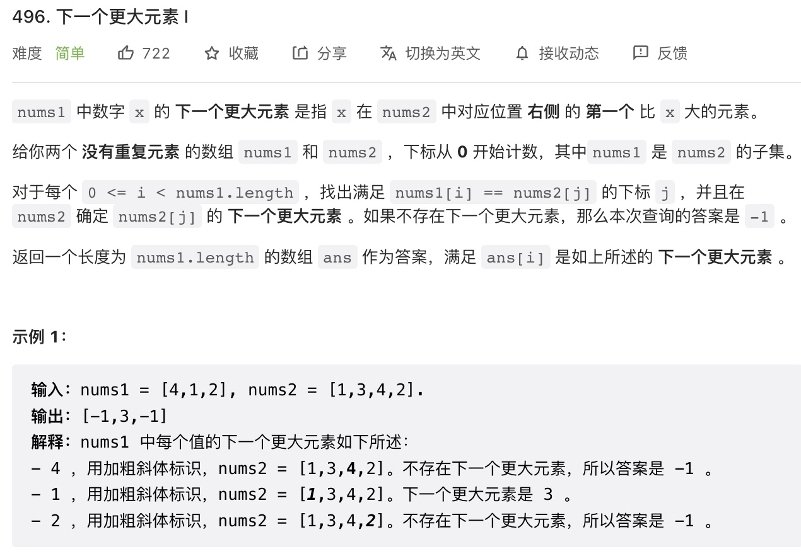
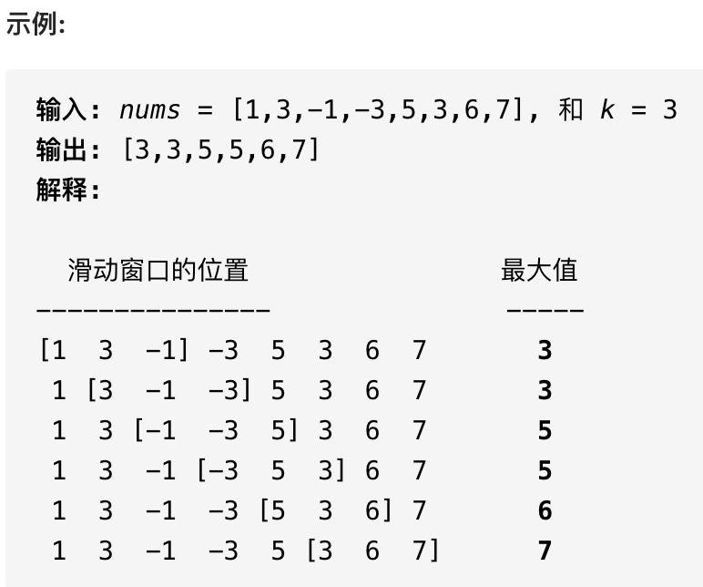
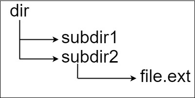

## 单调的栈或者队列来解决几个问题

### 单调栈

#### 单调模板


根据上面的图，我们来看下 leetcode 496 的问题

leetcode 496 下一个更大的元素：




### 单调队列

单调队列也没啥难的，就是一个队列，只是使用了一点巧妙的方法，使得队列中的元素全部是单调递增(递减)的。

为啥要发明「单调队列」这种结构那，主要是为了解决下面的这个场景：

**给你一个数组 `window` , 已知其最值为 `A`，如果给 `window` 中添加一个元素 `B`，那么比较一下 `A` 和 `B` 就可以立即算出其最新的最值；但如果从 `window` 数组中减少一个数，就不能直接得到最值了，因为如果减少的这个数敲好是`A`，就需要遍历 `window` 中的所有元素重新寻找新的最值。**

这个场景很常见，但不用单调队列也可以，比如优先级队列也是一种特殊的队列，专门用来动态寻找最值，我们创建一个大（小）顶堆，不就很快可以拿到最值了吗？

如果单纯地维护最值的话，优先级队列很专业，队头元素就是最值。但是优先级队列无法满足标准队列「先进先出」的**时间顺序**，因为优先级队列底层使用二叉堆对元素进行动态排序，元素的出队顺序是元素的大小顺序，和入队的先后顺序完全没有关系。

所以现在需要一种新的队列结构，既能够维护队列元素「先进先出」的时间顺序，也能够正确维护队列中所有元素的最值，这就是「单调队列」结构。

「单调队列」这个数据结构主要是用来辅助解决滑动窗口相关的问题，有些复杂的滑动窗口只靠两个指针不能解决，需要上更先进的数据结构。

比如说，经典滑动窗口的更新时机，每当扩大窗口(`right++`) 和窗口缩小(`left++`) 时，我们仅凭移出和移入窗口的元素即可决定是否更新答案。

但是本章节所说的判断一个窗口中最值的例子，你无法单凭移出窗口的那个元素更新窗口的最值，除非重新遍历整个窗口元素，那这样的话，时间复杂度就上来了，这是我们不希望看到的。

leetcode 239 题 「滑动窗口的最大值」，就是一道标准的需要单调队列的滑动窗口问题

给你输入一个数组 `nums` 和一个正整数 `k`，有一个大小为 `k` 的窗口在 `nums` 上从左至右滑动，请你输出每次窗口中 `k` 个元素的最大值。

函数签名如下：

```java
int[] maxSlidingWindow(int[] nums, int k);
```

比如说 leetcode 给出的一个例子：



接下来，我们就借助单调队列结构，用 `O(1)` 的时间算出每个滑动窗口的最大值，使得整个算法在限行时间内完成。

##### 一、搭建解题框架

单调队列的 API 如下：

```java
interface MonotonicQueue {
        void push(int item);
        // 如果队头元素是 n，则删除它。
        void pop(int n);
        // 返回队列中的最大值
        int max();
    }
```
滑动窗口的 框架：

```java
int[] maxSlidingWindow(int[] nums, int k) {
        int[] res = new int[nums.length - k + 1];
        MonotonicQueue window = new MonotonicQueueImpl();
        // 先填充 window，形成 k 大小的滑动窗口
        for (int i = 0; i < nums.length; i++) {
            if (i < k - 1) {
                // 先填满窗口 k -1 个元素
                window.push(nums[i]);
            } else {
                // 窗口向前滑动，加入新数字
                window.push(nums[i]);
                // 记录窗口的最大值
                res[i - k + 1] = window.max();
                // 移出窗口首位元素
                window.pop(nums[i - k + 1]);
            }
        }
        return res;
    }
```


思路比较简单，能理解吧，下面我们开始单调队列的实现：

##### 二、实现单调队列

```java
static class MonotonicQueueImpl implements MonotonicQueue {
        Deque<Integer> queue = new LinkedList<>();

        @Override
        public void push(int item) {
            // 当前 入队的元素比队尾元素大，则弹出队尾的元素
            while (!queue.isEmpty() && item >= queue.peekLast()) {
                queue.removeLast();
            }
            queue.addLast(item);
        }

        @Override
        public void pop(int n) {
            if (n == queue.peek()) {
                queue.removeFirst();
            }
            // 其他情况下 push 的时候，元素已经被压缩了，(这里的压缩，就是指弹出队列了)
        }

        @Override
        public int max() {
            return queue.peek();
        }
    }
```

你可以想象，加入数字的大小代表人的体重，体重大的会把前面体重不足的压扁，直到遇到更大的量级才停住。


如果每个元素被加入时都这样操作，最终单调队列中的元素大小就会保持一个单调递减的顺序，因此 ```max``` 方法就可以直接返回队列头部的元素

`pop` 方法在队头删除元素 `n`

之所以要判断 `n == maxq.getFirst()`，是因为我们想删除的队头元素 `n` 可能已经被「压扁」了，可能已经不存在了，所以这时候就不用删除了。

单独看 push 操作的复杂度确实不是 `O(1)`，但是算法整体的复杂度依然是 `O(N)` 线性时间。要这样想，`nums` 中的每个元素最多被 `push` 和 `pop` 一次，没有任何多余操作，所以整体的复杂度还是 `O(N)`。空间复杂度就很简单了，就是窗口的大小 O(k)

___
#### 文件的最长绝对路径

假设有一个同时存储文件和目录的文件系统。下图展示了文件系统的一个示例：


这里将 dir 作为根目录中的唯一目录。dir 包含两个子目录：subdir1 和 subdir2。subdir1 包含文件 file1.ext 和 子目录 subdir1; subdir2 包含子目录 subsubdir2，该子目录下包含文件 file2.ext.

在文本中展示，如下所示(→)
```text
dir
⟶ subdir1
⟶ ⟶ file1.ext
⟶ ⟶ subsubdir1
⟶ subdir2
⟶ ⟶ subsubdir2
⟶ ⟶ ⟶ file2.ext
```
如果是代码表示，上面的文件系统可以写为 `"dir\n\tsubdir1\n\t\tfile1.ext\n\t\tsubsubdir1\n\tsubdir2\n\t\tsubsubdir2\n\t\t\tfile2.ext"`。`\n` 和 `\t` 分别是换行符和制表符

文件系统的每个文件和文件夹都有一个**绝对路径**，所有的路径用 `'/'` 连接。上面的例子中，指向 file2.ext 的绝对路径是 `"dir/subdir2/subsubdir2/file2.ext"`。每个目录由名字、数字或者空格组成，每个文件名遵守 `name.extension` 的格式，其中 name 和 extension 由字母，数字和空格组成。

给定一个上述格式表示文件系统的字符串 `input`, 返回文件系统中指向文件的**最长绝对路径**的长度，如果文件系统中没有文件文件，返回0.

示例1：



```text
输入：input = "dir\n\tsubdir1\n\tsubdir2\n\t\tfile.ext"
输出：20
解释：只有一个文件，绝对路径为 "dir/subdir2/file.ext"，路径长度 20
```

##### 基本思路

我当时看了半天，题目都没看明白，后来又仔细看了看输入的字符串，才发现是从一堆凌乱的但是却能表示文件系统的字符串中找到一个最长文件路径的长度。但是怎么想也跟栈扯不上半毛钱的关系，后来没办法，看了阿东的解法，有种豁然开朗的感觉，通过栈把叔辈路径给弹出，这样最终遇到文件的时候，就计算栈中的文件路径中各个路径字符串的长度+路径分隔符的长度，即可得到某一个文件路径的长度，最终算得最长文件路径的长度。

具体代码参考 stackqueue.java 中的 lengthLongestPath(String input) 方法。

___
### 最小栈

根据我们上面的实战经验，我们知道栈是一种操作受限的数据结构，只能从栈顶插入或者弹出元素，所以对于标准的栈来说，如果想实现本题的 `getMin` 方法，只能老老实实地把所有元素弹出来然后找最小值。**想提高时间效率，那肯定通过空间换时间的思路**。

不过在具体说解法之前，我们还是要聊一下动态集合维护最值的问题。这类问题看似简单，但实际上是个很棘手的问题，其实本题就是如下一个场景：

假设你有若干数字，你用一个 `min` 变量维护了其中的最小值，如果现在给这些数字添加了一个新数字，那么只要比较这个新数字和 `min` 就能得出最新的最小值。但是如果从这些数字中删除一个数字，你还能用 `min` 变量得到最小值吗？答案是不能的，因为如果这个被删除的数字恰好就是最小值，那么新的 `min` 应该更新为第二小的元素对吧，但是我们没有记录第二小的元素是多少，所以只能把数字重新遍历一遍。

明确了难点再回到本题，就可以对症下药了。栈顶元素删除的时候，不确定新的最小值是多少，那栈顶的下一个元素知道呀，因为它被压入栈的时候的最小值，就是现在的最小值呗。

所以这道题的关键就是，**每个元素入栈时,还要记下当前栈中的最小值**。比方说，可以用一个额外的栈 `minStk` 来记录栈中的每个元素入栈时的栈中的最小元素是多少，这样每次删除的时候用就能够快速得到剩余栈中的最小元素了。


当然，可以做一些优化，减少 `minStk` 中存储的元素个数，优化的方法也会给出

请参考代码 StackQueue.MinStack 类

#### 队列中能够看到的人数。

有 `n` 个人排成一个队列，**从左至右** 编号为 `0` 到 `n-1`。给你一个整数数组 `heights`, 每个整数**互不相同**，`height[i]` 表示第 `i` 个人的高度。

一个人能 **看到** 他右边的另一个人的条件是这两个人之间的所有人都比他们俩**矮**。更正式的，第 i 个人能看到第 j 个人的条件是 i < j 且 min(heights[i], heights[j]) > max(heights[i+1], heights[i+2], ..., heights[j-1]) 。

请你返回一个长度为 n 的数组 answer，其中 `answer[i]` 是第 `i` 个人在他右侧能看到的**人数**


示例1：


```text
输入：heights = [10,6,8,5,11,9]
输出：[3,1,2,1,1,0]
解释：
第 0 个人能看到编号为 1 ，2 和 4 的人。
第 1 个人能看到编号为 2 的人。
第 2 个人能看到编号为 3 和 4 的人。
第 3 个人能看到编号为 4 的人。
第 4 个人能看到编号为 5 的人。
第 5 个人谁也看不到因为他右边没人。
```

##### 解题思路：

这道题显然要用到 单调栈技巧：靠左的高个子可以把靠右相邻的矮个子都「挤掉」，相当于计算下一个更大的元素

这不顾哦这道题不是问你下一个更大的元素是多少，而是问你当前元素和下一个更大的元素之间的元素个数。解法请看考 MonotonyStackQueue.canSeePersonsCount 方法


