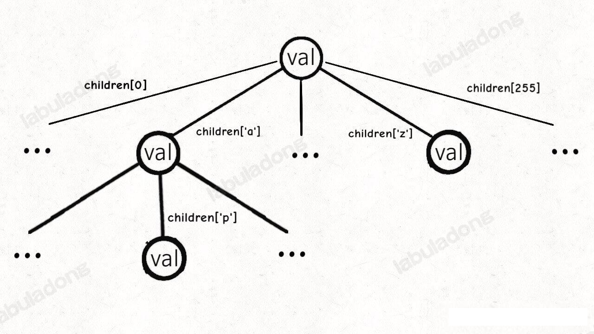
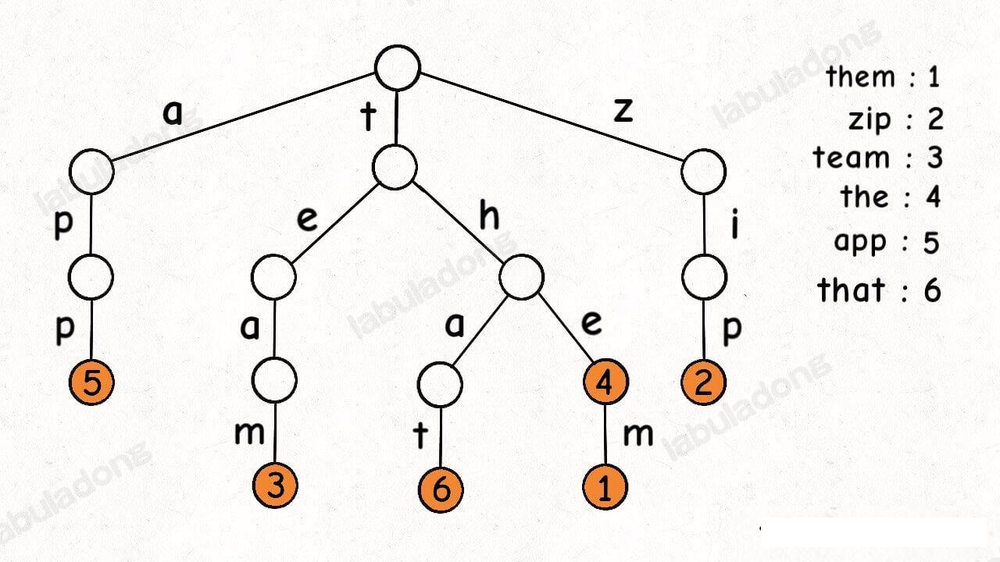
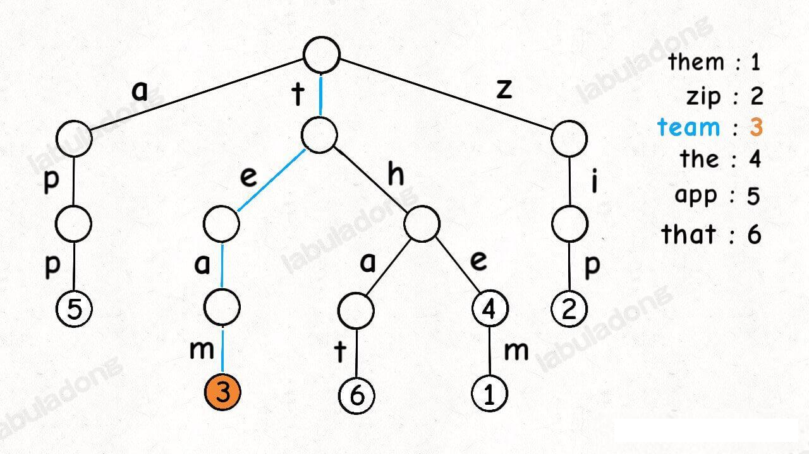
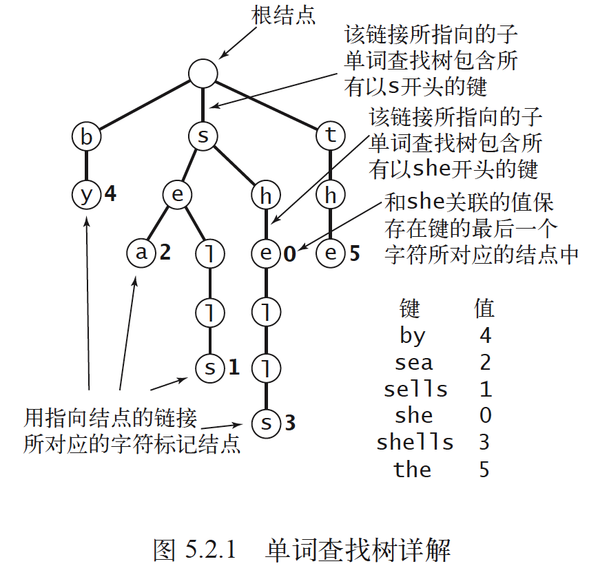
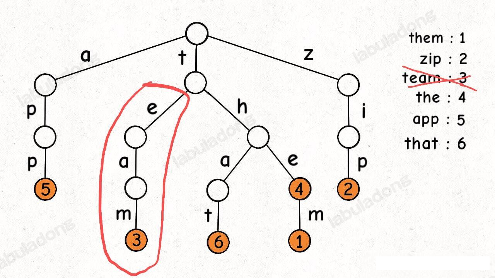
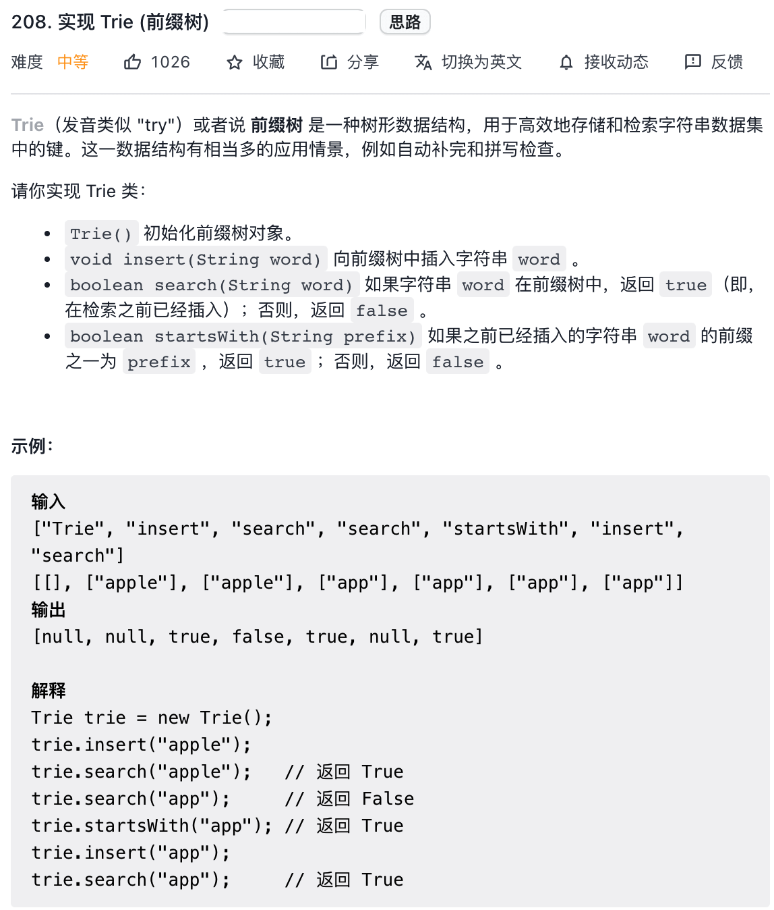
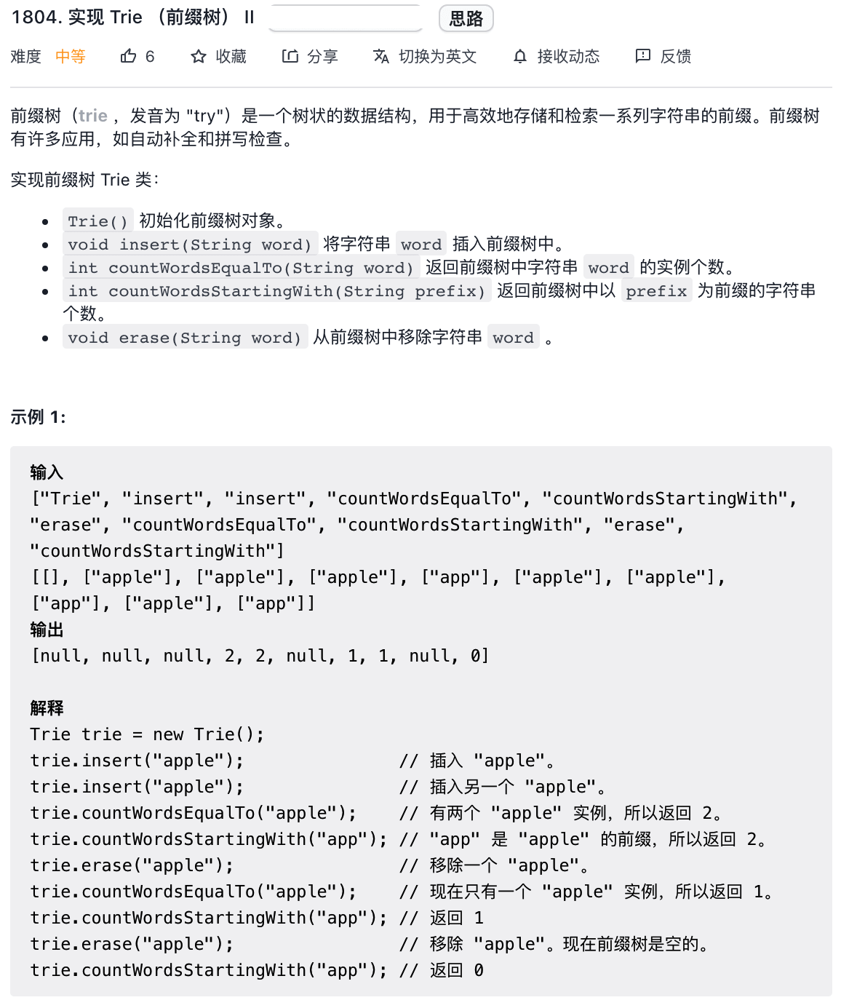

### TrieTree 树


本文主要分三部分：

**1、讲解 Trie 树的工作原理**

**2、给出一套 `TrieMap` 和 `TrieSet` 的代码模板，实现几个常见的 API**。

**3、实践环节，直接套代码模板秒杀 5 道算法题。**

我们这里先实现 `TrieMap`, 然后在 `TrieMap` 的基础上封装出 `TrieSet`。

我们知道 `HashMap<K,V>` 的优势是能够在 O(1) 时间内通过键的 查找对应的值，但要求键的类型 `K` 必须是「可哈希」的；而 `TreeMap<K,V>` 的特点是方便根据键的大小进行操作，但要求键的类型`K` 必须是「可比较」的。

本文要实现的 `TrieMap` 也是类似，由于 Trie 树原理，我们要求 `TrieMap<V>` 的键必须是字符串类型，值类型`V`可以随意。

接下里我们了解一下 Trie 树的原理，看看为什么这个数据结构能高效操作字符串。

#### Trie 树原理

**Trie 树本质上就是一颗从二叉树衍生出来的多叉树。**

TrieMap 中的树节点 `TrieNode` 的代码实现是这样的

```java
public class TrieNode<V> {
    public V val;
    public TrieNode<V>[] children = new TrieNode[256];
}
```

这个 `val` 字段存储键对应的值，`children` 数组存储指向子节点的指针。

**但是和之前的普通多叉树节点不同，`TrieNode` 中 `children` 数组的索引是有意义的，代表键中的一个字符**。

比如说 `children[97]` 如果非空，说明这里存储了一个字符 `'a'`, 因为 `'a'` 的 ascii 码为 97。

我们的模板只考虑处理 ASCII 字符，所以 `children` 数组的大小设置为 256。不过这个可以根据具体问题修改，比如改成更小的数组或者 `HashMap<Character,TrieNode>` 都是一样的效果。

综上所述，Trie 树的结构是这样的：



一个节点有 256 个指针，但大多数的时候都是空的，可以省略掉不画，所以**我们一般看到的 Trie 树长这样**：



这个是 `TrieMap<Integer>` 中插入一些键值对后的样子，白色的节点代表 `val` 字段为空，橙色节点代表`val` 字段非空

**这里要特别注意，`TrieNode` 节点本身只存储 `val` 字段，并没有一个字段储字符，字符是通过子节点在父节点的 `children` 数组的索引确定的**

**形象理解就是，Trie 树用「树枝」存储字符串（键），用「节点」存储字符串键对应的数据（值）。所以我们在图中把字符串标在树枝上，键对应的值 `val` 标在节点上**：



明白这点很重要，有助于之后的代码实现理解

注意：《算法 4》以及网上讲的 Trie 树的文章大部分都是把字符标在节点上，个人认为会引起误解，所以这里标在树枝上。如下为《算法4》中的 Trie 树示意图



现在你应该知道为啥 Trie 树也叫前缀树了，因为其中的字符串共享前缀，相同前缀字符串集中在 Trie 树中的一个字符上，给字符串的处理带来了很大的便利。

#### TrieMap/TrieSet 以及实现

首先我们看下 `TrieMap` 的 API，为了列举 API 的功能，假设 TrieMap  中已经存储了如下键值对


最后，我们说一下 `remove` 函数，似乎所有数据结构的删除操作都相对其他操作会更复杂一些。(其实这句话不完整，双链表的删除就很简单)。

比如下面这个场景，如果我们想删除 `"team"`, 那么删除掉 `"eam"` 这条分支才是符合逻辑的：



删多了肯定不行，但删除少了也不行，否则 API 中实现的 `hasKeyWithPrefix` 就会出错

那么如何控制算法来正确地进行删除那？

首先，递归修改数据结构的时候，如果一个节点想删除自己，直接返回空指针就行了。

**其次，一个节点如何知道自己是否需要被删除那？主要是看看自己的 `val` 字段是否为空以及自己的 `children` 数组是否全部都是空指针**。

这里就要用到我们之前多次提到的 二叉树的后序位置的特点了：

一个节点要先递归处理子树，然后在后续位置检查自己的 `val` 字段和 `children` 列表，判断自己是否需要被删除。

如果自己的 `val` 字段为空，说明自己没有任何存储值，如果同时自己的`children` 数组全部是空指针，说明自己下面也没有接任何树枝，即不是任何一个键的前缀。这种情况下这个节点就没有存在的意义了，应该删掉自己。

具体代码请参考 `TrieMap.delete(String key)` 方法


#### leetcode 相关题目：

leetcode 208 题，「相关前缀树」



leetcode 1804 题，「实现前缀树 II」



这道题就可以用到 TrieMap ，每个插入的 `word` 就是键，插入的次数就是对应的值，然后复用 `TrieMap` 的 API 就能实现题目要求的这些函数

