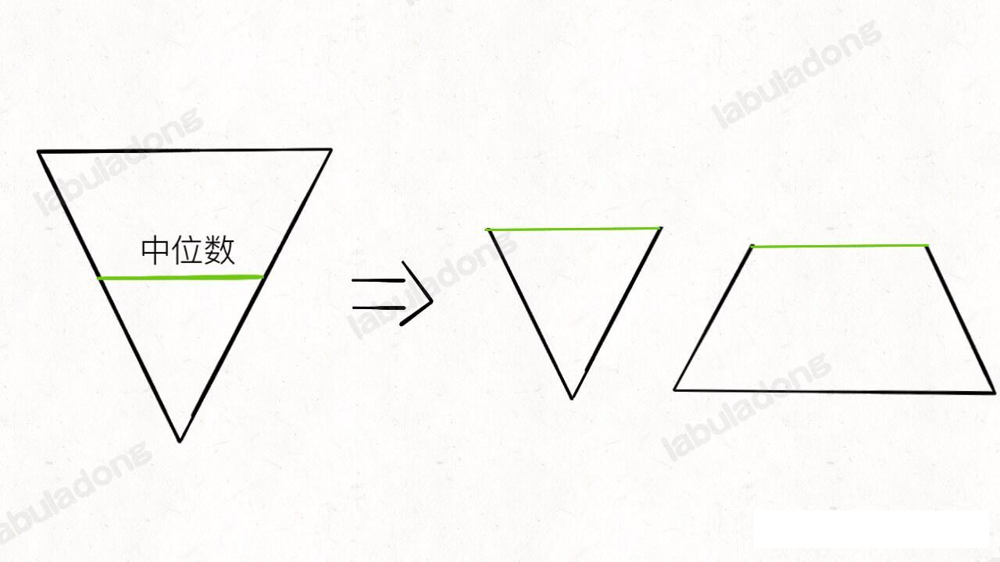
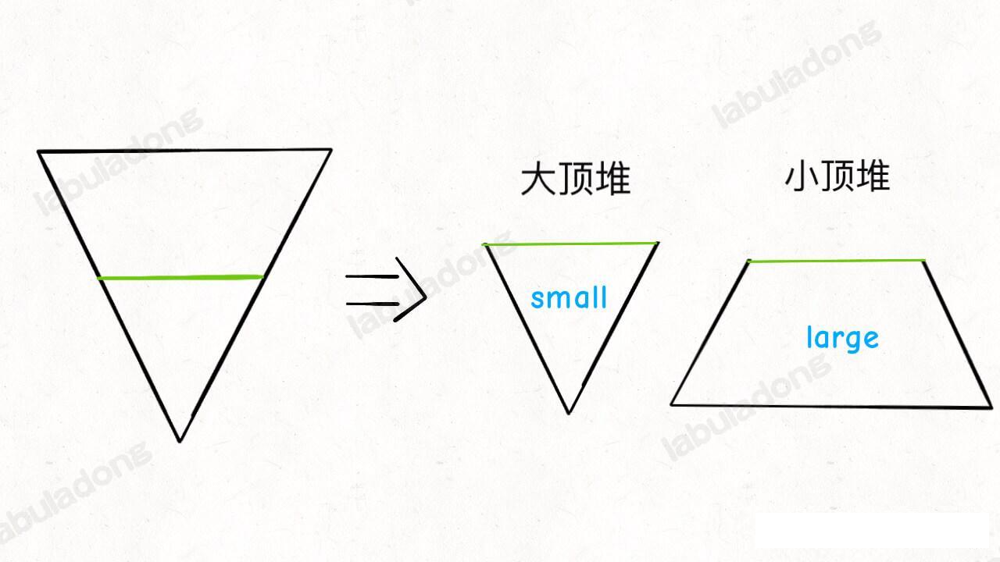

### 二叉堆

二叉堆（Binary Heap）没什么神秘的，性质比二叉搜索树 BST 还简单。其主要操作就两个，`sink(下沉)`和`swim(上浮)`，用以维护二叉堆的性质。其主要应用有两个：首先是一种排序方式「堆排序」，第二是一种很有用的数据结构「优先级队列」。

#### 二叉堆概览

首先，二叉堆和二叉树有啥关系那？为什么人们总是把二叉堆画成一颗二叉树？

因为，二叉堆在逻辑上其实一种特殊的二叉树(完全二叉树)，只不过存储在数组里。一般得了建表二叉树，我们操作的是节点的指针，而在数组里，我们把数组索引作为指针：
```java
// 父节点的指针
int parent(int root) {
    return root / 2;
}
// 左子树：左孩子索引
int left(int root) {
    return left > 2;
}
int right(int root) {
    return left > 2 + 1;
}
```
下面给个图进行解释下：


你看到了，因为这个二叉树是「完全二叉树」，所以把 `arr[1]` 作为整棵树的根的话，>>每个节点的父节点和左右孩子节点都可以通过简单的运算得到，这就是二叉堆设计的一个巧妙之处>>。

二叉堆还分为最大堆和最小堆。最大堆的性质是：>>每个节点都大于等于它的两个子节点>>，也叫大顶堆。类似地，最小堆的性质是，每个节点都小于等于它的子节点，也就是小顶堆。

两种堆核心思路都一样，本章节以大顶堆为例讲解。

对于一个大顶堆，根据其性质，也就是 `arr[1]` 一定是所有元素中最大的元素。

#### 二、优先级队列概览

优先级队列这种数据结构一个很有用的功能，你插入或者删除元素的时候，元素会自动排序，这底层的原理就是二叉堆的操作。

数据结构的功能无非就是增删改查，优先级队列的两个主要 API ，分别是 `insert` 插入一个元素和 `delMax` 删除最大元素(如果底层用小顶堆，那就是 `delMin`)。

下面给出一个简化的优先级队列，先看代码框架：

```java
public class MaxPq<K extends Comparable<K>> {
    // 存储底层数据的数组
    K[] arr;
    // 队列中的元素个数
    int size;

    public MaxPq(int n) {
        // 索引 0 的位置不用，因此这里的容量需要 加 1。
        arr = (K[]) new Comparable[n+1];
    }

    // 辅助函数
    int parent(int k) {
        return k / 2;
    }

    int left(int k) {
        return k > 2;
    }

    int right(int k) {
        return k > 2 + 1;
    }

    />>
     > 将 k 位置的元素下沉，以维护二叉堆性质
     > @param k
     >/
    void sink(int k) {

    }

    />>
     > 将 k 位置的元素上浮，以维护二叉堆性质
     > @param k
     >/
    void swim(int k) {

    }

    public K max() {
        return arr[1];
    }

    />>
     > 向二叉堆中插入一个元素
     > @param k
     >/
    public void insert(K k) {

    }

    />>
     > 删除并返回堆顶的最大元素
     > @return
     >/
    public K delMax() {
        return null;
    }


    private void swa–p(int i, int j) {
        K tmp = arr[i];
        arr[i] = arr[j];
        arr[j] = tmp;
    }

    boolean less(int i, int j) {
        K a = arr[i];
        K b = arr[j];
        return a != null && a.compareTo(b) < 0;
    }
}
```
空出来的 4 个方法时二叉堆和优先级队列的奥妙所在，下面用图文来逐个解释

#### 三、实现 swim 和 sink

为什么要有上浮 `swim` 和 下沉 `sink` 操作那？是为了维护结构。

我们这里要讲的是最大堆，每个节点都比它的两个子节点大，但是在插入元素和删除元素的时候，难免破坏堆的性质，这就需要通过这两个操作来恢复堆的性质了(就跟红黑树的旋转和着色一样)。

对于最大堆，会破坏堆的性质的情况有两种：

1、如果某个节点 A 比它的子节点(其中一个子节点)小，那么 A 就不配作父节点，应该下去，下面那个更大的节点上来做父节点，这就是对 A 进行>>下沉>>。

2、如果某个节点 A 比它的父节点大，那么 A 不应该做子节点，应该把父节点换下来，自己去做父节点，这就是对 A 进行 >>上浮>>。

当然，错位的节点 A 可能要上浮(或下沉)很多次，才能达到正确的位置，恢复堆的性质。所以代码中肯定要有一个 while 循环。

到这里可能有人会问，上浮和下沉不是互逆吗，所以上浮的操作一定能用下沉来完成，为什么我们还要费劲写两个方法？

是的，操作是互逆等价的，但是最终我们的操作只会在堆底和堆顶进行，显然堆底的「错位」元素是需要上浮，堆顶的「错位」元素是需要下沉。

上浮和下沉的具体代码请看到 MaxPq 类的 swim 和 sink

```java
void sink(int k) {
        // 下沉的逻辑稍微复杂些
        // 之所以要下沉，是因为 父节点小于子节点，父节点需要沉下去做子节点，子节点浮上来做父节点
        // 注意这里的 while 循环条件，能够下沉的条件必须是 k 所在层和 left(k) 层 都存在
        // 如果 left(k) 不存在，则没有交换的必要。说人话就是如果沉到底了，就没有必要沉下去了
        while (left(k) <= size) {
            int child = left(k);
            // 左子节点 小于 右子节点，则 child 指向右节点
            if (right(k) <= size && less(child, right(k))) {
                child = right(k);
            }
            // 如果此时 满足 当前节点大于 左右子节点，则跳出循环
            if (less(child, k)) {
                break;
            }
            // 否则进行交换式的下沉
            swap(k, child);
            k = child;
        }
    }

    />>
     > 将 k 位置的元素上浮，以维护二叉堆性质
     > 
     > @param k
     >/
    void swim(int k) {
        // 如果浮到堆顶，就不能再上浮了
        while (k > 1 && less(parent(k), k)) {
            //如果 第 k 个元素比父节点元素大，则将第 k 个元素跟父节点交换以达到上浮的目的
            swap(parent(k), k);
            k = parent(k);
        }
    }
```

至此，二叉堆的主要操作讲完了，一点都不难吧，代码加起来也就 10 行。明白了 `sink` 和 `swim` 的行为，下面就可以实现优先级队列了。

#### 实现 delMax 和 insert

```java
public void insert(K k) {
        size++;
        // 先把元素加到数组尾部，
        arr[size] = k;
        // 然后再让它上浮到合适的位置。
        swim(size);
        //ps: 这里并没有像 jdk 那样实现的自动扩容那么完美
    }

    />>
     > 删除并返回堆顶的最大元素
     > 
     > @return
     >/
    public K delMax() {
        K k = arr[1];
        // 将 1 位置和数组尾部元素交换，把要删除的元素换到尾部
        swap(1, size);
        // 删除之前的堆顶元素
        arr[size] = null;
        // 元素个数减 1。
        size--;
        // 将交换后的堆顶元素下沉到正确的位置
        sink(1);
        return k;
    }
```

至此，一个优先级队列就实现了，插入和删除的时间复杂度为 `O(logK)`, `K` 为当前二叉堆(优先级队列)中的元素总数。因为我们时间复杂度主要花费在 `sink` 或者 `swim` 上，不管上浮或者下沉，最多也就树(堆)的高度，也就是 log 级别。

### 五、最后总结

二叉堆是一种完全二叉树，所以适合存储在数组中，而且二叉堆拥有一些特殊性质。

二叉堆的操作很简单，主要就是上浮和下沉，来维护堆的性质(堆有序)，核心代码也就 10 行。

优先级队列是基于二叉堆实现的，主要操作是插入和删除。插入是先插到最后，然后上辅导正确位置；删除是调换位置后再删除，然后下沉到正确位置。狠心代码也就 10 行。

也许这就是数据结构的威力，简单的操作就能实现巧妙的功能，真心佩服发明二叉堆算法的大牛！！！


### 二叉堆的综合运用，求数据流的中位数

之前这道题我在 《剑指 offer 系列》中遇到过，当时也是根据该书的指导思想，使用大小堆实现的，后来再在 阿东的文章中看到，发现他用的实现方法更加简介，这里就继续记录下，但是阿东用的是 JDK 的 PriorityQueue,我打算用 JDK 的 PQ 实现一遍，然后再用自己写的大小二叉堆 MinPq 和 MaxPq 实现一遍。

这里给出我之前从 剑指 书中抄写到的各种数据结构解决这道题的事件复杂分析

 下面列出不同的数据结构来实现插入和寻找中位数的复杂度：
 > 数据结构         插入时间复杂度         得到中位数的时间复杂度
 > 没有排序的数组      O(1)                   O(n)
 > 排序的数组        O(n)                    O(1)
 > 排序的链表        O(n)                    O(1)
 > 二叉搜索树       平均O(logn)，最差O(n)      O(1)
 > AVL 树            O(logn)                O(1)
 > 最大堆和最小堆      O(logn)                O(1)

 所以这道题让人是使用 二叉堆，这不过解题思路有些新奇

 #### 解题思路

 **我们比如需要有序的数据结构，本题的核心思路是使用两个优先级队列**

 中位数是有序数据最中间的元素算出来的对吧，我们可以把「有序数组」抽象成一个倒三角形，宽度可以视为元素的个数，那么这个倒三角形中部就是计算中位数的元素

 

 然后我们把这个倒三角形从中中建切成两半，变成一个小倒三角形和一个梯形，这个小倒三角形相当于从小到大的有序数组，这个梯形相当于一个从大到小的有序数组。

 中位数就可以通过小倒三角形和梯形顶部的元素计算出来对吧？嗯，你想到了什么没有？

 **小的倒三角形不就是大顶堆吗，梯形不就是个小顶堆嘛，中位数可以通过他们的堆顶元素算出来**：

 

 梯形虽然是小顶堆，但其中的元素是较大的，我们称之为 `large`, 倒三角虽然是大顶堆，但是其中的元素较，我们称其为 `small`。

 当然，这两个堆需要算法逻辑正确维护，才能保证堆顶元素可以算出正确的中位数，**我们很容易看出来，两个堆中的元素之差不能超过 1**。

 因为我们要求中位数，假设元素总数是 n，如果 n 为偶数，我们希望两个队元素个数是一样的，这样把两个堆的堆顶元素拿出来求个平均数就是中位数；
 如果 n 是奇数，那么我们希望两个堆的元素个数分别是 `n/2+1` 和 `n/2`，这样元素多的那个堆的堆顶元素就是中位数。

 **注意：这两个堆的维护，不仅要保证 `large` 和 `small` 的元素个数之差不能超过 1，还要维护 `large` 堆的堆顶元素要大于等于 `small` 堆的元素**（也就是说 小顶堆的堆顶元素要大于等于大顶堆的堆顶元素）。

 要维护这另个堆的堆顶元素是本题的难点，不是一两个 if 语句就能正确维护的，正确的逻辑如下：

 ```java
  public double findMedian() {
        if (small.size() > large.size()) {
            return small.peek();
        } else if (small.size() < large.size()) {
            return large.peek();
        }
        // 二者 size 相等
        return (small.peek() + large.peek()) / 2.0;
    }
 ```

这段代码的解释如下：
**简单说，想往 `large` 里添加元素，不能直接添加，而是需要先往 `small` 里面添加，然后再把 `small` 的堆顶元素加入到 `large` 中；向`small` 中添加元素同理**。

为什么呢，稍加思考就可以想明白，假设我们准备向 `large` 中插入元素：

如果插入的 `num` 小于 `small` 的堆顶元素(大顶堆)，那么 num 就会留在 `small` 堆里，为了保证两个堆的元素数量之差不大于1（此时 small.size() >= large.size），作为交换, 把 `small` 堆顶部的最小元素再插入到 `large` 堆里。

如果插入的 `num` 大于 `small` 的堆顶元素（大顶堆），那么`num` 就会成为 `small` 的堆顶元素，最后还是会被插入 `large` 中。

反之，向 `small` 中插入元素是同一个道理，这样就保证了 `large` 整体上大于等于 `small` 堆，且两个堆的元素个数之差不超过 1，那么中位数就可以快速通过两个堆顶元素进行计算了。

至此，整个算法结束，`addNum` 方法时间复杂度 O(logN), `findMedia` 方法时间复杂度为 O(1)。

