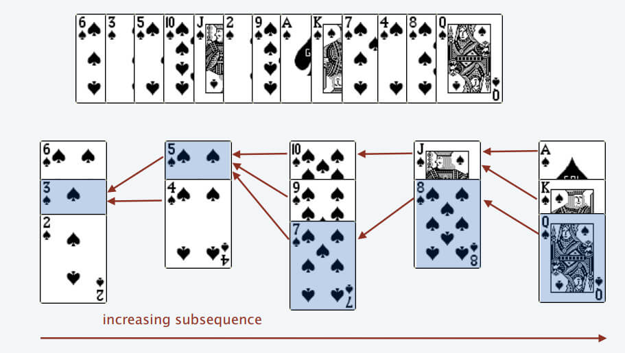
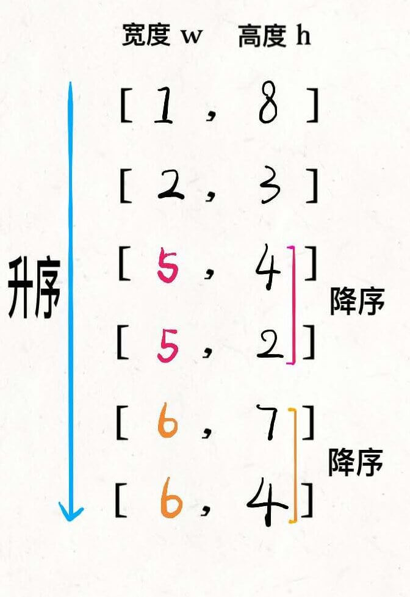
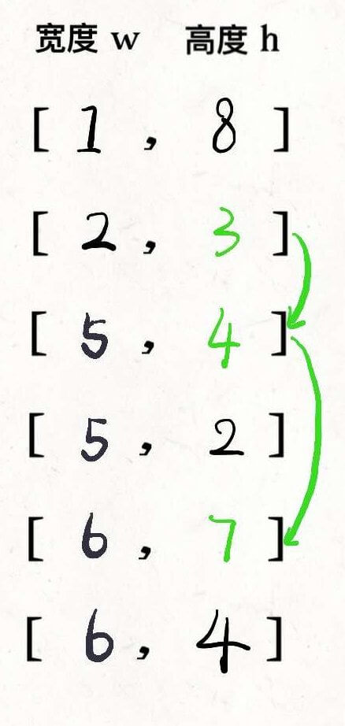
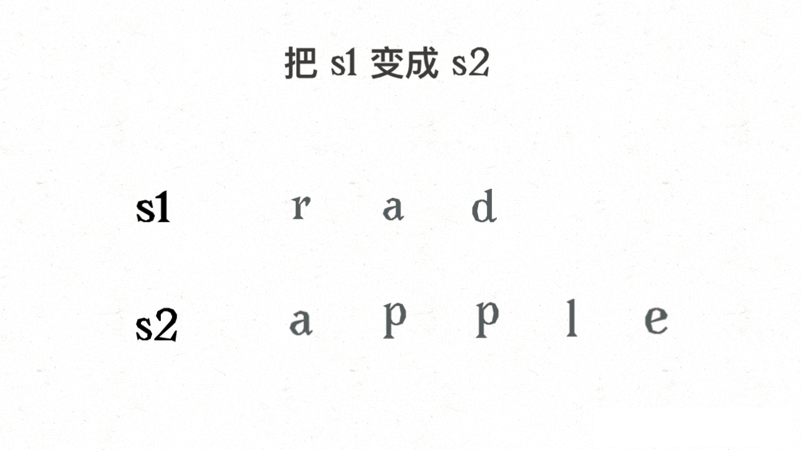
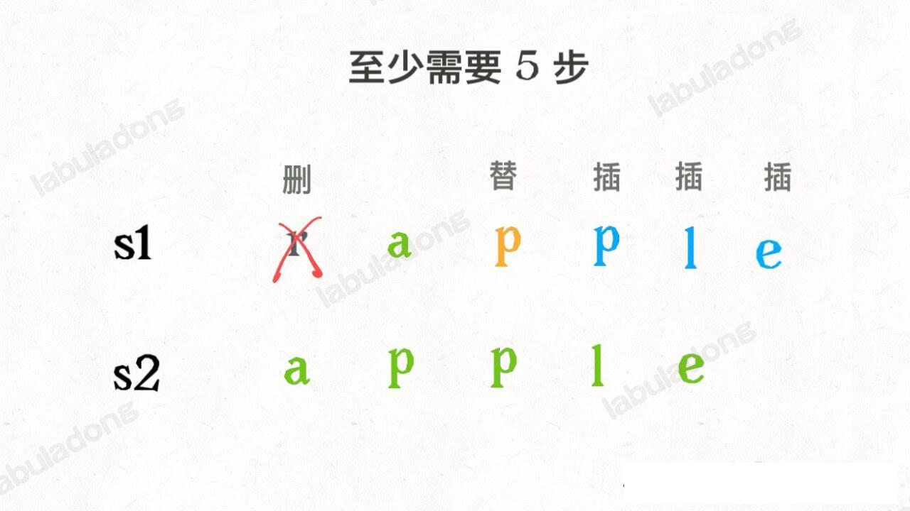
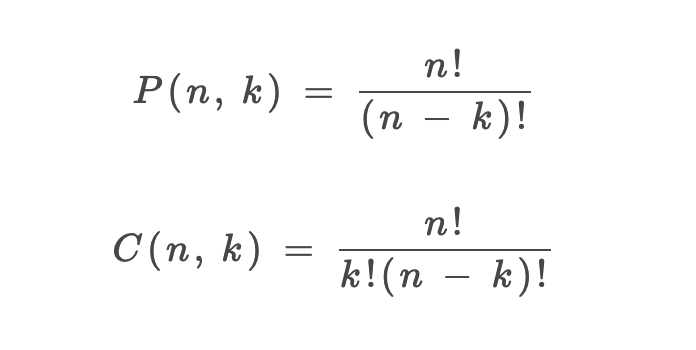
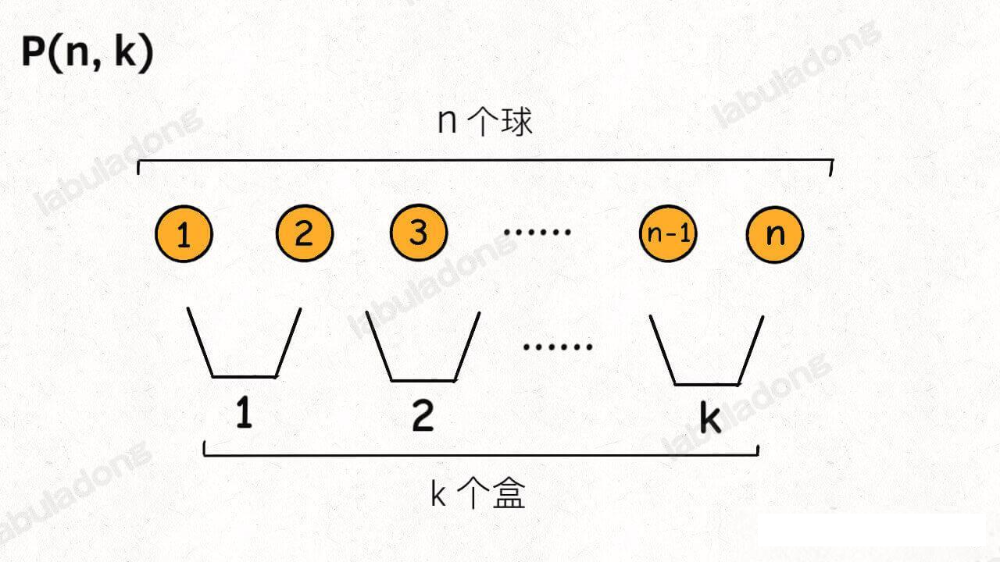
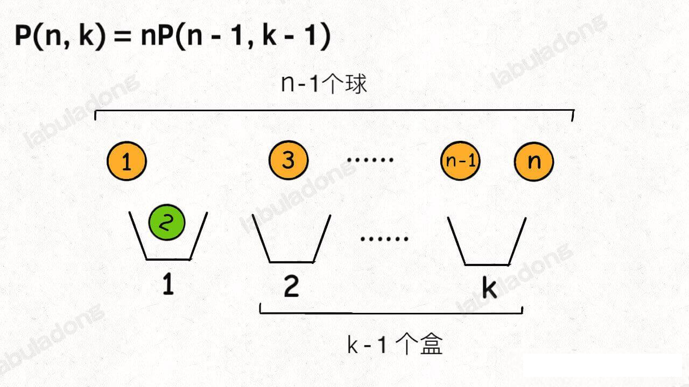
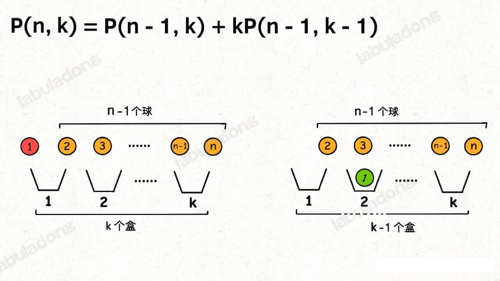
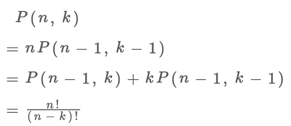

动态规划章节

leecode 115 题，不同的子序列
https://leetcode.cn/problems/distinct-subsequences/
给你输入一个字符串 s 和一个字符串 t，请你计算在 s 的子序列中 t 出现的次数。比如题目给的例子，输入 s = "babgbag", t = "bag"，算法返回 5

### 一、动态规划解法

动态规划的核心思想是数学归纳法。数学归纳法的思路比价简单，比如我们想证明一个数学结论，那么我们先假设这个结论在 k < n 的时候成立，然后根据这个假设，想办法推导证明出 k=n 的时候此结论依然成立。
如果能够这么出来，说明这个结论对于 k 等于任何值都成立

#### 最长递增子序列
##### 最长子序列查找——二分法
这个解法的时间复杂度为 `O(NlogN)`,但是说实话，正常人更不想不到这种解法(通过下面的纸牌游戏解说可能玩过这类游戏的人可以想出来)。所以我们了解一下就好，正常情况下能够给出动态规划解法就已经很不错了。
根据题目的意思，很难想象这个问题竟然能跟二分法车上关系。其实最长递增西序列和一种叫做 patience game 的纸牌游戏有关，甚至有一种排序方法就叫做 patience sorting(耐心排队)。
为了简单起见，后文跳过所有的数学证明，通过一个简化的例子来理解下算法的思路
首先，给你一副扑克牌，我们像数组遍历一样从左到右一张一张处理这些扑克牌，最终把这些牌分成若干堆。

处理这些扑克牌要遵循一下规则：
只能把点数小的牌压到点数比它大的牌上；如果当前牌点数比较大，没有可用防止的堆，则新建一个堆，把这张牌放进去；如果当前牌有多个堆可以选择，则选择最左边的那个堆放置。

比如说上述扑克牌最终会被分成 5 堆(我们认为纸牌 A 的牌面是最大的，纸牌 2 的牌面是最小的)。
为什么遇到多个可选择的时候要放到最左边的堆上那？因为这样可以保证堆顶的牌有序（2,4,7,8，Q), 证明略。
按照上述规则执行，可以算出最长递增子序列，**<font color='red'>牌的堆数就是子序列的长度</font>**，证明略
我们只需要把处理扑克牌的过程边写出来即可。每次处理一张扑克牌不是要找一个合适的堆顶来存放吗？牌的堆顶不是有序吗？这就能用到二分法查找了：用二分查找搜索牌应放置的位置。
最终的最序列为 [3,5,7,8,12] 如下图所示


#### 俄罗斯信封解题分析
这道题目其实是最长子序列的一个变种，因为每次合法的嵌套是大的套小的，相当于在二维平明中找一个最长递增的子序列，其长度就是就是最多能签到的信封个数。

前面说的标准的 LIS 算法只能在一维数组中寻找最长子序列，而我们的信封是由(w,h) 这样的二维数组对形式表示的，如何把 LIS 算法云涌过来那？
我们也许会想到，通过 w*h 的方式计算面积，然后对面积进行标准的 LIS 算法。但是稍加思考就会发现这样不行，比如 1*10 大于 3*3 ，但是这显然无法实现两个信封相互嵌套
这道题的解法比较巧妙：
先对宽度 `w` 按升序排列，如果遇到 `w` 相同的，则按照高度 `h` 降序排列；之后把所有的 `h` 作为一个数组，在这个数组上计算 LIS 的长度就是答案
接下来上图来帮助理解下



然后在 `h` 寻找最长递增子序列，这个子序列就是最优的嵌套方案


**为什么这就可以找到相互嵌套的信封序列那？** 稍微思考一下就明白了
首先，对宽度`w`从小到大排序，确保了`w`这个维度可以相互嵌套，所以我们只需要专注高度`h`这个维度就可以相互嵌套即可。
其次，两个`w`相同的信封不能相互包含，所以对于宽度`w`相同的信封，对高度`h` 进行降序排列保证二维 LIS 中不存在多个 `w` 相同的信息(因为题目说了长宽相同也无法嵌套)。

#### 编辑距离部分
设两个字符串分别为`rad` 和 `apple`，为了把 s1 变成 s2，算法会是这样进行的：



根据上的 gif，我们发现操作不只有三个，其实还有第四个，就是什么都不做 (skip)。比如 s1[i]==s2[j] 的情况，还有一个很容易处理的情况，就是 j 走完了 s2 后，如果 `i` 还没走完 `s1` ，那么只能用删除将 s1 缩短为 s2。类似的，如果 i 走完了 s1 时 j 还没走完 s2，那就只能用插入操作把 s2 剩下的字符全部插入 s1，这两种情况都算是算法的 basecase

伪代码大概如下：
```python
if s1[i] == s2[j]:
    啥都不做(skip)
    i,j 同时向前移动一步
    dp(s1,i-1,s2,j-1)
else:
    三选一：
        插入(insert)
        删除(delete)
        替换(replace)
```
子序列的问题在 sub sequence 子包中

#### 排列组合的 2 种视角

1、P(n,k)(有的书称为 `A(n,k)`) 表示从 n 个不同的元素中拿出 k 个元素的排列 (Permutation/Arrangement); `C(n,k)` 表示从 n 个不同的元素中拿出 k 个元素的组合 (Combination) 总数。
2、「排列」与「组合」的主要区别在于是否考虑顺序的差异
3、排列和组合的总数计算公式如下


##### 公式推导过程

###### 公式推导1
Q1:有从1到9共计9个号码球，请问，可以组成多少个三位数？

A1:123和213是两个不同的排列数。即对排列顺序有要求的，既属于“排列P”计算范畴。

上问题中，任何一个号码只能用一次，显然不会出现988,997之类的组合，我们可以这么看，百位数有9种可能，十位数则应该有9-1种可能，个位数则应该只有9-1-1种可能，最终共有9*8*7个三位数。计算公式＝P(3,9)＝9*8*7,(从9倒数3个的乘积）

Q2:有从1到9共计9个号码球，请问，如果三个一组，代表“三国联盟”，可以组合成多少个“三国联盟”？

A2:213组合和312组合，代表同一个组合，只要有三个号码球在一起即可。即不要求顺序的，属于“组合C”计算范畴。

上问题中，将所有的包括排列数的个数去除掉属于重复的个数即为最终组合数C(3,9)=9*8*7/3*2*1

重复的个数为什么是 3*2*1，因为 3 个数最大可以组成 3! 个不同排列，在组合的情况下，就是 1 个，因此组合的最终结果是 9*8*7/3*2*1

###### 公式推导2
排列组合问题的各种变体都可以通过「球盒模型」，P(n,k) 就可以抽象成下面这个场景：

即，将 `n` 个标记了不同序列号的球（标记号码是为了体现顺序的差异），放入 `k` 个标记了不同序号的盒子中( 其中 `n>=k`, 每个盒子最终都装有恰好一个球)，共有 `P(n,k)` 中不同的方法。
现在你来，往盒子里面访求，你怎么放？其实有 2 中视角。
**首先，你可以站在盒子的视角**，每个盒子必然要选择一个球。
这样，第一个盒子可以选择 `n` 个球中的任意一个，然后你需要让剩下 `k-1` 个盒子在 `n-1` 个球中选择 (第一个例子符合该视角的，百位数可以在 1-9 中选择任意一个数字)

**另外，你也可以站在球的角度**，因为并不是每个球都会被装进盒子，所以球的视角分两种情况：
1、第一个球可以不装进任何一个盒子，这样的话你就需要将剩下的 `n-1` 个球放入 `k` 个盒子。
2、第一个球可以装进 `k` 个盒子的任意一个，这样的话，你就需要将剩下的 `n-1` 个球放入 `k-1` 个盒子

综合上述两种情况，可以得到：


你看，两种视角得到两个不同的递归模式，但是这两个递归模式解开的结果都是我们熟知的阶乘形式：


至于如何递归，涉及的数学知识内容比较多，这里就不深入探讨了。
当然，以上只是纯数学的推导，P(n,k)的计算那结果也仅仅是一个数字，所以以上两种视角从数学来讲没什么差异，但是从编程的角度来看，如果让你计算出来所有的排列结果，那么这两种穷举思路的代码实现可能会产生性能上的差异，因为有的穷举思路会使用额外的 for 循环来拖慢效率。

因此上述公式满足 P(n,k)=n!/(n-k)!；C(n,k) = P(n,k)/k! = n!/(k!*(n-k)!)

#### 动态规划&排列组合的算法复杂度计算
 M，N 分别表示 s,t 的长度
```
带备忘录的动态规划算法的时间复杂度
=子问题的个数 x 函数本身的时间复杂度
=「状态」的个数 x 函数本身的时间复杂度
= O(MN) * O(M)
= O(N*M^2)
```
当然，因为 for 循环的复杂度并不总是 O(M) 且总问题个数肯定小于 O(MN)(s.length()-i<t.length-j return 0 这时候就不再遍历了，因此总问题个数达不到 O(MN))，所以这是复杂度的粗略上界。
这个上限说明这个算法的复杂度还是有些偏高，主要高在哪里那？对「状态」的穷举已经有 memo 备忘录优化，所以 O(MN)的复杂度是必不可少的，关键的问题处在 dp 函数中的 for 循环。
是否可以优化掉 dp 函数中的 for 循环那？可以的，这就需要另一种视角来解决这个问题。

##### 视角2，站在 `s` 的角度进行穷举

我们的原问题是计算 s[0...] 中的所有子序列中 t[0..] 的出现次数，可以先看看 `s[0]` 是否能匹配 `t[0]`, 如果不匹配，那没得说，原问题就转化为计算 `s[1..]` 的所有子序列中 `t[0..]` 出现的次数；

但是如果 `s[0] ` 可以匹配 `t[0]`, 这两种情况是累加的关系：
1、让 s[0] 匹配 t[0], 那么原问题转化为 s[1..] 的所有子序列中计算 t[1..] 出现的次数
2、不让 s[0] 匹配 t[0], 那么原问题就转化为 s[1..] 中的所有子序列中计算 t[0..] 出现的次数

为啥明明 s[0] 可以匹配 t[0], 还不让它俩匹配那？主要是为了给 s[0] 之后的元素匹配的机会，比如 `s="aab", t="ab"`，就有两种匹配方式 `a_b` 和 `_ab`

把以上思路写成状态转移方程：
```java
// 定义：s[i..] 的子序列中 t[j..] 出现的次数为 dp(s,i,t,j)
int dp(String s,int i,String t,int j) {
    if (s[i] == t[j]) {
        // 匹配，两种情况，累加关系
        return dp(s,i+1,t,j+1) + dp(s,i+1,t,j);
    } else {
        // 不匹配，在 s[i+1..] 的子序列中计算 t[j..] 的出现次数
        return dp(s,i+1,t,j);
    }
}
```
根据以上思路，可以写出 实现函数来

#### 不同的子序列 dp 数组实现
数组实现法，参考下图

当 S[j] == T[i] , dp[i][j] = dp[i-1][j-1] + dp[i][j-1];

当 S[j] != T[i] , dp[i][j] = dp[i][j-1]


### 动态规划和回溯算法实现 word Break

回溯法即便我们如何优化，总的时间复杂度依然是指数级的 O(2^N * N^2),是无法通过所有测试用例
那么问题出在哪那？

比如输入 `wordDict = ["a","aa"], s="aaab"`, 算法无法找到一个可行的组合，所以一定会遍历整棵回溯树，但我们要注意里面存在重复的情况。重复情况极端情况下会消耗大量的时间。

**如何消除荣誉计算那？这里要稍微变一下思维模式，用「分解问题」的思维模式来考虑这道题**

我们刚才以排列组合的方式来思考这个问题，现在我们换一种视角，思考一下能否把问题分解成规模更小，结构相同的子问题，然后通过子问题的结果计算原问题的结果(dp 函数不就是干这个的吗)？

对于输入的字符串 `s`, 如果我们能够从单词列表 `wordDict` 中找到一个单词匹配 `s` 的前缀 `s[0..k]`, 那么只要我能拼出 `s[k+1]`, 就一定能拼出整个 `s` 。换句话说，我把规模较大的原问题 `workBreak(s[0..])` 分解成了规模较小的子问题 `wordBreak(s[k+1..])`, 然后通过子问题的求解反推出原问题的解。
有了这个思路就可以定义一个 `dp` 函数, 并给出该函数的定义：
```java
// 定义：返回 s[i..] 能否被拼出
int dp(String s,int i);

// 计算整个 s 是否能够被拼出，调用 dp(s,0)
```
有了这个函数定义，我们就可以把刚才的逻辑大致翻译成伪代码：

```java
HashSet<String> wordDict

// 定义：返回 s[i..] 能否被拼出
int dp(String s,int i) {
    // base case, s[i..] 时空串或者遍历到 s 的结尾
    if(i==s.length) {
        return  true;
    }

    for (int k=1;i+k < s.length(); k++) {
        if wordDict 中存在 s[i..i+k] {
            // 只要 s[i+len..] 能够被拼出，s[i..] 就能被整体拼出
            if(dp(s, i+k)) {
                return true;
            }
        }
    }
    // 所有单词都尝试过，没有办法拼出整个 s
    return false
}
```